# Docker基础

## 系统命令

~~~shell
#查看docker版本信息
docker version
#查看docker系统信息
docker info
#帮助命令
docker 命令 --help
~~~

[docker命令官方文档]: https://docs.docker.com/reference/

## 镜像命令

### docker images

查看本地所有镜像

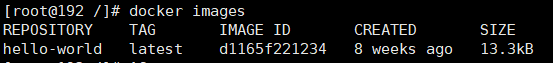

**说明**

| 列名       | 解释           |
| ---------- | -------------- |
| REPOSITORY | 镜像的仓库源   |
| TAG        | 镜像的标签     |
| IMAGE ID   | 镜像的id       |
| CREATED    | 镜像的创建时间 |
| SIZE       | 镜像的大小     |

**可带参数**

| 参数        | 说明         |
| ----------- | ------------ |
| -a, --all   | 列出所有镜像 |
| -q, --quiet | 只显示镜像id |

### docker search

从DockerHub上搜索镜像

**说明**

| 列表        | 解释     |
| ----------- | -------- |
| NAME        | 镜像名称 |
| DESCRIPTION | 镜像描述 |
| STARS       | 点赞数   |
| OFFICIAL    | 是否官方 |
| AUTOMATED   | 自动构建 |

**可带参数**

| 参数     | 说明       |
| -------- | ---------- |
| --filter | 过滤某些列 |

### docker pull

下载镜像，下载镜像命令`docker pull 镜像名:版本`如果不带`:版本`默认下载`:latest`最后一个版本

**默认下载**

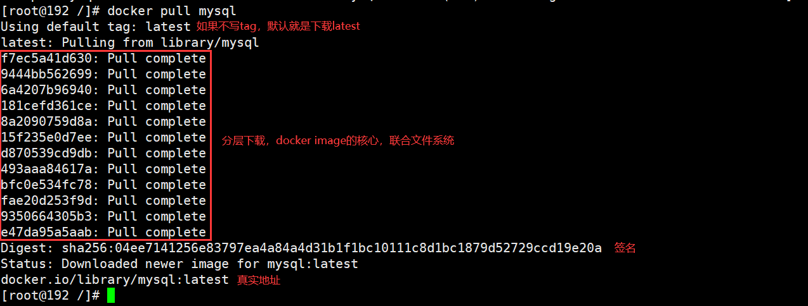

**指定版本下载**

指定下载mysql5.7`docker pull mysql:5.7`

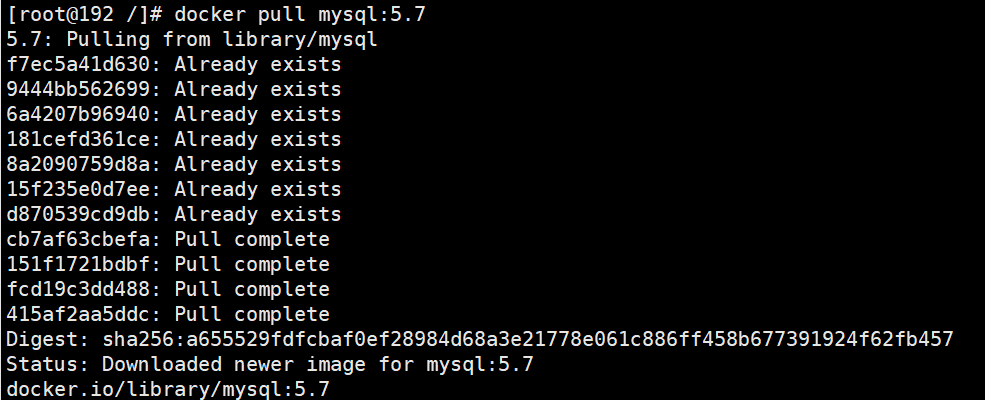

### docker rmi

删除指定镜像`docker rmi 镜像id`

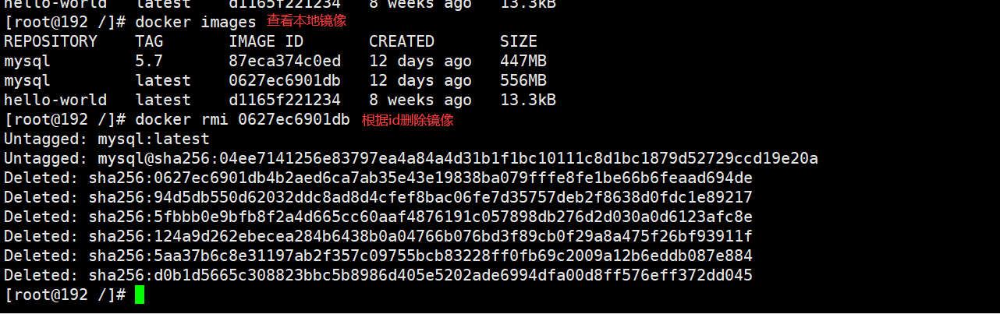

## 容器命令

### docker run

创建并且启动一个镜像

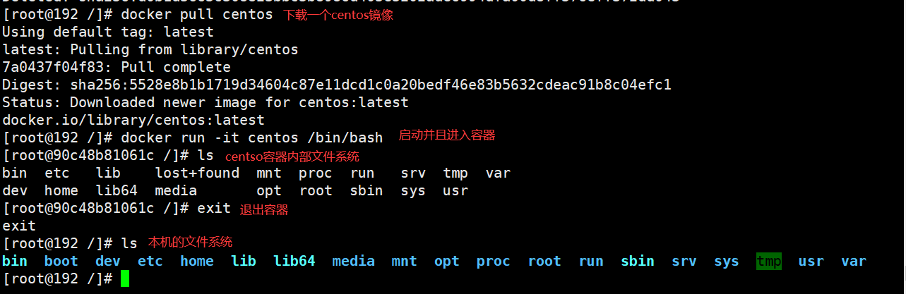

**可带参数**

| 参数      | 说明                                                         |
| --------- | ------------------------------------------------------------ |
| --name="" | 设置容器名称，用来区分容器                                   |
| -d        | 后台方式运行                                                 |
| -it       | 使用交互方式运行，进入容器查看内容，交互模式下退出容器2种方式： 1、exit（退出并且停止容器） 2、ctrl+p+q（退出容器不停止） |
| -p        | 指定容器的端口，3种方式： 1、-p 主机端口:容器端口（常用） 2、-p 主机ip:主机端口:容器端口  3、-p 容器端口 |
| -P        | 随机指定端口                                                 |

### docker ps

查看当前正在运行中的容器

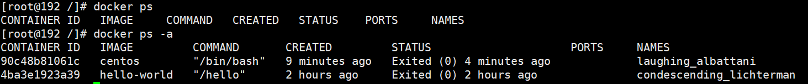

**可带参数**

| 参数 | 说明                             |
| ---- | -------------------------------- |
| -a   | 查看所有容器，包括停止与运行中的 |
| -n=? | 显示最近的容器                   |
| -q   | 只显示编号                       |

### docker rm

删除指定容器`docker rm 容器id`（无法删除正在运行的），若需要强制删除`docker rm -f 容器id`

强制删除所有容器 `docker rm -f $(docker ps -aq)`

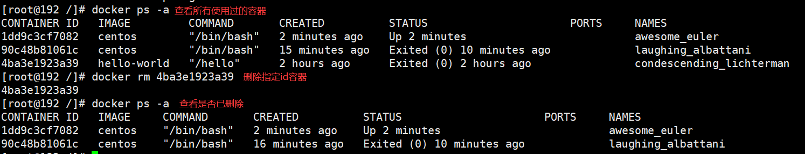

### docker start 

启动已停止的容器`docker start 容器id`

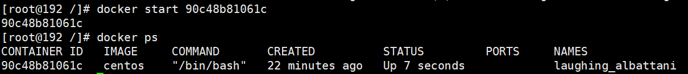

### docker restart

重启容器`docker restart 容器id`

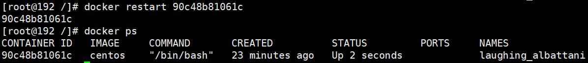

### docker stop

停止指定容器`docker stop 容器id`

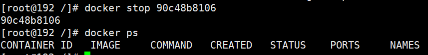

## 镜像讲解

### 什么是镜像

**Win镜像**

> 平时我们再重装系统时一定会用到一个镜像，Win镜像是由微软打包发布到官网上，Win镜像文件里面包含着系统文件、引导文件、分区表信息等，当我们将配置U盘插入电脑那么电脑就会读取Win镜像并且引导安装，最终会得到一个完整并且满足初次使用的Win系统

**Docker镜像**

> Docker镜像也可以理解成为Win镜像类似，Docker是一种轻量级可执行的独立软件包，用户可以对自己的某一个应用包括环境变量和运行环境进行打包发布，发布成功后其它用户只需要直接下载打包好的镜像，直接运行即可

### 镜像获取方式

1. 从远程仓库下载
2. 朋友打包拷贝给你
3. 自己制作DockerFile

### 镜像加载原理

#### UnioFS联合文件系统

UnioFS文件系统，是一种分层，轻量级并且高性能的文件系统，它会将来每一次修改的文件作为一次提交来叠加再一起，由于文件被分层了，这样就可以解决一个不同软件直接共用一些相同依赖的问题，如果软件A与软件B它们都有一个共同的依赖jdk那么使用Docker下载了软件A后下载软件B，软件B的jdk不会被下载，因为软件A已经包含了jdk环境，UnioFS文件系统是Docker镜像的基础

#### Docker加载原理

docker的镜像事件是一层一层的文件系统注册，这种层级文件系统UnioFS

bootfs（boot file system）主要包含bootload和kernel，bootloader主要是引导加载kernel，liunx刚启动时会加载botfs文件系统，docker镜像最底层就是bootfs，这一层与典型的Liunx/Unix系统是一样的，包含boot加载器和内核，当boot加载完成后整个内核都再内存中了，这时系统会卸载了bootfs，将内存使用权交给内核

rootfs（foot file system），再bootfs上，包含的就是进行的liunx系统中的/dev,/proc,/bin等标准目录文件，rootfs就是各种不同的操作系统的发行版

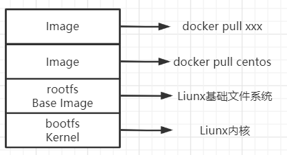

平时我们一个CentOs安装包好几个G为什么再Docker中只有200M，因为底层直接用了Host的kernel（内核系统），自己只需要提供rootfs（文件系统）就可以了，

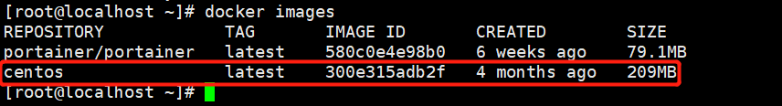

#### 分层原理

从pull下载会下载到一些运行一个tomcat的基础层，当然里面是很多层的这里为了方便演示我合并了一层，然后我们对tomcat进行run会叠加一层，进行其它配置又会叠加一层，最后我们需要将自己配置好的容器打包成镜像发布时，123层就会被统一打包成一个images中

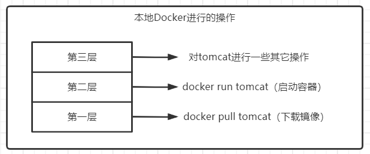

### 提交自己的镜像

#### commit镜像

~~~shell
docker commit -m="提交描述" -a="作者" 容器id 目标镜像名:[TAG]
~~~

**实战练习（提交一个自己的tomcat）**

默认的tomcat，的Webapp是中是没有文件的，现在我对默认tomcat进行了一些修改，在webapp中添加了默认的访问页面，对我们修改过的容器进行commit，在本地生成一个自己修改过的镜像

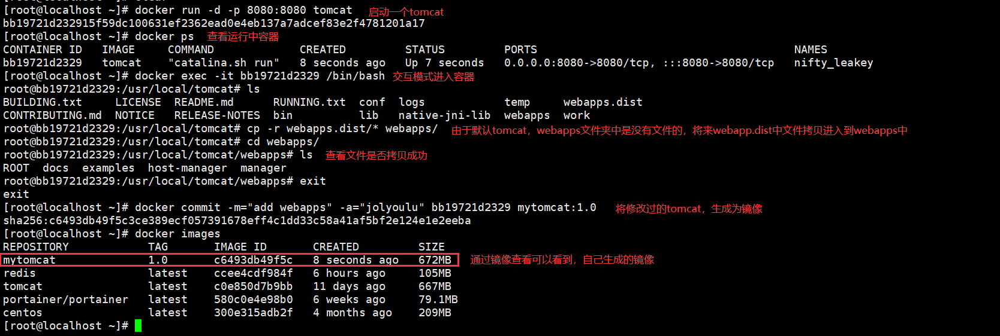

## 容器数据卷

### 什么是容器数据卷

> 经过前面的实例练习，我们找到docker的应用是运行在容器中的，这就会产生一个问题比如我们运行着一个mysql容器那么我们的，表与数据会被保存在容器中，如果一不小心错删容器那么mysql连着mysql的数据都会丢失（删库跑路），这时就需要一个mysql数据可以存在在liunx本地而不是容器的解决方案`容器数据卷就能解决该问题，可以让容器产生的数据同步到liunx本地中`其实原理就是将容器的目录挂载到liunx中

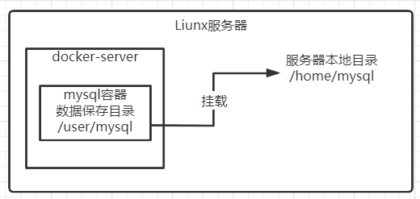

### 使用数据卷

> 使用如下命令，启动时添加`-v`参数`docker run -it -v 主机目录:容器内目录`

**数据卷特性1：容器同步到本机**

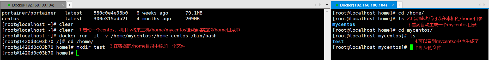

**数据卷特性2：本机同步到容器**

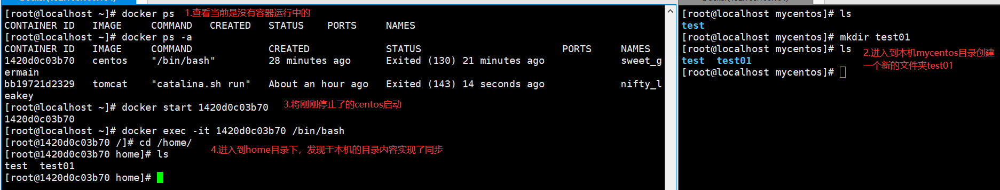

**实战练习**

> 下载mysql5.7镜像，启动一个mysql容器，将mysql的数据文件/data挂载到本机的

**启动命令**

~~~shell
# docker run -d(后台启动) 
# -p 3306:3306(主机3306:容器3306端口相互映射) 
# -v /home/mysql/conf:/etc/mysql/conf.d(将容器的conf.d同步到主机/home/mysql/conf目录中) 
# -v /home/mysql/data:/var/lib/mysql(将来容器数据库数据同步到主机的/home/mysql/data中)
# -e MYSQL_ROOT_PASSWORD=123456(启动参数设置数据库root密码)
# --name mysql(为启动的容器命名)
# mysql:5.7(使用mysql:5.7镜像启动)
docker run -d -p 3306:3306 -v /home/mysql/conf:/etc/mysql/conf.d -v /home/mysql/data:/var/lib/mysql -e MYSQL_ROOT_PASSWORD=123456 --name mysql mysql:5.7
~~~

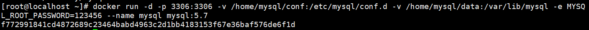

**测速连接**

> 通过第三方工具测速连接Docker的mysql，连接成功

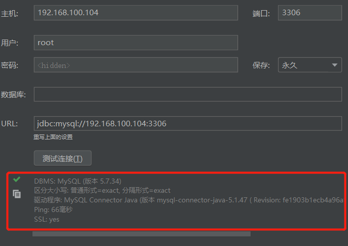

**本机查看数据卷**

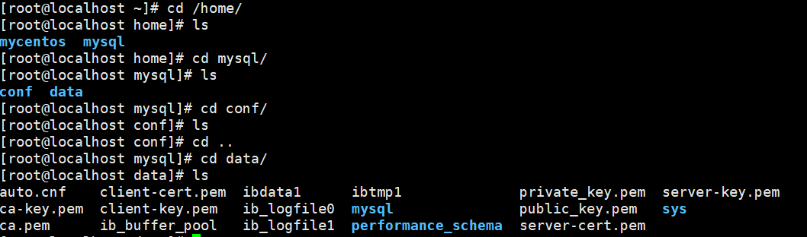

### 查看容器是否挂载数据卷

> 使用`docker inspect  容器id`在Mounts可以看到当前容器一些挂载信息

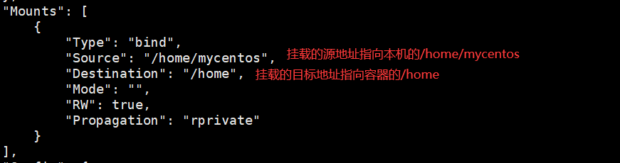

### 具名挂载和匿名挂载

#### 匿名挂载

> 匿名挂载用法`-v`后面只写路径，没有写容器外路径

~~~shell
# -v 容器路径（实现匿名挂载）
docker run -d -P -v /etc/nginx nginx
~~~

**查看挂载的列表**

> 使用`docker volume ls`可以查看所有挂载的文件，因为是匿名挂载所以卷名名字都是一串很长的hash值

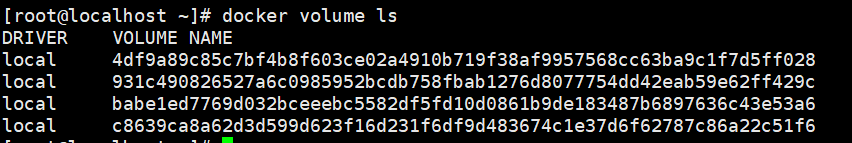

#### 具名挂载

> 具名挂载用法`-v`后面写`卷名:容器路径`，可以方便快速的找到卷

~~~shell
# -v 卷名:容器路径（实现匿名挂载）
docker run -d -P -v jm-nginx:/etc/nginx nginx
~~~

**查看挂载的列表**

> 使用`docker volume ls`可以查看所有挂载的文件，可以发现具名挂载中有编写的名字

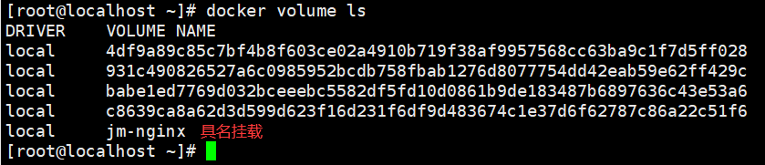

#### 查看指定卷名的信息

> 使用`docker volume inspect 卷名`卷的挂载路径

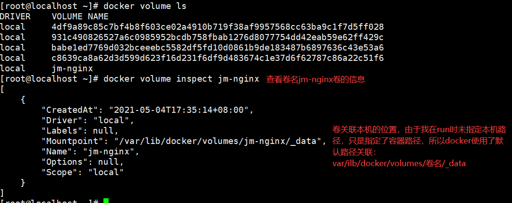

> 直接进入`/var/lib/docker/volumes/`目录看看

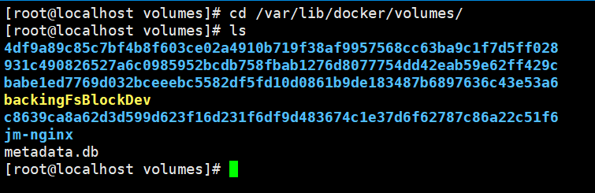

#### 如何确定具名挂载还是匿名挂载

~~~shell
# 匿名挂载
-v 容器内路径
# 具名挂载
-v 卷名:容器内路径
# 指定路径挂载
-v /宿主机路径:容器内路径
~~~

### 扩展知识

~~~shell
#通过 -v 容器路径:ro (readonly)设置挂载的内容只读
-v jm-nginx:/etc/nginx:ro nginx
#通过 -v 容器路径:rw (readwrite)设置挂载的内容可读可写
-v jm-nginx:/etc/nginx:rw nginx
~~~

