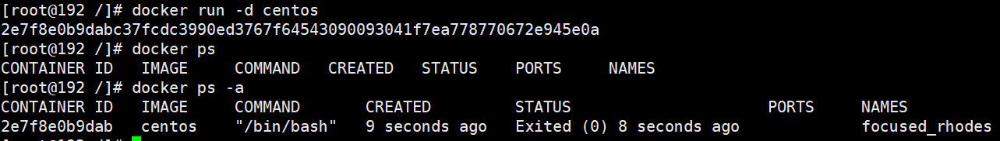
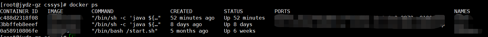
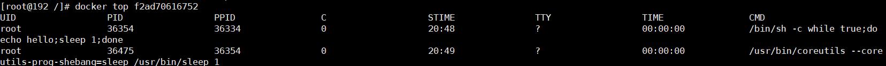
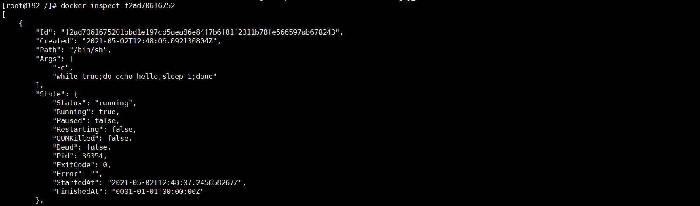
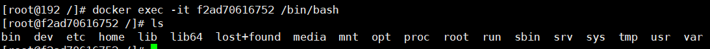
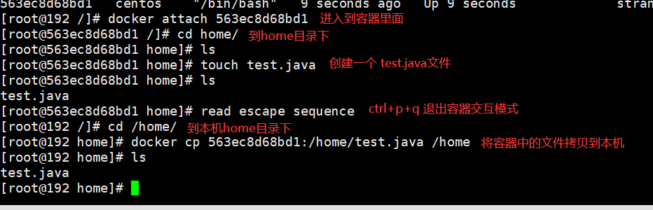
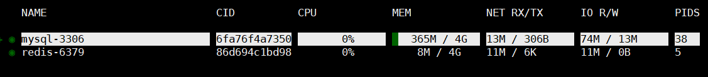
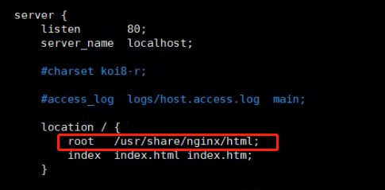

# Docker-命令速查手册

## 镜像

### DockerFile构建

~~~shell
#若创建的DockerFile是不是标准命名(除DockerFile以外的名称)必须使用该命令
docker build -f /xxx/xxx/myDockerFile -t test:1.0 .
#若创建的DockerFile是标准命名(直接DockerFile)可省略-f参数
docker build -t test:1.0 .
~~~

## 容器

### 容器启动

~~~shell
# -d 后台启动
# -p 端口映射 本机端口:容器端口(多个使用多个-p)，若是tcp协议写法 本机端口:容器端口/tcp
# --name 容器名称
# -v 挂载目录 本机目录:容器目录(多个使用多个-v)
# 启动java项目需要带上 --privileged=true --cap-add=SYS_PTRACE 参数
docker run -d -p 本机端口:容器端口  --name 容器名称 -v 本机目录:容器目录  镜像名称 --privileged=true --cap-add=SYS_PTRACE
~~~

**可能出现的坑爹情况**

> 在启动容器时，经常性会出现启动失败，即启动后使用`docker ps`命令无法看到容器，但使用`docker ps -a`可看到表示容器启动后出于某种运用关闭了，`解决方案将-d去掉前台启动查看程序运行时日志打印情况`

### 查看运行中容器信息

~~~shell
#查看当前运行时容器信息
docker ps
#查看所有运行过容器信息
docker ps -a
~~~

### 查看容器内部进程信息

~~~shell
#查看容器内部进程信息
docker top 容器id
~~~

### 查看镜像源数据

~~~shell
#查看容器的所有信息
docker inspect 容器id
~~~

**重要参数说明**

| 属性                                    | 说明                 |
| --------------------------------------- | -------------------- |
| "Id":""                                 | 容器的id             |
| "Args": []                              | 启动时传递的一些参数 |
| "State": {"Status": "running"}          | 容器当前的状态       |
| "Image":""                              | 来源镜像的签名       |
| "Mounts": []                            | 容器挂载             |
| "Config": { "Hostname": "f2ad70616752"} | 容器名称             |
| "Config": { "Env": []}                  | 容器环境变量         |
| "NetworkSettings"                       | 网络相关信息         |

### 进入运行中容器内部

~~~shell
#进入到容器并且打开新的终端（常用配置参数）
docker exec -it 容器id /bin/bash
#已root身份进入到容器
docker exec -it -u root 容器id /bin/bash
#进入到容器当前执行的终端窗口（常用测试查看）
docker attach 容器id /bin/bash
~~~

### 将容器内拷贝到主机上

~~~shell
docker cp 容器id:容器内路径 目标主机路径 
~~~

### 保存自己配置的容器

~~~shell
docker commit -m="提交描述" -a="作者" 容器id 目标镜像名:[TAG]
~~~

### 容器监控

> ctop容器监控命令：https://github.com/bcicen/ctop

## 网络

### 创建自定义网络

~~~shell
#driver:网络模式桥接模式
#subnet:子网192.168.0.0/16，可以分配192.168网段的255*255个IP地址
#gateway:网关192.168.0.1，就是你家路由器的地址，这个没写对容器无法访问互联网
#名字：mynet
docker network create --driver bridge --subnet 192.168.0.0/16 --gateway 192.168.0.1 mynet
~~~

## 脚本

> 该目录下收录了以下常用的脚本，直接创建sh文件拷贝进入后即可使用

### 删除指定镜像

~~~shell
#获取镜像信息
getImgIdByRep(){
  echo "正在查询 $1 镜像信息"
  images=$(docker images | grep $1 | awk '{print $3}')
  if [ ! ${images} ]
  then
    echo "未找到 $1 相关信息"
    return 1
  else
    echo "已找到 $1 ID=${images}"
    return 0
  fi
}
#删除镜像
deleteImgById(){
  if ( getImgIdByRep $1 )
  then
    echo "正在删除 $1 镜像"
    docker rmi $1
  fi
}
#入口
main(){
  deleteImgById $1
}

main $1
~~~

### 删除指定容器

~~~shell
#获取容器信息
getContainerIdByRep(){
  echo "正在查询 $1 容器信息"
  container=$(docker ps -a | grep $1 | awk '{print $1}')
  if [ ! ${container} ]
  then
    echo "未找到 $1 相关信息"
    return 1
  else
    echo "已找到 $1 ID=${container}"
    return 0
  fi
}
#删除容器
deleteContainerById(){
  if( getContainerIdByRep $1 )
  then
    echo "正在删除 $1 容器"
    docker ps -a | grep $1 | awk '{print $1}' | xargs docker rm -f
  fi
}
#入口
main(){
  deleteContainerById $1
}

main $1
~~~

### 镜像构建

~~~shell
#入口
main(){
  if [ ! $1 ]
  then
    echo "DockerFile文件路径不能为空"
    exit
  fi

  if [ ! $2 ]
  then
    echo "生成镜像名称不能为空"
    exit
  fi

  echo "DockerFile文件路径为 $1"
  echo "生成镜像名称为 $2"
  docker build -f $1 -t $2 .
}
main $1 $2
~~~

## 生产服务配置

### 部署Redis服务
~~~shell
#docker run -d(后台启动) 
#-p 6379:6379：主机的6379与容器6379先映射
#--name redis-1：容器名为redis-1
#-v /data/redis/dtat:/data：主机的/data/redis/dtat挂载到容器的/data目录
#-v /data/redis/conf/redis.conf:/etc/redis.conf：主机/data/redis/conf下的配置文件挂载到容器内
#redos-server /etc/redis/redis.conf使用配置文件启动
docker run -d -p 6379:6379 \
	-v /data/redis/dtat:/data \
	-v /data/redis/conf/redis.conf:/etc/redis.conf\
    --name redis-6379 \
    redis
~~~

### 部署Mysql服务
~~~shell
# docker run -d(后台启动) 
# -p 3306:3306(主机3306:容器3306端口相互映射) 
# -v /home/mysql/conf:/etc/mysql/conf.d(将容器的conf.d同步到主机/home/mysql/conf目录中) 
# -v /home/mysql/data:/var/lib/mysql(将来容器数据库数据同步到主机的/home/mysql/data中)
# -e MYSQL_ROOT_PASSWORD=123456(启动参数设置数据库root密码)
# --name mysql(为启动的容器命名)
# mysql:5.7(使用mysql:5.7镜像启动)
docker run -d -p 3306:3306 \
	-v /data/mysql/conf:/etc/mysql/conf.d \
	-v /data/mysql/data:/var/lib/mysql \
	-e MYSQL_ROOT_PASSWORD=123456 \
	--name mysql \
	mysql:5.7
~~~

> mysql默认只root使用localhost本地连接，若需要远程使用root服务mysql请执行如下命令

~~~shell
#部署进入到mysql容器中
docker exec -it mysql /bin/bash
#连接上mysql
mysql -u root -p
#授权
mysql> CREATE USER 'root'@'%' IDENTIFIED BY 'root';
mysql> GRANT ALL ON *.* TO 'root'@'%';
#刷新权限
mysql> flush privileges;
#修改root用户密码
mysql> ALTER USER 'root'@'%' IDENTIFIED WITH mysql_native_password BY '123456';
#刷新权限
mysql> flush privileges;
~~~

### 部署Nginx服务

~~~shell
#docker run -d(后台启动) 
#-p 6379:6379：主机的6379与容器6379先映射
#--name redis-1：容器名为redis-1
#-v /data/nginx/nginx.conf:/etc/nginx/nginx.conf 挂载nginx的配置文件
#-v /data/nginx/log:/var/log/nginx 挂载nginx的日志文件
#-v /data/nginx/html:/usr/share/nginx/html 挂载nginx的html文件
docker run -d -p 80:80 \
	-v /data/nginx/nginx.conf:/etc/nginx/nginx.conf \
	-v /data/nginx/log:/var/log/nginx \
	-v /data/nginx/html:/usr/share/nginx/html \
	--name nginx \
	nginx
~~~

> 注意docker中nginx的默认存放html路径是再/usr/share/nginx/html所有需要修改配置文件中的root路径

### 部署Jenkins服务

~~~shell
#docker run -d(后台启动) 
#-p 8080:8080：主机的8080与容器8080先映射
#-p 50000:50000：
#-v /data/jenkins:/var/jenkins_home jenkins的工作目录

docker run -d -p 8080:8080 \
	-p 50000:50000 \
	--privileged -e JAVA_OPTS="-Duser.timezone=Asia/Shanghai  -Dhudson.model.DownloadService.noSignatureCheck=true" \
	-v /data/jenkins:/var/jenkins_home \
	-v /etc/localtime:/etc/localtime:ro \
	--name jenkins \
	-e PHP_TZ="Asia/Shanghai" \
	docker.io/jenkins/jenkins
	
	#需要使用宿主机的docker命令
	#-v /usr/bin/docker:/usr/bin/docker \
	#-v /var/run/docker.sock:/var/run/docker.sock \

    #如果需要nginx反向代理 localhost/jenkins 需要添加如下配置
    #-e JENKINS_OPTS="--prefix=/jenkins" \
    #-e JENKINS_ARGS="--prefix=/jenkins" \
~~~

### 部署Sonarqube服务

~~~shell
#docker run -d(后台启动) 
#-p 9000:9000：主机的8080与容器8080先映射
#-v sonarqube_conf:/opt/sonarqube/conf
#-v sonarqube_data:/opt/sonarqube/data 
#-v sonarqube_extensions:/opt/sonarqube/extensions
#-v sonarqube_bundled-plugins:/opt/sonarqube/lib/bundled-plugins
docker run -d --name sonarqube \
	--restart always \
    -p 9000:9000 \
    -v sonarqube_conf:/opt/sonarqube/conf \
    -v sonarqube_data:/opt/sonarqube/data \
    -v sonarqube_extensions:/opt/sonarqube/extensions \
    -v sonarqube_bundled-plugins:/opt/sonarqube/lib/bundled-plugins \
    sonarqube
~~~

## DockerFile脚本

### 基于centos构建web

~~~shell
FROM centos:7
MAINTAINER xxx@qq.com

RUN yum -y install net-tools
RUN yum -y install java-1.8.0-openjdk
RUN yum -y install java-1.8.0-openjdk-devel
# 安装中文包
RUN yum install -y kde-l10n-Chinese
# 编译生成语言库
RUN localedef -c -f UTF-8 -i zh_CN zh_CN.utf8
# 设置语言默认值为中文，时区改为东八区
RUN echo 'LANG="zh_CN.UTF-8"' > /etc/locale.conf
RUN cp /usr/share/zoneinfo/Asia/Shanghai /etc/localtime
ENV LANG zh_CN.UTF-8
ENV LC_ALL zh_CN.UTF-8

WORKDIR /admin

# 暴露端口product环境
EXPOSE 8080

ADD target/web.jar ./

#测试环境
CMD java  -Djava.security.egd=file:/dev/./urandom  -Duser.timezone=GMT+8 -jar web.jar  --spring.profiles.active=test
#正式环境
#CMD java -Xmx6144m -Xms6144m -Xmn3072m -Xss512k -Djava.security.egd=file:/dev/./urandom -Duser.timezone=GMT+8 -jar web.jar  --spring.profiles.active=product
~~~

### 基于jdk构建web

~~~shell
FROM java:8
RUN mkdir webapp
RUN mkdir profile
COPY *.jar /webapp/web.jar
#时区设置
RUN cp /usr/share/zoneinfo/Asia/Shanghai /etc/localtime && echo 'Asia/Shanghai' >/etc/timezone
WORKDIR /webapp
#定义java启动参数
ENV JAVA_OPTS="-XX:+PrintGCDetails -XX:+PrintGCTimeStamps -XX:+PrintGCDateStamps -Xloggc:/gc-log/gc.log -Duser.timezone=Asia/Shanghai"
#暴露端口
EXPOSE 8180 6666 23

ENTRYPOINT java ${JAVA_OPTS} -jar /webapp/web.jar
~~~

