# Docker-进阶

## DockerFile

> DockerFile是用来构建docker镜像文件的，编写DockerFile文件可以构建自定义的镜像，并且可以将来构建的镜像发布，镜像构建与发布步骤如下
>
> 编写DockerFile文件=>docker buil构建镜像=>docker run运行镜像=>docker push发布镜像
>
> 其实官方的镜像都是使用DockerFile构建的我们在dockerHub随便搜索一个镜像点击版本进去后会发现跳到一个github页面里面就有构建这个镜像的DockerFile文件，使用docker buil执行这个脚本文件就可以生成一个镜像

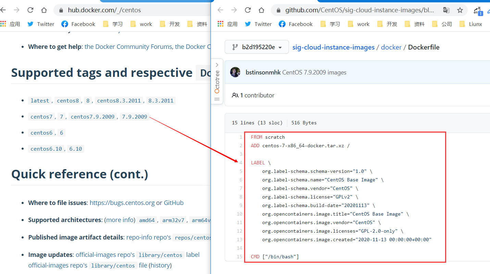

### 编写DockerFile

#### 编写规范

1. 每一个保留关键字（指令）必须大写
2. 执行从上到下的顺序执行
3. `#`表示注释
4. 每一个指令都会生成一个新的镜像层，并且提交

#### 指令集

| 指令       | 说明                                                       |
| ---------- | ---------------------------------------------------------- |
| FROM       | 指定基础镜像（就是你生成的镜像是基于那个镜像构建的）       |
| MAINTAINER | 编写镜像维护者信息（姓名+邮箱）                            |
| RUN        | 镜像构建时需要运行的命令（你想要它执行的命令前都要加RUN）  |
| ADD        | 添加内容（如你需要使用到tomcat，那么需要ADD tomcat压缩包） |
| WORKDIR    | 镜像的工作目录（就是镜像启动后默认cd到那个目录）           |
| VOLUME     | 设置卷，挂载主机目录（设置镜像卷名以及目录挂载到哪里）     |
| EXPOSE     | 指定镜像默认暴露端口（与-p手动指定端口命令一致）       |
| CMD        | 指定启动时运行的命令（只有会生效最后一条命令）             |
| ENTRYPOINT | 指定启动时运行的命令（可以追加命令）                       |
| ONBUILD | 构建一个被继承的DockerFile需要用到该指令|
| COPY | 类似ADD命令|
| ENV | 构建时设置环境变量（与-e手动指定环境变量命令一致） |

#### CMD与ENTRYPOINT区别

##### CMD例子

**创建并编写DockerFile文件**

~~~shell
#进入dockerfile文件夹
cd /home/dockerfile
#创建编写mycentos文件
vim cmdtest
~~~

**创建编写cmdtest文件内容**

~~~shell
# 基于centos修改
FROM centos
# 执行ls -a 命令
CMD ["ls","-a"]
~~~

**执行构建**

~~~shell
# docker build 
# -f DockerFile文件路径
# -t 生成镜像名:版本号
#  . (这个一定要加上最后结尾是空格.)
docker build -f cmdtest -t cmdtest:1.0 .
~~~

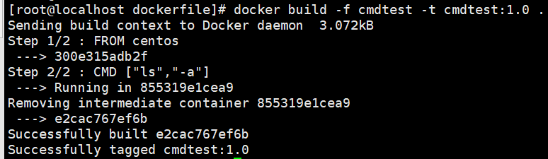

**运行测试**

> 运行测试时可以看到执行了ls -a命令

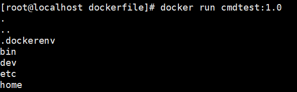

> 尝试在run 后追加命令-l，理想情况是ls -al，但是实际报错了，由于CMD特性只会执行最后一个命令，所以这里只是运行了-l命令

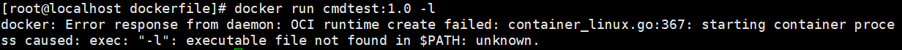

> 想使用ls -al那就需要写上完整命令才能执行成功

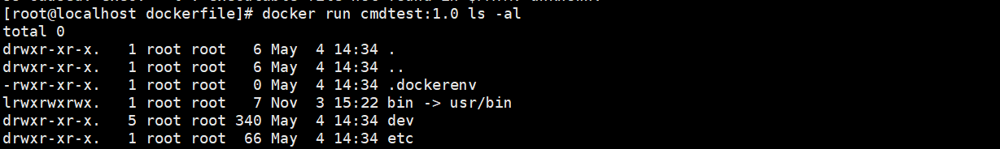

##### ENTRYPOINT例子

**创建并编写DockerFile文件**

~~~shell
#进入dockerfile文件夹
cd /home/dockerfile
#创建编写entrypointtest文件
vim entrypointtest
~~~

**创建编写entrypointtest文件内容**

~~~shell
# 基于centos修改
FROM centos
# 执行ls -a 命令
ENTRYPOINT ["ls","-a"]
~~~

**执行构建**

~~~shell
# docker build 
# -f DockerFile文件路径
# -t 生成镜像名:版本号
#  . (这个一定要加上最后结尾是空格.)
docker build -f entrypointtest -t entrypointtest:1.0 .
~~~

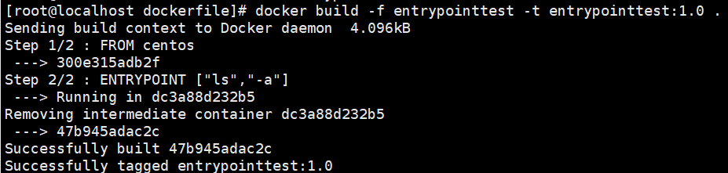

**运行测试**

> 运行测试时可以看到执行了ls -a命令

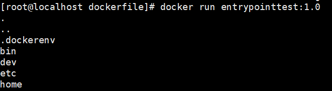

> 尝试在run 后追加命令-l，由于ENTRYPOINT特性没有替换掉原来ls -a命令，而是在后面追加`l`最后执行的是`ls -al`

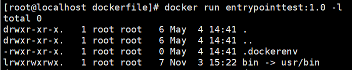

### 实战练习

#### 查看镜像构建过程

> 通过`docker history 镜像id`可以查看到一个镜像的构建过程

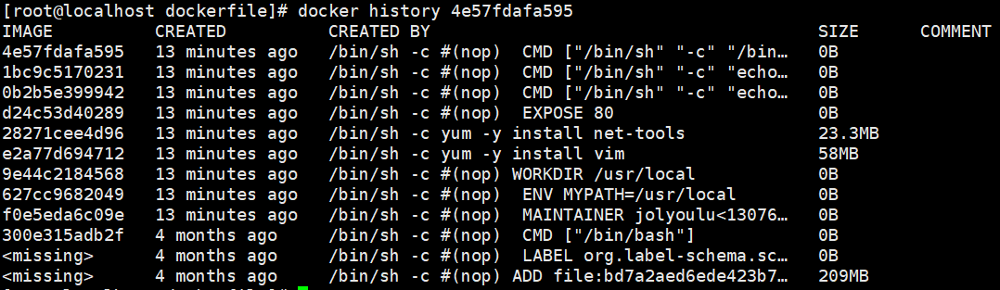

~~~shell
#进入到home目录创建一个dockerfile文件夹，以后练习的文件都放到这个里面
cd /home
mkdir dockerfile
~~~

#### 构建自己的Centos

> 利用DockerFile创建一个自己的centos，该centos需要带上vim和net-tools工具，默认暴露80端口，默认工作目录是/usr/local
>
> 1.创建DockerFile文件
>
> 2.编写DockerFile文件
>
> 3.执行构建命令

##### 创建DockerFile文件

~~~shell
#进入dockerfile文件夹
cd /home/dockerfile
#创建编写mycentos文件
vim mycentos
~~~

##### 编写mycentos文件内容

~~~shell
# 基于centos镜像构建的
FROM centos
# 作者信息
MAINTAINER jolyoulu<1307633126@qq.com>
# 设置环境变量 MYPATH="/usr/local"
ENV MYPATH /usr/local
# 启动后默认cd到$MYPATH变量定义的目录下
WORKDIR $MYPATH
# centos内需要安装vim和net-tools
RUN yum -y install vim
RUN yum -y install net-tools
# 默认暴露80端口
EXPOSE 80
#打印一下内容
CMD echo $MYPATH
CMD echo "-----end-----"
#使用/bin/bash命令
CMD /bin/bash
~~~

##### 执行构建命令

~~~shell
# docker build 
# -f DockerFile文件路径
# -t 生成镜像名:版本号
#  . (这个一定要加上最后结尾是空格.)
docker build -f mycentos -t mycentos:1.0 .
~~~

##### 查看本地镜像

> 通过`docker images`可以查看到我们刚刚构建的镜像

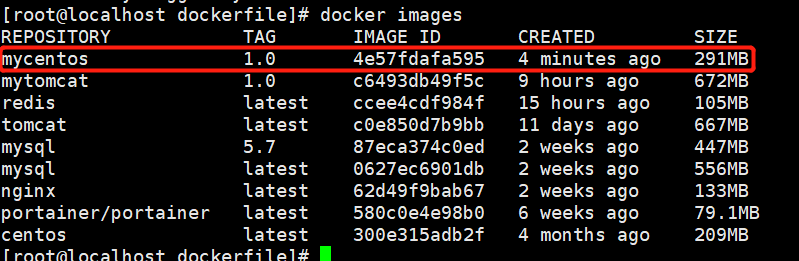

##### 运行测试

> 运行自己构建好的镜像后可以发现，在基础的centos添加了新功能

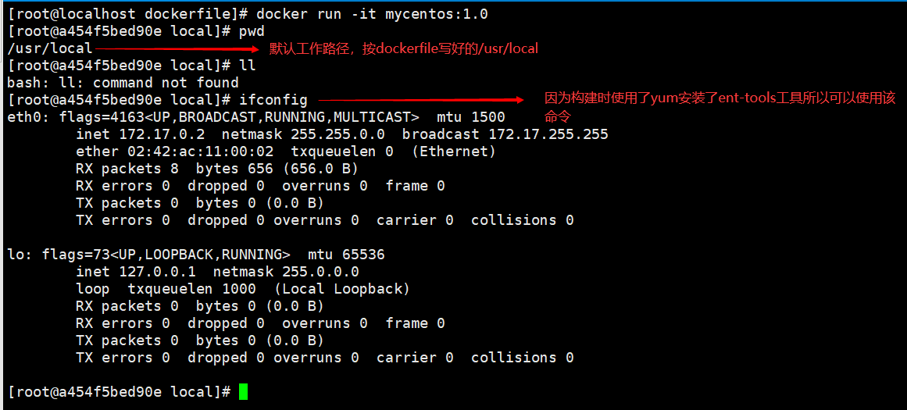

#### 构建自己的Tomcat

> 准备镜像文件，tomcat压缩包，jdk压缩包
>
> 1.创建DockerFile文件
>
> 2.编写DockerFile文件
>
> 3.执行构建命令

**准备相应文件**

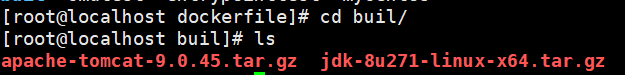

##### 创建DockerFile文件

~~~shell
#进入dockerfile文件夹
cd /home/dockerfile/buil
#创建编写Dockerfile文件(官方标准命名，好处buil会自动寻找不用-f指定)
vim Dockerfile
~~~

##### 编写Dockerfile文件内容

~~~shell
#基于centos构建
FROM centos
#编写作者
MAINTAINER jolyoulu<1307633126@qq.com>
#将来文件夹中的war包拷贝到/usr/local/目录下
COPY test.war /usr/local/test.war
#添加jdk与tomcat的tar包，并且解压到/usr/local/目录下
ADD jdk-8u271-linux-x64.tar.gz /usr/local/
ADD apache-tomcat-9.0.45.tar.gz /usr/local/
#安装vim编辑器
RUN yum -y install vim
#设置默认工作目录/usr/local
ENV MYPATH /usr/local
WORKDIR $MYPATH 
#设置jdk环境变量            
ENV JAVA_HOME /usr/local/jdk1.8.0_271
ENV CLASSPATH $JAVA_HOME/lib/dt.jar:$JAVA_HOME/lib/tools.jar
#设置tomcat环境变量           
ENV CATALINA_HOME /usr/local/apache-tomcat-9.0.45
ENV CATALINA_BASH /usr/local/apache-tomcat-9.0.45
#将来jdk与tomcat环境变量追加到PATH后面
ENV PATH $PATH:$JAVA_HOME/bin:$CATALINA_HOME/lib:$CATALINA_HOME/bin
#默认开放8080端口
EXPOSE 8080
#执行startup.sh 和 tail -f打印日志文件
CMD /usr/local/apache-tomcat-9.0.45/bin/startup.sh && tail -f /usr/local/apache-tomcat-9.0.45/logs/catalina.out
~~~

##### 执行构建命令

~~~shell
# 由于Dockerfile是标准名称所以构建无需加-f参数
docker build -t diytomcat .
~~~

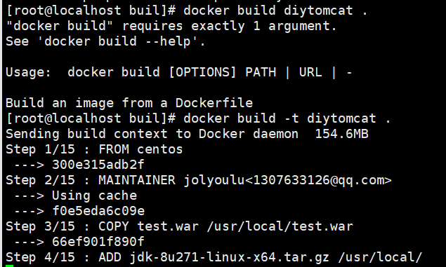

###### 查看本地镜像

> 通过`docker images`可以查看到我们刚刚构建的镜像

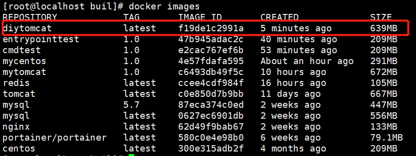

##### 运行测试

~~~shell
# -d 后台运行
# -p 端口映射 主机端口:容器端口
# --name 容器名称
# -v 主机路径:容器路径
docker run -d -p 9090:8080 --name diytomcat -v /home/tomcat/webapps/test:/usr/local/apache-tomcat-9.0.45/webapps/test -v /home/tomcat/logs:/usr/local/apache-tomcat-9.0.45/logs diytomcat
~~~

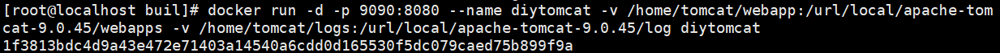

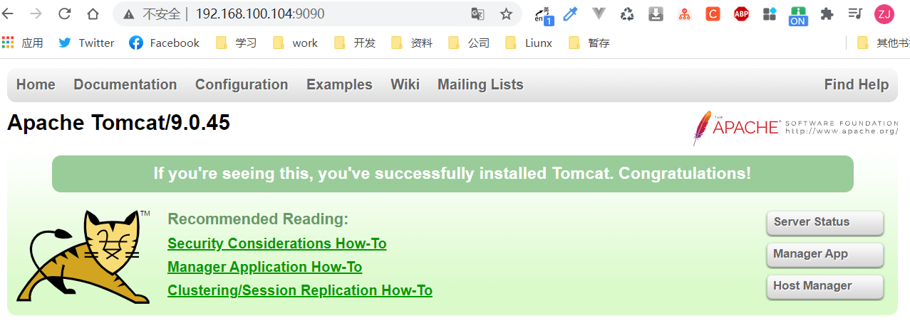

**模拟发布**

> 在本机的/home/tomcat/webapps/test
>
> 创建一个WEB-INF文件
>
> 创建一个inde.html文件内容随意

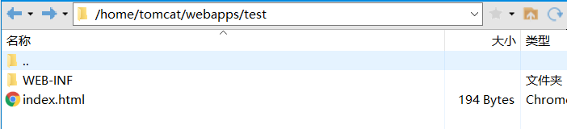

> 在本机的/home/tomcat/webapps/test/WEB-INF放入web.xml文件通用的百度一下就有

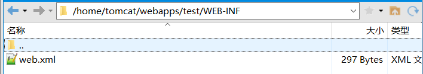

> 访问测试

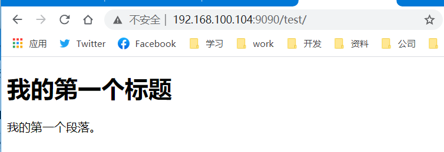

## 自定义镜像发布与拉取

发布自己的镜像可以发布到DockerHub或者发布到阿里云上

### DockerHub

> 发布到DockerHub首先需注册一个DockerHub账号需要如下步骤
>
> 1.DockerHub账号注册（已注册跳过）
>
> 2.在Docker中利用`docker login`命令登录自己的账号
>
> 3.使用`docker push`命令将制作好的镜像push上去

#### 账号注册

[点击此处注册DockerHub账号]: https://hub.docker.com/signup

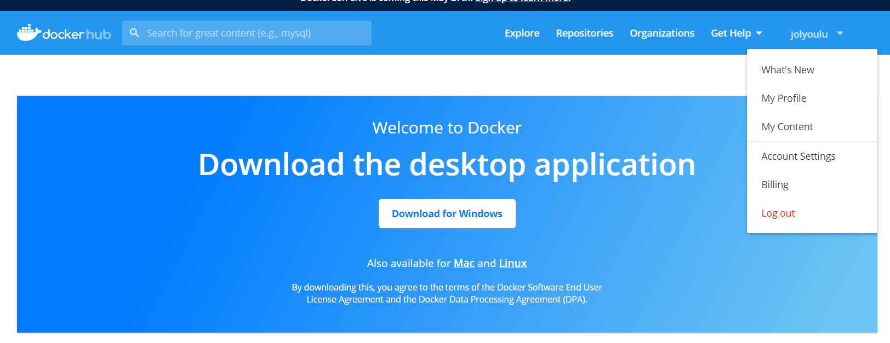

#### 登录账号

> 使用`docker login -u 你注册的账号`，输入密码显示`Login Succeeded`表示登录成功

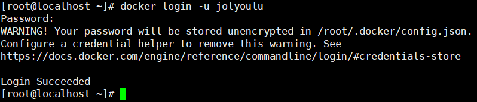

#### 提交镜像

> 镜像构建时最好按如下规范`你的账号/镜像名称:版本`
>
> 如果不规范需使用`docker tag 镜像id 新名称:版本号`命令修改镜像名称与版本信息

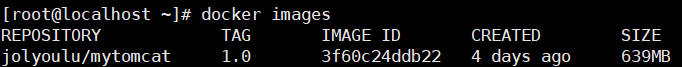

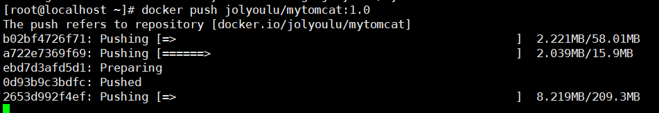

**错误示范**

> 如当前构建了一个叫diytomcat的镜像，当我想push到dockerHub时会招到拒绝，原因是因为镜像命名问题，叫diytomcat的镜像肯定有很多，由于命名不规范被拒绝提交了，所以在构建镜像时命名最好使用`你的账号/镜像名称:版本`方式命名，这样可以确保你的镜像能顺利提交

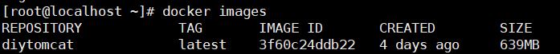

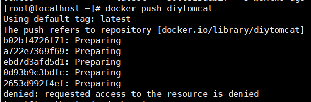

### 阿里云

> 由于DockerHub是外国网站，所以使用DockerHub发布镜像经常发布不了，接下来给大家讲解如何发布到阿里云容器仓库
>
> 1.登录阿里云
>
> 2.找到容器镜像服务
>
> 3.创建命名空间
>
> 4.创建镜像仓库
>
> 5.查看使用说明

#### 进入容器镜像服务

> 如果没有使用过`容器镜像服务`第一次进入选择个人版，然后输入仓库密码，进入就是整个页面

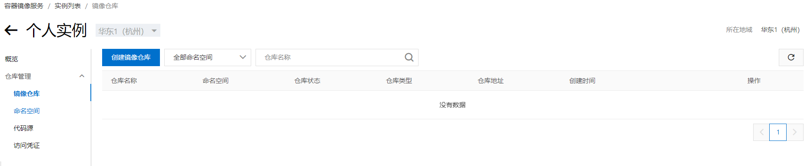

#### 创建命名空间

> 选择左侧命名空间，点击创建命名空间，输入一个自己喜欢的名字即可，`注意：有一个账号只能创建3个命名空间`

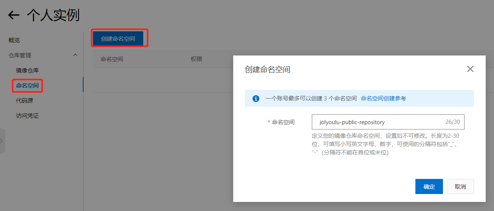

#### 创建镜像仓库

> 在创建命名空间完成后，选择左侧镜像仓库点击创建镜像仓库

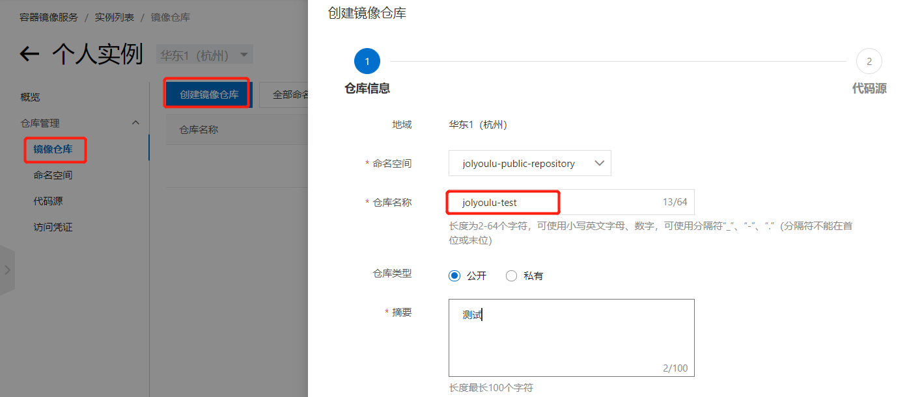

> 下一步后选择代码源，选择本地仓库即可

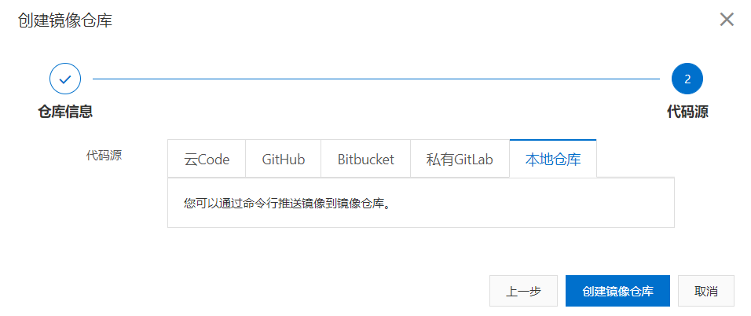

#### 查看操作说明

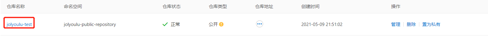

> 点击创建好的仓库名称进去，可以看到右边公网地址等信息，你的伙伴就可以通过这个地址访问你的仓库，可以看到阿里云已经有详细的操作指南了，看着操作指南就可以做到镜像提交和拉取了

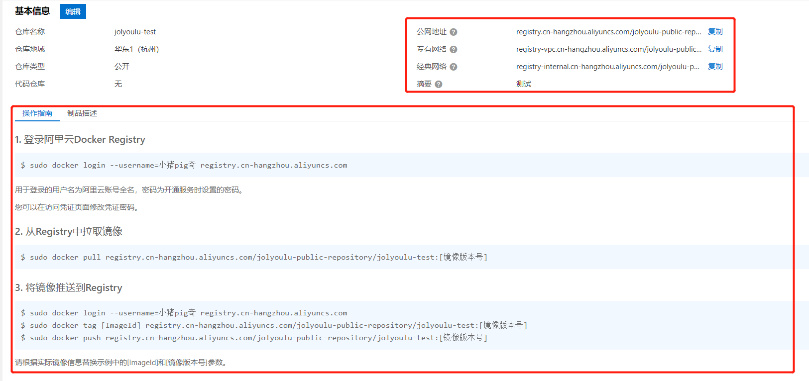

#### 提交一个镜像

> 就拿从dockerHub拉取的`hello-world `镜像修改名称再次提交到我们的阿里云
>
> 如果使用`docker images`没看到hello-world镜像的话使用`docker pull hello-world`拉取一个下来

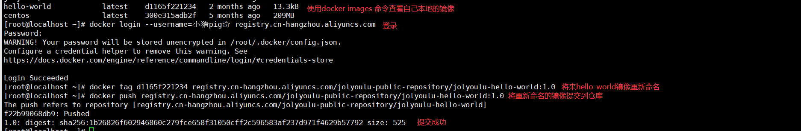

> 发布成功后就可以在镜像仓库中看到一个镜像版本

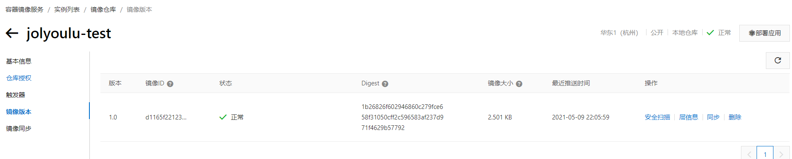

