# Kubernetes-基础

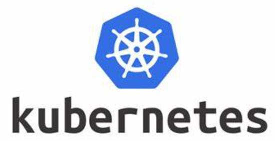

Kubernetes，是一个基于容器技术的分布式架构解决方案，Kubernetes是谷歌使用10几年的Borg系统的一个开源版本，于2014年9月发布第一个版本，2015年7月发布第一个正式版

Kubernetes的本质是一组服务器集群，它可以再集群的每个节点上运行特点的程序，来对节点中的容器进行管理，它的目的就是实现资源管理的自动化，主要是提供了如下功能

* 自我修复：一旦某一个容器崩溃，能够在1秒中左右迅速启动新的容器
* 弹性伸缩：可以工具需要，自动对集群中正在运行的容器数量进行调整
* 负载均衡：如果一个服务启动多个容器，能够自动实现请求的负载均衡
* 版本回退：如果发现新发布的版本有问题，可以立即回退到原来的版本
* 存储编排：可以根据容器自身的需求自动创建存储卷

## 组件

一个Kubernetes集群主要是由`控制节点(master)`和`工作节点(node)`构成，每个节点上都会安装不同的组件

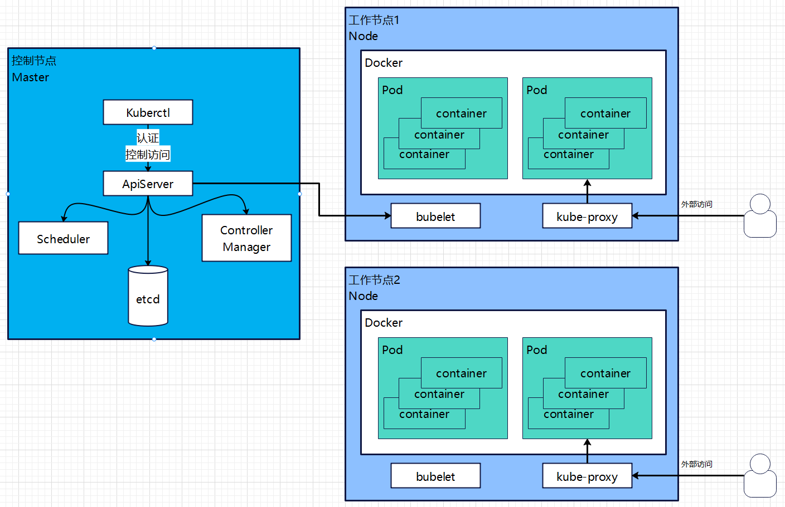

### Master

master是集群的控制平台，负责管理集群，在master中有4个组件

1. ApiServer：资源操作的唯一入口，接受用户输入的命令、提供认证授权、API注册和发现等机制
2. Scheduler：负责集群资源调度，按照预定的策略将Pod调度到相应的node节点上
3. ControllerManager：负责维护集群的状态，比如程序部署安排、故障检测、自动扩展、滚动更新等
4. Etcd：负责存储集群中各种资源对象的信息(默认使用Etcd，可以切换为mysql或其它数据库)

### Node

node是集群的数据平台，负责为容器提供运行环境

1. Kublete：负责维护容器的生命周期，即通过控制docker，来创建、更新、销毁容器
2. KubeProxy：负责提供集群内部的服务发现和负载均衡
3. Docker：负责节点上容器的各种操作

### 案例说明

前面对Master与Node说明组件涉及比较多可能总体下来没什么概念，下面以部署一个nginx为例看kubernetes各组件是怎么协调

> 1. 首先，一旦Kubernetes环境启动后，master和node都会将自身的信息存储到etc数据库中
> 2. 一个nginx服务的安装请求会首先被发送到master的apiServer节点上
> 3. apiServer组件会调用schedule组件来决定到底应该把这个服务安装到那个node节点上，在此时它会从etcd中读取各个node节点的信息，然后按一定的算法进行选中，并将结果告知apiServer
> 4. apiServer调用controller-manager去调度node节点按照nginx服务
> 5. kubelet接受到指令后，会通知docker，然后由docker来启动一个nginx的pod(pod是Kubernetes的最小操作单元，容器必须跑在pod中)
> 6. 一个nginx服务就运行了，如果需要访问nginx，就需要通过kube-proxy来对pod产生访问的代理，这样外界用户就可以访问到集群中的nginx服务

## 概念

Master：集群控制节点，每个集群需要至少1个master节点

Node：工作负载节点，由master分配容器到这些node工作节点上，然后node节点上的docker负责容器的运行

Pod：Kubernetes的最小控制单元，容器都是运行在pod中的，一个pod中可以有1个或者多个容器

Controller：控制器，通过它来实现对pod的管理，比如启动pod、停止pod、伸缩pod的数量等

Service：pod对外服务的统一入口，下面可以维护着同一类的多个pod

Label：标签，用于对pod进行父类，同一类pod要用的相同的标签

NameSpace：命名空间，用来隔离pod的运行环境

## 集群环境搭建

### 集群类型

Kubernetes集群上分为两类：一主多从和多主多从

> 一主多从：一台Master节点和多台Mode节点，搭建简单，但是单机故障风险，适用于测试环境
>
> 多主多从：多台Master节点和多台Node节点，搭建麻烦，安全性高，适用于生产环境

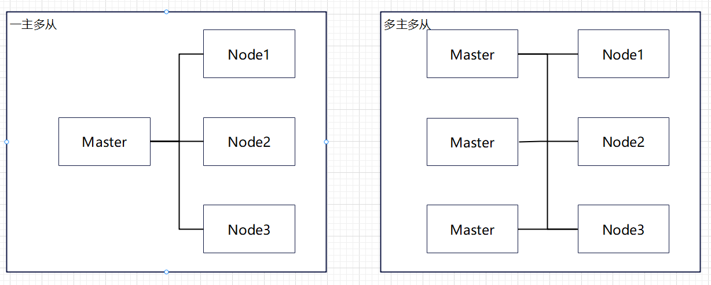

[Liunx-安装Kubernetes](./Liunx-安装Kubernetes)

## 资源管理

在Kubernetes中，所有的内部都抽象为资源，用户只需要通过操作资源来管理Kubernetes

> Kubernetes的本质上就是一个集群系统，用户可以在集群中部署各种服务，所谓的部署服务器实际上就是在Kubernetes中运行一个容器，并且将指定的程序运行在容器中
>
> Kubernetes的最小管理单元是pod而不是容器，所以只能将容器放在pod中，而kubernetes一般也不会直接管理pod，而是通过pod管理器来管理pod
>
> pod可以提供服务之后，就要考虑如何访问pod中服务，kubernetes提供了service资源实现这个功能
>
> 当然，如果pod中程序的数据需要持久化，kubernetes还提供了存储系统
>
> `学习Kubernetes的核心，就是学习如何对集群上的Pod、Pod控制器、Service、存储等各种资源进行操作`

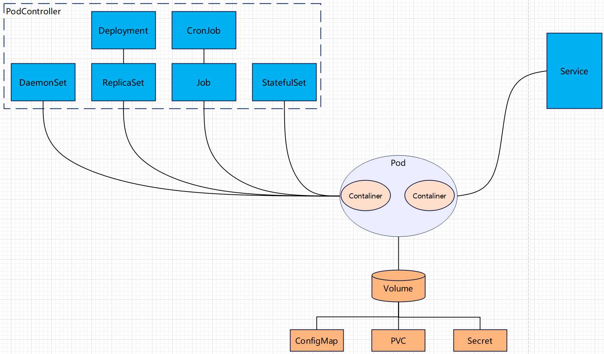

### YAML语法

> YAML是Kubernetes的配置文件使用的语法，YAML是一个类似XML、JSON的标记语言，它强调已数据为中心，并不是以标记语言为重点，因而YAML本身定义比较简单，号称"一种人性化的数据格式语言"
>
> `使用并且了解过过yaml/yml的可通过该章节`

**YAML语法特点**

* 大小写敏感
* 使用缩进表示层级关系
* 缩进不允许使用tab，只允许空格
* 缩进空格不重要，只要与相同层级的元素左对齐即可
* `#`表示注释

**YAML支持的数据类型**

* 纯量：单个的、不可再分的值
* 对象：键值对的集合，又称为映射(mapping)/哈希(hash)/字典(dictionary)
* 数组：一组次序排序的值，又称为序列(sequence)/列表(list)

~~~yaml
#纯量，即简单的值
#布尔
c1: ture
#整型
c2: 123
#浮点
c3: 3.14
#null值
c4: ~
#日期，必须按照ISO 8601格式
c5: 2018-02-07
#时间，必须按照ISO 8601格式
c6: 2018-02-17T15:02:31+08:00
#字符串
c7: aaa
#多字符串换行后会被转换为空格，即使"hello world"
c8: hello
    world

#对象
#写法1（推荐）
student:
 age:18
 name:zhangsan
#写法2
student: {age: 18,name: zhangsan}

#数组
#写法1（推荐）
array:
 - 1
 - 2
#写法2
array: [1,2]
~~~

> [yaml转json网页，和用于验证yaml语法准确性](http://json2yaml.com)

### 资源管理方式

* 命令式对象管理：直接使用命令去操作kubernetes资源

  `kubectl run nginx-pod --image=nginx:1.17.1 --port=80`

* 命令式对象配置：通过命令配置和配置文件去操作kubernetes资源

  `kubectl creat/patch -f nginx-pod.yaml`

* 声明式对象配置：通过apply命令和配置文件去操作kubernetes资源

  `kubectl apply -f nginx-pod.yaml`

| 类型           | 操作对象 | 适用环境 | 优点           | 缺点                             |
| -------------- | -------- | -------- | -------------- | -------------------------------- |
| 命令式对象管理 | 对象     | 测试     | 简单           | 只能操作活动对象、无法审计、跟踪 |
| 命令是对象配置 | 文件     | 开发     | 可以审计、跟踪 | 项目大时，配置文件多，操作麻烦   |
| 声明式对象配置 | 目录     | 开发     | 支持目录操作   | 意外情况下难以调试               |

#### 命令式对象管理

**kubectl命令**

kubect是kubernetes集群的命令行工具，通过它能够对集群本身进行管理，并能够再集群上进行容器化应用的安装部署，kubectl命令语法如下

> command：指定要对资源执行的操作，例如crate、get、delete
>
> type：指定资源类型，比如deployment、pod、service
>
> name：指定资源的名称，名称大小写敏感
>
> flags：指定额外的可选参数

~~~shell
#命令
kubectl [command] [type] [name] [flags]

#例子
#查看所有pod
kubectl get pod
#查看名为pod_name的pod
kubectl get pod pod_name
#查看pod_name，以yaml格式显示
kubectl get pod pod_name -o yaml
~~~

##### command

**基本命令**

| 命令    | 翻译 | 命令作用     |
| ------- | ---- | ------------ |
| create  | 创建 | 创建一个资源 |
| edit    | 编辑 | 编辑一个资源 |
| get     | 获取 | 获取一个资源 |
| patch   | 更新 | 更新一个资源 |
| delete  | 删除 | 删除一个资源 |
| explain | 解释 | 展示资源文档 |

**运行和调试**

| 命令      | 翻译     | 命令作用                   |
| --------- | -------- | -------------------------- |
| run       | 运行     | 在集群中运行一个指定的镜像 |
| expose    | 暴露     | 暴露资源为 Service         |
| describe  | 描述     | 显示资源内部信息           |
| logs      | 日志     | 输出容器在 Pod 中的日志    |
| attach    | 缠绕     | 进入运行中的容器           |
| exec      | 执行     | 执行容器中的一个命令       |
| cp        | 复制     | 在 Pod 内外复制文件        |
| rollout   | 首次展示 | 管理资源的发布             |
| scale     | 规模     | 扩（缩）容 Pod 的数量      |
| autoscale | 自动调整 | 自动调整 Pod 的数量        |

**高级命令**

| 命令  | 翻译 | 命令作用               |
| ----- | ---- | ---------------------- |
| apply | 应用 | 通过文件对资源进行配置 |
| label | 标签 | 更新资源上的标签       |

**其他命令**

| 命令         | 翻译     | 命令作用                         |
| ------------ | -------- | -------------------------------- |
| cluster-info | 集群信息 | 显示集群信息                     |
| version      | 版本     | 显示当前 Client 和 Server 的版本 |

##### type

**集群级别资源：**

| 资源名称   | 缩写 | 资源作用     |
| ---------- | ---- | ------------ |
| nodes      | no   | 集群组成部分 |
| namespaces | ns   | 隔离 Pod     |

**Pod资源：**

| 资源名称 | 缩写 | 资源作用 |
| -------- | ---- | -------- |
| Pods     | po   | 装载容器 |

**Pod资源控制器：**

| 资源名称                 | 缩写   | 资源作用      |
| ------------------------ | ------ | ------------- |
| replicationcontrollers   | rc     | 控制 Pod 资源 |
| replicasets              | rs     | 控制 Pod 资源 |
| deployments              | deploy | 控制 Pod 资源 |
| daemonsets               | ds     | 控制 Pod 资源 |
| jobs                     |        | 控制 Pod 资源 |
| cronjobs                 | cj     | 控制 Pod 资源 |
| horizontalpodautoscalers | hpa    | 控制 Pod 资源 |
| statefulsets             | sts    | 控制 Pod 资源 |

**服务发现资源：**

| 资源名称 | 缩写 | 资源作用          |
| -------- | ---- | ----------------- |
| services | svc  | 统一 Pod 对外接口 |
| ingress  | ing  | 统一 Pod 对外接口 |

**存储资源：**

| 资源名称               | 缩写 | 资源作用 |
| ---------------------- | ---- | -------- |
| volumeattachments      |      | 存储     |
| persistentvolumes      | pv   | 存储     |
| persistentvolumeclaims | pvc  | 存储     |

**配置资源：**

| 资源名称   | 缩写 | 资源作用 |
| ---------- | ---- | -------- |
| configmaps | cm   | 配置     |
| secrets    |      | 配置     |

##### 案例

结合上面学习的命令，运用命令完成简单的一个namespaces/pod操作

~~~shell
#创建一个命名空间(namespaces)用于隔离不同环境的pod
kubectl create ns dev
#获取当前所以namespaces
kubectl get ns
#在刚刚创建的dev命名空间中运行一个pod
kubectl run pod --image=nginx:1.17.1 -n dev
#查询dev命名空间中的pod
kubectl get pods -n dev
#获取pod的描述
kubectl describe pods -n dev
#删除pod(这个删除后会自动再启动一个nginx的pod，因为pod控制器的原因，后面章节会说到)
kubectl delete pods pod-cbb995bbf-6vsbz -n dev
#删除命名空间，停止命名空间下的所有pod并且删除
kubectl delete ns dev
~~~

#### 命令式对象配置

命令对象配置就是使用命令配合配置文件一起操作kubernetes资源

##### 案例

这里将用命令式对象配置的方式实现命令式对象管理中的案例功能

1. 创建一个nginxpod.yaml内容如下

~~~yaml
#创建一个命名空间
apiVersion: v1
kind: Namespace
metadata:
 name: dev
 
#如果想在一个yaml中写多个相同内容，使用3个-分段
---
#创建一个Pod
apiVersion: v1
kind: Pod
metadata:
 name: nginxpod
 namespace: dev
spec:
 containers:
 - name: nginx-containers
   image: nginx:1.17.1
~~~

2. 执行creat命令，创建资源

~~~shell
#执行命令，创建资源
kubectl create -f nginxpod.yaml
#查看命名空间
kubectl get ns dev
#查看pod
kubectl get pod -n dev
~~~

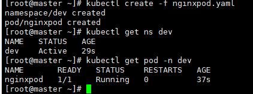

3. 删除资源

~~~shell
#执行命令，删除资源
kubectl delete -f nginxpod.yaml
~~~

> 命令式对象配置的方式操作资源，可以简单的认为：命令+yaml配置文件(里面是需要的各种参数)

#### 声明式对象配置

声明式对象配置跟命令式对象配置很相似，只不过它只有一个apply，只能对资源进行新增/更新

##### 案例

1. 创建资源

~~~shell
#执行的还是前面写好的配置文件
kubectl apply -f nginxpod.yaml
~~~

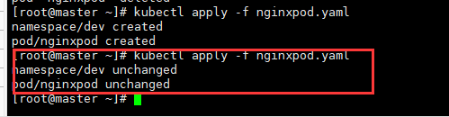

> 多次执行时可以发现第一次提示创建成功，第二次提示无变化

2. 更新资源

当修改yaml后，再次使用`kubectl apply -f nginxpod.yaml`执行可以看到提示nginxpod有变动

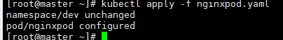

3. 查看变动情况

~~~shell
#查看pod的变动信息
kubectl describe pod nginxpod -n dev
~~~

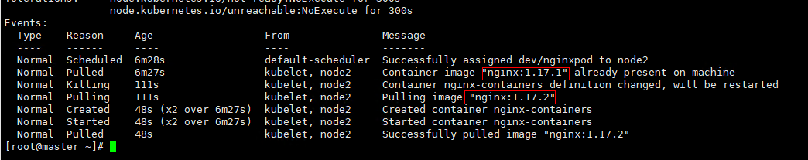

> 可以看到由开始的1.17.1改为1.17.2

#### 总结

| 操作类型      |                                                 |
| ------------- | ----------------------------------------------- |
| 创建/更新资源 | 使用声明式对象配置kubectl apply -f xxx.yaml     |
| 删除资源      | 使用命令式对象配置kubectl delete -f xxx.yaml    |
| 查询资源      | 使用命令是对象管理kubectl get/describe 资源名称 |

#### 扩展

##### 如何在Nodd节点上执行kubectl

kubectl的运行是需要进行配置的，它的配置文件是$HOME/.kube，如果想要node节点运行此命令，需要将master上的.kune文件负责到node节点上，即在master节点上执行下面操作

~~~shell
scp -r $HOME/.kube node1:$HOME/
~~~

## 资源详解

### Namespace

Namespace是kubernetes系统中的一种非常重要资源，它的主要作用是用来实现多套环境资源隔离和多租户的资源隔离

默认情况下，kubernetes集群中的所有的Pod都是可以相互访问的，但是实际中，可能不想让两个Pod之间进行相互的访问，那此时就可以将两个Pod划分到不同的namespace下，kubernetes通过将集群内部的资源分配到不同的Namespace中，可以形成逻辑上的组，以方便不同的组的资源进行隔离使用和管理

可以通过kubernetes的授权机制，将不同的namespace交给不同租户进行管理，这样就实现了多租户的资源隔离，此时还能结合kubernetes的资源配额机制，限定不同租户能占用的资源，例如CPU使用量，内存使用量等等，来实现租户可用资源的管理

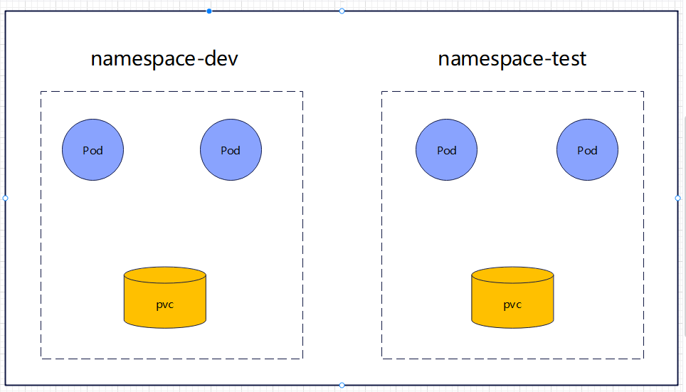

#### 默认的命名空间

> 使用`kubectl get ns`命令可查看到Kubernetes中存在是命名空间

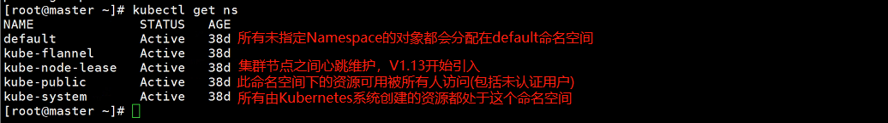

#### 操作命名空间

**命令行方式**

| 命令名称                            | 说明                                                         |
| ----------------------------------- | ------------------------------------------------------------ |
| kubectl get ns                      | 查看所有命名空间                                             |
| kubectl get ns <命名空间名称>       | 查看指定的命名空间信息，如状态、存活时间                     |
| kubectl describe ns  <命名空间名称> | 查看指定的命名空间详细描述内容如下：  Name:         default Labels:       <none> Annotations:  <none> Status:       Active `ResourceQuota针对namespace做的资源限制` `LimitRange针对namespace中的每个组件做的资源限制` No resource quota. No LimitRange resource. |
| kubectl create ns dev               | 创建一个名为dev的命名空间                                    |
| kubectl delete ns dev               | 删除dev命名空间                                              |

#### 配置操作

> 使用`kubectl create -f xxx.yaml`会读取相应的yaml文件创建命名空间
>
> 以下yaml文件创建后并且使用命令执行可以创建一个命为dev的命名空间

~~~yaml
apiVersion: v1
kind: Namespace
metadata:
  name: dev
~~~

### Pod

Pod是kubernetes集群进行管理的最小单元，程序要运行必须要部署在容器中，而容器必须存在于Pod中，Pod可以认为是对容器的封装，一个Pod中可以存在一个或者多个容器

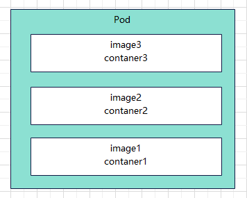

kubernetes在集群启动后，集群中的组件也都是Pod方式运行的，可以使用`kubectl get pid -n kube-system`查看到集群组件的信息

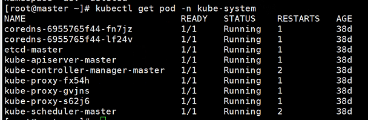

#### 命令行操作

~~~shell
#命令格式：kubectl run (pod控制器名称) [参数]
#--image 	 指定Pod的镜像
#--port 	 指定端口
#--namespace 指定namespace
kubectl run nginx --image=nginx:1.17.1 --port=80 --namespace dev
~~~

**查看信息**

~~~shell
#查看命名空间dev中的pod信息
kubectl get pod -n dev
#查看命名空间dev中的pod额外信息，如
#NAME(名称)
#READY(有多少容器，多少正在运行)
#STATUS(运行状态)
#RESTARTS(重启次数)
#NODE(容器所属节点)
kubectl get pod -n dev -o wide
#查看命名空间dev中的名称为“nginx-64777cd554-kxctv”的pod描述信息
kubectl describe pod nginx-64777cd554-kxctv
~~~

**删除**

删除pod时很多人会发现删除不了，删除了又重新创建一个这是因为pod控制器会监控pod的状态，一旦发现pod死亡就会立刻重新创建一个pod，所以要想删除pod那么必须先删除pod控制器

~~~shell
#删除指定pod命令(该命令是无法正常删除的)
kubectl delete pod nginx-64777cd554-gh8r4 -n dev

#查询命名空间下的pod控制器
kubectl get deploy -n dev
#删除控制器(控制器删除后pod就直接没了)
kubectl delete deploy nginx -n dev
~~~

#### 配置操作

以下就是一个简单的使用`pod-nginx.yaml`

~~~yaml
apiVersion: v1
kind: Pod
metadata:
  name: nginx
  namespace: dev
spec:
  containers:
  - image: nginx:1.17.1
    name: pod
    ports:
    - name: nginx-port
      containerPort: 80
      protocol: TCP
~~~

> 创建：`kubectl create -f pod-nginx.yaml`
>
> 删除：`kubectl delete -f pod-nginx.yaml`

### Lable

Lable是kubenetes系统中的一个重要概念，它的作用就是在资源上添加标识，用来对它们就行区分和选择

Lable特点：

* 一个Label会以Key/value键值对的形式附加到各种对象上，如Node、Pod、Service等等
* 一个资源对象开源定义任何数量的Lable，同一个Lable也开源被添加到任意数量的资源对象上
* Label通常在资源对象定义时确定，当然也开源在对象创建后动态添加或者删除

> 一些常用Label例子如下：
>
> * 版本标签："version":"release","versiong":"stable".....
> * 环境标签："environment":"dev","environment":"test","environment":"pro"
> * 架构标签："tier":"frontend","tier":"backend"

标签定义完毕之后，还需要考虑到标签的选择，这就要使用到Label Selector即：

​	Label用于某个资源对象定义标识

​	Label Selector用于查询和筛选拥有某些标签的资源对象

当前有两种Label Selector：

* 基于等式的Label Selector

  name=slave：选择所有包含Label中key="name"且value="slave"的对象

  env != production：选择所有包括Label中的key="env"且value不等于"production"的对象

* 基于集合的Label Selector

  name in (master,slave)：选择所有包含Label中的key="name"且value="master"或者"slave"的对象

  name not in (frontend)：选择所有包含Label中的key="name"且value不等于"frontend"的对象

> 标签的选择条件开源使用多个，此时将多个Label Selector进行组合，使用逗号","进行分隔即可，例如：
>
> name=slave，env!=production
>
> name not in (frontend)，env!=production

#### 命令行操作

~~~shell
#显示dev下所有pod的标签
kubectl get pod -n dev --show-labels
#为pod资源打标签
kubectl label pod nginx version=1.0 -n dev
#为pod资源更新标签
kubectl label pod nginx version=2.0 -n dev --overwrite
#筛选出version=2.0的pod
kubectl get pod -l "version=2.0" -n dev --show-labels
#删除标签名为nginx的pod中的version标签
kubectl label pod nginx -n dev version-
~~~

#### 配置操作

> 以下使用yaml方式创建一个带标签的容器

~~~yaml
apiVersion: v1
kind: Pod
metadata:
  name: nginx
  namespace: dev
  labels:
    version: "3.0"
    env: "test"
spec:
  containers:
  - image: nginx:1.17.1
    name: pod
    ports:
    - name: nginx-port
      containerPort: 80
      protocol: TCP
~~~

> 创建/更新：`kubectl apply -f pod-nginx.yaml`
>
> 删除：`kubectl delete -f pod-nginx.yaml`

### Deployment

在Kubernetes中，Pod是最小的控制单元，但是Kubernetes很少直接控制Pod，一般都是通过Pod控制器来完成的，Pod控制器用于pod的管理，确保pod资源管理符合预期的状态，当pod的资源出现故障时，会尝试进行重启或者重建pod

> Kubernetes中Pod控制器的种类有很多，本章节只介绍一种：Deployment

#### 命令行操作

~~~yaml
#命令格式：kubectl run deployment名称 [参数]
# --image 指定pod的镜像
# --port 指定端口
# --replicas 指定创建pod数量
# -n 指定namespace
kubectl run nginx --image=nginx:1.17.1 --port=80 --replicas=3 -n dev

#查看命名空间dev下的deploy和pods信息
kubectl get deploy,pods -n dev

#查看nginx deploy的详细信息
kubectl describe deploy nginx -n dev

#删除deploy
kubectl delete deploy nginx -n dev
~~~

#### 配置操作

> 配置yaml时kind使用Deployment，这样就会使用Pod控制器创建Pod，创建的Pod的信息位于template中，spec.selector.matchLabels.run 于 template.metadata.labels.run 关联使得Deployment可以监控pod

~~~yaml
apiVersion: v1
kind: Deployment
metadata:
  name: nginx
  namespace: dev
spec:
  replicas: 3
  selector:
    matchLabels:
      run: nginx
  template:
    metadata:
      labels:
        run: nginx
    spec:
      containers:
      - image: nginx:1.17.1
        name: nginx
        ports:
        - name: nginx-port
          containerPort: 80
          protocol: TCP
~~~

> 创建：`kubectl create -f deploy-nginx.yaml`
>
> 删除：`kubectl delete -f deploy-nginx.yaml`

### Service

利用前面所学的知识点已经可以实现一组pod来提供具有高可用的服务了，利用pod的ip+端口号发请求实现pod于pod之间的通信，但是这还存在以下问题

1. Pod IP 会随着Pod的重建产生变化
2. Pod IP 仅仅是集群内可见的虚拟IP，外部无法访问

这样堆访问中国服务带来了难度，所以Kubernetes设计了Service来解决这个问题，Service可以将一组同类的Pod对外提供访问接口，借助Service运用可以方便地实现服务发现和负载均衡

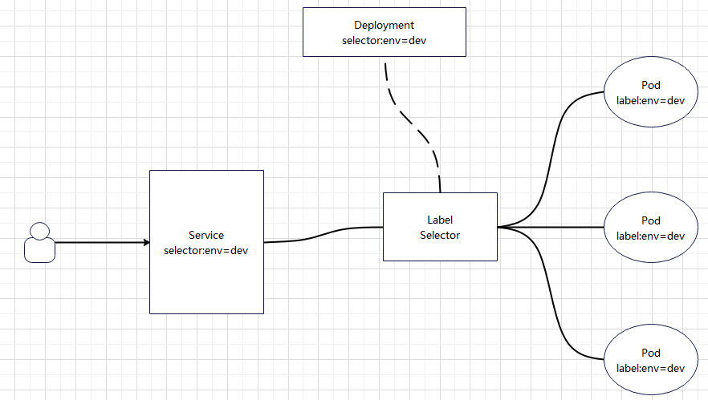

#### 创建集群内部访问的Service

~~~yaml
#暴露Service
#expose deploy nginx 通过一个名为nginx的deploy找到需要暴露pod
#--type=ClusterIP 只能在集群个节点访问
kubectl expose deploy nginx --name=svc-nginx1 --type=ClusterIP --port=80 --target-port=80 -n dev
#查询service，可以看到有一个CLUSTER-IP通过该IP+端口就能访问到pod服务
kubectl get service -n dev
~~~

#### 创建集群外部访问的Service

~~~shell
#暴露Service
#expose deploy nginx 通过一个名为nginx的deploy找到需要暴露pod
#--type=NodePort 可集群访问
kubectl expose deploy nginx --name=svc-nginx2 --type=NodePort --port=80 --target-port=80 -n dev
#查询service，可以看到有一个CLUSTER-IP通过该IP+端口就能访问到pod服务
kubectl get service -n dev
~~~

#### 删除Service

~~~shell
kubectl delete svc svc-nginx1 -n dev
~~~

#### 配置操作

~~~yaml
apiVersion: v1
kind: Service
metadata:
  name: svc-nginx
  namespace: dev
spec:
  clusterIP: 10.109.179.231
  ports:
  - port: 80
    protocol: TCP
    targetPort: 80
  selector:
    run: nginx
  type: ClusterIP
~~~

> 创建：`kubectl create -f svc-nginx.yaml`
>
> 删除：`kubectl delete -f svc-nginx.yaml`
