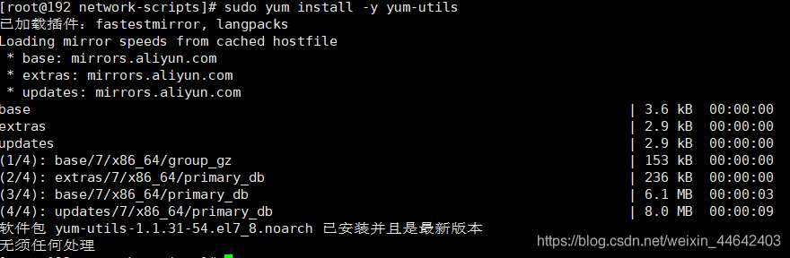
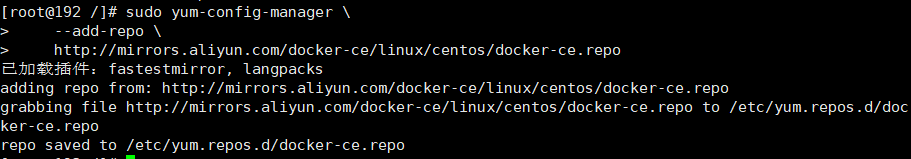
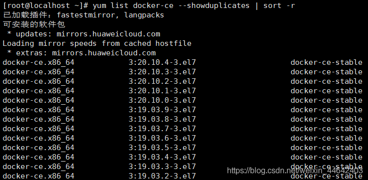

# 安装Docker
## 查看Liunx内核
> 使用如下命令查看Liunx内容是否在3.10以上
~~~shell
uname -r
~~~
## 卸载旧版
>如果电脑安装过docker执行如下命令，将旧版本的docker以及相关的依赖项卸载
~~~shell
sudo yum remove docker \
                  docker-client \
                  docker-client-latest \
                  docker-common \
                  docker-latest \
                  docker-latest-logrotate \
                  docker-logrotate \
                  docker-engine
~~~
## 安装相关依赖
>执行如下命令安装所需的软件包
~~~shell
sudo yum install -y yum-utils
~~~

## 设置仓库源
> 仓库源一般选择国内的一些源地址，这样比较文件，下载速度也快，这里提供2个下载源，使用其中一个即可
~~~shell
#阿里云
sudo yum-config-manager \
    --add-repo \
    http://mirrors.aliyun.com/docker-ce/linux/centos/docker-ce.repo
#清华大学
sudo yum-config-manager \
	--add-repo \
	https://mirrors.tuna.tsinghua.edu.cn/docker-ce/linux/centos/docker-ce.repo
~~~

## 安装 Docker最新版
> 执行如下命令可以安装Docker最新版本 docker-ce（社区版） docker-ee（企业版），官方推荐社区版
> `如需指定安装版本请往下看`
~~~shell
sudo yum install docker-ce docker-ce-cli containerd.io
~~~
## 指定版本安装 Docker
**查询存储库中可用版本**
> 使用如下命令查询你当前存储库中可用的Docker版本，从高到低列出
~~~shell
yum list docker-ce --showduplicates | sort -r
~~~

**指定版本安装**

> 使用如下命令指定版本安装，这里我指定安装`18.03.1.ce-1.el7.centos`
> `sudo yum install docker-ce-[版本号] docker-ce-cli-[版本号] containerd.io`
~~~shell
 sudo yum install docker-ce-18.03.1.ce-1.el7.centos docker-ce-cli-docker-ce-18.03.1.ce-1.el7.centos containerd.io
~~~

## Docker基本命令
~~~shell
# Docker开机自启
sudo systemctl enable docker
# 启动Docker
sudo systemctl start docker
# 查看当前Docker版本,如查看到版本信息表示docker安装成功
sudo docker version
# 重启Docker
sudo systemctl restart docker
~~~

## 镜像加速
> docker默认镜像仓库国内访问是很慢，所以需要将镜像仓库修改为国内地址那么这样就可以快速发下载镜像文件，这里演示修改为阿里云的镜像加速地址，只需要注册一个阿里云账号找到容器服务，里有镜像加速拷贝代码在liunx执行即可

## 运行hello-world测试
> 运行hello-world测试Docker是否已经安装成功
~~~shell
sudo docker run hello-world
~~~
> 出现如下内容表示安装成功

## 卸载Docker
~~~shell
#卸载依赖
sudo yum remove docker-ce docker-ce-cli containerd.io
#删除资源
rm -rf /var/lib/docker
~~~

