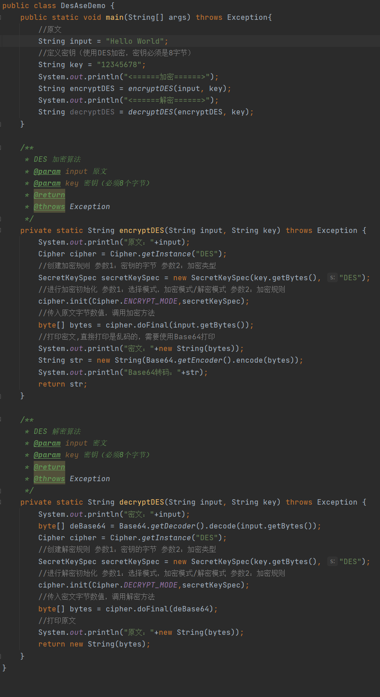

# 密码学

> 数据安全在日常开发中是一个非常重要，特别是在互联网的业务中，对于一些重要业务比如支付、转账、登录等都需要涉及到数据的安全，在互联网下所有传输的数据都可能会被抓取到，若重要数据未加密那么不法分子就可以抓取并且伪造假数据蒙骗过我们，最终照成损失

## 密码学演变

### 古典密码学

> 密码学并不是近代产生的，在很早很早古人在传输书信的时候就已经用到了密码学了，这些早期的密码学称为古典密码学，古典密码学的核心原理为替换法、移位法

#### 替换法

> 古代密码学中的替换法就是使用固定的信息，将原文替换成密文
>
> 如：原文bee，将b替换成w，e替换p，得出密文wpp
>
> 替换法的加密方式一般有2种 单表替换、多表替换

**单表替换**

> 单表替换表示原文只有一张对于的密文表
>
> 表： b -> w   e->p
>
> 原文：bee
>
> 密文：wpp

**多表替换**

> 单表替换表示原文有多张的密文表，由于涉及到了多个密文表所以需要使用到`密钥`标记每个字符从那个密文表中找，加密与解密时需要配合密钥完成
>
> 表1：b -> f   e -> a   表2：b -> t   e->  c  表3：b -> r   e -> g
>
> 原文：bee
>
> 密钥：213 `表示b字符密文表是表2、e字符的密文表是表1、e字符密文表是表3`
>
> 密文：tag

#### 位移法

> 移位法，是按照字母的方式进行的，就是将原文的字母进行偏移一定距离后得到密文，著名的加密算法就是`恺撒加密`
>
> 加密规则：字母偏移2位
>
> 原文：bee
>
> 密文：dgg

#### 破解古典密码学

**频率分析法**

### 近代密码学

> 二战德国时期制作了`恩尼格玛密码机`，该加密方式其实运用的也是古典密码学，相比之前是人工加密而近代机械化了所以可加密的方式更加多可以更加复杂，`恩尼格玛密码机最后被人工智能之父图灵破解了`

### 现代密码学

> 现代密码学则是我们日常开发中使用最广泛的密码学，加密方式分如下3种
>
> 1. 散列函数也叫哈希函数，如：MD5、SHA-1、SHA-256
> 2. 对称加密，特点：加密方式与解密方式，使用是同一把密钥
> 3. 非对称加密，特点：有2把密钥，使用公钥加密必须使用私钥解密，或使用公钥加密必须使用私钥解加密

## ASCII编码

> ASCII是美国信息交换的标准代码，是基于拉丁文字母的一套电脑编码系统，主要用于显示现代英语和其它西欧语言，它是现今最通用的单字节编码系统

### 程序中使用ASCII

> 编写一个简单的java程序，char类型默认编码格式使用的是ASCII字符

## 对称加密

> 加密方式分2种
>
> * 序列密码(流加密)：原文为123456，流加密就是将原文从左往右遍历按顺序一个一个字取出加密，最后拼接成密文
>
> * 分组密码(块加密)：原文为123456，块加密则将按指定长度拆分多个块，不足的使用固定数值部位，然后分别对不同块加密，最后拼接成密文
>
> 常见对称加密算法
>
> * DES，即数据加密标准，是一种使用密钥加密的块算法，1977年被美国联邦政府的国家标准局确定位联邦资料处理标准(FIPS)，并授权在非密级政府通信中使用，最后该算法在国际上广泛流传
> * AES，高级加密标准，在密码学中又称Rigndael加密法，是美国联邦政府采用的一种块加密标准，这个标准用来替代原先的DES，已经被多方分析并且广为全世界使用
>
> 特点
>
> * 加密快，可加密大文件
> * 密文可逆，一旦密钥文件泄露，就会导致数据泄露
> * 加密后编码表找不到对应字符，出现乱码
> * 一般结合Base64使用

### DES加密/解密

> DES是一种对称加密的流加密，加密与解密都使用同一把密钥，DES的密钥必须8字符，加密/解密例子

**测试**

### Base64

> 可以在上面看到，我们使用到Base64，这里要说明一下Base64不是加密算法，是一种可读性算法，Base64的目的不是保护数据，是为了让数据可读，可看到大部分算法加密后显示都会产生乱码使用了Base64可以将这些乱码转为可读的字符串
>
> Base64组成是由64个字符组成分别是 A-Z、a-z，0-9，+和/
>
> Base58也是一个比较知名的编码方式，广泛运用在比特币里
>
> Base64与Base58区别，Base58没有数字0字母o，大写字母I，小写字母i，+和/

### ASE加密/解密

> ASE的加密与解密和DES是一样的步骤的不过，不同之处就是密钥必须是16位的

### Cipher加密模式

**ECB**

> ECB电子密码本，需要加密的消息按照块密码的块大小被分为数个块，然后对每一个块进行独立加密，最后拼接到一起
>
> 优点：可以并行处理数据
>
> 缺点：同样的原文生成同样的密文，不能很好的保护数据
>
> 总结：可以多个块同时加密效率高，若块中原文一样那么加密出来的密文也是一样的，数据安全性较低

**CBC**

> CBC密码块链接，每个明文块先与前一个密文块进行异或后，再进行加密这种加密方式中，每个密文块都依赖于它前面的所有明文块
>
> 优点：同样的原文生成的密文不一样
>
> 缺点：串行处理数据
>
> 总结：加密数据满，不过安全性高

### Cipher填充模式

**NoPadding**

> 不填充
>
> 使用该模式之需要再DES加密算法下，安装要求密钥必须是8byte的整数倍
>
> 使用该模式之需要再AES加密算法下，安装要求密钥必须是16byte的整数倍

**PKCS5Padding**

> 数据块的大小为8位，不够就补足

## 消息摘要

> 消息摘要又称为数字摘要，它是一个唯一对应一个消息或者文本的固定长度的之，它是由单向Hash加密函数对消息进行加密产生的，使用数字摘要生成的值是不可篡改的，为了保证文件于值的安全
>
> 特点：无论输入消息有多长，计算出来的消息摘要长度总是固定的，消息摘要是单向的、不可逆的

### 应用场景

> 在说应用场景是首先要明确的消息摘要的作用是用于保证文件的安全的，那么如何保证呢，平时我们去下载tomcat时都可以发现在下载安装包旁边防止一个sha512，其实这个就是你下载的tomcat安装包的一个消息摘要，你可以将下载好的tomcat做一个sha512可以发现和官方提供的是一致的，如果不一致那么你要注意了你下载的安装包可能已经被篡改了

### 常见算法

> * MD5
> * SHA1
> * SHA256
> * SHA512

## 非对称加密

> 非对称加密又叫现代加密算法，非对称加密于对称加密最大的区别就是，非对称加密需要使用到2个密钥，公钥与私钥，规则是如果使用公钥加密那么必须使用私钥解密，如果使用私钥加密那么必须使用公钥解密
>
> 常见的非对称加密算法
>
> 1. RSA
> 2. ECC

### 公/私钥生成规则

> 在java中KeyPairGenerator类是用于专门生成公钥与私钥的密钥对

**封装成方法**

> 将密钥对生成封装一下方便以后的调用，并且在生成密钥对的时候把公钥与私钥都保存一份到文件中

### 私钥/公钥加密

> 加密的话都需要使用到Cipher对象，在前面的对称加密中也讲过该对象如何使用，因为那公钥/私钥加密写的代码都是一样是，所有这里只演示使用私钥加密

**封装成方法**

> 为了方便后面的调用，我们可以将加密封装成一个方法，由于公钥与私钥加密执行代码都是一样的所有只需要编写一个同一的加密方法即可

### 公钥/私钥解密

> 解密的话需要看你使用什么密钥进行加密规则是`私钥加密公钥解密、公钥加密私钥解密`

**封装成方法**

> 为了方便后面的调用，我们可以将解密封装成一个方法，由于公钥与私钥解密执行代码都是一样的所有只需要编写一个同一的加密方法即可

### 保存公钥/私钥

> 在开发过程中通常是将公钥/私钥保存到一个文件中，不然每一次都要重新构建一个KeyPair对象很麻烦并且，每次构建的公钥/私钥也不一样，所有需要将生成好的密钥对保存下来这样才能重复使用

### 读取公钥/私钥

> 保存到文件的密钥需要重新读取出来并且将读取的Base64字符串转换成正确的密钥对象才能使用

**读取公钥**

> 读取公钥只需要使用X509EncodedKeySpec对象将字符串构建回公钥对象即可

**读取私钥**

> 读取私钥只需要使用PKCS8EncodedKeySpec对象将字符串构建回私钥对象即可

**测试**

> 在构建完密钥对后不在通过对象获取了，而是通过读取文件的方式获取密钥对

## 数字签名

> 学完非对称加密后，那么我们可以对我们的信息进行加密了并且由于加密是非对称的所有他人无法破解，但是这其中还是存在一个问题，既然黑客已经不能破解你的信息但是他可以伪造信息，比如你该隔壁老王发一个消息你使用了老王的公钥对信息进行加密，老王收到消息后使用自己的私钥解密，看似万无一失可是你的信息可能就会被掉包，在你把信息发出去后被隔壁小张截取了，然后他伪造了一个消息出来并且使用老王的公钥加密了发给老王，这样老王收到的就是错误消息了，那么如何解决这个问题呢？
>
> 数字签名也叫公钥签名，只有信息的发布者才能产生别人无法伪造的一段数字串，有了数字签名那么可以保证信息是由信息发布者而发布的，别人是无法伪造的，你在要发给老王的消息中加上一个你的数字签名，这样老王收到可以核对该数字签名是不是你本人发送的

### 生成签名

### 校验签名

### 测试

