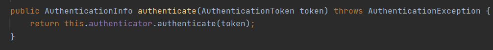
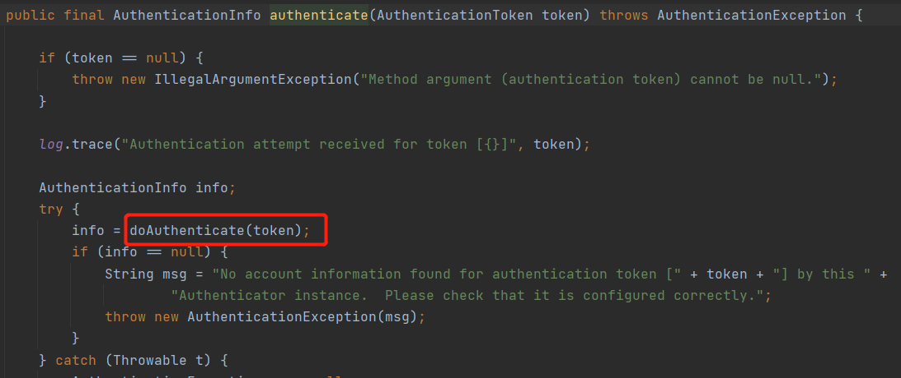

# Shiro框架入门到精通

## 权限管理

### 什么是权限管理

> 基本上涉及到用户的系统都需要进行权限管理，权限管理属于系统安全的范畴，权限管理实现对用户访问系统的控制，按照安全规则或者安全策略控制用户可以访问而且只能访问自己被授权的资源
>
> 权限管理包括用户`身份认证`和`授权`两部分，简称`认证授权`对应需要访问控制的资源用户首先经过身份认证，认证通过后用户具有该资源的访问权限即可访问

### 什么是身份认证

> `身份认证`就是判断一个用户是否合法用户的过程，最常用的身份证认证就是用户登录功能，核对用户输入的用户名与密码查看是否与存储的用户密码一致，来判断用户身份是否正确

### 什么是授权

> `授权、访问控制`，谁能访问那些资源，用户登录成功后需要给用户授权，该用户可以做什么操作，可以看到什么样的资源

## Shiro的核心框架

> 整个Shiro框架中最核心的就是中间那块Security Manager，Security Manager以后需要做的如何认证授权操作都要通过Security Manager完成

### Subject

> Subject，外部应用于subject进行交互，subject记录了当前操作用户，一个用户通过浏览器发送请求到服务器，这就是一个Subject
>
> `Subject再Shiro中是一个接口，接口定义了很多认证授权相关的方法，外部程序通过subject进行认证授权，而且subject是通过SecurityManager安全管理器进行认证授权`

### SecurityManager

> SecurityManager(安全管理器)，对subject进行安全管理，它 是shiro的核心，负责对所有的subject进行安全管理，通过SecurityManager可以完成subject的认证、授权等SecurityManager是通过Authenticator进行身份认证、Authorizer进行授
>
> `SecurityManager是一个接口，继承了Authenticator、Authorizer、SessionManager这3个接口 `

### Authenticator

> Authenticator(认证器)，对用户进行认证的
>
> `Authenticator是一个接口，shir提供ModularRealmAuthenticator实现类，通过ModularRealmAuthenticator基本可以满足大多数需求，也可以自定义认证器`

### Authorizer

> Authorizer(授权器)，用户认证通过后，在访问功能是需要通过授权器判断用户是否有此功能的操作权限

### Realms

> Realms(领域)，相当于数据源，SecurityManager需要从那种持久化数据库中获取到用户的认证信息，授权信息
>
> `注意：不要把Realms只是获取用户信息的数据源，在Realms中还有授权校验的相关代码`

### SessionManager

> SessionManager(会话管理器)，shiro框架定义了一套慧华管理器，它不依赖web容器的session，所以shiro可以使用在非web的应用上，也可以将分布式会话集中一个点管理，此特性可使它实现单点登录

### SessionDAO

> SessionDAO(会话dao)，对SessionManager中的会话进行增删改查的一套操作，如需要将会话保存到Redis中、Mysql中等

### CacheManager

> CacheManager(缓存管理器)，保存着用户登录成功后权限信息，提高性能
>
> `用户认证成功后从数据库获取的权限信息会保存到CacheManager中，用户发起任何请求时直接从CacheManager核对用户权限信息` 

### Cryptography

> Cryptography(密码管理器)，shiro提供了一套加密、解密的组件，方便开发

## Shiro基础入门

> 身份证，就是判断一个用户是否合法用户，最常用的身份证就是核对用户的用户名密码是否与数据库中存储的用户名密码一致

### 认证中的关键对象

1. Subject(主体)：主体可能是访问系统的用户、程序，就是需被认证的对象称为主体
2. Principal(身份信息)：是主体(Subject)进行身份认证的表示，表示必须是具有唯一性，比如用户名、手机号、邮箱地址，一个主体可以有多个身份，但是必须有一个主身份，如只能取用户名/手机号/邮箱其中一个，与密码匹配
3. credential(凭证信息)：是只有主体自己知道的安全信息、如密码、证书等

### 认证流程

### 简单认证入门开发

> 首先我们先创建一个简单的java项目，先对shiro的认证流程熟悉，以及执行中涉及到的类对象，最后再集成SpringBoot项目，`若不想了解可以直接跳过，看集成SpringBoot`

#### 依赖引入

~~~xml
<!-- https://mvnrepository.com/artifact/org.apache.shiro/shiro-core -->
<dependency>
    <groupId>org.apache.shiro</groupId>
    <artifactId>shiro-core</artifactId>
    <version>1.7.1</version>
</dependency>
~~~

#### shiro.ini

> 由于我们现在创建的是普通的java项目，并没有使用到数据库，我们将用户信息保存到一个ini文件中这样，认证的时候指定读取ini的用户信息即可

~~~ini
[users]
test1=123
test2=456
test3=789
~~~

#### TestAuthenticator

> 一个认证的测试类，首先所有认证操作都需要通过securityManager(安全管理器完成)，所有先初始化一个管理器，接下来告诉管理器使用那种`realms`进行认证，将初始化号的安全管理器传入到`SecurityUtils`中，通过`SecurityUtils.getSubject()`可以获取到当前访问的主体，创建一个令牌，调用`subject.login(token);`完成验证，`验证通过是不会有任何打印，但是如果验证识别会抛出相应的异常`

~~~java
public class TestAuthenticator {
    public static void main(String[] args) {
        //创建安全管理器对象
        DefaultSecurityManager securityManager = new DefaultSecurityManager();
        //给安全管理器设置realms
        securityManager.setRealm(new IniRealm("classpath:shiro.ini"));
        //全局安全工具类SecurityUtils，提供认证、退出方法
        //给全局工具类设置安全管理器
        SecurityUtils.setSecurityManager(securityManager);
        //认证关键对象subject主体
        Subject subject = SecurityUtils.getSubject();
        //创建令牌,并且设置身份信息与凭证信息
        UsernamePasswordToken token = new UsernamePasswordToken("test1","123");

        try {
            System.out.println("认证前，认证状态："+subject.isAuthenticated());
            subject.login(token);//用户认证
            System.out.println("认证后，认证状态："+subject.isAuthenticated());

        //认证失败时会抛异常
        }catch (UnknownAccountException e){
            System.out.println("认证失败：用户名不存在");
        }catch (IncorrectCredentialsException e){
            System.out.println("认证失败：密码错误");
        }catch (Exception e){
            e.printStackTrace();
        }
    }
}
~~~

#### 测试

> 通过`subject.isAuthenticated()`可以查看到当前角色的认证状态是否通过

## Shiro登录源码剖析

> 了解整个shiro的认证过程可以让我们更加的清楚shiro的运行原理，以及如果需要只定义认证与授权，那么我们就需要覆盖什么类实现

> 首先通过`subject.login(token)`入手可以深入了解到整个认证过程，将来用户名与密码封装成token传入到login中

### DelegatingSubject

> 进入`subject.login(token)`方法中可以发现其实调用的是`DelegatingSubject.login`方法，并且在`DelegatingSubject.login`方法使用的是`securityManager.login`安全管理器进行登录认证

### DefaultSecurityManager

> 进行往下追，进入`DefaultSecurityManager.login`方法中又继续调用了`authenticate(token);`

> `authenticate(token);`调用的`this.authenticator.authenticate(token);`方法

### AbstractAuthenticator

> 调用的`this.authenticator.authenticate(token);`方法指向的是父类的`AbstractAuthenticator.authenticate`方法，并且在该方法中又调用了`doAuthenticate(token);`

### ModularRealmAuthenticator

>`doAuthenticate(token);`方法会调用`ModularRealmAuthenticator.doAuthenticate`方法，这里通过`getRealms()`获取到Realms信息，因为我们只配置了一个IniRealm，所以获取处理size只有1会进入到`doSingleRealmAuthentication(realms.iterator().next(), authenticationToken);`方法

>`ModularRealmAuthenticator.doSingleRealmAuthentication`进入到该方法中，判断一下该`realm`是否支持token后会继续进入到`realm.getAuthenticationInfo(token);`

### AuthenticatingRealm

>最终进入`AuthenticatingRealm.getAuthenticationInfo`方法中，该方法就是真正的认证实现了
>
>1. `getCachedAuthenticationInfo(token);`首先会去缓存中获取一下看能不能取到用户信息
>2. `doGetAuthenticationInfo(token);`初次登录是没有缓存的，任何就会进入到磁盘中获取
>3. `assertCredentialsMatch(token, info);`将来磁盘读取的用户信息与客户端传入的用户信息比较

> `assertCredentialsMatch(token, info);`客户端密码与磁盘密码比较是由`AuthenticatingRealm`类进行我们无需去实现自己的密码比较方法，因为shiro已经封装好了，使用的是shiro自己的密码加密解密，我们会用就行了
>
> 在`assertCredentialsMatch(token, info);`最终会调用一个`doCredentialsMatch方法`

>由于我们没有指定加密、解码实现，这里使用默认的实现密码比较器，只是简单的使用了`equals`方法

### SimpleAccountRealm

#### doGetAuthenticationInfo(token);

>`SimpleAccountRealm.doGetAuthenticationInfo`实现了获取用户信息的方法，通过客户端提供的用户名去磁盘中获取用户信息，并且对用户名进行校验是否被锁定与是否过期

### 类结构与关系

> 经过阅读源码后，如果我们需要实现自定义的认证与授权只需要继承了`AuthorizingRealm`，就可以实现`doGetAuthenticationInfo`认证、`doGetAuthorizationInfo`授权，2大方法

## Shiro登录实战

### 自定义Realm

> 为什么要自定义Realm？，经过入门以及上面的源码剖析学习，我们发现用户信息都存储在`shiro.ini`文件中，显然写死的用户信息使用很不方便，那么如果想存到数据库中怎么做呢，那么就需要自定义Realm，就是集成`AuthorizingRealm`实现`doGetAuthenticationInfo`认证、`doGetAuthorizationInfo`授权，2大方法都通过数据库获取

#### CustomerRealm

> 编写自定义的Realm，继承AuthorizingRealm实现`doGetAuthenticationInfo`认证、`doGetAuthorizationInfo`授权方法，这里主要讲认证所以授权方法占时没有编写，我们只编写了`doGetAuthenticationInfo`方法，其实只需要从数据库获取用户信息返回即可，剩下的密码比较由Shiro完成

#### TestCustomerRealmRealmAuthenticator

> 使用自定义的Realm去进行认证

~~~java
public class TestCustomerRealmRealmAuthenticator {
    public static void main(String[] args) {
        //创建安全管理器对象
        DefaultSecurityManager securityManager = new DefaultSecurityManager();
        //给安全管理器设置realms
        securityManager.setRealm(new CustomerRealm());
        //全局安全工具类SecurityUtils，提供认证、退出方法
        //给全局工具类设置安全管理器
        SecurityUtils.setSecurityManager(securityManager);
        //认证关键对象subject主体
        Subject subject = SecurityUtils.getSubject();
        //创建令牌,并且设置身份信息与凭证信息
        UsernamePasswordToken token = new UsernamePasswordToken("test","123");

        try {
            System.out.println("认证前，认证状态："+subject.isAuthenticated());
            subject.login(token);//用户认证
            System.out.println("认证后，认证状态："+subject.isAuthenticated());

        //认证失败时会抛异常
        }catch (UnknownAccountException e){
            System.out.println("认证失败：用户名不存在");
        }catch (IncorrectCredentialsException e){
            System.out.println("认证失败：密码错误");
        }catch (Exception e){
            e.printStackTrace();
        }
    }
}
~~~

### 使用MD5和Salt

> 经过自定义Realm的练习，我们已经掌握如何的自定义认证了，但是在认证过程中我们发现，Shiro默认的密码比较是使用了简单的`equals`对2段明文进行比较，并且我们从数据库中得到的user对象密码是明文密码，这显然很不安全，那一天我们的数据库被那个黑客破解了那么他就可以获取到所有用户的账户密码，随意的登录系统，接下来我们就讲解，如何将来用户名密码加密存储，并且对加密后的密码进行比较

#### MD5算法介绍

> 作用：
>
> 1. 文件加密 ：MD5算法不可逆，只能从明文生成密文然而密文不能生成明文，但是内容相同无论执行多少次md5生成结果始终是一致
> 2. 生成签名(校验和)：比如现在有2台电脑，A电脑与B电脑，A电脑要发文件给B电脑，那么在发送过程中可能会有一个问题就是网络不好导致数据包丢失，最后B电脑收到的是缺失的文件，那么如何知道这个文件的完整性呢，利用签名就可以解决，比如A电脑在发文件前对当前文件使用MD5加密生成一个签名，然后签名与文件一起发给B电脑，B电脑获取到文件后就将来获取的文件使用MD5进行加密，也得到了一个签名，然后将这个签名与A电脑发过来的签名比较一下，一致表示文件内容是正常的没有数据丢失
>
> 生成结果：始终是一个16进制 32位长度字符串

#### MD5加密思路

##### MD5加密思路

> 当用户注册时，后台取到的用户明密码后我们就对用户发送过来的明文密码使用MD5进行加密，然后存储到数据库中，这样当数据库中用户密码都是密文的确保了密码的安全性

> 现在数据库用户密码是密文了，当时用户登录时给的密码是明文的呀，这就运用到了MD5的特点了`MD5对相同的文本生成的密文始终是一致的`，所有我们只需要将来用户发来的明文密码用MD5加密并且与数据库中的加密过的密码进行对比即可

##### MD5加密存在问题与解决

> 经过以上思路是可以实现对用户密码加密了，并且也可以核对用户密码是否正确，但是只是MD5加密是不行的，这样的密码还是比较容易被破解，如一个用户注册时密码只输入了123，那么利用穷举的方式即可快速破解这个密码，`穷举暴力破解原理：并且一个循环从1开始进行MD5加密，加密后与数据库密文匹配是否一致，不一致i++继续加密比对，直到一致即可找到该用户的明文密码`
>
> 加盐(Salt)，就可以缓解这个问题

##### MD5+Salt

> 什么是加盐？拿鸡蛋炒饭的小例子解释这个问题
>
> 某一天你老妈给你做了一个菜，你把食材比喻成明文，经过锅的烹饪后的菜就是MD5加密后密文，你吃过发这个菜发现很好吃，然后你利用穷举家里冰箱所有食材的方式得知这道菜是一个蛋炒饭，然后你去烹饪但是最后烹饪出来的与你老妈的味道始终都不是不一样的，这是因为你不知道你妈加了多少盐(Salt)在什么时候加盐，所以你无法破解你老妈的食谱
>
> MD5+Salt也是一个道理，比如用户就喜欢给一个简单的123密码给我，那我使用MD5加密后就等于没有加密，几下子就给你破解了，那么我们就对你发过来的明文密码后面加一些乱七八糟的字母数组，将来你给我的123添油加醋，最后假设变成`123fwef4sfe`，那么我再继续加密MD5加密这样就不会给人破解了，那么下次你提供密码给我我就在你明文密码后面加上`fwef4sfe(盐)`用MD5加密于数据库密文对比，这样黑客无法利用穷举方式去破解密码，因为它不知道你加了什么盐

#### Shiro中使用MD5+Salt加密

##### 对明文密码加密

~~~java
public class TestShiroMD5 {
    public static void main(String[] args) {

        System.out.println("使用md5加密，未加盐===============================");
        Md5Hash md5Hash1 = new Md5Hash("123");
        //对加密后的结果转化16进制打印
        System.out.println(md5Hash1.toHex());

        System.out.println("使用md5加密+加盐(jolyoulu)=======================");
        Md5Hash md5Hash2 = new Md5Hash("123","jolyoulu");
        //对加密后的结果转化16进制打印
        System.out.println(md5Hash2.toHex());

        System.out.println("使用md5加密+加盐(jolyoulu)+hash散列=======================");
        Md5Hash md5Hash3 = new Md5Hash("123","jolyoulu",1024);
        //对加密后的结果转化16进制打印
        System.out.println(md5Hash3.toHex());
    }
}
~~~

##### Shiro中对加密后的密码认证

###### CustomerMd5Realm

> CustomerMd5Realm在返回SimpleAuthenticationInfo对象时需要把盐也返回回去，默认Shiro会把盐加在明文的最后面

###### TestCustomerMd5RealmAuthenticator

> TestCustomerMd5RealmAuthenticator与创建Realm需要修改Redalm的中CredentialsMatcher实现，默认使用的只是`equals`方法，显然已经不满足现在的业务，需要对加密后的密码进行认证就需要使用到`HashedCredentialsMatcher`对象并且告诉他加密方式是md5如果有做hash散列也要告诉散列次数，将初始化好的使用`realm.setCredentialsMatcher`将初始化好的`HashedCredentialsMatcher`传进去

## Shiro授权实战

> 授权就是访问控制，针对登录后的用户，控制谁能访问那些资源，谁(Subject)对那些资源(Resouece)可以做什么样的操作(Premission)

### 授权中的关键对象

1. Subject(主体)：主体需要访问系统中的资源
2. Resouece(身份资源)：如菜单、页面、按钮、类方法等，资源分2类`资源类型`和`资源实例`，比如查看苹果手机资源类型，比如查看`苹果11Pro`就是资源实例，资源实例是在资源类型下的
3. Premission(权限/许可)：规定了主体对资源的操作许可，权限离开资源没有意义，用户查询权限、用户添加权限、某一个方法的调用权限、通过权限可以控制当前用户能修改什么东西

### 授权流程

> 首先授权需要建立在用户认证通过之后，才会对该用户进行授权

### 授权方式

1. 基于角色的访问控制

   * RBAC基于角色的访问控制（Role-Based-Access-Control）是以角色为中心进行访问控制

   * ~~~java
     //判断subject是否是admin角色
     if(subject.hasRole("admin")){
         //操作资源
     }
     ~~~

1. 基于资源的访问控制

   * RBAC基于角色的访问控制（Resource-Based-Access-Control）是以角色为中心进行访问控制

   * ~~~java
     //判断subject是否是有user:create:*
     //user:create:* => 对用户模块:有创建权限:所有用户
     if(subject.isPermission("user:create:*")){
         //操作资源
     }
     ~~~

### 权限字符串

> 权限字符串的规则是`资源标识符:操作:资源实例标识`，意思是对那个资源的那个实例具有什么操作，权限字符串也可以使用`*`标识所有的意思
>
> 例子：
>
> * 对所有用户创建权限：`user:create:*`
> * 对001用户修改权限：`user:update:001`
> * 对001用户有所有权限：`user:*:001`

### Shiro中授权编程实现

#### 代码方式

~~~java
Subject subject = SecurityUtils.getSubject();
if(subject.hasRole("admin")){
    //有权限
}else{
    //无权限
}
~~~

#### 注解方式

~~~java
@RequiresRoles("admin")
public void deleteUserById(){
    //有权限
}
~~~

#### 标签方式

~~~jsp
JSP/GSP 标签:在JSP/GSP页面通过相应标签完成
<shiro:hasRole name="admin">
    <!--有权限-->
</shiro:hasRole>
注意：Thymeleaf中使用shiro需要额外集成
~~~

### 授权代码编写

> 在原有的认证Realm中修改增加授权

#### CustomerMd5Realm

> 实现`doGetAuthorizationInfo`从数据库中获取到用户角色与权限信息存入到`SimpleAuthorizationInfo`对象中返回

#### TestCustomerMd5RealmAuthenticator

> 通过`subject.hasRole`判断主体是否拥有某给权限，`subject.isPermitted`主体是否拥有某个角色

## SpringBoot-集成Shiro

