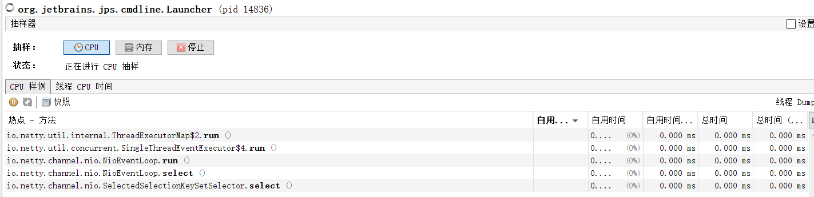

# JVM内存监控

## JVM命令

JVM中的命令中存放在，jdk的bin目录下，我们进去可以看到平时我们最常用的的命令如javac javap命令，今天我们讲的几个是平时用来查看jvm参数内存信息的主要命令

## JPS命令

jps命令用于查看我们当前系统中的java进程，左边的是进程id(pid)右边的是进程名称

## Jinfo命令

jinfo命令一般用于查看正在运行的Java应用程序的JVM参数等，jinfo命令一般较少使用，主要是用于查看jvm参数

### 主要命令

| 命令                  | 说明             |
| --------------------- | ---------------- |
| jinfo -flags <pid>    | 查看jvm的参数    |
| jinfo -sysprops <pid> | 查看java系统参数 |

### 例子解析

**jinfo -flags [pid]** 该命令主要是查看JVM虚拟机运行的参数全部都打印出来了，如初始化堆的大小，新生代堆的大小，老年代堆的大小等

**jinfo -sysprops [pid] **该命令可以查看到java的系统参数，如jre目录，虚拟机版本，整个程序加载目录，程序加载了那些包，等一堆参数，截图只是一小部分

## Jstat命令

jstat命令可以查看堆内存各部分的使用量，以及加载类的数量

### 主要命令

| 命令                        | 说明               |
| --------------------------- | ------------------ |
| jstat -class <pid>          | 类加载统计         |
| jstat -gc <pid>             | 垃圾回收统计       |
| jstat -gccapacity <pid>     | 堆内存统计         |
| jstat -gcnew <pid>          | 新生代垃圾回收统计 |
| jstat -gcnewcapacity <pid>  | 新生代内存统计     |
| jstat -gcold <pid>          | 老年代垃圾回收统计 |
| jstat -gcoldcapacity <pid>  | 老年代内存统计     |
| jstat -gcmetacapacity <pid> | 元数据空间统计     |
| jstat -gcutil <pid>         | 总结垃圾回收统计   |

### 例子解析

**jstat -class [pid] **类加载统计

| 表头     | 说明            |
| -------- | --------------- |
| Loaded   | 加载class的数量 |
| Bytes    | 所占用空间大小  |
| Unloaded | 未加载数量      |
| Bytes    | 未加载占用空间  |
| Time     | 时间            |

**jstat -gc [pid]** 垃圾回收统计

| 表头 | 说明                   |
| ---- | ---------------------- |
| S0C  | 第一个幸存区的大小     |
| S1C  | 第二个幸存区的大小     |
| S0U  | 第一个幸存区的使用大小 |
| S1U  | 第二个幸存区的使用大小 |
| EC   | 伊甸园区的大小         |
| EU   | 伊甸园区的使用大小     |
| OC   | 老年代大小             |
| OU   | 老年代使用大小         |
| MC   | 方法区大小(元空间)     |
| MU   | 方法区使用大小         |
| CCSC | 压缩类空间大小         |
| CCSU | 压缩类空间使用大小     |
| YGC  | 年轻代垃圾回收次数     |
| YGCT | 年轻代垃圾回收消耗时间 |
| FGC  | 老年代垃圾回收次数     |
| FGCT | 老年代垃圾回收消耗时间 |
| GCT  | 垃圾回收消耗总时间     |

**jstat -gccapacity [pid] **堆内存统计

| 表头  | 说明                   |
| ----- | ---------------------- |
|NGCMN|新生代最小容量|
|NGCMX|新生代最大容量|
|NGC|当前新生代容量|
|S0C|第一个幸存区大小|
|S1C|第二个幸存区的大小|
|EC|伊甸园区的大小|
|OGCMN|老年代最小容量|
|OGCMX|老年代最大容量|
|OGC|当前老年代大小|
|OC|当前老年代大小|
|MCMN|最小元数据容量|
|MCMX|最大元数据容量|
|MC|当前元数据空间大小|
|CCSMN|最小压缩类空间大小|
|CCSMX|最大压缩类空间大小|
|CCSC|当前压缩类空间大小|
|YGC|年轻代gc次数|
|FGC|老年代GC次数|

**jstat -gcnew [pid] **新生代垃圾回收统计

| 表头  | 说明               |
| ----- | ------------------ |
|S0C|第一个幸存区的大小|
|S1C|第二个幸存区的大小|
|S0U|第一个幸存区的使用大小|
|S1U|第二个幸存区的使用大小|
|TT|对象在新生代存活的次数|
|MTT|对象在新生代存活的最大次数|
|DSS|期望的幸存区大小|
|EC|伊甸园区的大小|
|EU|伊甸园区的使用大小|
|YGC|年轻代垃圾回收次数|
|YGCT|年轻代垃圾回收消耗时间|

**jstat -gcnewcapacity [pid] **新生代内存统计

| 表头 | 说明                       |
| ---- | -------------------------- |
|NGCMN|新生代最小容量|
|NGCMX|新生代最大容量|
|NGC|当前新生代容量|
|S0CMX|最大幸存1区大小|
|S0C|当前幸存1区大小|
|S1CMX|最大幸存2区大小|
|S1C|当前幸存2区大小|
|ECMX|最大伊甸园区大小|
|EC|当前伊甸园区大小|
|YGC|年轻代垃圾回收次数|
|FGC|老年代回收次数|

**jstat -gcold [pid]** 老年代垃圾回收统计

| 表头 | 说明                       |
| ---- | -------------------------- |
|MC|方法区大小|
|MU|方法区使用大小|
|CCSC|压缩类空间大小|
|CCSU|压缩类空间使用大小|
|OC|老年代大小|
|OU|老年代使用大小|
|YGC|年轻代垃圾回收次数|
|FGC|老年代垃圾回收次数|
|FGCT|老年代垃圾回收消耗时间|
|GCT|垃圾回收消耗总时间|

**jstat -gcoldcapacity [pid]** 老年代内存统计

| 表头 | 说明                       |
| ---- | -------------------------- |
|OGCMN|老年代最小容量|
|OGCMX|老年代最大容量|
|OGC|当前老年代大小|
|OC|老年代大小|
|YGC|年轻代垃圾回收次数|
|FGC|老年代垃圾回收次数|
|FGCT|老年代垃圾回收消耗时间|
|GCT|垃圾回收消耗总时间|

**jstat -gcmetacapacity [pid]** 元数据空间统计

| 表头 | 说明                       |
| ---- | -------------------------- |
|MCMN|最小元数据容量|
|MCMX|最大元数据容量|
|MC|当前元数据空间大小|
|CCSMN|最小压缩类空间大小|
|CCSMX|最大压缩类空间大小|
|CCSC|当前压缩类空间大小|
|YGC|年轻代垃圾回收次数|
|FGC|老年代垃圾回收次数|
|FGCT|老年代垃圾回收消耗时间|
|GCT|垃圾回收消耗总时间|

**jstat -gcutil [pid]** 总结垃圾回收统计

| 表头 | 说明                       |
| ---- | -------------------------- |
|S0|幸存1区当前使用比例|
|S1|幸存2区当前使用比例|
|E|伊甸园区使用比例|
|O|老年代使用比例|
|M|元数据区使用比例|
|CCS|压缩使用比例|
|YGC|年轻代垃圾回收次数|
|FGC|老年代垃圾回收次数|
|FGCT|老年代垃圾回收消耗时间|
|GCT|垃圾回收消耗总时间|

## Jmap命令

jvm的一个重要命令，该命令可以查询jvm运行时内存信息

### 主要命令

| 命令                        | 说明               |
| --------------------------- | ------------------ |
| jmap -heap <pid>             | 内存使用的总体信息 |
| jmap -histo <pid>           | 类加载详细统计       |
| jmap -dump:format=b,file=<fileName>.hprof  <pid>             | 动导出dump文件       |

### 例子解析

**jmap -heap [pid]**该命令用用来查看内存的一个总体的统计信息，如Eden区 From区 To区 Old Generation区的内存使用和空闲情况等统计信息，要看具体那个类占用多少内存需要使用**jmap -histo [pid]**命令

**jmap -histo [pid]** 该命令用来查看内存使用信息，那些对象实例最多占用内存最多会被排到最前面，可使用 jmap -histo [pid] > d:\mem.txt 输出到指定文件中

| 表头       | 说明                   |
| ---------- | ---------------------- |
| num        | 序号                   |
| instances  | 实例数量               |
| bytes      | 占用空间大小           |
| class name | 类名称                 |

**jmap -dump:format=b,file=<fileName>.hprof  [pid]** 导出.hprof结尾的文件，该文件可以被jvisualvm识别，我们可以把服务器上当前jvm内存情况，导出.hprof结尾的文件后使用jvisualvm打开查看分析程序情况，jvisualvm最后面会说到如何使用

## Jstack命令

Jstack也是一个重要的命令用于查看java程序中线程的使用情况

### 主要命令

| 命令         | 说明                             |
| ------------ | -------------------------------- |
| jstack <pid> | 查看线程使用情况，并且可排除死锁 |

### 例子解析

daemon守护线程，tid jvm的线程id，nid映射操作系统的线程id，prio线程优先级，TIMED_WAITING线程状态

### Jstack检查死锁例子

首先准备一个程序，这个程序运行时会开启2个线程，线程1会去获取lock1 线程2会去获取lock2，然后他们他们拿到锁后休息5秒后线程1获取lock2(lock2当前在线程2手上) 线程2获取lock1(lock1当前在线程2手上) ，这样导致程序死锁

移到最后会Jstack会提示发现死锁，发生死锁的线程信息找出来并且显示在这里

我们可以分析其中，看红标记发现Thread-1和Thread-2 都在BLOCKED状态(等待锁)，然后我们查看Thread1中的waiting to lock(等待锁) 等待的是 thread2 locked的锁，然后Thread2中的waiting to lock(等待锁) 等待的是 thread1 locked的锁，然后就发生死锁了

## jvisualvm工具使用

jvisualvm是一个JDK内置的视图化的JVM监控工具，更加友好的可视化界面，平时我们生产环境上使用的基本都是Linux操作系统，所以是无法使用jvisualvm工具的，一般会在Linux上使用**jmap -dump:format=b,file=<fileName>.hprof  [pid]**命令将当前jvm的信息导出.hprof文件后，然后导入到我们自己电脑上的jvisualvm中分析jvm，或者jvisualvm使用远程连接我们的JVM需添加一个启动参数，开放一个端口即可(相关设置后面说)

### 打开jvisualvm

**打开方式1** 找到我们的jdk的bin目录下的双击jvisualvm.exe即可运行

**打开方式2** 如果jdk环境变量没有问题只需在cmd中直接输入jvisualvm即可

### 使用jvisualvm

打开后可以看到我们本地的java进程以及pid等基本信息，双击进程后在右边就可以实时查看jvm的信息了

#### 概述

概述主要是用于查看JVM的参数，和系统属性等信息

#### 监视

监视可以查看我们cpu使用情况，垃圾回收活动情况，堆大小，堆使用，堆空闲，Meta space(元空间)使用情况，类转载数等信息

#### 线程

线程是用于查看我们当前应用中，运行、休眠、等待、驻留、监视状态的线程，会分别用不同颜色显示，线程的状态，如果发现线程死锁这会出现警报(后面演示)

#### 抽样器

抽样器可以查看堆中对象的使用内存的情况，排查内存溢出是由于那个对象引起的

##### CPU抽样 

查看对象占用CPU的程度

##### 内存抽样

查看对象占用内存的程度

Profiler和抽样器差不多所以这里就不做解释了

### 导入hprof 文件

点击左上角文件，装入

选择好文件类型，选择hprof 文件

打开后也是看到概要，类，实例数，OQL控制台

概要：这和前面介绍的一样，里面显示的是JVM的基本参数

类：这里显示的是对象占用的内存，和实例数量，与前面的抽样器中内存一样

实例数：双击我们类下的对象后，会进入到实例数中可以查看这个对象具体的实例情况

OQL控制台：这个类似与SQL语句可以写查询语句查询内存中的对象等信息

### 远程连接jvisualvm

**启动普通的jar程序JMX端口配置：**

java -Dcom.sun.management.jmxremote.port=12345 -Dcom.sun.management.jmxremote.ssl=false -Dcom.sun.management.jmxremote.authenticate=false -jar foo.jar

**tomcat的JMX配置**

JAVA_OPTS=-Dcom.sun.management.jmxremote.port=8999 -Dcom.sun.management.jmxremote.ssl=false -Dcom.sun.management.jmxremote.authenticate=false

**jvisualvm远程连接服务需要在远程服务器上配置host(连接ip 主机名)，并且要关闭防火墙**

### jvisualvm发现死锁

如果程序发生死锁后jvisualvm在线程监控中会出现红字提示，检测到死锁，我们点击右侧线程Dump就可以查看，详细的死锁信息

线程 Dump中的死锁信息

### jvisualvm分析内存溢出

编写类模拟内存溢出

为了更加快的溢出拍照一下JVM启动参数，并且捕获溢出溢出，生成文件输出到相应位置

运行一下就报错了

打开jvisualvm把生成的文件装入进来

首先我们可以在概要看到出现了OOM异常，发生异常的线程是main

我们可以发现一个User的对象占用的内存就不正常，初始化了那么多，由此判断内存溢出很大可能是因为User对象造成的

**小知识：**最后补充一个小知识，我们发现char[]数组占用内存最高但是我们并没有使用到他，因为String的底层就是由char[]实现的