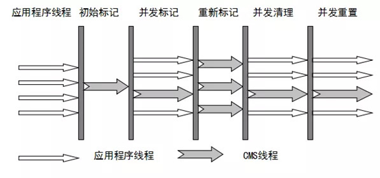

# JVM垃圾回收机制

## 垃圾回收执行过程

### 对象优先被分配到Eden区中

大多数情况下，被创建的对象被分配到Eden区中，当Eden区没有足够的空间分配给另外的新对象时，虚拟机就会发起一次Minor GC，我们实际测试一下。

在测试之前我们先了解一下Minor GC和Full GC有什么不同。

#### 新生代GC(Minor GC)

发生在新生代的垃圾回收动作都叫Minor GC，Minor GC非常频繁而且回收速度一般也比较快。

#### 老年代GC(Major GC/Full GC)

发生在老年代的垃圾回收动作都叫Full GC，在Full GC执行时经常会伴随至少一次的Minor GC(并非绝对)，Full GC的速度一般会比Minor GC的慢10倍以上，并且执行Full GC时JVM会停下它手头上所有工作，等待Full GC执行完毕。

#### 案例

~~~java
public class GCTest {
    public static void main(String[] args) {
        byte[] allocation1;
        //1024byte = 1KB   1024KB = 1MB 28*1024*1024约等于28MB
        allocation1 = new byte[28 * 1024 * 1024];
    }
}
~~~

配置JVM执行参数添加的： **-XX:+PrintGCDetails**(打印GC日志)

**运行结果**

我们可以从控制台中看到这个程序执行完毕后的堆信息，JVM默认初始化了一个约38M的新生代，其中eden区是33M，form和to区各5M，我们可以看到我们new的28M的对象存放在了eden区中占用98%的内存(即使程序什么也不做，新生代也会使用至少2000多k内存)

现在eden区已经用了98%假如我再new一个2M对对象会发生什么，大家猜一猜

**简单解释一下为什么会出现这种情况：** 因为给allocation2分配内存的时候eden区内存几乎已经被分配完了，我们刚刚讲了当Eden区没有足够空间进行分配时，虚拟机将发起一次Minor GC，GC期间虚拟机又发现allocation1对象有28M无法存入Survior空间，所以只好通过 **分配担保机制** 把新生代的对象提前转移到老年代中去，老年代上的空间足够存放allocation1，所以不会出现Full GC，执行Minor GC后，后面分配的对象如果能够存在eden区的话，还是会在

#### 结论

##### 大对象直接进入老年代

大对象就是需要大量连续内存空间的对象(比如：字符串、数组)，这样做的原因是为了避免过大的对象分配Survior区中，导致from或者to区空间及易满发生频繁的Minor GC，而且该对象体积较大带来的复制而降低效率。

##### 长期存活的对象将进入老年代

虚拟机采用了**分代收集**的思想来管理内存，那么内存回收时就必须能识别那些对象应放在新生代，那些对象应放在老年代中。为了做到这一点，虚拟机给每个对象一个对象年龄（Age）计数器。

如果对象在 Eden 出生并经过第一次 Minor GC 后仍然能够存活，并且能存活在 Survivor 区的话，将被移动到 Survivor 空间中(from区与to区来回交换复制)，并将对象年龄设为1.对象在 Survivor 中每熬过一次 MinorGC(from区复制到to区)，年龄就增加1岁，当它的年龄增加到一定程度（默认为15岁），就会被移动到老年代中，对象移动到老年代的年龄阈值，可以通过参数 **-XX:MaxTenuringThreshold** 来设置。

### 对象什么时候被回收

堆中几乎放着所有的对象实例，对堆垃圾回收前的第一步就要是要判断那些对象是可以被回收的(即不能再被任何途径使用的对象)。

#### 引用计数法

给对象中添加一个引用计数器，每当有一个地方引用它，计数器就加1，当引用失效，计数器就减1，当计数器为0的对象就是可以被回收的对象了。

**这个方法实现简单，效率高，但是目前主流的虚拟机中并没有选择这个算法来管理内存，其最主要的原因是它很难解决对象之间相互循环引用的问题。**

什么是对象之间的相互引用问题，如下面代码所示：创建2个对象并且把objA放入objB的局部变量中，把objB放入objA的局部变量中，最后中断程序对objA和objB的引用，虽然程序中断了引用但是引用计数器当前还不是0，因为在objA中的obj变量引用了objB，objB中的obj变量引用了objA，于是引用计数算法无法通知 GC 回收器回收他们，这2对象本该在程序执行完毕后回收掉的，但是因为内部出现了循环引用导致引用计数器始终标记的他还被引用不能回收，久而久之越来越多这样的对象导致JVM内存泄漏。

~~~java
public class ReferenceCountingGc {
    Object obj = null;

    public static void main(String[] args) {
        ReferenceCountingGc objA = new ReferenceCountingGc();
        ReferenceCountingGc objB = new ReferenceCountingGc();
        //objA的obj变量引用objB
        objA.obj = objB;
        //objB的obj变量引用objA
        objB.obj = objA;
        //把该程序对堆中的引用都去除
        objA = null;
        objB = null;
    }
}
~~~

#### 可达性分析法

这个算法的基本思想就是通过一系列的称为 **“GC Roots”** 的对象作为起点，从这些节点开始向下搜索，节点所走过的路径称为引用链，当一个对象到 GC Roots 没有任何引用链相连的话，则证明此对象是不可用的。

简单来说就是现在有一个地图在你手上，地图上有几个入口，你分别从这些入口进入并且沿着这路全部走一遍，把所有你能找到的房子标记一下，剩下的那些找不到的房子就是全部都要被拆除。

**GC Roots**根节点：类加载器、Thread、虚拟机栈的本地变量表、static成员、常量引用、本地方法栈的变量等等

#### finalize()方法最终判定对象是否存活

即使在可达性分析算法中不可达的对象，也并不是“非死不可”的，这时候它们暂时处于“缓刑”阶段，要真正宣告一个对象死亡，至少要经历再次标记过程，**需要再次标记的前提是对象在进行可达性分析后发现没有与GC Roots相连接的引用链**。

**1.** **第一次标记并进行一次筛选。**

筛选的条件是此对象是否有必要执行finalize()方法，当对象没有覆盖finalize方法，或者finzlize方法已经在之前被虚拟机调用过，虚拟机将这两种情况都视为**“没有必要执行”**，对象被回收。

**2.** **第二次标记**

如果这个对象被判定为有必要执行finalize()方法，那么这个对象将会被放置在一个名为：F-Queue的队列之中，并在稍后由一条虚拟机自动建立的、低优先级的Finalizer线程去执行，这里所谓的“执行”是指虚拟机会触发这个方法，但并不承诺会等待它运行结束。这样做的原因是，如果一个对象finalize()方法中执行缓慢，或者发生死循环（更极端的情况），将很可能会导致F-Queue队列中的其他对象永久处于等待状态，甚至导致整个内存回收系统崩溃。

finalize()方法是对象脱逃死亡命运的最后一次机会，稍后GC将对F-Queue中的对象进行第二次小规模标记，如果对象要在finalize()中成功拯救自己，只要重新与引用链上的任何的一个对象建立关联即可，如把自己赋值给某个类变量或对象的成员变量，那在第二次标记时它将移除出“即将回收”的集合，如果对象这时候还没逃脱，那基本上它就真的被回收了。

~~~java
public class TestOOM {
    //初始化堆10m 最大堆10m    控制台打印GC信息         捕获内存溢出异常                  把捕获的溢出输出到dump文件
    //  -Xms10M  -Xmx10M  -XX:+printGCDetails -XX:+HeapDumpOnOutOfMemoryError -XX:HeapDumpPath=D:/oom.dump
    public static void main(String[] args) {
        List<User> list = new ArrayList<>();
        int i = 0;
        int j = 0;
        while (true){
            list.add(new User(i++, UUID.randomUUID().toString()));
            new User(j--,UUID.randomUUID().toString());
        }
    }
}
class User{
    private Integer id;
    private String data;
    public User(Integer id, String data) {
        this.id = id;
        this.data = data;
    }
    //省略get set方法
    @Override
    protected void finalize() throws Throwable {
        System.out.println("finalize开始=======");
        System.out.println("User:"+id+"即将被回收");
        System.out.println("finalize结束========");

    }
}
~~~

没有被引用的对象都是复数id的，因为我重写finalize方法所以在这些没有被引用的对象回收之前会执行finalize方法，如果想自救那么就可以在该方法中把对象赋值给一个变量。

#### 如何判断一个常量是废弃常量

运行时常量池主要回收的是废弃的常量，如何判断一个常量是否被废弃呢？

假如在常量池中存在字符串 "abc"，如果当前没有任何String对象引用该字符串常量的话，就说明常量 "abc" 就是废弃常量，如果这时发生内存回收的话而且有必要的话，"abc" 就会被系统清理出常量池。

#### 如何判断一个类是无用的类

方法区主要回收的是无用的类，那么如何判断一个类是无用的类的呢？

判定一个常量是否是“废弃常量”比较简单，而要判定一个类是否是“无用的类”的条件则相对苛刻许多，类需要同时满足下面3个条件才能算是无用的类：

1. 该类所有的实例都已经被回收，也就是 Java 堆中不存在该类的任何实例。

2. 加载该类的 ClassLoader 已经被回收。

3. 该类对应的 java.lang.Class 对象没有在任何地方被引用，无法在任何地方通过反射访问该类的方法。

虚拟机可以对满足上述3个条件的无用类进行回收，这里说的仅仅是“可以”，而并不是和对象一样不使用了就会必然被回收。

## 垃圾收集算法

### 标记-清除算法

顾名思义该算法分为“标记”和“清除”阶段：首先标记出所有需要回收的对象，在标记完成后统一回收所有被标记的对象。它是最基础的收集算法，效率也很高，但是会带来两个问题

1. 效率问题

   进行一次标记需要把整一个内存全部遍历一次，效率低。

2. 空间问题

   再完成清理后我们内存就会出现内存碎片(内存使用分散)，这样会导致比如我当前有一个对象需要5个连续格子的内存，但是当前内存分布都想碎片那样，哪里一点，哪里一点，找不到5个连续格子存入这个对象。

   

### 复制算法

为了解决效率问题，“复制”收集算法出现了，用牺牲空间的方式换取效率，它可以将内存分为大小相同的两块，每次使用其中的一块，另外一块备用，当使用的内存需要清理时，就将还存活的对象复制到备用的那块内存，然后直接把当前使用的内存全部一次性清理掉并且变成备用的内存，原来备用的内存变成使用的内存了，这样省去了遍历内存的使用，也能解决内存碎片的问题，就是内存可用空间小了。

### 标记-整理算法

根据老年代的特点特出的一种标记算法，标记过程仍然与“标记-清除”算法一样在中间添加了一步变成“标记-整理-清除”，先把所有**存活对象标记**出来，如何把存活对象引用地址整理排在一起，然后直接清理掉边界以外的内存，和标记-清除算法一样效率比较低，但是非常适合内存小而且回收次数的场景(老年代区)。

### 分代收集算法

当前虚拟机的垃圾收集都采用分代收集算法，其实就是以上的收集算法混合使用，一般将java堆分为新生代和老年代，这样我们就可以根据各个年代的特点选择合适的垃圾收集算法。

**比如在新生代中，每次收集都会有大量对象死去，并且新生代分配内存多，所以可以选择复制算法，只需要付出少量对象的复制成本就可以完成每次垃圾收集。而老年代的对象存活几率是比较高的，并且没有额外的空间对它进行分配担保，所以我们必须选择“标记-清除”或“标记-整理”算法进行垃圾收集。**

## 垃圾收集器

**如果说收集算法是内存回收的方法论，那么垃圾收集器就是内存回收的具体实现。**

虽然我们对各个收集器进行比较，但并非为了挑选出一个最好的收集器，因为直到现在为止还没有最好的垃圾收集器出现，更加没有万能的垃圾收集器，**我们能做的就是根据具体应用场景选择适合自己的垃圾收集器**，试想一下：如果有一种任何场景下都适用的完美收集器存在，那么我们的HotSpot虚拟机就不会实现那么多不同的垃圾收集器了。

### Serial收集器

Serial(串行)收集器，是最基本的收集器，并且是历史最久远的垃圾收集器了，从名字就可以看出这是一个**单线程**收集器，在执行垃圾回收时只会使用一条垃圾收集线程去完成垃圾收集工作，并且在这个垃圾收集线程工作时候必须暂停其他所有线程的工作（**“Stop The World”**）直到它收集结束

分代收集算法：**新生代采用复制算法，老年代采用标记-整理算法。**

所以早期的java程序运行时会出现程序假死，很可能就是JVM后台在执行垃圾回收，虚拟机是设计者也知道Stop The World带来的不好用户体验，所以在后续的垃圾收集器设计中，停顿时间在不断缩短（仍然还有停顿，寻找最优秀的垃圾收集器的过程仍然在继续）

但是Serial收集器就不好了么？并不是的Serial也有它的优势，它简单高效(与其他收集器的单线程相比)，Serial收集器由于没有线程资源的争夺，交互的开销，自然可以获得很好的单线程收集效率。

### ParNew收集器

ParNew收集器其实就是Serial收集器的多线程版本，除了使用多线程进行垃圾收集外，其余行为(控制参数、收集算法、回收策略等等）和Serial收集器完全一样。

分代收集算法：**新生代采用复制算法，老年代采用标记-整理算法。**

它是许多运行在Server模式下的虚拟机的首要选择，除了Serial收集器外，只有它能与CMS收集器（真正意义上的并发收集器，后面会介绍到）配合工作。

**并行和并发概念补充：**

**并行（Parallel）** ：指多条垃圾收集线程并行工作，但此时用户线程仍然处于等待状态，适合科学计算、后台处理等弱交互场景。

**并发（Concurrent）**：指用户线程与垃圾收集线程同时执行（但不一定是并行，可能会交替执行），用户程序在继续运行，而垃圾收集器运行在另一个CPU上，适合Web应用。

### Parallel Scavenge收集器

Parallel Scavenge收集器类似于ParNew收集器，是Server模式(内存大于2G，2个cpu)下的**默认收集器**，它与ParNew相比有什么特别之处呢？

**Parallel Scavenge**收集器关注点是吞吐量（高效率的利用CPU），CMS等垃圾收集器的关注点更多的是用户线程的停顿时间（提高用户体验），所谓吞吐量就是CPU中用于运行用户代码的时间与CPU总消耗时间的比值，Parallel Scavenge收集器提供了很多参数供用户找到最合适的停顿时间或最大吞吐量，如果对于收集器运作不太了解的话，可以选择把内存管理优化交给虚拟机去完成也是一个不错的选择。

分代收集算法：**新生代采用复制算法，老年代采用标记-整理算法。**

### Serial Old收集器

**Serial收集器的老年代版本**，专门为老年代的垃圾回收设计的，它同样是一个单线程收集器。它主要有两大用途：一种用途是在JDK1.5以及以前的版本中与Parallel Scavenge收集器搭配使用，另一种用途是作为CMS收集器的后备方案。

### Parallel Old收集器

**Parallel Scavenge收集器的老年代版本**，专门为老年代的垃圾回收设计的，使用多线程和“标记-整理”算法，在注重吞吐量以及CPU资源的场合，都可以优先考虑 Parallel Scavenge收集器和Parallel Old收集器。

### CMS收集器

**CMS(Concurrent Mark Sweep)**收集器是一种以获取最短回收停顿时间为目标的收集器，它而非常符合在注重用户体验的应用上使用，它是HotSpot虚拟机第一款真正意义上的并发收集器，它第一次实现了让垃圾收集线程与用户线程(基本上)同时工作。

从名字中的**Mark Sweep**这两个词可以看出，CMS收集器是一种 **“标记-清除”**算法实现的，它的运作过程相比于前面几种垃圾收集器来说更加复杂一些。整个过程分为四个步骤：

1. 初始标记： 暂停所有的其他线程(**STW**)，并记录下**直接与root相连的几个对象**，速度很快 ；

2. 并发标记：同时开启GC和用户线程，用一个闭包结构去记录可达对象，但在这个阶段结束，这个闭包结构并不能保证包含当前所有的可达对象，因为用户线程可能会不断的更新引用域，所以GC线程无法保证可达性分析的实时性，所以这个算法里会跟踪记录这些发生引用更新的地方。

3. 重新标记：重新标记阶段就是为了修正并发标记期间因为用户程序继续运行而导致标记产生变动的那一部分对象的标记记录，这个阶段的停顿时间一般会比初始标记阶段的时间稍长，远远比并发标记阶段时间短

4. 并发清除： 开启用户线程，同时GC线程开始对未标记的区域做清扫，在这期间用户线程产生的浮动垃圾将无法清理需等待下一次GC清理。

### G1收集器

**G1 (Garbage-First)**是一款面向服务器的垃圾收集器，主要针对配备多颗处理器及大容量内存的机器(听说能处理内存T级以上的垃圾回收)，以极高效率满足GC停顿时间要求的同时，还具备高吞吐量性能特征。

**G1收集器堆特征**

传统的Java堆划分都是一个代一块内存，而且G1收集器不同。

G1将Java堆划分为多个大小相等的独立区域（**Region**），虽保留新生代和老年代的概念，但不再是物理隔阂了，它们都是（可以不连续）Region的集合。

**Humongous区：**在G1收集器特有的一个内存区域用于分配大对象（直接进Humongous区，专门存放短期巨型对象，不用直接进老年代，避免Full GC的大量开销）不会因为无法找到连续空间而提前触发下一次GC。

G1被视为JDK1.7中HotSpot虚拟机的一个重要进化特征。它具备以下特点：

1. 并行与并发：G1能充分利用CPU、多核环境下的硬件优势，使用多个CPU(CPU或者CPU核心)来缩短STW停顿时间，部分其他收集器原本需要停顿Java线程来执行GC动作，G1收集器仍然可以通过并发的方式让java程序继续执行。

2. 分代收集：虽然G1可以不需要其他收集器配合就能独立管理整个GC堆，但是还是保留了分代的概念。

3. 空间整合：与CMS的“标记-清理”算法不同，G1从整体来看是基于**“标记-整理”**算法实现的收集器，从局部上来看是基于“复制”算法实现的。

4. 可预测的停顿：这是G1相对于CMS的另一个大优势，降低停顿时间是G1 和 CMS 共同的关注点，但G1 除了追求低停顿外，还能建立可预测的停顿时间模型，能让使用者明确指定在一个长度为M毫秒的时间片段内完成垃圾收集，G1会按照指定的时间制定垃圾回收计划。

**G1收集器的运作大致分为以下几个步骤：**

1. 初始标记(initial mark，STW)：在此阶段，G1 GC 对根进行标记，该阶段与常规的 (STW) 年轻代垃圾回收密切相关。

2. 并发标记(Concurrent Marking)：G1 GC 在整个堆中查找可访问的（存活的）对象。

3. 最终标记(Remark，STW)：该阶段是 STW 回收，帮助完成标记周期。

4. 筛选回收(Cleanup，STW)：筛选回收阶段首先对各个Region的回收价值和成本进行排序，**根据用户所期望的GC停顿时间来制定回收计划**，这个阶段其实也可以做到与用户程序一起并发执行，但是因为只回收一部分Region，时间是用户可控制的，而且停顿用户线程将大幅提高收集效率。

**G1收集器在后台维护了一个优先列表，每次根据允许的收集时间，优先选择回收价值最大的Region(这也就是它的名字Garbage-First的由来)**。这种使用Region划分内存空间以及有优先级的区域回收方式，保证了GF收集器在有限时间内可以尽可能高的收集效率。

**G1垃圾收集分类**

**YoungGC**

1. 新对象进入Eden区

2. 存活对象拷贝到Survivor区

3. 存活时间达到年龄阈值时，对象晋升到Old区

**MixedGC**

1. 不是FullGC，回收所有的Young和部分Old(根据期望的GC停顿时间确定old区垃圾收集的优先顺序)

2. global concurrent marking （全局并发标记）

* Initial marking phase:标记GC Root，STW
* Root region scanning phase：标记存活Region
* Concurrent marking phase：标记存活的对象
* Remark phase :重新标记,STW
* Cleanup phase:部分STW

## 垃圾收集器的选择

1. 优先调整堆的大小让服务器自己来选择

2. 如果内存小于100M，使用串行收集器

3. 如果是单核，并且没有停顿时间的要求，串行或JVM自己选择

4. 如果允许停顿时间超过1秒，选择并行或者JVM自己选

5. 如果响应时间最重要，并且不能超过1秒，使用并发收集器

下图有连线的可以搭配使用，官方推荐使用G1，因为性能高

Serial收集器默认 年轻代使用Serial 年老代Serial Old

Parallel Scavenge收集器默认 年轻代使用Parallel Scavenge 老年代Parallel Old

ParNew 收集器默认 年轻代使用ParNew 老年代Serial Old

有线相连接的表示该2个收集器可搭配使用如 Serial/Serial Old、Serial/CMS、ParNew/Serial Old、ParNew/CMS、Parallel Scavenge/Serial Old、Parallel Scanvenge/Parallel Old。

G1 收集器不管新生代和老年代都可以使用

CMS是Serial Old收集器的后被方案