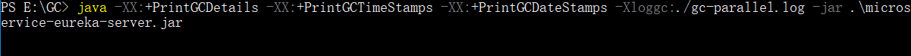
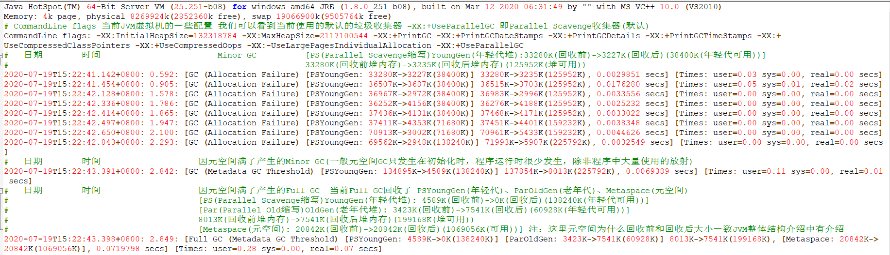
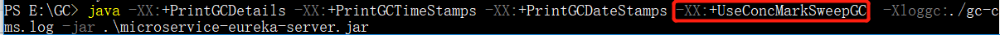
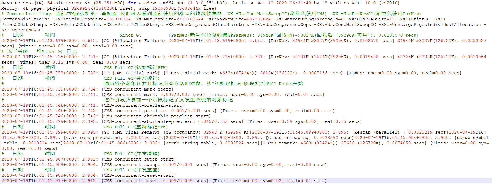
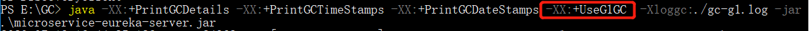
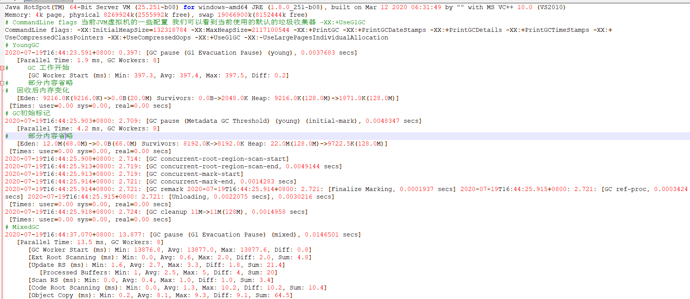
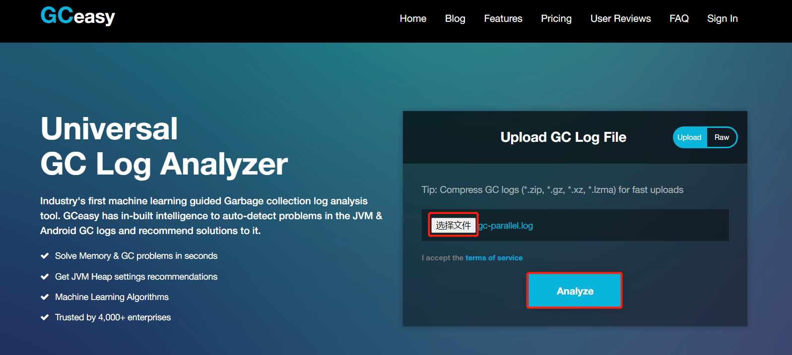
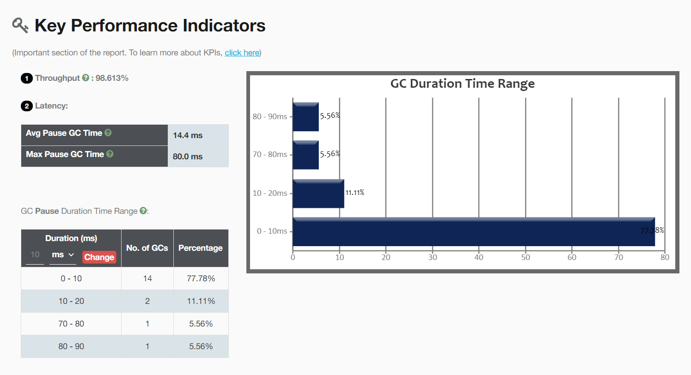

# JVM性能调优

## JVM调优主要指标

**停顿时间：**垃圾收集器做垃圾回收中断应用执行的时间(就是一次Full GC的时间)，可通过 -XX:MaxGCPauseMillis进行配置，这个并不是你配置了之后就会按照你设置的时间执行，JVM用自适应的方式让Full GC时间接近你设置的时间。

**吞吐量：**垃圾收集的时间和总时间的占比：1/(1+n)，吞吐量就是1减去垃圾收集时间占总时间的占比，1-1/(1+n) ， 可通过-XX:GCTimeRatio进行配置。

## GC调优步骤

### 打印GC日志

~~~shell
#     打印GC日志            GC时间                 GC日期               输出到文件
-XX:+PrintGCDetails -XX:+PrintGCTimeStamps -XX:+PrintGCDateStamps -Xloggc:./gc.log
~~~

Tomcat则直接加在JAVA_OPTS变量里，Jar包则直接 java  [参数] -jar XXX.jar 

* 分析日志得到关键性指标

* 分析GC原因，调优JVM参数

### GC日志格式解读

首先我们先认识一下各种收集器的GC日志格式，以及日志格式表达了啥，以下为了方便演示我使用的是Jar包的方式启动

#### Parallel Scavenge收集器(默认)

Parallel Scavenge是JDK 1.8的默认收集器，所以我们启动时候无需任何配置，以下我启动一个服务并且打印日志内容到当前目录下的gc-parallel.log文件中

以下就是打印出来的GC日志我对一些主要内容进行了解答

#### CMS收集器

指定使用CMS收集器启动

以下就是打印出来的GC日志我对一些主要内容进行了解答

#### G1收集器

指定使用G1收集器启动

G1收集器日志比较复杂，我只标记了我了解的部分

### gceasy工具使用

在实际应用中调优一般是使用可视化工具的，gceasy是一个在线GC调优的网站，使用很简单只需要上传你本地的gc日志，就会生成相应的图表，分析你的JVM的GC情况

gceasy：https://gceasy.io/

Throughput吞吐量，Latency停顿时间(avg平均、Max最大)

### GC常用参数

#### 堆栈设置

| 参数                 | 说明                                                         |
| -------------------- | ------------------------------------------------------------ |
| -Xss                 | 每个线程的栈大小                                             |
| -Xms                 | 初始堆大小，默认物理内存的1/64                               |
| -Xmx                 | 最大堆大小，默认物理内存的1/4                                |
| -Xmn                 | 新生代大小                                                   |
| -XX:NewSize          | 设置新生代初始大小                                           |
| -XX:NewRatio         | 默认2表示新生代占年老代的1/2，占整个堆内存的1/3              |
| -XX:SurvivorRatio    | 默认8表示一个survivor区占用1/8的Eden内存，即1/10的新生代内存 |
| -XX:MetaspaceSize    | 设置元空间大小                                               |
| -XX:MaxMetaspaceSize | 设置元空间最大允许大小，默认不受限制，JVM Metaspace会进行动态扩展 |

#### 垃圾回收统计信息

| 参数                   | 说明       |
| ---------------------- | ---------- |
| -XX:+PrintGC           | 打印GC日志 |
| -XX:+PrintGCDetails    | 打印日期   |
| -XX:+PrintGCTimeStamps | 打印时间   |
| -Xloggc:filename       | 输出到文件 |

#### 收集器设置

| 参数                    | 说明                     |
| ----------------------- | ------------------------ |
| -XX:+UseSerialGC        | 设置串行收集器           |
| -XX:+UseParallelGC      | 设置并行收集器           |
| -XX:+UseParallelOldGC   | 老年代使用并行回收收集器 |
| -XX:+UseParNewGC        | 在新生代使用并行收集器   |
| -XX:+UseParalledlOldGC  | 设置并行老年代收集器     |
| -XX:+UseConcMarkSweepGC | 设置CMS并发收集器        |
| -XX:+UseG1GC            | 设置G1收集器             |
| -XX:ParallelGCThreads   | 设置用于垃圾回收的线程数 |

#### 并行收集器设置

| 参数                             | 说明                                                  |
| -------------------------------- | ----------------------------------------------------- |
| -XX:ParallelGCThreads            | 设置并行收集器收集时使用的CPU数。并行收集线程数       |
| -XX:MaxGCPauseMillis             | 设置并行收集最大暂停时间                              |
| -XX:GCTimeRatio                  | 设置垃圾回收时间占程序运行时间的百分比，公式为1/(1+n) |
| -XX:YoungGenerationSizeIncrement | 年轻代gc后扩容比例，默认是20(%)                       |

#### CMS收集器设置

| 参数                               | 说明                                                         |
| ---------------------------------- | ------------------------------------------------------------ |
| -XX:+UseConcMarkSweepGC            | 设置CMS并发收集器                                            |
| -XX:+CMSIncrementalMode            | 设置为增量模式。适用于单CPU情况                              |
| -XX:ParallelGCThreads              | 设置并发收集器新生代收集方式为并行收集时，使用的CPU数。并行收集线程数 |
| -XX:CMSFullGCsBeforeCompaction     | 设定进行多少次CMS垃圾回收后，进行一次内存压缩                |
| -XX:+CMSClassUnloadingEnabled      | 允许对类元数据进行回收                                       |
| -XX:UseCMSInitiatingOccupancyOnly  | 表示只在到达阀值的时候，才进行CMS回收                        |
| -XX:+CMSIncrementalMode            | 设置为增量模式。适用于单CPU情况                              |
| -XX:ParallelCMSThreads             | 设定CMS的线程数量                                            |
| -XX:CMSInitiatingOccupancyFraction | 设置CMS收集器在老年代空间被使用多少后触发                    |
| -XX:+UseCMSCompactAtFullCollection | 设置CMS收集器在完成垃圾收集后是否要进行一次内存碎片的整理    |

#### G1收集器设置

| 参数                              | 说明                                                         |
| --------------------------------- | ------------------------------------------------------------ |
| -XX:+UseG1GC                      | 使用G1收集器                                                 |
| -XX:ParallelGCThreads             | 指定GC工作的线程数量                                         |
| -XX:G1HeapRegionSize              | 指定分区大小(1MB~32MB，且必须是2的幂)，默认将整堆划分为2048个分区 |
| -XX:GCTimeRatio                   | (重要)吞吐量大小，0-100的整数(默认9)，值为n则系统将花费不超过1/(1+n)的时间用于垃圾收集 |
| -XX:MaxGCPauseMillis              | (重要)目标暂停时间(默认200ms)                                |
| -XX:G1NewSizePercent              | 新生代内存初始空间(默认整堆5%)                               |
| -XX:G1MaxNewSizePercent           | 新生代内存最大空间                                           |
| -XX:TargetSurvivorRatio           | Survivor填充容量(默认50%)                                    |
| -XX:MaxTenuringThreshold          | 最大任期阈值(默认15)                                         |
| -XX:InitiatingHeapOccupancyPercen | 老年代占用空间超过整堆比IHOP阈值(默认45%),超过则执行混合收集 |
| -XX:G1HeapWastePercent            | 堆废物百分比(默认5%)                                         |
| -XX:G1MixedGCCountTarget          | 参数混合周期的最大总次数(默认8)                              |

