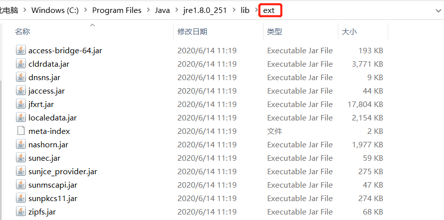

# JVM整体结构介绍

## JVM是什么

VMWare、Virtual Box相信大家都用过，我们可以在上面安装使用win Linux等系统，还可以设置我们系统内存等等，其实JVM(java虚拟机)就类似我们平时使用的虚拟机，JVM就像我们在虚拟机上安装的操作系统一样，运行在一个完全隔离环境中的完整计算机系统 

Java虚拟机阵营：Sun HotSpot VM、BEA JRockit VM、IBM J9 VM、Azul VM、Apache Harmony、Google Dalvik VM、Microsoft JVM

## JVM工作流程

首先把我们编写的.java结尾的文件使用javac编译成.class(java字节码文件)文件,jvm会先把.class通过类加载机制加载到内存中(运行时数据区)，然后class文件会被拆分分别装载到相应的方法区、堆、栈、本地方法栈、程序计数器中，最后会通过执行引擎堆我们的程序执行，执行引擎中就有垃圾回收机制会自动帮我们清理运行时产生的内存垃圾

## 类加载子系统

Java运行时把(.java)编译源码成字节码(.class)，由jre运行,jre由java虚拟机（jvm）实现,Jvm分析字节码，后解释并执行。

### 类加载过程

类加载：类加载器将class文件加载到虚拟机的内存

1. 加载：在硬盘上查找并通过IO读入字节码文件
2. 连接：执行校验、准备、解析（可选）步骤
3. 校验：校验字节码文件的正确性
4. 准备：给类的静态变量分配内存，并赋予默认值
5. 解析：类装载器装入类所引用的其他所有类
6. 初始化：对类的静态变量初始化为指定的值，执行静态代码块

### 类加载器种类

引导类加载器：负责加载JRE的核心类库，如jre目标下的rt.jar,charsets.jar等，如我们平时使用的 io包 lang包 等一些java核心类都是在rt.jar包下

扩展类加载器：负责加载JRE扩展目录ext中JAR类包

系统类加载器：负责加载ClassPath路径下的类包，就是我们自己写的Class

用户自定义加载器：负责加载用户自定义路径下的类包

**小例子**

获取各种类的加载器，String的类加载器获取为空，原因是Bootstrap ClassLoader是C/C++实现的所以在不在JDK中获取不到Name

### 加载机制

全盘负责委托机制：当一个ClassLoader加载一个类时，该类所依赖和引用的类也由这个ClassLoader载入，除非指定其他ClassLoader加载

双亲委派机制：指先如果Application ClassLoader需要加载一个类的时候，自己不会加载而是先委托他的上级Extension ClassLoader加载，但是Extension ClassLoader也不会加载而是继续委托上级Bootstrap ClassLoader加载，Bootstrap ClassLoader因为没有上级了所以从他开始加载，如果加载到就结束，如果加载不会就会下降一级加载，就这样一级一级向上委托到最高层，如果从最高处依次检查加载

**双亲委派模式优势**

沙箱安全机制：自己写的String.class类不会被加载，这样便可以防止核心API库被随意篡改

避免类的重复加载：当父亲已经加载了该类时，就没有必要子ClassLoader再  加载一次

**小例子**

自己编写一个 一模一样的 java.lang.String的类，但是我运行时居然报错"在类 java.lang.String 中找不到 main 方法"这个main方法根本就没有错，那为什么报错呢因为加载的时候，根本加载的不是你写的这个类，加载这个类时是最后委派最上级的Bootstrap ClassLoader先加载，Bootstrap ClassLoader也有一个一模一样的类所以加载的是Bootstrap ClassLoader加载器中的String类，因为Bootstrap ClassLoader加载器中的String类并没有main方法所以就报错了

### 类加载过程

JVM加载jar包是否会将包里的所有类全部加载进内存？

JVM对class文件是按需加载(运行期间动态加载)，非一次性加载，见示例(启动需要加上参数：-verbose:class)

~~~java
public class TestClassLoaderSequence {

    static {
        System.out.println("==========static code=========");
    }

    public static void main(String[] args) {
        new A();
        System.out.println("==========load=========");
        new B();
    }

}
class A{
    public A(){
        System.out.println("==========inti A=========");
    }
}
class B{
    public B(){
        System.out.println("==========inti B=========");
    }
}
~~~

我们可以看到最先TestClassLoaderSequence会被加载，然后static静态代码块会被加载，当使用到A的时候A对象才会被加载，或者使用B对象的时候B对象才会被加载

## 运行时数据区

运行时数据区就是JVM内存，JVM内存中分为方法区、java栈、本地方法栈、堆、程序计数器，其中方法区与堆是所有线程共享的，java栈、本地方法栈、程序计数器是每一个线程独享的，程序中每分配一个线程，该线程中就会创建自己的java栈、本地方法区、程序计数器，不与其它线程共享

| 内存区域   | 共享         |
| ---------- | ------------ |
| 方法区     | 线程之间共享 |
| 堆         | 线程之间共享 |
| java栈     | 线程独享     |
| 本地方法栈 | 线程独享     |
| 程序计数器 | 线程独享     |

### 线程独享内存区

#### 本地方法栈(线程私有)

登记native方法(native修饰的方法底层执行是本地写好的c/c++文件)，在Execution Engine执行时加载本地方法库

#### 程序计数器（线程私有）

就是一个指针，指向方法区中的方法字节码（用来存储指向下一条指令的地址,也即将要执行的指令代码），由执行引擎读取下一条指令，是一个非常小的内存空间，几乎可以忽略不记。

#### Java栈（线程私有）

 Java线程执行方法的内存模型，一个线程对应一个栈，每个方法在执行的同时都会创建一个栈帧（用于存储局部变量表，操作数栈，动态链接，方法出口等信息）**不存在垃圾回收问题**，只要线程一结束该栈就释放，生命周期和线程一致

**java栈 **

在每一个线程中都会有一个之间的java栈，栈中会存放的栈帧，栈帧中存放的是该线程需要执行的方法，每一个方法对应一个栈帧，每一个栈帧中会存在该方法中存储局部变量表，操作数栈，动态链接，方法出口等信息，栈的数据结构特点就是先进后出

加入我现在编写如下内容的class那么在java栈是如何存放的

~~~java
public class Math {
    public static final Integer CONSTANT_1 = 666;
    
    public int math(){
        int a = 1;
        int b = 2;
        int c = (a + b)*10;
        return c;
    }

    public static void main(String[] args) {
        Math math = new Math();
        System.out.println(math.math());
        System.out.println("end");
    }
}
~~~

首先我们把我们的java文件反汇编获取，jvm字节码文件

~~~shell
#编译Math.java 得到.class文件
javac Math.java
#把class文件反编译得到更容易阅读的字节码文件，输出到txt文件保存
javap -c Math.class > Math.txt
~~~

打开后我们得到如下内容，jvm会从上往下执行这些指令，从这些指令顺序我们就可以看出这个类的执行顺序了

~~~java
Compiled from "Math.java"
public class Math {
  //static final修饰的 变量为最先执行的
  public static final java.lang.Integer CONSTANT_1;

  public Math(); 
    Code:
       0: aload_0
       1: invokespecial #1                  // Method java/lang/Object."<init>":()V
       4: return

  public int math();
    Code:
       0: iconst_1 //将int类型常量1压入栈(栈帧-操作数栈)
       1: istore_1 //从操作数栈把,把int类型值出栈存入第1个局部变量a中(栈帧-局部变量表)
       2: iconst_2 //将int类型常量2压入栈(栈帧-操作数栈)
       3: istore_2 //从操作数栈把,把int类型值出栈存入第2个局部变量b中(栈帧-局部变量表)
       4: iload_1  //从局部变量中把第1个局部变量a复制一份，存入操作栈中
       5: iload_2  //从局部变量中把第2个局部变量b复制一份，存入操作栈中
       6: iadd     //从操作数栈，出栈2个数，执行int类型的加法，计算后把结果压入栈
       7: bipush        10 //将一个8位带符号整数压入栈，就是把10压入栈
       9: imul     //从操作数栈，出栈2个数，执行int类型的乘法，计算后把结果压入栈
      10: istore_3 //从操作数栈把,把int类型值出栈存入第3个局部变量c中(栈帧-局部变量表)
      11: iload_3  //从局部变量中把第3个局部变量c复制一份，存入操作栈中
      12: ireturn  //从方法中返回int类型的数据

  public static void main(java.lang.String[]);
    Code:
       0: new           #2                  // class Math
       3: dup
       4: invokespecial #3                  // Method "<init>":()V
       7: astore_1
       8: getstatic     #4                  // Field java/lang/System.out:Ljava/io/PrintStream;
      11: aload_1
      12: invokevirtual #5                  // Method math:()I
      15: invokevirtual #6                  // Method java/io/PrintStream.println:(I)V
      18: getstatic     #4                  // Field java/lang/System.out:Ljava/io/PrintStream;
      21: ldc           #7                  // String end
      23: invokevirtual #8                  // Method java/io/PrintStream.println:(Ljava/lang/String;)V
      26: return

  static {};
    Code:
       0: sipush        666
       3: invokestatic  #9                  // Method java/lang/Integer.valueOf:(I)Ljava/lang/Integer;
       6: putstatic     #10                 // Field CONSTANT_1:Ljava/lang/Integer;
       9: return
}
~~~

#### 

### 线程共享内存区

#### 方法区（线程共享）

类的所有字段和方法字节码，以及一些特殊方法如构造函数，接口代码也在此定义。简单说，所有定义的方法的信息都保存在该区域，静态变量+常量+类信息(构造方法/接口定义)+运行时常量池都存在方法区中，虽然Java虚拟机规范把方法区描述为堆的一个逻辑部分，但是它却有一个别名叫做 Non-Heap（非堆），目的应该是与 Java 堆区分开来

#### 堆（线程共享）

虚拟机启动时创建，用于存放对象实例，几乎所有的对象（包含常量池）都在堆上分配内存，当对象无法再该空间申请到内存时将抛出OutOfMemoryError异常，同时也是垃圾收集器管理的主要

堆分为 Young Generation(年轻代) Old Generation(老年代) MetaData Space(永久代)

Young Generation(年轻代)默认设置是占堆的1/3的内存，Young Generation(年轻代)中又分为 Eden区 Survivor区， Survivor区内又包含From区 To区，首先最新new出来的对象会被存入Eden区，当Eden区满了会触发Minor GC(普通GC)把没有引用的对象回收掉，把有有引用的对象放入Survivor的From区，当From区也满了就会再次触发Minor GC(普通GC)，会把没有引用的对象清理，把引用的对象移动到To区，这时他们的位置就会被调换，原本的To区变成了From区，原本的From就变成了To区，To和From每一次GC后他们会交换，如果From与To区持续GC交换了15次(默认15次)后如果该对象还是存在后会被移动到Old Generation(老年代)，最后的老年代慢慢的满了后就会进行一次Full GC(大GC)

MetaData Space(永久代) JDK8以前MetaData Space是被划分到堆中的但是并不占用堆中内存，JDK8以后MetaData Space被移出堆中，并且改名叫元空间，元空间使用的是直接内存不是jvm的内存，常量都保存在这，元数据区也有可能发生OutOfMemory异常

* Jdk1.6及之前： 有永久代, 常量池在方法区
* Jdk1.7：    有永久代，但已经逐步“去永久代”，常量池在堆
* Jdk1.8及之后： 无永久代，常量池在元空间

元数据区的**动态扩展**，默认–XX:MetaspaceSize值为21MB的高水位线，一旦触及则Full GC将被触发并卸载没有用的类（类对应的类加载器不再存活），然后高水位线将会重置，新的高水位线的值取决于GC后释放的元空间。如果释放的空间少，这个高水位线则上升，如果释放空间过多，则高水位线下降。

### Minor GC与Full GC区别

Minor GC与Full GC区别 Minor GC是轻GC对JVM影响不大，Full GC是重GC发生Full GC时JVM会停下所有工作等待GC结束，所以通过出现大量的Full GC会非常的影响JVM性能，JVM调优其实就是，尽量减少Full GC次数已经Full GC执行时间

### 栈+堆+方法区的交互关系

HotSpot(主流虚拟机)是使用指针的方式来访问对象，Java堆中会存放访问元数据的地址，reference存储的就是直接是对象的地址，

## 执行引擎

java执行引擎分为2种 JIT编译器和字节码解析器

JIT编译器

Just-In-Time(即时编译器)，就是一口气编译好多行代码然后存起来，执行时取出来使用，特点就是第一次运行毕竟慢因为需要编译全部执行的代码，但是以后会快因为只编译一次后可以重复利用

字节码解析器

字节码解析器就把字节码文件，一行一行的编译然后一行一行的执行，特点就是不能保存下来，每一次执行都需要重新一次一次编译

jvm默认使用的是 混合模式，JIT和字节码解释混合使用

