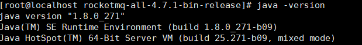

## 安装jdk
### 自定义安装
**jdk下载**
> jdk安装包都可以通过Oracle官网：`https://www.oracle.com/java/technologies/javase-jdk8-downloads.html`下载
> jdk8：下载地址：`http://www.oracle.com/technetwork/java/javase/downloads/jdk8-downloads-2133151.html`
> 
**解压压缩包**
~~~shell
tar -zxvf jdk-8u181-linux-x64.tar.gz
~~~
**环境变量配置**
~~~shell
# 修改系统环境变量
vim /etc/profile
# 在profile后追加如下内容
export JAVA_HOME=/usr/local/jdk1.8.0_271
export CLASSPATH=$JAVA_HOME/lib
export JRE_HOME=$JAVA_HOME/jre
export PATH=$PATH:$JAVA_HOME/bin
# 重新加载环境变量
source /etc/profile
~~~
**验证安装**
> 执行`java -version`如看到以下内容表示安装成功
> 

### yum安装

**检查**

> 检查本地是否已经按照过java环境，只有通过yum安装的才能使用这命令查询到
~~~shell
rpm -qa | grep -i java
~~~
**卸载**
> 若在rpm中查到了jdk那么就执行如下没了卸载jdk，若没有跳过
~~~shell
rpm -e --nodeps java-xxx
~~~

**安装**
> 执行如下命令安装jdk
~~~shell
yum install java-1.8.0-openjdk* -y
~~~
**验证安装**
> 执行`java -version`如看到以下内容表示安装成功
> 

