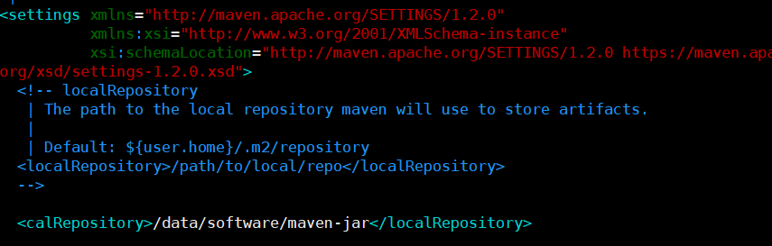

# 安装Maven
在安装Maven需要有一定的Linux知识，小伙伴可以通过我以下2篇博客学习到一下Linux的基础知识
[VM虚拟机安装Linux](VMware-克隆虚拟机.md)
[Linux基础命令](Linux-安装和常用命令.md)

## 安装包下载
`https://dlcdn.apache.org/maven/maven-3/3.8.4/binaries/apache-maven-3.8.4-bin.tar.gz`

## Maven的安装
### 上传安装包
将安装包上传到Linux中

### 解压安装包
~~~shell
#进入local目录
cd /data/software/
#解压安装包
tar -zxvf apache-maven-3.8.4-bin.tar.gz
~~~
解压完成后我们就可以在local目录下看到一个maven的安装包
### 修改配置

> 解压后的maven需要修改配置文件，配置文件位于`/data/software/apache-maven-3.8.4/conf/settings.xml`

**依赖存储地方**

> 自定义依赖包的保存位置，可以更加便于自己管理依赖

**使用阿里云镜像**

> Maven默认依赖是从中央仓库美国拉取的访问很慢，切换到国内阿里云可以提升依赖下载的速度

~~~xml
<mirror>
    <id>nexus-aliyun</id>
    <mirrorOf>central</mirrorOf>
    <name>Nexus aliyun</name>
    <url>http://maven.aliyun.com/nexus/content/groups/public/</url>
</mirror>
~~~

### 配置环境变量

~~~shell
#编辑Linux环境变量
vim /etc/profile
~~~

> 最后面添加如下内容
>
> export MAVEN_HOME=/data/software/apache-maven-3.8.4
> export PATH=$MAVEN_HOME/bin:$PATH

~~~shell
#刷新环境变量
source /etc/profile
~~~

> 使用`mvn -v `如果看到版本号表示成功

