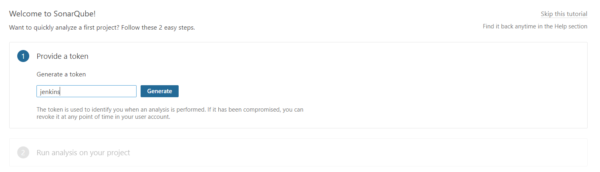
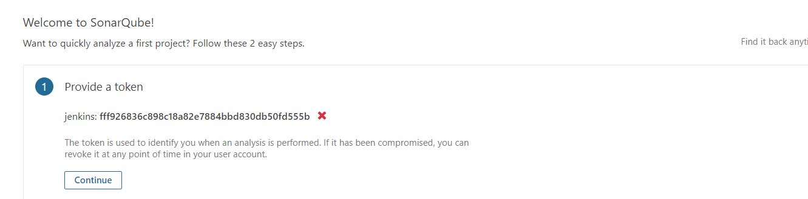

# 安装SonarQuble

> SonarQuble是一款代码审查工具，他可以快速的发现编写的代码种存在的问题，SonarQuble可以检测`Java, C#, PHP, Python, JavaScript, TypeScript`等十多款语言的代码问题

## 所需环境

> mysql：SonarQuble安装需要mysql数据，因为SonarQuble会将代码审查结果保存到mysql种
>
> unzip：由于SonarQuble安装包是zip，需要使用unzip命令解压，在Linux执行`yum install unzip`安装unzip
>
> jdk：SonarQuble的运行需要jdk环境

[Linux-安装mysql数据库](Linux-安装mysql数据库.md)

[Linux-安装JDK](Linux-安装JDK.md)

**新建数据库**

> 需要在mysql中创建一个名为，`sonar`的数据库

## 下载安装包

> 官方地址：https://www.sonarqube.org/downloads/
>
> 进入到官方下载页面下载社区版即可，下载完毕后将压缩包上传到Linux服务器上，滑倒最下面可以下载其他版本，下载最新版jdk可能不适配所以我下载的是`6.7.7`

## 执行安装

### 解压

~~~shell
#解压缩SonarQuble
unzip sonarqube-9.2.4.50792.zip
#重命名解压后的文件夹
mv sonarqube-9.2.4.50792 sonarqube
~~~

### 创建用户

> sonarqube不能使用root用户运行，需要创建一个普通用户运行否则会报错

~~~shell
#创建一个sonar用户
useradd sonar
#将sonarqube文件夹权限全部修改为sonar用户
chown -R sonar. /data/software/sonarqube
~~~

### 修改配置文件

> 进入到sonarqube下的conf目录，修改`sonar.properties`配置文件，修改连接数据库的信息

~~~shell
sonar.jdbc.username=root
sonar.jdbc.password=123456

sonar.jdbc.url=jdbc:mysql://localhost:3306/sonar?useUnicode=true&characterEncoding=utf8&rewriteBatchedStatements=true&useConfigs=maxPerformance&useSSL=false
~~~

> sonar默认是监听9000端口的，如果9000端口被占用，那么可以找到配置文件这个位置修改

### 启动

> 启动sonar不能使用root启动，需要切换用户切换成前面创建是sonar用户启动

~~~shell
#切换用户
su sonar
#因为使用的是linux操作系统，所有
cd bin/linux-x86-64/
~~~

**常用命令**

| 命令                                            | 说明     |
| ----------------------------------------------- | -------- |
| ./sonar.sh status                               | 查看状态 |
| ./sonar.sh sart                                 | 启动     |
| ./sonar.sh stop                                 | 停止     |
| tail -f /data/software/sonarqube/logs/sonar.log | 日志查看 |

> 启动成功后访问`http://192.168.100.104:9000`能够成功访问表示安装成功

> 点击登录，sonar默认有一个账户，账户密码都为admin

## 密钥生成

> 第一次登录成功后，弹出一个界面让你生成一个密钥，这个密钥在后期是非常有用的，特别是集成Jenkins时候

> 点击构建的时候保存下来`fff926836c898c18a82e7884bbd830db50fd555b`

## 中文插件

> SonarQuble官方提供中文插件，插件地址如下，下载对应版本中文插件
>
> 下载地址：https://github.com/xuhuisheng/sonar-l10n-zh
>
> 如果使用最新版的SonarQuble可以直接在工具中安装，但是如果使用的是旧版需要手动安装

### 手动安装

> 从gitHub下载对应的中文包：`https://github.com/xuhuisheng/sonar-l10n-zh`

> 将下载好的安装包上传到sonarqube下`/extensions/plugins`的文件夹中，执行`sonar.sh restart`重启后生效

