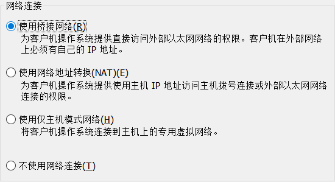
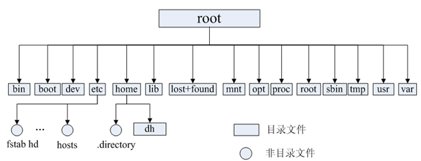
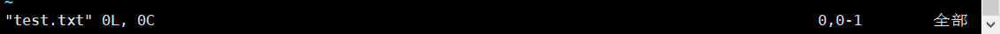
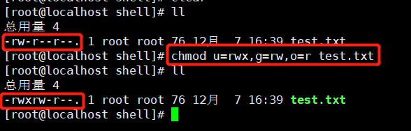

# 后端程序员必备的Linux基础知识

## 一、虚拟机安装CentOS7

这里就不多说了 新建虚拟机 一直下一步下一步

### VMware三种网络配置

好多小伙伴在安装虚拟机过程中到搭这一步后就不该怎么选了，而已好多小伙伴因为这一步导致虚拟机无法连接网络，今天我就来给大家解释一下这三种网络配置方式的区别，推荐使用桥接模式，桥接模式是最容易而且最少出错的。

1. Bridged桥接模式(推荐)：
        桥接模式就是表示这个操作系统就像是局域网中的一台独立的主机，它和你的宿主机是同级别的，它可以访问网内任何一台机器，你需要手工为它配置IP地址、子网掩码，而且还要和宿主机器处于同一网段，这样虚拟机就可以访问这个网段下的任何一台电脑，虚拟机和宿主机的关系就像网吧2台电脑同时连着一台交换机的关系。
2. NAT网络地址转换模式：
        虚拟机借助NAT的功能，通过宿主机所在的网络来访问公网。在这种模式下宿主机成为双网卡主机，同时参与现有的宿主局域网和新建的虚拟局域网，但由于加设了一个虚拟的NAT服务器，使得虚拟局域网内的虚拟机在对外访问时，使用的则是宿主机的IP地址，这样从外部网络来看，只能看到宿主机，完全看不到新建的虚拟局域网。
3. Host-only主机模式：
        新建了一个由所有虚拟机与宿主机所构成的局域网，但该局域网与宿主机本身所处的现有局域网是相互独立的，如果不做额外路由设置，这两个局域网之间不会连通，因此新建的局域网可以认为是一个单独从属于当前宿主机的私有网络，其成员为当前宿主机和相关的所有虚拟机。

过了这以后继续下一步 下一步。。。

### 桥接模式的网络配置

Linux安装完成后首先我们需要配置我们的网络，这样才能互通

1. 配置ip地址等信息

   ~~~shell
   #/etc/sysconfig/network-scripts/ifcfg-eno16777736文件里做如下配置
   TYPE=Ethernet # 网络类型为以太网
   BOOTPROTO=static # 手动分配ip
   DEVICE=eno16777736 # 网卡设备名，设备名一定要跟文件名一致
   ONBOOT=yes # 该网卡是否随网络服务启动
   IPADDR=192.168.0.60 # 该网卡ip地址
   NETMASK=255.255.255.0 # 子网掩码
   GATEWAY=192.168.0.1 # 网关
   DNS1=8.8.8.8 # DNS，8.8.8.8为Google提供的免费DNS服务器的IP地址
   ~~~

2. 配置公共DNS服务（可选）

   ~~~shell
   #在/etc/resolv.conf文件里增加如下配置
   nameserver 8.8.8.8
   ~~~

3. 关闭防火墙

   ~~~shell
   systemctl stop firewalld # 临时关闭防火墙
   systemctl disable firewalld # 禁止开机启动
   ~~~

4. 重启网络

   ~~~shell
   service network restart
   ~~~

## 二、Linux文件系统概览

在Linux操作系统中，所有被操作系统管理的资源，例如网络接口卡、磁盘驱动器、打印机、输入输出设备、普通文件或是目录都被看作是一个文件，也就是说在LINUX系统中有一个重要的概念：一切都是文件。其实这是UNIX哲学的一个体现，而Linux是重写UNIX而来，所以这个概念也就传承了下来。在UNIX系统中，把一切资源都看作是文件，包括硬件设备。UNIX系统把每个硬件都看成是一个文件，通常称为设备文件，这样用户就可以用读写文件的方式实现对硬件的访问  

### Linux的目录结构如下 ：

### 常见目录说明：

- **/bin：** 存放二进制可执行文件(ls,cat,mkdir等)，常用命令一般都在这里；
- **/etc：** 存放系统管理和配置文件；
- **/home：** 存放所有用户文件的根目录，是用户主目录的基点，比如用户user的主目录就是/home/user，可以用~user表示；
- **/usr** ：用于存放系统应用程序；
- **/opt：** 额外安装的可选应用程序包所放置的位置。一般情况下，我们可以把tomcat等都安装到这里；
- **/proc：** 虚拟文件系统目录，是系统内存的映射。可直接访问这个目录来获取系统信息；
- **/root：** 超级用户（系统管理员）的主目录（特权阶级o）；
- **/sbin:** 存放二进制可执行文件，只有root才能访问。这里存放的是系统管理员使用的系统级别的管理命令和程序。如ifconfig等；
- **/dev：** 用于存放设备文件；
- **/mnt：** 系统管理员安装临时文件系统的安装点，系统提供这个目录是让用户临时挂载其他的文件系统；
- **/boot：** 存放用于系统引导时使用的各种文件；
- **/lib** **：** 存放着和系统运行相关的库文件 ；
- **/tmp：** 用于存放各种临时文件，是公用的临时文件存储点；
- **/var：** 用于存放运行时需要改变数据的文件，也是某些大文件的溢出区，比方说各种服务的日志文件（系统启动日志等。）等；
- **/lost+found：** 这个目录平时是空的，系统非正常关机而留下“无家可归”的文件（windows下叫什么.chk）就在这里。

## 三、Linux基本命令

中文Linux命令帮助大全：http://man.linuxde.net/  这个网站提供了一个网站的Linux main手册中文版小伙伴们如果与到不会的命令都可以在这个网站搜索，里面有案例什么的好多，我下面之讲一些比较常用的命令

### 文件夹切换跳转命令

~~~shell
cd usr #切换到该目录下usr目录
cd ..（或cd../） #切换到上一层目录
cd / #切换到系统根目录
cd ~ #切换到用户主目录
cd - #切换到上一个所在目录
~~~

### 文件夹的操作命令

~~~shell
mkdir 目录名称 #创建目录
ls #查看当前目录 下所有目录和文件
ll #ll是ls -l的缩写，ll命令以看到该目录下的所有目录和文件的详细信息
find 目录 参数 #寻找目录
mv 目录名称 #新目录名称： 修改目录的名称也可修改文件
mv 目录名称 #目录的新位置： 移动目录的位置---剪切
cp -r 目录名称 #目录拷贝的目标位置： 拷贝目录（-r表示递归拷贝 目录下全部都是都拷贝过去）
rm -rf 目录 #删除目录也可以删除文件
~~~

### 文件操作命令

~~~shell
touch 文件名称 #文件的创建
cat 文件名称 #文件的查看
#文件的查看除了cat 还有很多如 more less head -行 tail -行
#cat： 只能显示最后一屏内容
#more： 可以显示百分比，回车可以向下一行， 空格可以向下一页，q可以退出查看
#less： 可以使用键盘上的PgUp和PgDn向上 和向下翻页，q结束查看
#head -10 ： 查看文件的前10行，Ctrl+C结束
#tail -10 ： 查看文件的后10行，Ctrl+C结束
#tail -f 对文件动态查看，我们在看tomcat的日志文件时日志是动态插入的，我们就需要用这个命令
vim 文件 #修改文件的内容
~~~

vim命令是一个非常重要的命令，我们在Linux编辑配置文件，等都需要用到

一般我们在lunx对一个文件编辑需要步骤如下：

vim 文件==>进入文件==>命令模式==>按i进入编辑模式==>编辑==>按Esc进入底行模式==>输入:wq或q!完成编辑（wq保存内容并退出；输入q!代表强制退出不保存）

在上面操作步骤中提到了几种模式：命令模式、编辑模式、底行模式

1. 命令模式

用vim打开文件时进入的就是命令模式，命令模式下我们可以操作光标移动，字符，字，字或者行的删除，移动复制某段区域，在该模式下可以进入插入模式也可以进入底行模式。

2. 编辑模式

在编辑模式下才可以使用上下左右输入文字，按Esc进入底行模式

3. 底行模式

在底行模式下保存文件或者退出vim

#### vim中一些常用命令

移动

~~~
vim 可以使用小写英文字母 h j k l 分别控制光标左 下 上 右移动，也可以使用箭头
Ctrl+b 屏幕往后移动一页
Ctrl+f 屏幕往前移动一页
Ctrl+u 屏幕往后移动半页
Ctrl+d 屏幕往前移动半页
Shift+g == G 移动到文章的最后
Shift+4 == $ 移动到光标所在行的行尾
Shift+6 == ^ 移动到光标所在行的行首
w 光标跳到下个字的开头
e 光标跳到下个字的字尾
b 光标回到上个字的开头
#l  例如:5l ，56l 光标移动到该行的第'#'个位置
gg 进入到文本的开始
~~~

删除

~~~
x 每按一次删除光标所在位置的一个字符
#x 栗子：6x 删除光标所在位置的"后面"(包含自己在内)6个字符
Shift+x == X 每按一次，删除光标所在位置的前一个字符
Shift+#x == #X 栗子 20X 删除光标所在位置的前面20个字符
dd 删除光标所在行
#dd 栗子 6dd 从光标所在行开始删除6行
~~~

替换

~~~
r 替换光标所在处的字符
R 替换光标所到之处的字符，知道按下Esc键为止.
~~~

撤销

~~~
u 回到上一个操作，按动多次'u'可以执行多次回复
~~~

更改

~~~
cw 更改光标所在处的字到字尾处
c#w 栗子 c3w 表示更改三个字
~~~

### 压缩文件的操作命令

1. 打包并压缩文件

   Linux中的打包文件一般是.tar结尾的，压缩的文件一般是以.gz结尾的。

   而一般情况下打包和压缩是一起进行的，打包并压缩后的文件的后缀一般.tar.gz

   命令：

   ~~~shell
   tar -zcvf 打包压缩后的文件名 要打包压缩的文件
   # -zcvf 其中其实这是4个命令 如果想了解还有上面命令的小伙伴可以去man 帮助查tar命令
   #z：调用gzip压缩命令进行压缩
   #c：打包文件
   #v：显示运行过程
   #f：指定文件名
   ~~~

   小案例：

   如test目录中有3个文件 分别是aaa.text bbb.text ccc.text 我需要打包这3个文件命名为 test.tar.gz我可以执行如下命令：

   ~~~shell
   tar -zcvf test.tar.gz aaa.txt bbb.txt ccc.txt
   #或者tar -zcvf test.tar.gz /test/
   ~~~

2. 解压压缩包

   命令：

   ~~~shell
   tar -xvf 压缩文件
   #x：解压
   #v：显示运行过程
   #f：指定文件名
   ~~~

   小案例：

   我需要解压我刚刚打包好的 test.tar.gz 

   ~~~shell
   tar -xvf test.tar.gz
   #将/test下的test.tar.gz解压到当前目录下
   tar -xvf xxx.tar.gz -C /usr
   #将/test下的test.tar.gz解压到根目录/usr下
   ~~~

### Linux的权限命令

每一个操作系统都有权限控制，如那些文件谁能修改，谁不能修改只能读取。

Linux中权限一般分为读(readable)、写(writable)和执行(excutable)，我们要查看该文件的权限时我们可以通过 ll命令 查看当前目录详细文件信息和文件的权限

第一个是当前用户名称：root用户 拥有rwx权限

第二个是这个用户归属那个用户组：root组 拥有rx权限

文件类型：

- d： 代表目录
- -： 代表文件
- l： 代表链接（可以认为是window中的快捷方式）

权限类型：

- r：代表权限是可读，r也可以用数字4表示
- w：代表权限是可写，w也可以用数字2表示
- x：代表权限是可执行，x也可以用数字1表示

文件和目录权限的区别：

1. 对于文件
   * r 可以使用cat查看文件的内容
   * w 可以修改文件的内容
   * x 可以运行该文件（如某个shell脚本）

2. 对于目录
   * r 可以查看目录下列表
   * w 可以创建和删除目录下文件
   * x 可以使用cd进入目录

在Linux中每一个用户必须属于一个组，不能独立于组外。在linux中每一个文件有所有者、所在组、其它组的概念。

1. 所有者

   一般为文件的创建者，谁创建了该文件，就天然的成为该文件的所有者，用ls ‐l命令可以看到文件的所有者 也可以使用chown 用户名 文件名来修改文件的所有者 。

2. 文件所在组

   当某个用户创建了一个文件后，这个文件的所在组就是该用户所在的组 用ls ‐l命令可以看到文件的所有组 也可以使用chgrp 组名 文件名来修改文件所在的组。

3. 其它组

   除开文件的所有者和所在组的用户外，系统的其它用户都是文件的其它组

修改文件/目录的权限命令：chmod

修改/test下的aaa.txt的权限为属主有全部权限，属主所在的组有读写权限， 其他用户只有读的权限

~~~shell
chmod u=rwx,g=rw,o=r test.txt
#chmod 764 test.txt 也可以使用数字表示
~~~

### Linux用户管理

linux系统是一个多用户多任务的分时操作系统，任何一个要使用系统资源的用户，都必须首先向系统管理员申请一个账号，然后以这个账号的身份进入系统。用户的账号一方面可以帮助系统管理员对使用系统的用户进行跟踪，并控制他们对系统资源的访问；另一方面也可以帮助用户组织文件，并为用户提供安全性保护。

相关命令：

~~~shell
useradd 选项 用户名 #添加用户账号
userdel 选项 用户名 #删除用户帐号
usermod 选项 用户名 #修改帐号
passwd 用户名 #更改或创建用户的密码
passwd -S 用户名 #显示用户账号密码信息
passwd -d 用户名 #清除用户密码
su - 用户名 #切换登录用户
~~~

useradd命令用于Linux中创建的新的系统用户。useradd可用来建立用户帐号。帐号建好之后，再用passwd设定帐号的密码．而可用userdel删除帐号。使用useradd指令所建立的帐号，实际上是保存在/etc/passwd文本文件中。该文件内容的解释：用户名:密码:用户id:组id:用户说明:用户的主目录:用户使用的shell环境(默认为bash)

passwd命令用于设置用户的认证信息，包括用户密码、密码过期时间等。系统管理者则能用它管理系统用户的密码。只有管理者可以指定用户名称，一般用户只能变更自己的密码。

### Linux用户组的管理

每个用户都有一个用户组，系统可以对一个用户组中的所有用户进行集中管理。不同Linux 系统对用户组的规定有所不同，如Linux下的用户属于与它同名的用户组，这个用户组在创建用户时同时创建。

用户组的管理涉及用户组的添加、删除和修改。组的增加、删除和修改实际上就是对/etc/group文件的更新。

相关命令：

~~~shell
groupadd 选项 用户组 #增加一个新的用户组
groupdel 用户组 #要删除一个已有的用户组
groupmod 选项 用户组 #修改用户组的属性

~~~

### 其它常用命令

~~~shell
pwd #显示当前所在位置路径
ps -ef # 查看所有进程
ps -ef | grep 搜索内容 # 查看所有进程然后如果管道"|"过滤出grep 搜索的相关内容
kill -9 进程的pid #杀死进程（-9 表示强制终止）
#网络通信命令
ifconfig #查看当前系统网卡信息
ping ip地址 #查看于某ip地址链接情况
netstat -an #查看所有链接和端口 an是多个命令更多命令链接可以查看man操作手册
route -n #查看网关
shutdown -h now #指定现在立即关机
reboot #重开机
reboot -w #做个重开机的模拟（只有纪录并不会真的重开机）
~~~

## 四、安装jdk

### 压缩包安装

1. 查看是否已经安装JDK：rpm -qa | grep -i java
2. 若有则删除：rpm -e --nodeps java-xxx，删除所有相关的java
3. 下载jdk8：`http://www.oracle.com/technetwork/java/javase/downloads/jdk8-downloads-2133151.html`安装包，将gz压缩文件放到指定目录如/usr/local，解压：tar -zxvf     jdk-8u181-linux-x64.tar.gz
4. 设置全局变量：vim /etc/profile，追加
        JAVA_HOME=/usr/local/jdk1.8.0_231
        CLASSPATH=$JAVA_HOME/lib/
        PATH=$PATH:$JAVA_HOME/bin
        export PATH JAVA_HOME CLASSPATH
5. source /etc/profile
6. java -version

### yum安装

1. 检索yum中有没有java1.8的包：yum list java-1.8*
2. yum install java-1.8.0-openjdk* -y