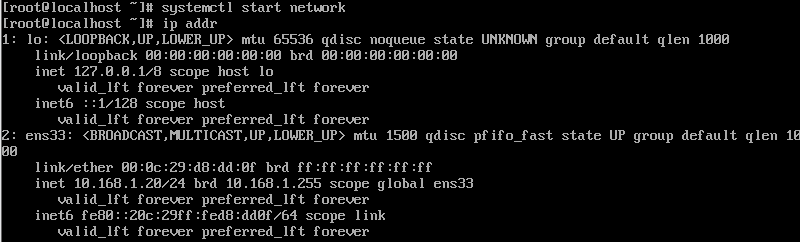

# VMware-克隆虚拟机

> 在使用VMware过程中需要经常克隆虚拟机，但是在克隆完整虚拟机后通常都会出现一个问题就是，网络无法连接因为网卡冲突了，告诉大家如何解决

## 虚拟机克隆

> 在管理中选择克隆

> 克隆当前虚拟机状态

> 选择完整克隆

## 重新生成网卡

>  克隆完毕后在，还不能立刻启动需要重新生成网卡，不然会和原来虚拟机冲突

## 修改IP地址

> 重新生成网卡后可以启动了，接下来修改修改ip地址

~~~shell
#修改网卡信息
vi /etc/sysconfig/network-scripts/ifcfg-ens33
~~~

~~~shell
#检查ip是否已修改
ip addr
#禁用NetworkManager服务
# 查看服务状态
systemctl status NetworkManager.service
# 停止服务
systemctl stop NetworkManager.service
# 禁止启动
systemctl disable NetworkManager.service
#重启网络
systemctl restart network
~~~

## 修改主机名称

> 主机名称可改可不改

~~~shell
#修改主机名称
vi /etc/sysconfig/network
#文件内容
NETWORKING=yes
HOSTNAME=hadoop51(你的主机名称)
~~~

## 修改hosts文件

> 在部署集群项目时需要修改Linux的hosts文件，这样可以通过域名访问集群内的集群

~~~shell
#修改hosts文件
vi /etc/hosts
~~~

## 常见问题

### 1.Centos中ifcfg-ens33参数

~~~shell
#执行如下命令修改网卡配置
vi /etc/sysconfig/network-scripts/ifcfg-ens33
~~~

~~~shell
DEVICE     接口名（设备,网卡）
USERCTL    [yes|no]（非root用户是否可以控制该设备）
BOOTPROTO  IP的配置方法[none|static|bootp|dhcp]（引导时不使用协议|静态分配IP|BOOTP协议|DHCP协议）
HWADDR     MAC地址   
ONBOOT     系统启动的时候网络接口是否有效（yes/no）   
TYPE       网络类型（通常是Ethemet）   
NETMASK    网络掩码   
IPADDR     IP地址   
IPV6INIT   IPV6是否有效（yes/no）   
GATEWAY    默认网关IP地址
BROADCAST  广播地址
NETWORK    网络地址
 
 
#########start设置静态地址例子#########
TYPE="Ethernet"
PROXY_METHOD="none"
BROWSER_ONLY="no"
#BOOTPROTO="dhcp"
DEFROUTE="yes"
IPV4_FAILURE_FATAL="no"
IPV6INIT="yes"
IPV6_AUTOCONF="yes"
IPV6_DEFROUTE="yes"
IPV6_FAILURE_FATAL="no"
IPV6_ADDR_GEN_MODE="stable-privacy"
NAME="ens33"
UUID="ac9b66bf-74fb-4bda-b89f-c66ff84c9571"
DEVICE="ens33"
ONBOOT="yes"
 
#static assignment
NM_CONTROLLED=no #表示该接口将通过该配置文件进行设置，而不是通过网络管理器进行管理
ONBOOT=yes #开机启动
BOOTPROTO=static #静态IP
IPADDR=192.168.59.134 #本机地址
NETMASK=255.255.255.0 #子网掩码
GATEWAY=192.168.59.2 #默认网关
DNS1=8.8.8.8
DNS2=8.8.4.4
 
#########end设置静态地址例子#########
~~~

~~~shell
#重启网络
service network restart
~~~

### 2.网卡配好后重启无法使用

> 虚拟机修改网卡配置后是正常的，但是一重启网卡就识别不了了

#### 重启前

> 重启前网卡是正常的

#### 重启后

> 重启后使用ip addr无法识别

#### 问题排查1

> 有可能是由于NetworkManager导致的问题，使用如下命令检查NetworkManager服务是否开启

~~~shell
#查看NetworkManager状态
systemctl stop NetworkManager状态
~~~

> 若是active状态，那么就需要关闭它

~~~shell
#停止NetworkManager
systemctl stop NetworkManager
#关闭开启自启动
systemctl disable NetworkManager
#重启网络
systemctl start network
~~~

> 可以看到网卡信息出现了

