# Linux安装和基础配置

centos OS 7 镜像下载 https://wiki.centos.org/Download 

选择自定义安装

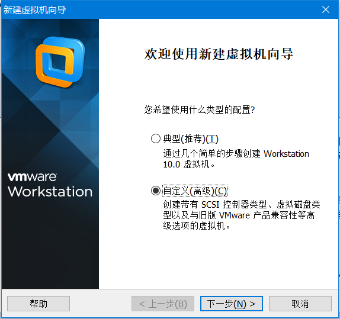

使用默认配置下一步

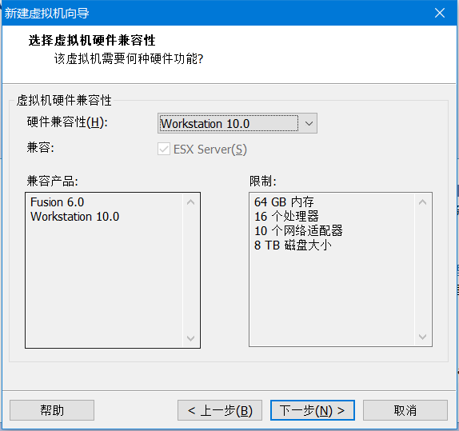

稍后安装操作系统

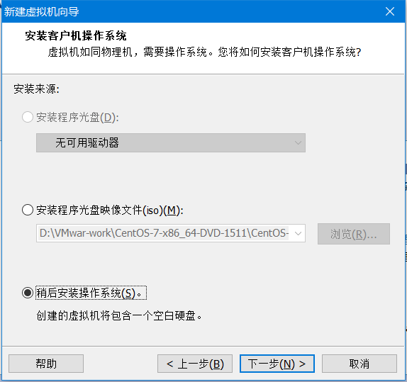

我们下载的是OS 7 我们也选Linux OS64

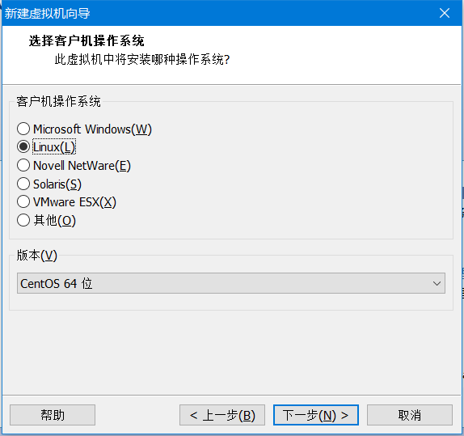

这里是你虚拟机存放在那个文件夹中，建议不要放C盘自己建一个统一文件夹好管理，也方便删除

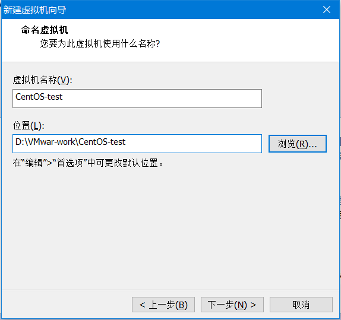

使用默认 下一步

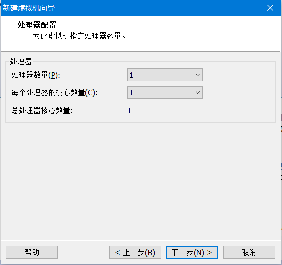

使用默认 下一步

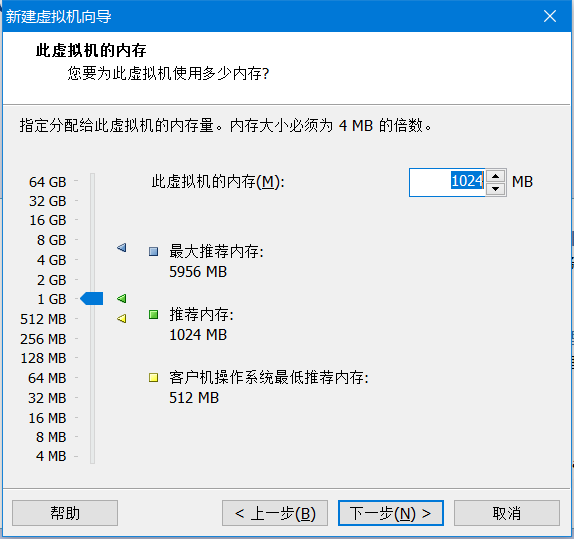

这里推荐使用网络桥接，最容易配置，以及最简单的，关于这3种网络类型解释，在我的小白架构师成长之路7可以看，想了解的小伙伴可以去看看

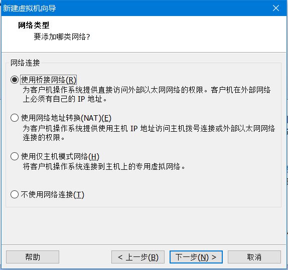

使用推荐的 下一步

使用推荐 下一步

创建新虚拟磁盘

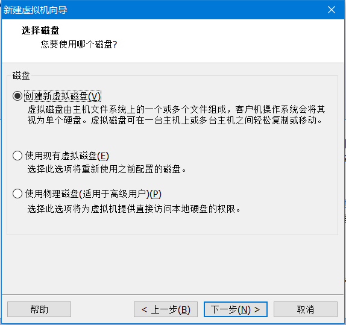

使用默认的 下一步

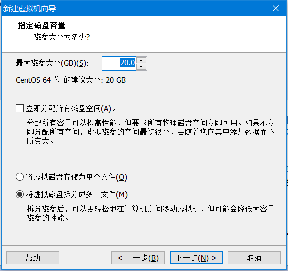

使用默认 下一步

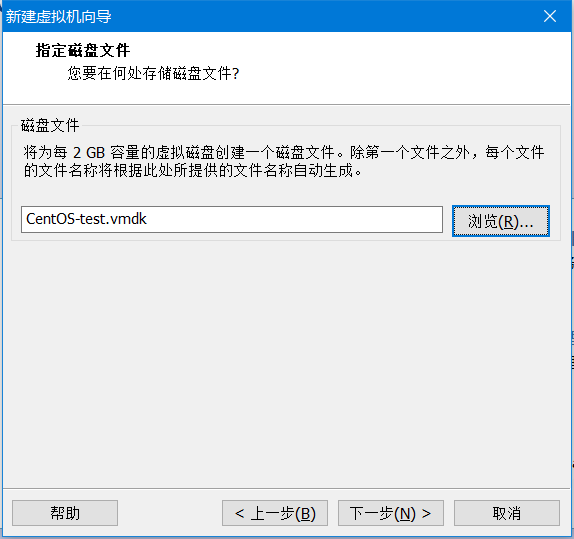

双击CD/DVD 设置 iso 镜像文件 安装Linux

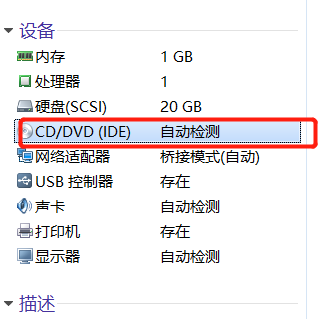

选择你下载的iso文件 

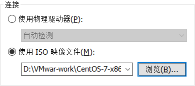

确认后 开机 选择install 

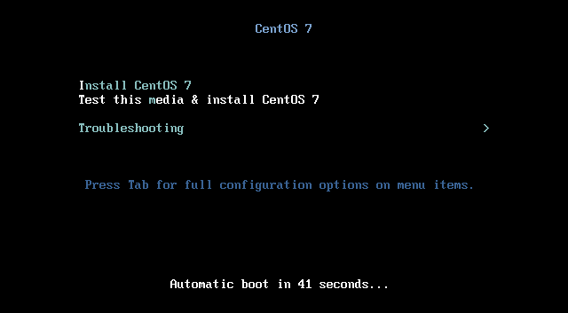

选择语言

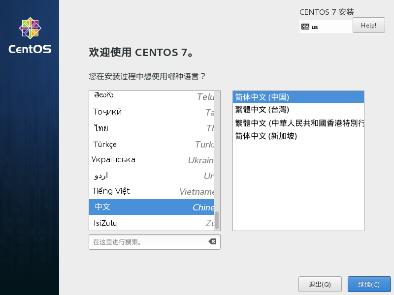

不要选择最小安装 不然什么都没得什么都需要下载，选择基础设施服务器就行了

安装位置点进去一下 点完成把感叹号去到就可以 开始安装了

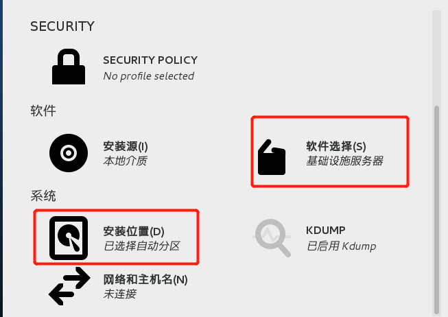

安装时设置密码

因为密码太简单所以需要点击2次完成

安装完成后重启就完成安装了 Linux基础配置请查看小白架构师成长之路7

