# VMware网络配置NAT模式
>VMware虚拟机有三种网络模式，分别是Bridged(桥接模式)、NAT(网络地址转换模式)、Host-only(主机模式)，Bridged模式应该是大家使用最多的模式，基本无需配置直接用，但是桥接模式在某种特定情况下满足不了需求，如在桥接模式下虚拟机与宿主机必须保持在同一网段下，如果跟换了网络环境，我们会发现网段发生了改变，虚拟机IP也随之修改，这样不利于长期管理我们的虚拟机。
## NAT模式介绍
>使用NAT模式，就是让虚拟系统借助NAT的功能，通过宿主机所在的网络来访问公网，在这种模式下宿主机成为双网卡主机，同时参与现有的宿主局域网和新建的虚拟局域网，但由于加设了一个虚拟的NAT服务器，使得虚拟局域网内的虚拟机在对外访问时，使用的则是宿主机的IP地址，这样从外部网络来看，只能看到宿主机，完全看不到新建的虚拟局域网

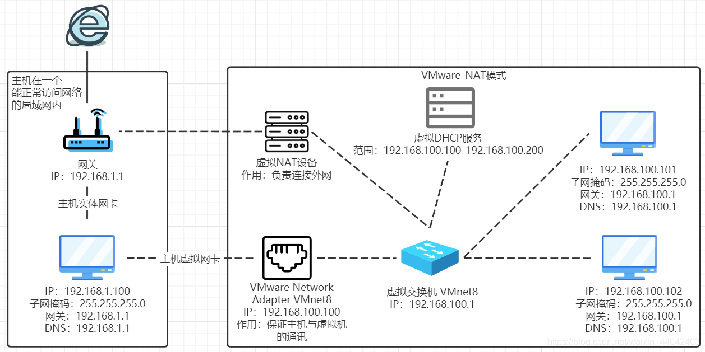

虚拟机的IP都是由虚拟交换机决定的，由虚拟NAT负责连接外网，而虚拟网卡VMware Network Adapter Vmnet8只是负责主机与虚拟机之间的通信
## NAT网络配置
### 虚拟机设置NAT模式
>打开VMware，选择需设置的虚拟机，点击编辑虚拟机设置将网络适配器修改为NAT模式，点击确认
>
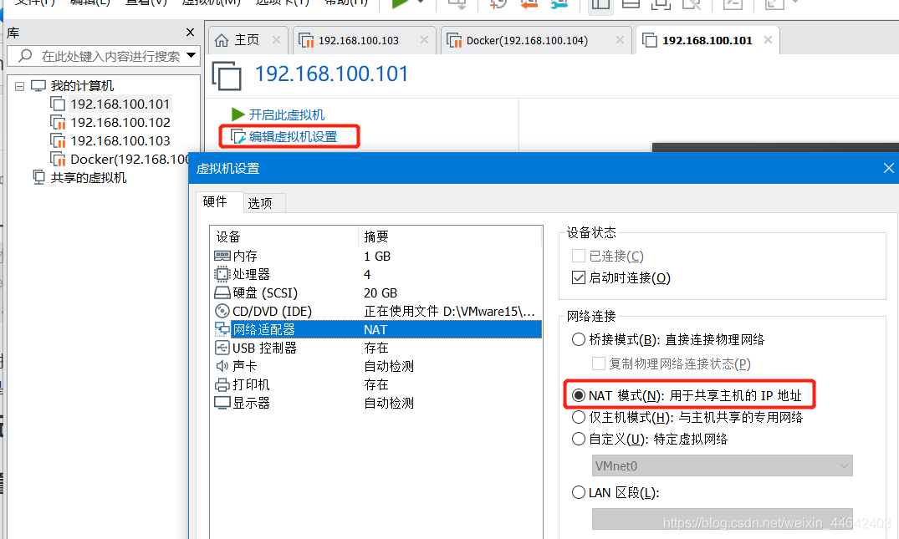
### 虚拟网络编辑器
> 在编辑里面找到虚拟网络编辑器打开可用看到这个界面

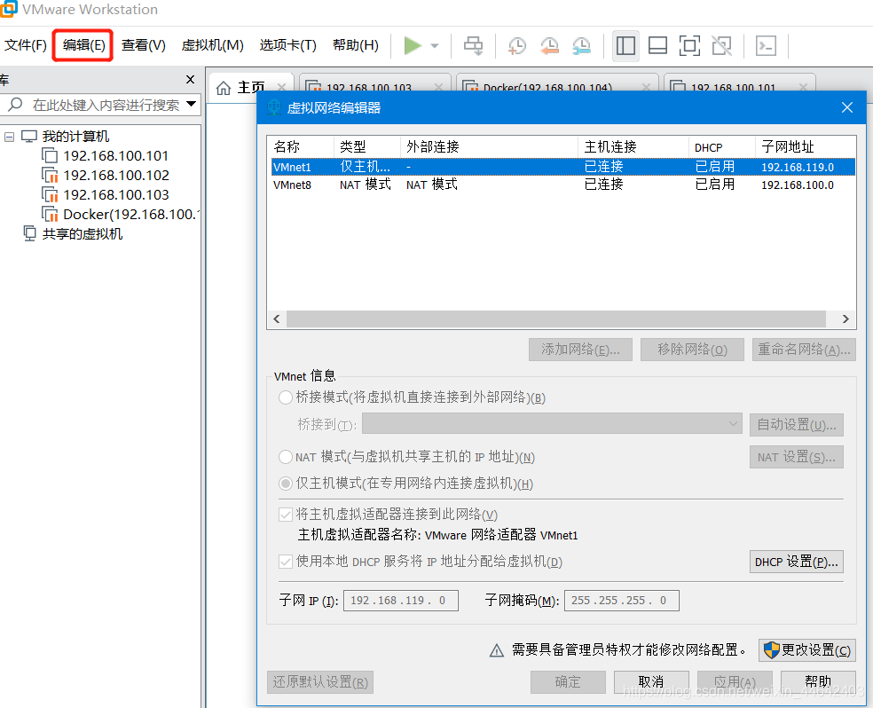
>点击更改设置，这样才能编辑

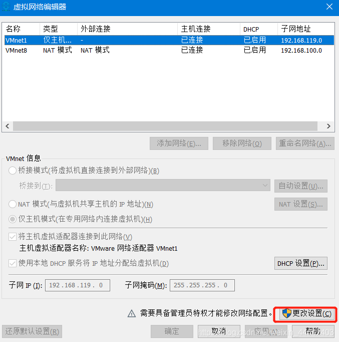
> 选中NAT模式，将DHCP中2个多选勾上
> 注意下面的子网IP，前两部分必须和主机IP的前两部分一样，即192.168，第三部分得不一样，不能是1（主机使用了 192.168.1网段），这里填100，第四部分补0。子网掩码都是255.255.255.0
> 
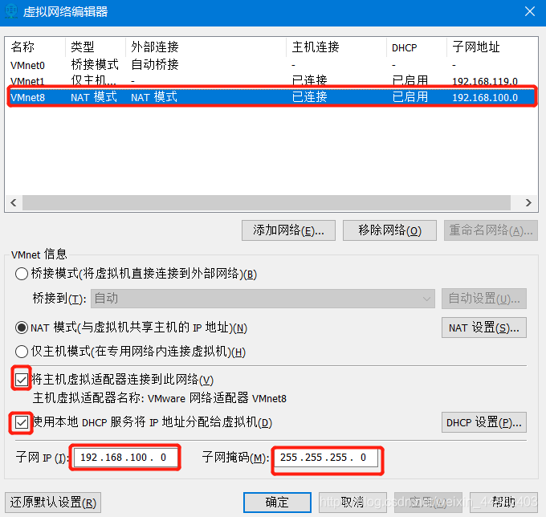
> 子网与子网掩码配置完毕后，点击NAT设置，填写默认网关一般第四位1的是默认网关
> 
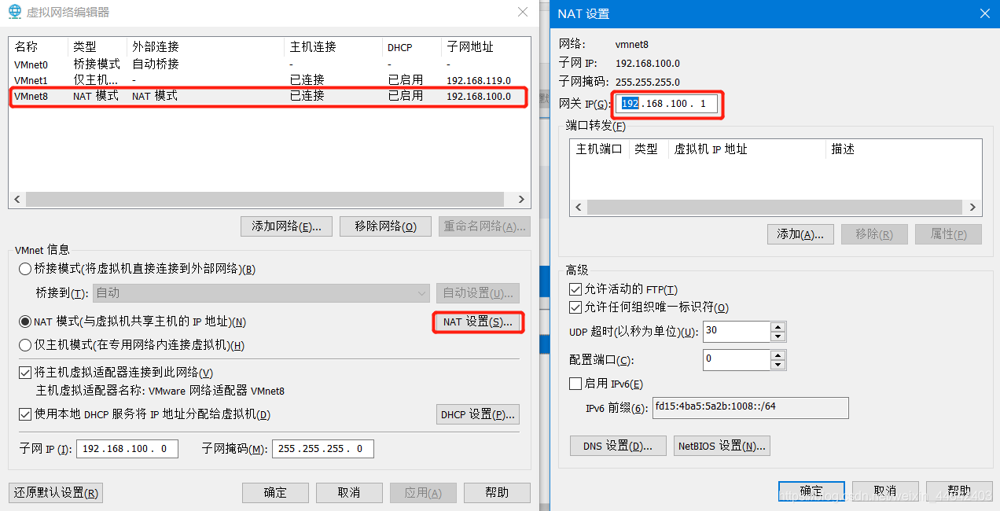
> DHCP配置虚拟机自动获取IP地址时，就会从DHCP获取你设置好的该范围内的一个IP，我这里设置起始192.168.100.100结束192.168.100.200这些IP是可用分配的
> 
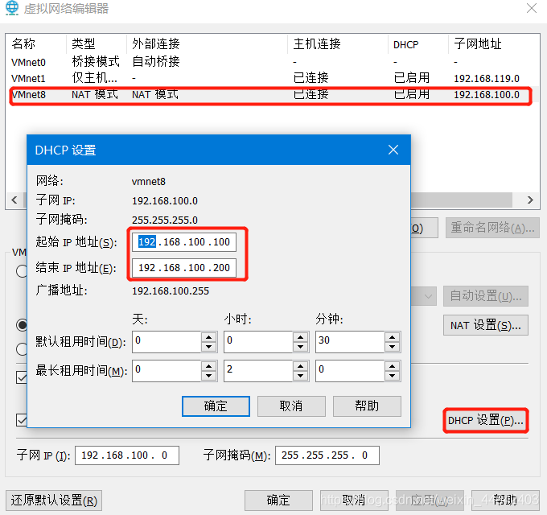
### 设置宿主机网卡
> 在 控制面板=>所有控制面板项=>网络连接 找到VMware Network Adapter VMnet8网口
> 
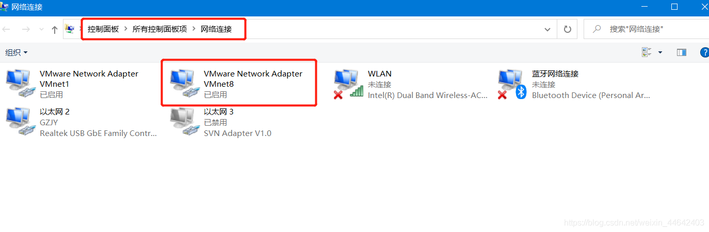
> 右键我们的虚拟网口，点击属性，找到IPv4点击属性，进入设置该网口的IP地址(192.168.100.100)、子网掩码(255.255.255.0)、默认网关(192.168.100.1)
> 
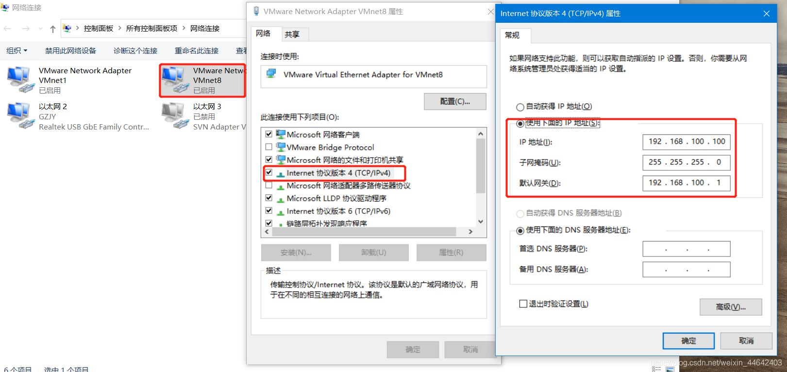
>同样虚拟机里面也手动设置好IP地址，这里我没有使用到DHCP自动分配，因为这样好管理我的主机IP
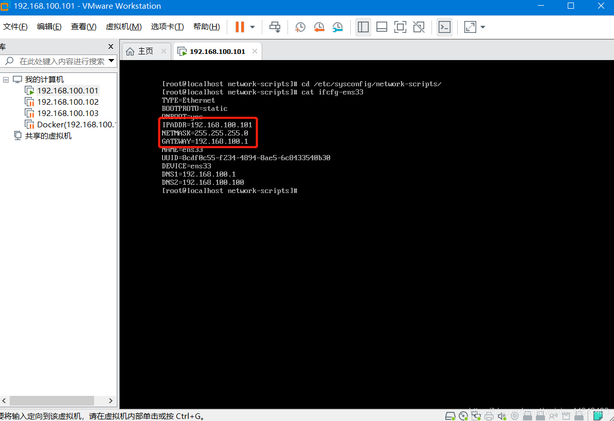
### 测试
>在宿主机中使用cmd，ping虚拟机(192.168.100.101)能够成功通讯，表示宿主机与虚拟机通讯是没有问题的
>
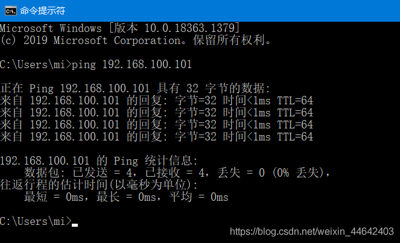
>在虚拟机中使用ping命令，ping百度官网，能够成功通讯表示虚拟机是可通过NAT虚拟服务访问外部网络的
>
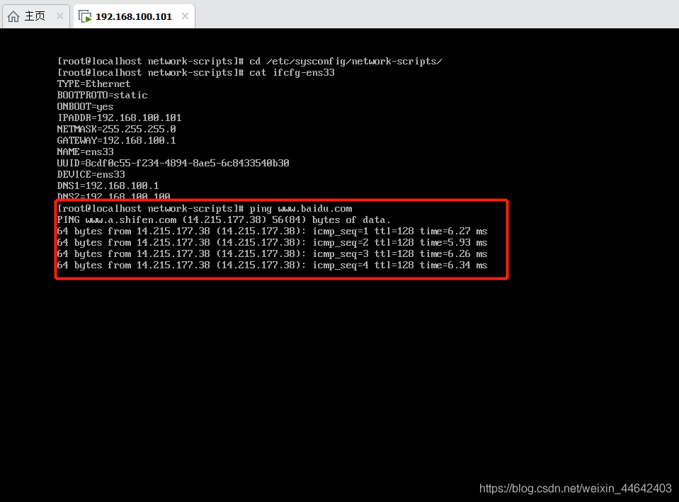
经过上面2个测试都没问题那么表示VMware网络配置NAT模式已经配置成功了
