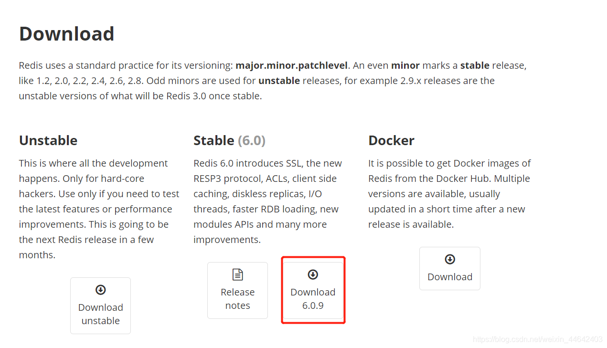
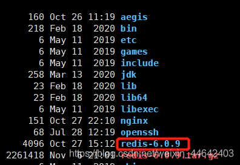
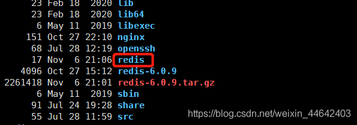
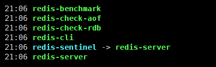
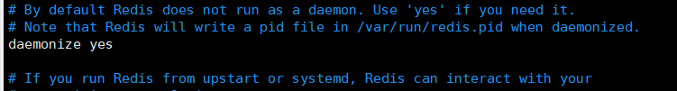
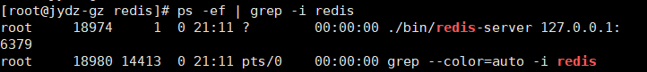

# 安装Redis
下载压缩包 ：https://redis.io/download

上传压缩包到/usr/local目录并解压

~~~shell
#进入/usr/local目录
cd /usr/local
#安装gcc依赖,不安装无法正常编译redis
yum install gcc-c++
#解压压缩包
tar -xvf redis-6.0.9.tar.gz
~~~
解压完成后我们目录下就会有一个redis-6.0.9文件夹

~~~shell
#进入到redis-6.0.9文件夹中
cd redis-6.0.9/
#执行编译命令
make
#把编译后的redis安装到/usr/local/redis目录下
make PREFIX=/usr/local/redis install
#将来redis.conf拷贝到/usr/local/redis目录下
cp redis.conf /usr/local/redis
~~~
完成后我们可以看到我们目录下有一个redis的文件夹

~~~shell
#进入redis目录
cd redis/bin
~~~
进入后我们可以查看到如下几个文件直接使用，**./redis-server**就可以启动redis但是这样是只是前台启动，如果我们的Linux窗口关闭后我们的redis也要关闭

后台启动Linux

~~~shell
#进入redis目录
cd redis
#编辑我们之前拷贝过来的redis.conf 文件
vim redis.conf 
~~~
将来deaonize改成yes，保存退出

~~~shell
#回到redais目录下
cd /redis
#启动redis        使用redis.conf配置文件启动
./bin/redis-server ./redis.conf
~~~
观察进程

关闭redis
~~~shell
./bin/redis-cli shutdown
~~~
