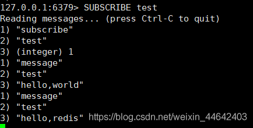
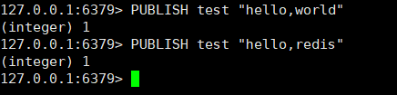
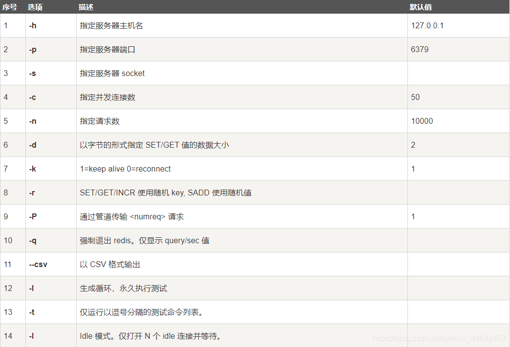
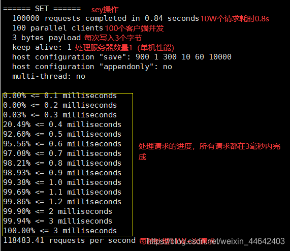

# RedisCli常用命令手册

## Redis常用
~~~shell
#进入到redis目录
cd redis
#启动redis
./bin/redis-server ./redis.conf
#关闭redis
./bin/redis-cli shutdown
#连接本地redis
./bin/redis-cli -p 6379
~~~
### redis客户端基本命令
~~~shell
#连接本地redis
./bin/redis-cli -p 6379
# 查看所有key
keys * 
# 切换到第三个数据库
select 3 #redis默认是有16个数据库 可以从配置文件的 databases 16 看到
# 查看当前数据库大小
DBSIZE
# 清空当前库
FLUSHDB #清空所有库 FLUSHALL 
# 检查 key=name的value是否存在
EXISTS name # 1存在 0不存在
# 移除
MOVE name 1 #把key=name这条数据从第1个数据库异常
# 设置过期时间
EXPIRE name 10  #设置key=name这条数据 10秒后过期
# 查看过期剩余时长
TTL name #查看key=name这条数据 还剩下多久时间过期
# 查看类型
TYPE name #查看key=name这条数据 数据类型
#导出Key
redis-cli -h 地址 -p 端口 -a 密码 -c 命令 >/路径/文件.txt
~~~
### Scan命令
~~~shell
#在数据量极大的情况下一般使用Scan举行分页查询，如果使用keys命令可能会导致超时
#从hashe游标0开始 匹配name*(正则表达式) 查询1000条内包含name的key
SCAN 0 MATCH name* COUNT 1000
# 1) "1398"
# 2) 1) "name1"
#    2) "name4"
#    3) "name55"
#接着上一次查询得到的游标1398，后面继续查100条
SCAN 1398 MATCH name* COUNT 1000
#若得到游标0表示已经没有了
# 1) "0"
# 2) 1) "name67"
#    2) "name44"
#    3) "name89"
redis-cli --raw -h 注解 -a 密码 -p 端口 --scan --pattern "*" >> temp.log
~~~

### String操作
~~~shell
# 追加字符串
APPEND name testappend  #往key=name的数据后面追加testappend，如果当前key不在久是插入
# 获取字符串长度
STRLEN name #获取key=name的字符串长度
#截取字符串
GETRANGE name 0 3 #截取key=name 范围[0,3]
#获取所有字符串
GETRANGE name 0 -1 #截取key=name 范围所有
#替换
SETRANGE name 1 xx #把key=name里面的值从下标1开始 往后覆盖xx
# 插入
SET name hello #插入一个key=name value=hello数据
# 插入一个值 并且设置过期时间
SETEX key1 30 hello #插入一个key=key1 value=hello 数据并且设置过期时间 30秒
# 插入一个值 如果该key不存在插入成功返回1，存在插入失败返回0
SETNX name hello #插入一个key=name value=hello SETNX与SET操作不同之处在在于SETNX会进行插入判断，如果当前插入的key已经存在就不允许插入，而SET操作不管你有没有值直接覆盖
# 批量插入 key=key1 value=hello1  key=key2 value=hello2 key=key2 value=hello2
MSET key1 hello1 key2 hello2 key3 hello3
# 批量插入检查当前如果不存在就创建，该操作是原则性操作
MSETNX key1 hello1 key2 hello2 key3 hello3 #原子性操作，其中有一个插入失败 全部失败要么全部成功
#get然后set
GETSET db redis2 #如果key=db 不存在创建，如果存在获取当前值返回，然后set redis2 进去
~~~
### 对象操作
~~~shell
#插入对象 {obj}:{id}:{file} {value},对象名:id:属性 值
MSET user:1:name lzj user:1:age 2
#获取对象
MGET user:1:name user:1:age
~~~
##### i++操作
应用场景：阅读量，访问量，观看量等统计，定时持久化到Mysql
~~~shell
# i++ 操作 
SET views 0 #set一个key=views 的数据到redis 初始值0
INCR views #key=views的值 +1  
DECR views #key=views的值 -1
INCRBY views 10  #key=views的值 +10  
DECRBY views 10  #key=views的值 -10
~~~
### List操作
应用场景：栈，队列，阻塞队列等使用，如果项目没有消息队列组件，可以尝试使用redis制作

~~~shell
#所有的liset命令都是L开头
#往key=list  的数组 从头插入value=one
#小提示：Redis LPUSH和java不同之处默认是从数组的头部插入元素，java的push是插入数组的尾部
LPUSH list one  
#往key=list  的数组 从后插入value=righr 
RPUSH list righr
#读取key=list 所有元素
LRANGE list 0 -1
#从数组头部 弹出一个值
LPOP list
#从数组尾部 弹出一个值
RPOP list
#通过下标获取list的值
LINDEX list 1 #从list数组 获取下标1的值
#获取list长度
LLEN list #返回list的长度
#删除值
LREM list 1 three #从list的头部开始遍历 删除1个值为three的值
#通过下标截取，执行该操作后数组只会保留截取部分
LTRIM list 1 2
#从数组尾部移除一个值，并且移动到行的list中
RPOPLPUSH list newlist #把list中尾部的值移除，把移除的值插入到newlist 中
#替换值，如果下标没有会报错
LSET list 1 hello  #将list 中下标0的值替换为hello
#插入值
LINSERT list before world other #往list的 world值的前面插入一个other值
~~~
### Set操作
应用场景：统计网页访问量（同一个用户多次点击不算网站访问量），通过差集，交集，并集等可以用于比如QQ/微信查看双方共同好友操作
~~~shell
#往myset存入一个值hello
SADD myset hello
#查看当前set所有元素
SMEMBERS myset
#查看当前set是否包含hello元素
SISMEMBER myset hello
#获取set的size
SCARD myset
#移除myset的hello元素
SREM myset hello
#随机获取set中的一个元素
SRANDMEMBER myset 1
#随机获取一个元素并且删除它
SPOP myset
#将来一个指定的元素移动到另外的set中
SMOVE myset myset2 sdfa #将来myset中的sdfa移动到myset2中
#获取set1与set3的差集
SDIFF set1 set3
#获取set1与set3的交集
SINTER set1 set3
#获取set1与set3的并 集
SUNION set1 set3
~~~
### Hahs操作
~~~shell
#插入
HSET myhash key1 lzj
#获取hahs
HGET myhash key1
#批量插入
HMSET myhash key1 value1 key2 value2
#批量获取
HMGET myhash key1 key2
#获取hash输出格式 key value
HGETALL myhash 
#删除hash中指定的key
HDEL myhash filed1
#获取长度
HLEN myhash #返回hash1哈希表的长度
#判断是否存在某个key
HEXISTS myhash key1
#只获取hash所有的key
HKEYS myhash
#只获取hash所有的值
HVALS myhash
#增加指定key中的值
INCRBY myhash key3 10
#检查插入，如果不存在key才能插入
HSETNX myhash key1 wefwef
~~~
### Zset操作（有序集合）
应用场景：数据需升序、降序、获取指定范围等操作
~~~shell
#插入值，插入时需要传一个需要，用于排序等操作
ZADD myzet 1 two
#按序号排序 从-inf（负无穷）到 +inf（正无穷）
ZRANGEBYSCORE myzet -inf +inf
#按序号排序 从-inf（负无穷）到 +inf（正无穷）并且显示序号
ZRANGEBYSCORE myzet -inf +inf withscores
#删除某一指定元素
ZREM myzet lzj
#获取容量
ZCARD myzet 
#通过排名范围获取
ZREVRANGE myzet 0 -1
~~~
### geospatial操作（地理位置）
应用场景：朋友定位，附近的人，打车距离
~~~shell
#添加城市经纬度,南北极无法直接添加，一般通过程序导入
GEOADD china:city 116.398209 39.909804 beijing  #纬度 经度 名称
#获取指定城市的经度纬度
GEOPOS china:city beijing
#获取2地的直线距离 带参数 m/km
GEODIST china:city beijing shanghai km #查看北京与上海的距离 返回单位km
#获取经度：110 纬度：30 半径1000km 范围内的所有点
GEORADIUS china:city 110 30 1000 km
#获取经度：110 纬度：30 半径1000km 范围内的1个城市
GEORADIUS china:city 110 30 10000 km withdist withcoord count 1
#以广州为中心查找附近1000km的城市
GEORADIUSBYMEMBER china:city gzhou 1000 km
#返回2个城市的经纬度的一个hash值
GEOHASH china:city shengzheng gzhou
#查看所有元素
ZRANGE china:city 0 -1
#删除指定元素
ZREM china:city beijing
~~~
### Hyperloglog（基数统计）
基数统计，什么是基数，已A={1,2,5,6,6,8}为例，基数=4 就是这给集合中不重复的数
应用场景：统计用户访问量，这个用到内存比Set更少
~~~shell
#添加
PFADD mypf 1 2 3 3 4 5 6
#统计其中有多少基数
PFCOUNT mypf
#合并
PFMERGE newmypf mypf2 mypf3 #mypf2 mypf3合并到newmypf中
~~~
### Bitmap（位存储）
位存储其实就是0和1  底层存储只有0和1  统计0/1，2种状态的数量
应用场景：打卡记录，登录记录，签到记录等，内存最少
~~~shell
#添加
SETBIT sign 0 1
#获取sign 0 对应的值
GETBIT sign 0
#统计为1的数据
BITCOUNT sign
~~~
### redis发布订阅
#### 订阅
~~~shell
SUBSCRIBE test #订阅一个频道
~~~

#### 发布
~~~shell
#往test频道发布一个消息
PUBLISH test "hello,world" 
~~~

### redis性能测试

~~~shell
# 测试redis处理 100个连接 100000个并发
redis-benchmark -h localhost -p 6379 -c 100 -n 100000
~~~

