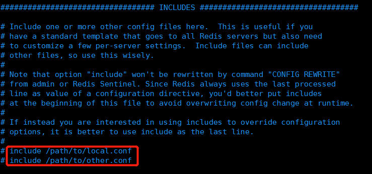

## Redis.conf详解

### 配置说明

> redis对配置文件对大小写不敏感

### 引入配置文件（INCLUDES）

> redis可以通过引入的方式引入多个配置文件

### 网络配置（NETWORK）

> 绑定的IP地址

> 保护模式（默认开启）

> Redis端口

### 通用配置（GENERAL）

> 以守护进程方式运行（默认是no）

> 如果以守护进程方式运行，需要指定一个PID进程文件

> 日志 debug测试环境使用 notice生产环境使用

> 日志生成的文件位置名，如果空只是控制台输出

> 数据库数量 默认16

> 是否显示Redis LOGO

### 快照设置（SNAPSHOTTING）

> 持久化时需要设置在规定时间内有多少次操作会持久化，保存到持久化文件分.rdb和.aof

~~~shell
#如果900秒内至少有1个key修改，就进行持久化操作
save 900 1 
#如果300秒内至少有10个key修改，就进行持久化操作
save 300 10 
#如果60秒内至少有1万个key修改（高并发），就进行持久化操作
save 60 10000 
~~~

> 持久化出错是否继续工作

> 是否压缩rdb文件，即持久化文件，会消耗CPU资源

> 保存rdb文件的时候继续错误的检测，校验

> rdb文件保存的目录

### 主从复制（REPLICATION）

> 指定主机的IP与端口号

### 安全配置（SECURITY）

> 连接密码，默认是不需要密码的，可以通过“requirepass 123456”设置连接密码为”123456“

~~~shell
#auth命令登录redis
auth [password]
~~~

### 客户端限制（CLIENTS）

> 最大客户端连接数

### 内存配置（MEMORY MANAGEMENT）

> redis最大内存容量

> 内存达到上限的处理策略
>
> 1、volatile-lru：只对设置了过期时间的key进行LRU（默认值）
> 2、allkeys-lru ： 删除lru算法的key
> 3、volatile-random：随机删除即将过期key
> 4、allkeys-random：随机删除
> 5、volatile-ttl ： 删除即将过期的
> 6、noeviction ： 永不过期，返回错误

### AOF配置（APPEND ONLY MODE）

> 默认不开启aof模式，默认使用rdb方式持久化，大部分情况下rdb够用

> aof持久化文件名字

> 同步设置

~~~shell
#每次修改都会 sync，消耗性能
appendfsync always 
#每次执行一次 sync，可能会丢失这ls的数据
appendfsync everysec
#不执行 sync，操作系统自己同步数据
appendfsync no
~~~

