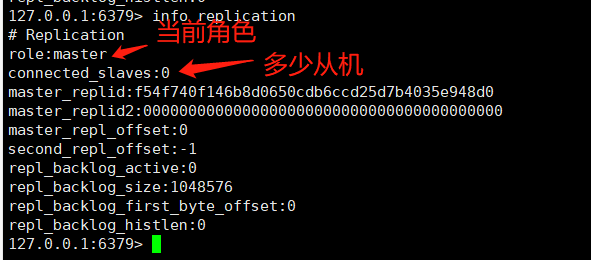
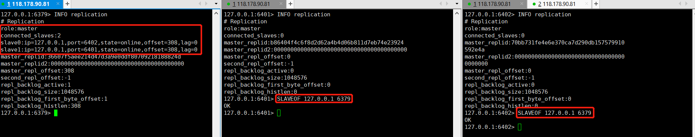
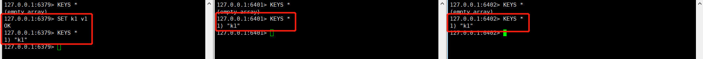
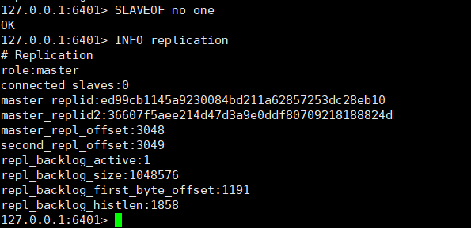

## Redis主从复制

### 简介

主从复制，是指将一台Redis服务器的数据，复制到其他的Redis服务器，前者称为主节点（master），后者成为从节点（slave），数据的复制是单向的，只能由主节点到从节点，Master以写为主，Slave以读为主

### 主从复制作用

1. 数据冗余：主从复制实现了数据的热备份，是持久化以外的一种数据冗余方式
2. 故障恢复：当主节点出现问题时，可以由从节点提供服务，实现快速的故障恢复
3. 负载均衡：在主从复制达到基础上，配合读写分离，可以由主节点提供写服务，由从节点提供读服务，分担服务器负载，尤其是在写少读多的场景下，通过多个从节点分担读负载，可以大大提示Redis服务的并发
4. 高可用基石：主从复制还是哨兵和集群的基础，因此说主从复制是Redis高可用的基础

一般来说，要将Redis运用于项目中，只使用一台Redis是会出现如下问题

1. 单Redis服务器会发生单点故障，并且一台服务器需要处理所有的请求负载压力较大
2. 单Redis服务器内存容量有限，就算一台Redis服务器内存256G，也不能所有内存用作Redis内存一般来说，单Redis最大使用内存不超过20G
3. 因为80%情况下都是进行读操作，主从复制读写分离可以大大减轻服务器的压力，一般情况下都是一主二从

### 环境配置

只配置从库，不用配置主库（Redis每一个服务默认是主库）

> 使用info replication 查看当前Redis信息

#### 拷贝多份conf文件

> cp redis.conf redis6379.conf 
>
> 使用cp拷贝多份conf文件  6401于6402是从机

#### 编辑主机配置文件

~~~shell
#端口6379 主机配置文件
vim redis6379.conf
#修改log文件输出名称和rdb文件输出名称，不改会冲突
logfile "6379.log"
dbfilename dump6379.rdb
~~~

#### 编辑从机配置文件

~~~shell
#端口6401 从机配置文件
vim redis6401.conf
#修改端口6401
port 6401
#pidfile修改成于端口对应
pidfile /var/run/redis_6401.pid
#修改log文件输出名称和rdb文件输出名称
logfile "6401.log"
dbfilename dump6401.rdb

#端口6402 从机配置文件
vim redis6402.conf
#修改端口6402
port 6402
#pidfile修改成于端口对应
pidfile /var/run/redis_6402.pid
#修改log文件输出名称和rdb文件输出名称
logfile "6402.log"
dbfilename dump6402.rdb
~~~

#### 启动3个Redis服务

~~~shell
./bin/redis-server redis6379.conf 
./bin/redis-server redis6401.conf 
./bin/redis-server redis6402.conf 
~~~

#### 配置成一主二从

我们可以看到默认情况下3台Redis都是主机

> 使用SLAVEOF 127.0.0.1 6379
>
> 配置2台从机器指定127.0.0.1:6379为主机

**当然通过命令行的方式来配置主机，只是临时配置，如果要从Redis启动时就配置好需连接的主机，就需要修改配置文件，的主从配置中的replicaof即可**

> 我们在主机中set一个值，然后这值会被复制到从机中

> 如果我们尝试在从机中写入会报错

### 主从复制原理

Slave启动成功连接到Master后会发送一个sync同步命令

Master接收到命令，启动后台的存盘进程，同时收集所有接收到用于修改数据集命令，在后台进程执行完毕之后整个数据文件到slave，并完成一次完全同步

**全量复制**：而slave服务在接收到数据文件数据后，将其存盘并加载到内存中

**增量复制**：Master继续将新的所有收集的修改命令依次传给slave，完成同步

只要重新连接master，一次完成同步（全量复制）将被自动执行

### 宕机手动设置主机

> 入主机在生产环境中突然宕机，我们查看2太从机的配置，我们会发现2台从机没有任何变化，还是连接的主机，问题是现在主机宕机了从机又不能执行写入命令，那么如何解决呢

> 手动执行``SLAVEOF no one``命令就可以将来我们的一台从机，切换为master主机
>
> **存在问题**：如果master连接上了，那从机也不会变回去了，又需要手动把从机器配置上

### 哨兵模式

#### 哨兵作用

* 通过发送命令，让Redis服务器返回监控其运行状态，包括主服务器和从服务器
* 当哨兵基础到master宕机，会自动将slave切换成master，然后通过发布订阅模式通知其他从服务器，修改配置文件让它们切换主机

#### 单哨兵

主从切换技术方法是：当主服务器宕机后，需要手动把一台从服务器切换为主服务器，这需要人工干预，还会造成一段时间内服务不可用，Redis从2.8开始正式提供了Sentinel（哨兵模式）来解决这个问题

主从切换自动版，Redis提供一个哨兵的命令，哨兵是一个独立的进程，独立运行的，哨兵会通过发送命令，等待Redis服务器响应，从而接口运行中的多个Redis实例，如果主机宕机了，会根据投票票数最多的从机，将其自动切换为主机

#### 多哨兵

单哨兵存在一个问题，如果最高哨兵死了呢，那么就没人进行监控了，所以在生产机中通常会存在多个哨兵同时监控Redis，并且多个哨兵也相互监控

假设主服务器宕机，哨兵1先检测到这个结果，系统并且不会马上进行failover过程，仅仅是哨兵1主观认为主服务器不可用，这现象称为**主观下线**，当其它哨兵也检测到主服务不可用，并且数量达到一定值，那么这些哨兵之间就会进行一次投票，投票的由一个哨兵发起，进行failover（故障转移）操作，切换成功后，就会通过发布订阅模式，让各哨兵把自己监控的从服务器实现切换主机**客观下线**

##### 部署多哨兵模式

~~~shell
#配置哨兵配置文件，文件名不要错，否则配置失败
vim sentinel.conf
#sentinel monitor [被监控的名称] [host] [port] [1]
sentinel monitor myredis 127.0.0.1 6379 1
#启动哨兵
./bin/redis-sentinel sentinel.conf
~~~

##### 模拟宕机

> 将来主机宕机，观察哨兵的日志，以及2台从机的信息

> 那如果主机回来了会怎么样呢
>
> 主机回来只能归并到新的主机下，当从机

#### 优缺点

**优点**：

1. 哨兵集群，基于主从复制模式，所有主从配置优点，它都有
2. 主从可以切换，故障可以转移，系统可用性就会更好
3. 哨兵模式是主从模式的升级，手动到自动，更加健壮

**缺点**：

1. Redis不好啊在线扩容，集群容量一旦达到上限，在线扩容十分麻烦
2. 实现哨兵模式的配置其实是很麻烦的，里面有很多选择

#### 哨兵模式的配置文件

~~~shell
# Example sentinel.conf
 
# 哨兵sentinel实例运行的端口 默认26379
port 26379
 
# 哨兵sentinel的工作目录
dir /tmp
 
# 哨兵sentinel监控的redis主节点的 ip port 
# master-name  可以自己命名的主节点名字 只能由字母A-z、数字0-9 、这三个字符".-_"组成。
# quorum 当这些quorum个数sentinel哨兵认为master主节点失联 那么这时 客观上认为主节点失联了
# sentinel monitor <master-name> <ip> <redis-port> <quorum>
  sentinel monitor mymaster 127.0.0.1 6379 2
 
# 当在Redis实例中开启了requirepass foobared 授权密码 这样所有连接Redis实例的客户端都要提供密码
# 设置哨兵sentinel 连接主从的密码 注意必须为主从设置一样的验证密码
# sentinel auth-pass <master-name> <password>
sentinel auth-pass mymaster MySUPER--secret-0123passw0rd
 
 
# 指定多少毫秒之后 主节点没有应答哨兵sentinel 此时 哨兵主观上认为主节点下线 默认30秒
# sentinel down-after-milliseconds <master-name> <milliseconds>
sentinel down-after-milliseconds mymaster 30000
 
# 这个配置项指定了在发生failover主备切换时最多可以有多少个slave同时对新的master进行 同步，
这个数字越小，完成failover所需的时间就越长，
但是如果这个数字越大，就意味着越 多的slave因为replication而不可用。
可以通过将这个值设为 1 来保证每次只有一个slave 处于不能处理命令请求的状态。
# sentinel parallel-syncs <master-name> <numslaves>
sentinel parallel-syncs mymaster 1
 
 
 
# 故障转移的超时时间 failover-timeout 可以用在以下这些方面： 
#1. 同一个sentinel对同一个master两次failover之间的间隔时间。
#2. 当一个slave从一个错误的master那里同步数据开始计算时间。直到slave被纠正为向正确的master那里同步数据时。
#3.当想要取消一个正在进行的failover所需要的时间。  
#4.当进行failover时，配置所有slaves指向新的master所需的最大时间。不过，即使过了这个超时，slaves依然会被正确配置为指向master，但是就不按parallel-syncs所配置的规则来了
# 默认三分钟
# sentinel failover-timeout <master-name> <milliseconds>
sentinel failover-timeout mymaster 180000
 
# SCRIPTS EXECUTION
 
#配置当某一事件发生时所需要执行的脚本，可以通过脚本来通知管理员，例如当系统运行不正常时发邮件通知相关人员。
#对于脚本的运行结果有以下规则：
#若脚本执行后返回1，那么该脚本稍后将会被再次执行，重复次数目前默认为10
#若脚本执行后返回2，或者比2更高的一个返回值，脚本将不会重复执行。
#如果脚本在执行过程中由于收到系统中断信号被终止了，则同返回值为1时的行为相同。
#一个脚本的最大执行时间为60s，如果超过这个时间，脚本将会被一个SIGKILL信号终止，之后重新执行。
 
#通知型脚本:当sentinel有任何警告级别的事件发生时（比如说redis实例的主观失效和客观失效等等），将会去调用这个脚本，
这时这个脚本应该通过邮件，SMS等方式去通知系统管理员关于系统不正常运行的信息。调用该脚本时，将传给脚本两个参数，
一个是事件的类型，
一个是事件的描述。
如果sentinel.conf配置文件中配置了这个脚本路径，那么必须保证这个脚本存在于这个路径，并且是可执行的，否则sentinel无法正常启动成功。
#通知脚本
# sentinel notification-script <master-name> <script-path>
  sentinel notification-script mymaster /var/redis/notify.sh
 
# 客户端重新配置主节点参数脚本
# 当一个master由于failover而发生改变时，这个脚本将会被调用，通知相关的客户端关于master地址已经发生改变的信息。
# 以下参数将会在调用脚本时传给脚本:
# <master-name> <role> <state> <from-ip> <from-port> <to-ip> <to-port>
# 目前<state>总是“failover”,
# <role>是“leader”或者“observer”中的一个。 
# 参数 from-ip, from-port, to-ip, to-port是用来和旧的master和新的master(即旧的slave)通信的
# 这个脚本应该是通用的，能被多次调用，不是针对性的。
# sentinel client-reconfig-script <master-name> <script-path>
 sentinel client-reconfig-script mymaster /var/redis/reconfig.sh
~~~

