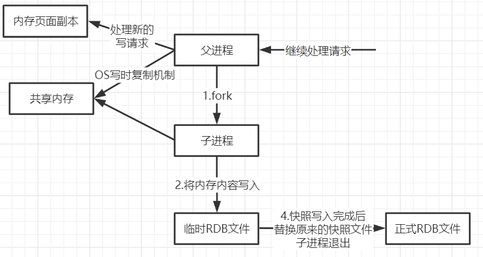

## Redis持久化

redis是内存数据库，如果不将内存的数据保存到硬盘，一旦服务器进程退出/崩溃，redis的中的数据就全部消失，所有redis提供了持久化功能

### RDB（Redis DataBase）

在指定的时间间隔内将内存中的数据集快照写入磁盘中，类似于虚拟机VMware/VBox的快照，需要恢复时将快照文件直接读取到内存中

**工作流程**：redis会单独创建（fork）一个子进程进行持久化，会先将数据写入到一个临时文件中，待持久化结束了，再用这个临时文件替换上次持久化好的文件。整个过程中，主进程是不进行任何IO操作，这确保了极高的性能，如果需要进行大规模数据恢复，且对数据恢复完整性不是非常敏感，那rdb方式比aof方式更加的高效，rdb的缺点是最后一次持久化数据可能会丢失（redis默认是rdb，一般情况下不需要修改这个配置）

**默认保存文件**：dump.rdb

#### rdb配置

~~~shell
#设置60秒修改5个值就会保存rdb文件
save 60 5
~~~

#### rdb触发机制

1. save的规则满足的情况下，会自动触发rdb规则
2. 执行flushall命令，也会触发rdb规则
3. 退出redis，也会触发rdb规则

> rdb触发后会在redis目录下生成一个 dump.rdb 文件

#### rdb文件恢复

> 使用CONFIG GET dir获取redis的目录位置
>
> 如果在该目录下存在dump.rdb文件就会读取并且自动恢复里面的数据

#### rdb优缺点

**优点**：

1. 适合大规模数据恢复
2. 对数据完整性要求不高推荐使用rdb

**缺点**：

1. 保存规则需要一定时间间隔，如果在未达到rdb规则时宕机，会丢失一部分数据
2. fork进程的适合，会占用一定的内存空间

### AOF（Append Only File）

**工作流程**：以日志的形式记录每一个写操作，将Redis执行过程的所有指令记录下来（读操作不记录），并且把目录追加到文件的后面，redis启动时就会读取aof文件把里面的所有记录的指令全部执行一次，恢复数据

**默认保存文件**：appendonly.aof

#### aof配置

~~~shell
# 手动开启aof
appendonly yes
# 每秒都会保存一次
appendfsync everysec
# 写入aof文件，不等待磁盘同步，保证数据安全性
no-appendfsync-on-rewrite no
# 执行AOF重写时，当前AOF大小
auto-aof-rewrite-percentage 100
# 执行AOF重写时，文件的最小体积
auto-aof-rewrite-min-size 64mb
~~~

#### aof文件修复

> tail appendonly.aof 
>
> 我们可以看到aof文件其实保存的是操作指令

> 如果指令存在问题，redis启动时会无法启动
>
> 我们可以通过check-aof帮我们检测修复

#### aof优缺点

**优点**：

1. 每一次修改都同步，数据完整性更加好（appendfsync always）
2. 每秒同步一次，可能会丢失一秒的数据（appendfsync everysec）
3. 从不同步，效率最高（appendfsync no）

**缺点**：

1. 相对数据文件来说，aof远大于rdb
2. 如果大数据情况下，修复速度比rdb慢，因为aof需要执行里面所有命令

### 混合持久化（4.x）

> 重启Redis是，我们很少使用rdb恢复内存状态，因为会丢失大量数据，通常使用aof作为持久化，但是aof存在性能问题，如果Redis实例很大情况下，启动需要花费很长的事件，Redis4.0就解决了这个问题，并带来了一种新的持久化选项`混合持久化`

#### 混合持久配置

~~~shell
#开启混合持久化
aof-use-rdb-preamble yes
~~~

#### 混合持久化特点

> 混合持久化重要的特点就是AOF重写，由于AOF超级好的特性里面会保存着所以Redis执行过的指令，然后再Redis重启时把所有之前执行过的命令都保存下来，这样其实有好多重复命令是多余操作，AOF会定期根据内存的最新数据生成AOF文件时将重写，及重写一刻的AOF生成一个RDB快照，然后在生成RDB的时候也会有一些操作命令的，这些命令都会背拼接上在做快照时的新的命令都写入新的AOF文件，新的文件一开始不叫appendonly.aof，等到重写完新的AOF文件才会进行改名，原子的覆盖原有的AOF文件，完成新旧两个AOF文件的替换

