# Redis-集群搭建

> 在连接Redis集群搭建之前首先具备的前置知识有Redis的安装，Redis持久化，Redis主从复制，若还没了解都可以通过阅读以下文章了解以下

[Liunx-安装Redis](https://blog.csdn.net/weixin_44642403/article/details/109539410)

[Redis-主从复制(一主二从、主从复制原理、单哨兵模式、多哨兵模式)](https://blog.csdn.net/weixin_44642403/article/details/110692692)

[Redis-持久化(RDB配置、RDB原理、AOF配置、AOF原理、混合持久化配置)](https://blog.csdn.net/weixin_44642403/article/details/110692444)

## 高可用集群

### 哨兵模式

> 其实对于一般的小型项目，利用哨兵模式+主从复制已经可以满足了，但是由于Redis是单线程应用所以在单主节点下理论上说Redis可以达到10W的并发，10W的并发对于大型互联网公司是远远不够用的

### REDIS CLUSTER

> 所以在Redis 3.0后便多了一个REDIS CLUSTER配置，即Redis集群他可以突破3.0之前只能一主多从的限制，实现多主多从，这种集群没有中心节点，可水平扩展，据官方文档称可以线性扩展到上万个节点，当前配置性能和高可用都优与哨兵模式，且配置非常简单

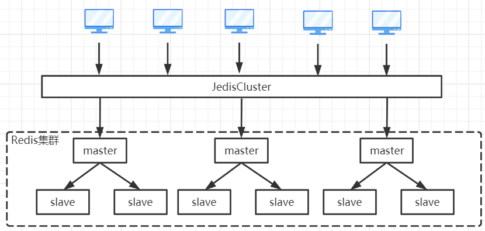

## 集群模式搭建

> 这里我演示搭建的是一个3主3从的Redis集群
>
> 首先需要准备3台Liunx，并且在3台Liunx上都安装了Redis

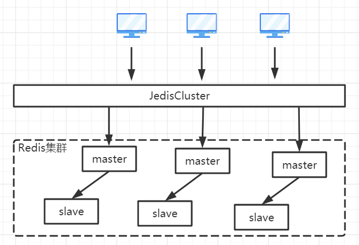

### 配置文件

> 我们需要3主3从那边就需要6个Redis服务，首先我们用创建创建好不同端口Redis的文件夹，并且在每一个文件夹里面保存一个redis.conf配置文件

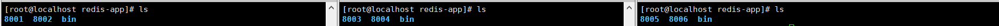

> 创建完毕后，逐个修改个个端口下的redis.conf文件，需修改内容如下，当前只拿8001端口举例其余端口以此类推，只是端口号不同

~~~shell
# 修改为后台启动
daemonize yes
# 修改端口号
port 8001
# 指定数据文件存储位置
dir /usr/local/redis-app/8001/
# 开启集群模式
cluster-enabled yes
# 集群节点信息文件配置
cluster-config-file nodes-8001.conf
# 集群节点超时间
cluster-node-timeout 15000
# 去掉bind绑定地址
# bind 127.0.0.1 -::1 (这里没写错就是家#注释掉bind配置)
# 关闭保护模式
protected-mode no
# 开启aof模式持久化
appendonly yes
# 设置连接Redis需要密码123（选配）
requirepass 123456
# 设置Redis节点与节点之间访问需要密码123（选配）
masterauth 123456
~~~

### 启动Redis

> 修改完毕后，逐个启动Reids服务，启动成功后我们可以从`ps -ef`中看到启动的Redis进程于普通的Redis进程不同之处在于后面的`[cluster]`表示当前进程是集群模式启动的

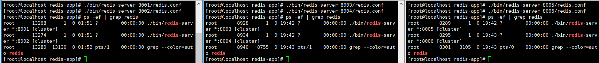

### 集群创建

> 在任意一台机器上执行如下命令，即可创建集群，执行如下命令后Redis会随机分配主从机器，并且在分配的时Redis是不会让主节点与从节点在同一台机器上的

~~~shell
# -a 密码认证，若没写密码无效带这个参数
# --cluster create 创建集群实例列表 IP:PORT IP:PORT IP:PORT
# --cluster-replicas 复制因子1（即每个主节点需1个从节点）
./bin/redis-cli -a 123456 --cluster create --cluster-replicas 1 192.168.100.101:8001 192.168.100.101:8002 192.168.100.102:8003 192.168.100.102:8004 192.168.100.103:8005 192.168.100.103:8006
~~~

> 执行命令后会让你确认配置，输入`yes`确认

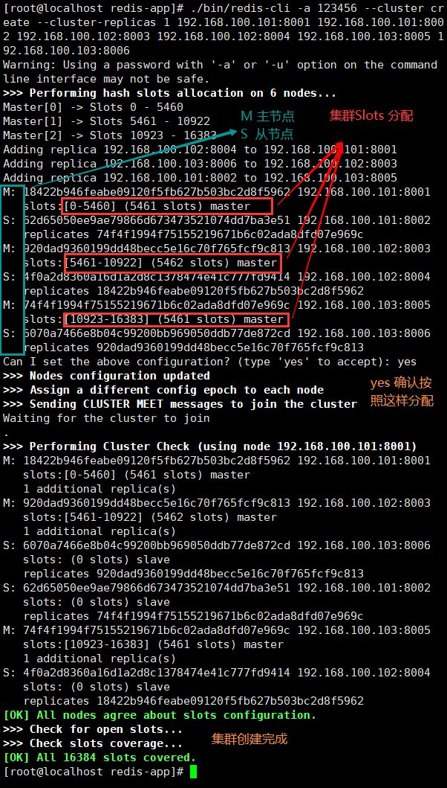

### 集群验证

**连接集群**

~~~shell
# -a 密码认证
# -c 连接集群
# -h 集群中任意一个Redis节点IP
# -p 集群中任意一个Redis节点端口
./bin/redis-cli -a 123456 -c -h 192.168.100.101 -p 8001
~~~

**查看集群信息**

~~~shell
# 登录redis-cli后执行如下命令
CLUSTER INFO
~~~

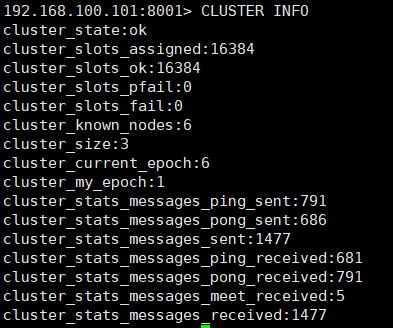

**查看节点信息**

~~~shell
# 登录redis-cli后执行如下命令
CLUSTER NODES
~~~

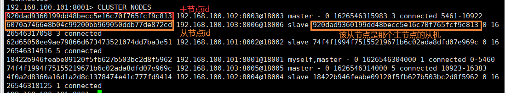

## 集群操作

### 主节点添加

#### 服务启动

> 我们对当前的3主3从进行扩容成4主4从，首先在准备多一台Liunx，并且在上面安装好Redis配置好2个Redis服务的配置文件，并且启动2个服务

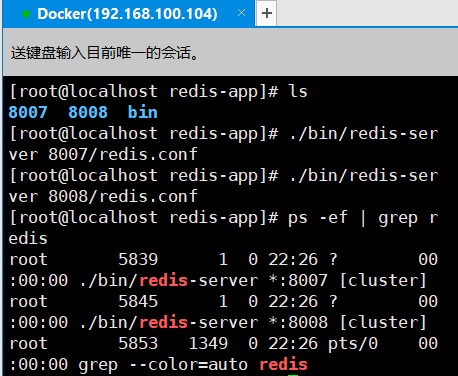

#### 添加节点

~~~shell
# 使用如下命令即可添加节点将一个新的节点添加到集群中
# -a 密码认证(没有密码不用带此参数)
# --cluster add-node 添加节点 新节点IP:新节点端口 任意存活节点IP:任意存活节点端口
./bin/redis-cli -a 123456 --cluster add-node 192.168.100.104:8007 192.168.100.101:8001
~~~

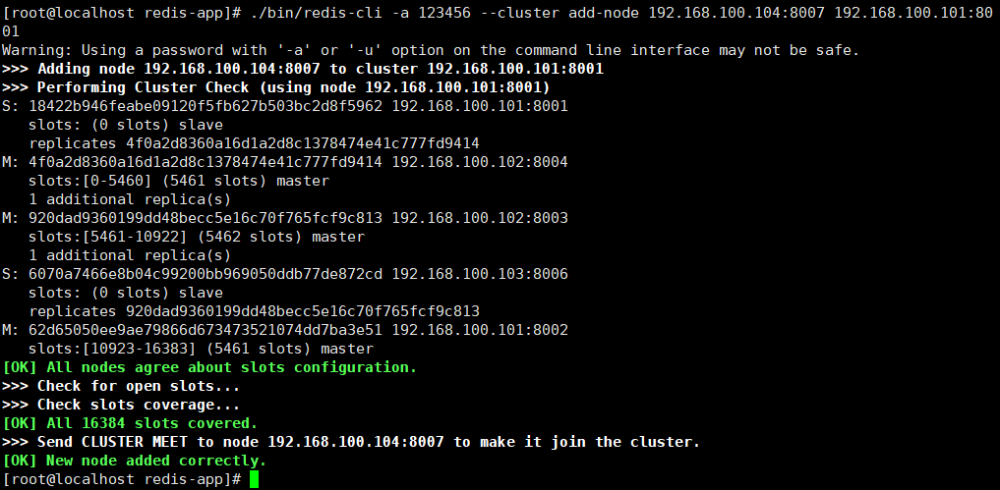

> 使用`cluster nodes`命令查看集群信息表，可以看到8007已经被添加到了新的集群中了，但是8007并且没有任何的槽位信息，这时就需要迁移槽位

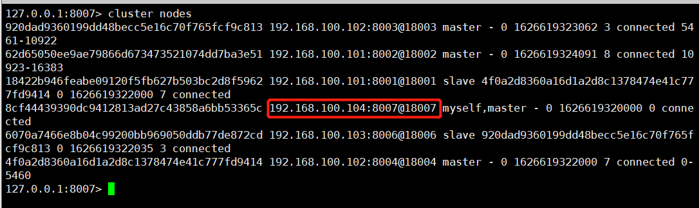

#### 槽位迁移

~~~shell
# 使用如下命令将其它主节点的分片迁移到当前节点中
# -a 密码认证(没有密码不用带此参数)
# --cluster reshard 槽位迁移 从节点IP:节点端口，中迁移槽位到当前节点中
./bin/redis-cli --cluster reshard 192.168.100.101:8002
~~~

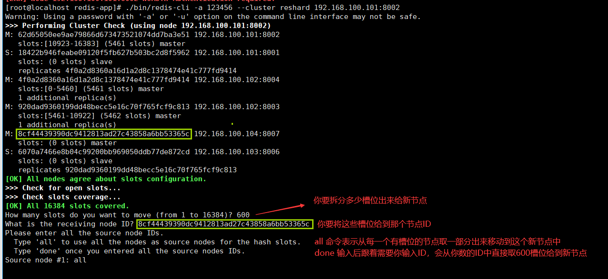

> 输入完成后会打印一片执行计划给你看，输入yes就会把槽位与数据全部迁移到新节点了

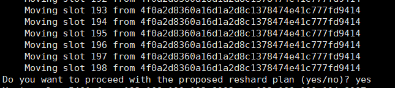

> 迁移完毕后再查看集群信息可以看到8007已经添加了槽位了

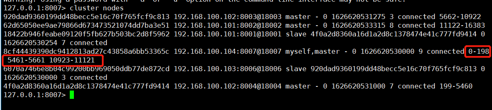

### 从节点添加

#### 添加节点

> 添加从节点首先需要先把节点添加到集群中

~~~shell
# 使用如下命令即可添加节点将一个新的节点添加到集群中
# -a 密码认证(没有密码不用带此参数)
# --cluster add-node 添加节点 新节点IP:新节点端口 任意存活节点IP:任意存活节点端口
./bin/redis-cli -a 123456 --cluster add-node 192.168.100.104:8008 192.168.100.101:8001
~~~

> 通过节点信息可以查看到8008节点已经添加进去了，但是任何的节点添加都是主节点，那么接下来我们需要把8008改成从节点

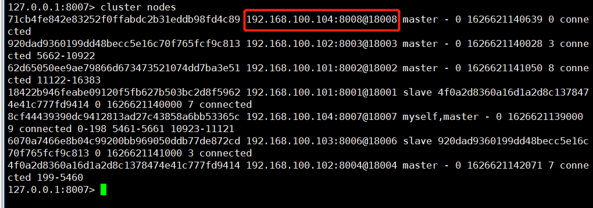

#### 配置节点

>  我们需要使用客户端命令连接到刚刚新添加的8008节点的上，并且为他设置一个主节点，设置完毕后再次查看节点信息，可以看到8008已经是8007的从节点了

~~~shell
# 连接需设为从节点的Redis服务
./bin/redis-cli -a 123456 -p 8008
# 将当前节点分配为 8cf44439390dc9412813ad27c43858a6bb53365c 的从节点
CLUSTER REPLICATE 8cf44439390dc9412813ad27c43858a6bb53365c
~~~

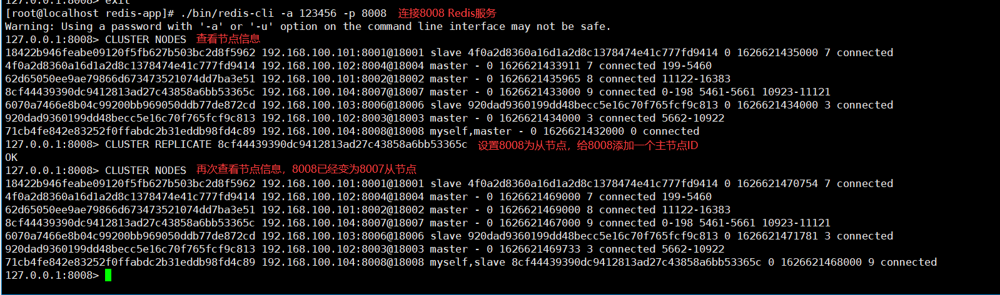

### 删除主节点

> 主节点删除就那么首先需要对槽进行迁移，如当前需要移除8007节点，那么首先需要把8007的节点槽位移动到别的节点中，才能删除

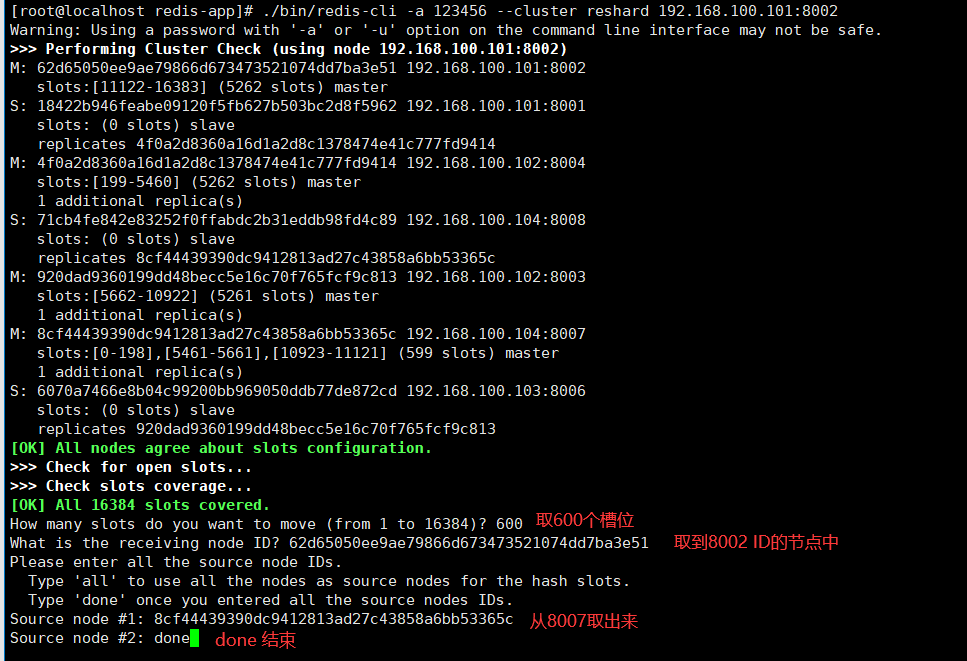

> 移完后可以看到8002的槽位增加了，8007的槽位已经没有哦

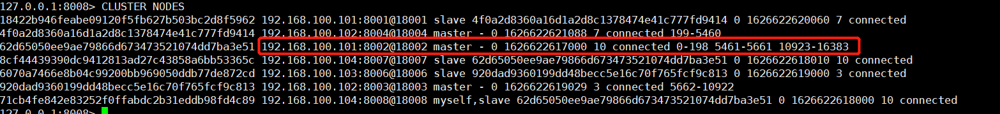

~~~shell
# 执行如下命令删除节点
# -a 密码认证(没有密码不用带此参数)
# --cluster del-node 连接任意一个存活的节点IP:连接任意一个存活的节点端口 要删除节点ID 
./bin/redis-cli -a 123456 --cluster del-node 192.168.100.101:8002 8cf44439390dc9412813ad27c43858a6bb53365c
~~~

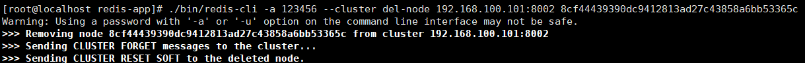

### 删除从节点

> 从节点删除比较简单，直接删除即可，现在要删除8008节点

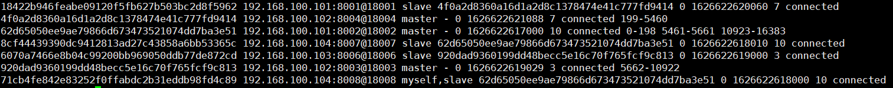

~~~shell
# -a 密码认证(没有密码不用带此参数)
# --cluster del-node 连接任意一个存活的节点IP:连接任意一个存活的节点端口 要删除节点ID 
./bin/redis-cli -a 123456 --cluster del-node 192.168.100.104:8008 71cb4fe842e83252f0ffabdc2b31eddb98fd4c89
~~~

> 删除删除成功后可以看到8008节点已经在集群中消失了

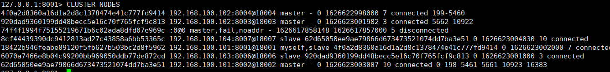

### 重新分配槽位

> `重新分配槽位慎用！！！`，该功能可以让着集群的槽位重新平均分配但是由于涉及到槽位大量迁移会导致整个Redis阻塞停止处理客户端的请求

~~~shell
# -a 密码认证(没有密码不用带此参数)
# --cluster rebalance 重新分配集群中的槽位
./bin/redis-cli -a 123456 --cluster rebalance 192.168.100.101:8002
~~~

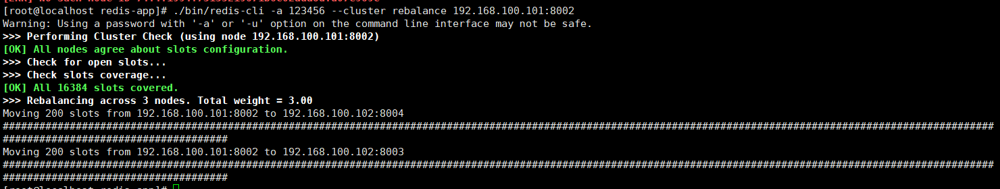

> 分配完成后可以看到所有的主节点的槽位都被重新分配了

## 使用Jedis连接集群

> 集群搭建成功后，使用Jedis连接集群并且测试

### 依赖引入

~~~xml
<dependency>
    <groupId>redis.clients</groupId>
    <artifactId>jedis</artifactId>
    <version>2.9.0</version>
</dependency>
~~~

### 代码编写

> 可以看到在使用set于get方法于普通的Redis使用并不差异

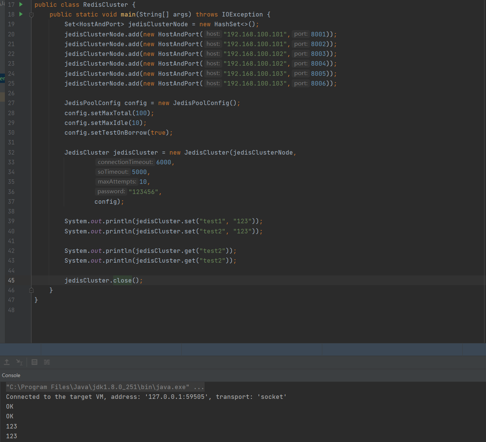

