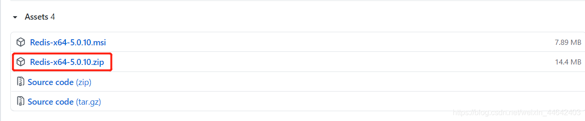
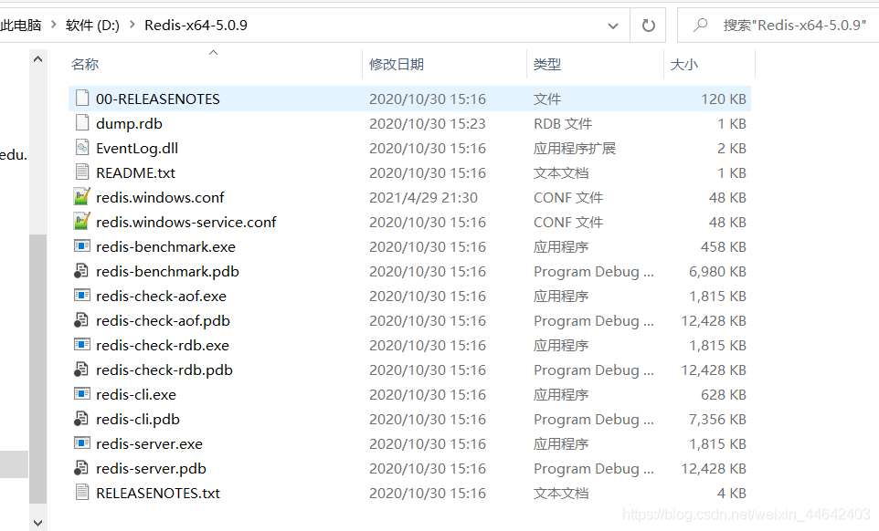
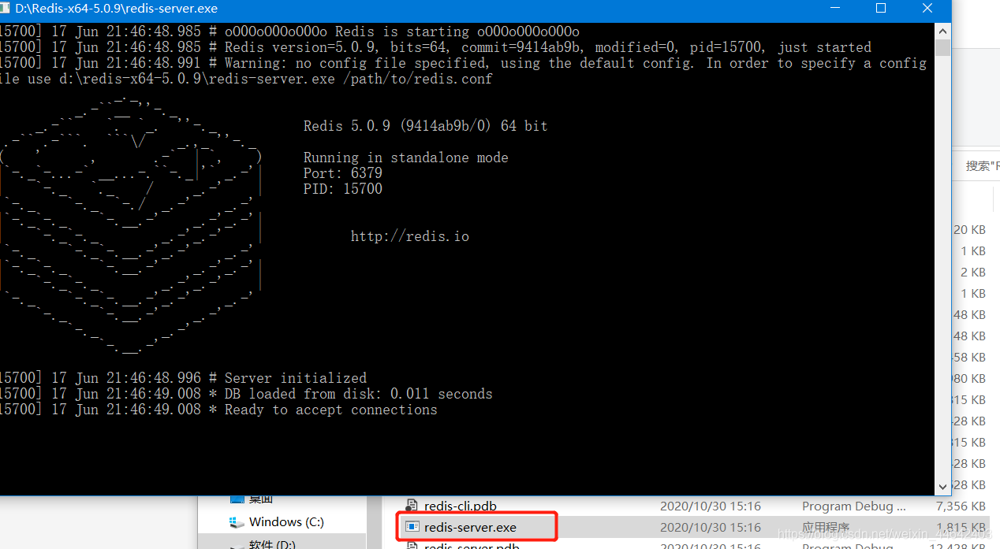
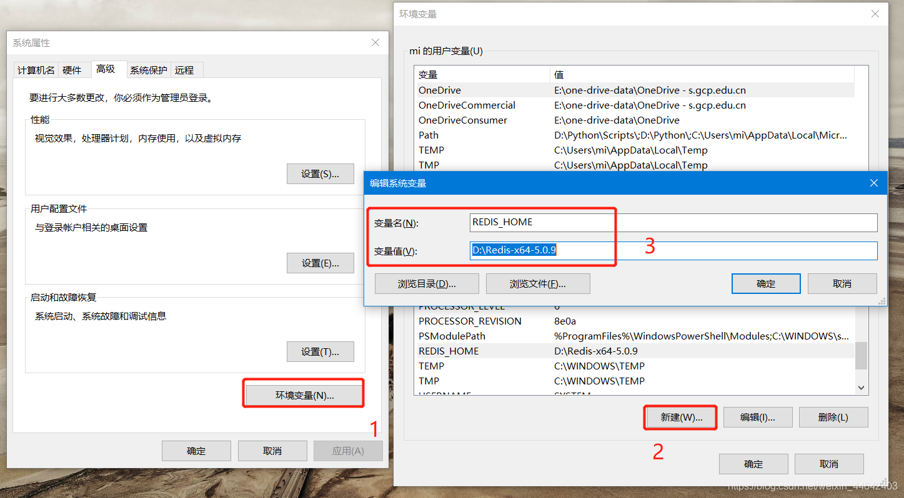
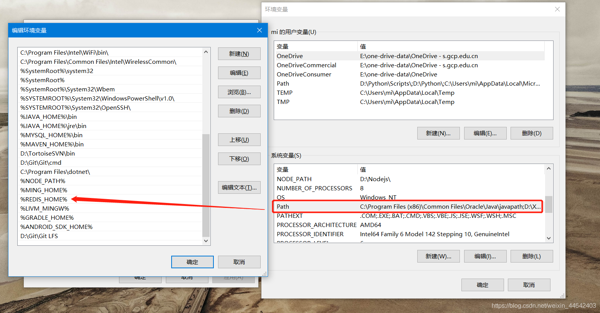
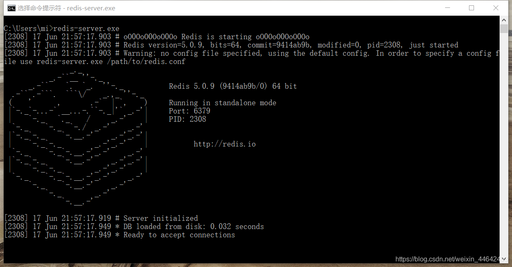
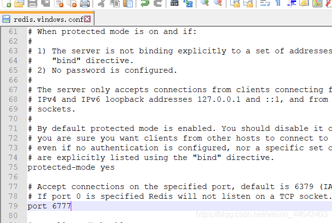
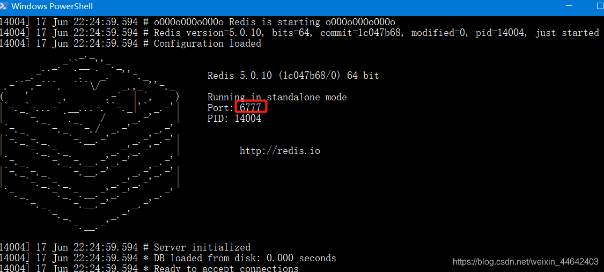

# Win10-安装Redis
## Redis下载
>Redis官网下载的都是LIunx版本的，如果需要下载Win版本需要通过Redis的github仓库下载，有64位、32位安装自己操作系统选择就行，下载`zip`即可
>
>[Win版本-Redis下载地址](Win10-安装Redis.md)

## 安装
> 将下载好的`zip`包直接解压到你喜欢的目录下，直双击`redis-server.exe`即可运行Redis
> 

### 运行
> 双击`redis-server.exe`弹出该窗口表示运行成功

## 进阶使用
> 经过上面的步骤Redis已经可以正常运行了，接下来讲一下进阶使用，如何修改配置文件、配置文件启动、环境变量配置，如果对进阶不感兴趣的可以跳过该内容
### 环境变量配置
> 普通的安装后每次启动Redis都需要进入到Redis的解压目录才能进行运行，那么通过配置系统的环境本来可以让我们不用进入Redis的没有了在任何地方都能运行Redis
> 
#### 新增环境变量
>右键我的电脑属性，进入高级设置新增一个环境变量，变量值指向的是你的Redis的解压目录
>

修改Path环境变量，在后面增加上你刚刚配置的Redis

#### 测试
> 直接打开cmd输入`redis-server.exe`就可以看到Redis运行起来了
> 

### 指定配置文件启动
> Win使用`redis-server.exe`是使用默认配置文件启动，如果我们需要指定配置文件启动就需要使用`redis-server.exe redis.windows.conf`命令

#### 修改配置文件

#### 测试

