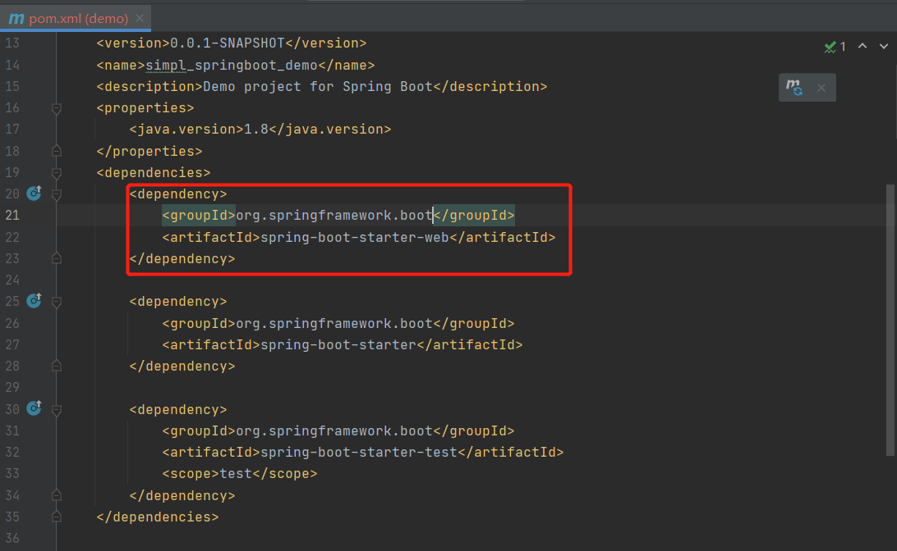
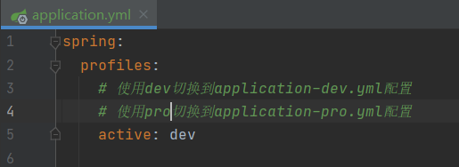
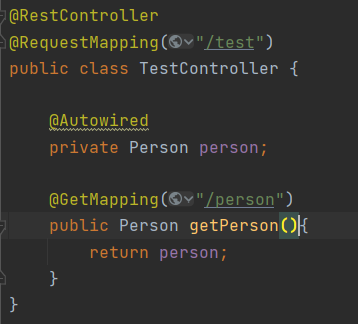

# SpringBoot基础入门

> SpringBoot是一个强大，并快捷的框架，能够快速搭建一个生产级别基于Spring的应用程序，相较于传统的SSM、SSH项目SpringBoot遵循约定大于配置使得构建项目时省去了繁琐的配置

## 项目构建

### 基于Maven构建

#### 快速构建

> 以下构建使用的是Idea构建构建，点击文件创建一个新的项目，使用spring官方构建工具进行构建

> 填写项目名称，选择jdk版本号等信息

> 下一步后会接入一个依赖选择界面，勾上对应依赖其实就是在`pom.xml`中加入该依赖，这里我选择不勾选，后期自己在`pom.xml`添加

> 下一步后确定模块名称与项目根目录，点击Finish后完成构建

#### 引入依赖

> 进入到pom文件中，引入web依赖

#### 启动项目

> 在java包下可以看到一个xxxApplication的启动类，启动main方法即可

> 当看到`Tomcat started`表示启动成功

## 项目打包

> 项目打包有2钟方式，1是打jar包，2是打war包区别如下
>
> jar包：内置tomcat，轻量级启动方式只需要使用`jar -jar xxx.jar`即可，推荐打包方式
>
> war包：不内置tomcat，启动方式需要依赖web容器(如tomcat)，比较传统的打包方式

### jar包

#### 修改pom文件

> 在pom.xml钟的build中添加如下内容

#### 执行打包命令

> 在idea的右侧，maven侧边栏中找到该项目，点击package即可打包

> 打包成功后可以看到在target目录下生成了一个jar包

### war包

#### 修改pom文件

> 需要完成如下3个操作
>
> 1. 在pom文件添加打包插件
> 2. 并且修改打包方式为war
> 3. 设置打包时排查内置tomcat依赖

#### 修改主启动类

> 继承`SpringBootServletInitializer`类，实现configure方法

#### 执行打包命令

> 在idea的右侧，maven侧边栏中找到该项目，点击package即可打包

> 打包成功后可以看到在target目录下生成了一个war包

### 特殊情况说明

#### 存在多个启动类

> 若项目存在多个启动类那么需要在pom中指定打包时的启动类

## 配置切换

> 在开发过程中，通常一个项目会使用很多套不同的配置，如开发、测速、生产等不同环境下，连接的数据库，redis，端口等都不一样，以下就叫大家如何通过profile切换不同的配置

### yml或properties文件环境切换

> 该方式yml或properties文件格式都适用，也是现在使用最普遍的方法，将原`application.yml`拷贝出2分，注意命名规则需要遵守`application-xx.yml`

#### dev与pro环境配置

> 配置好dev与pro环境中服务开发的端口分别是不同的端口

#### 配置切换方法

> 切换配置的方式有3种

 **直接修改`application.yml`使用`spring.profiles.active=dev|pro`来指定**

 **设置虚拟机参数`-Dspring.profiles.active=dev|pro来指定`**

**使用jar命令启动是指定`java -jar xxxx.jar --spring.profiles.active=dev|pro`**

### 配置读取

> 再开发过程中，有时会需要读取yml内容，来运行我们的程序

#### 修改yml

> 首先在`yml`中增加参数对象

#### 编写读取配置类

> `@ConfigurationProperties(prefix = "person")`将指定前缀的参数映射带当前类的属性中

#### 修改主启动类

> 在主启动类中将当前写好的配置类转载进入到容器中

#### 测速

> 编写一个controller进行测试，通过`Autowired`将Person注入到Controller中

> 从测试中可以看到在yml中的信息被成功读取，并且装入搭配Person对象中

## Web开发

### webJars

> 官网：https://www.webjars.org/
>
> webJars让前端资源引入，可以让前端组件管理就像引入jar包一样容易只需要通过修改pom文件来引入前端资源

#### 引入资源

> 在非前后端分离项目时，开发过程中常常需要使用到前端的一些js组件如jquery，bootstrap，这些组件都是可以 通过webJar的形式引入的

#### 测试

> 引入资源后重启项目后，可在webjars目录下访问到导入的前端资源

#### 实现原理

> 实现原理其实是在MVC层对所有的`webjars`目录请求做拦截，返回拼接好的目录

### 过滤器

> servlet三大利器之一过滤器的在SpringBoot的使用

#### 编写过滤器

> 编写一个类，继承Filter对象，实现doFilter方法

#### 编写配置类

> 编写一个配置类，需要继承WebMvcConfigurerAdapter对象，将过滤器注入到容器当中

#### 测试

> 只要访问任何请求都会执行过滤器中的doFilter方法

### 拦截器

#### 编写拦截器

> 实现HandlerInterceptor接口，并且实现该接口下的3个方法

#### 编写配置类型

> 配置类继承`WebMvcConfigurerAdapter`重写`addInterceptors`方法，从容器中获取到构建的拦截器传入到`registry`中

#### 测试

### 全局异常处理

> 全局统一异常处理是在web开发中一个很重要的功能，在前后端分离的项目下如果接口执行时发生异常那么不能直接返回保存内容给前端，需要自定义返回固定格式的Json数据，这就需要使用到全局统一异常处理

#### 编写自定义异常

> 编写一个自定义异常类，继承RuntimeException对父类构造方法进行增强

#### 编写异常处理类

> `@ControllerAdvice`指定一个全局异常处理类，使用`@ExceptionHandler`指定处理那些异常类，返回自定义格式的json数据

#### 测试

> 编写一个测试的Controller，抛出自定义的异常类

> 发送请求时，可以看到返回结果被全局异常类捕获并处理了

