# SpringBoot-集成RabbitMQ

> SpringBoot集成RabbitMQ配置十分的简单，只需要按照以下步骤完成即可

## 依赖引入

~~~xml
<dependency>
    <groupId>org.springframework.boot</groupId>
    <artifactId>spring-boot-starter-amqp</artifactId>
</dependency>
<dependency>
    <groupId>com.alibaba</groupId>
    <artifactId>fastjson</artifactId>
    <version>1.2.47</version>
</dependency>
<dependency>
    <groupId>org.projectlombok</groupId>
    <artifactId>lombok</artifactId>
</dependency>
<dependency>
    <groupId>org.springframework.amqp</groupId>
    <artifactId>spring-rabbit-test</artifactId>
    <scope>test</scope>
</dependency>
~~~

## yml配置

~~~yml
spring:
  rabbitmq:
    host: 192.168.100.101
    port: 5672
    username: admin
    password: 123
~~~

## 延迟队列案例

> 通过死信队列实现延迟消息消费的案例
>
> 创建2个队列QA与QB，两者队列的TTL分别是10S和40S，然后再创建一个交换机x和死信交换机Y，它们的类型都是direct，创建一个死信队列QD，它们相互绑定关系如下

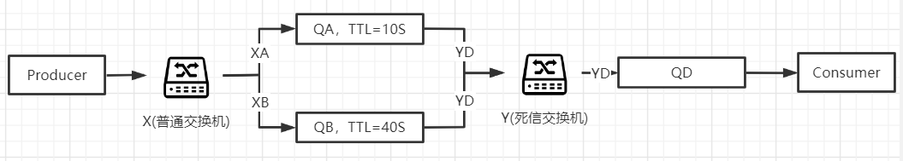

### 配置类编写

> 配置类中主要需配置的内容如下
>
> 1. 声明交换机
> 2. 声明队列，并且对普通队列配置死信交换机参数，以及ttl参数
> 3. 绑定交换机与队列之间关系

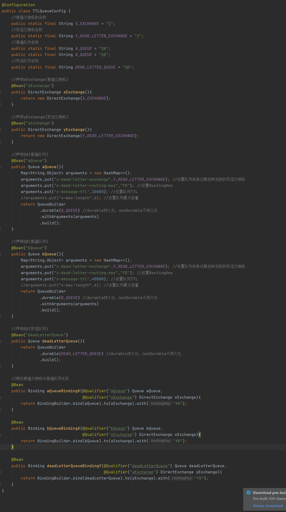

### 消息生产者

> 只要用户通过`localhost:8080/ttl/sendMsg/{消息内容}`发送get请求，后台就会将该消息内容分别发送到QA与QB队列中个一条

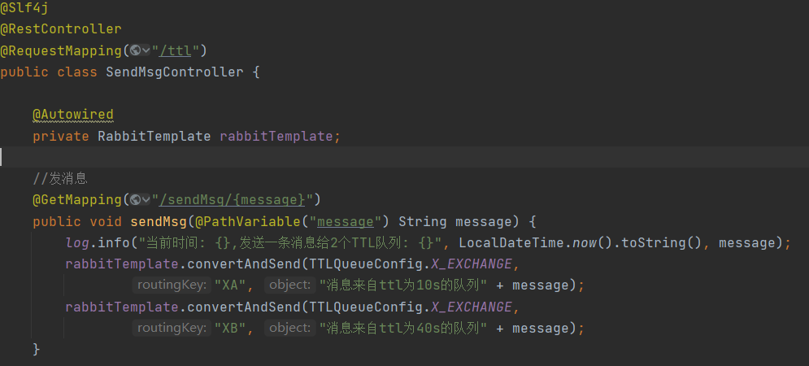

### 消息消费者

> 消费者监听QD队列中，有消息则消费，并且打印当前时间与消息内容

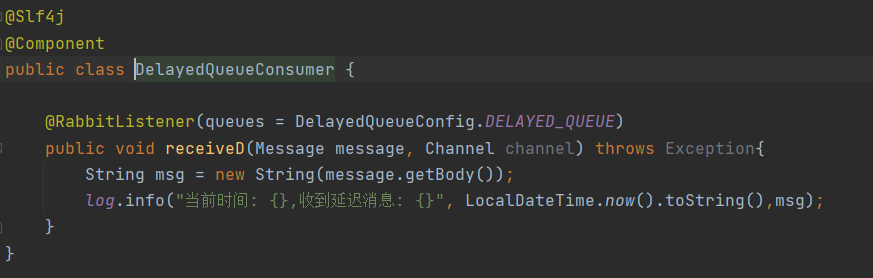

### 测试

> 使用postman发送请求

> 观察控制台日志数据，时间间隔是否正确

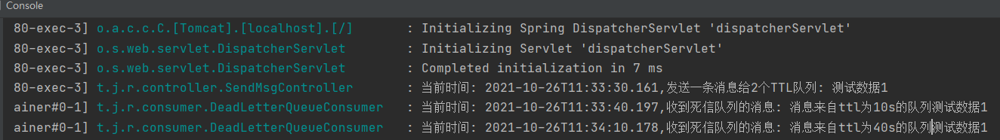

## 延迟队列案例(灵活版)

> 在上一个案例中，实现的延时队列都是固定时间的，就是只能发送2种延迟消息，分别的10s或40s显然这不够灵活只能适用于特定的业务场景，有一种更加灵活的延迟消息则是队列中不指定延迟时间，而是生产者在发送消息时指定延迟时间
>
> 我们对上面的例子进行优化增加一个QC队列，该队列不设置超时时长而是由生产者发送消息时指定超时时长

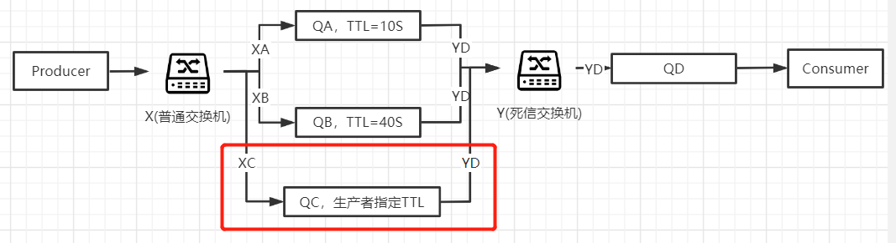

### 配置类编写

> 在上一个案例基础上增加如下内容

~~~java
public static final String C_QUEUE = "QC";

//声明QC(普通队列)
@Bean("cQueue")
public Queue cQueue(){
    Map<String,Object> arguments = new HashMap<>();
    arguments.put("x-dead-letter-exchange",Y_DEAD_LETTER_EXCHANGE); //设置队列消息过期后转发到的死信交换机
    arguments.put("x-dead-letter-routing-key","YD"); //设置RoutingKey
    return QueueBuilder
        .durable(C_QUEUE) //durable持久化、nonDurable不持久化
        .withArguments(arguments)
        .build();
}

@Bean
public Binding cQueueBindingX(@Qualifier("cQueue") Queue cQueue,
                              @Qualifier("xExchange") DirectExchange xExchange){
    return BindingBuilder.bind(cQueue).to(xExchange).with("XC");
}
~~~

### 消息生产者

> 生产者增加多一个接口，接收一个ttl参数，并且在发送消息时需要设置ttl时长

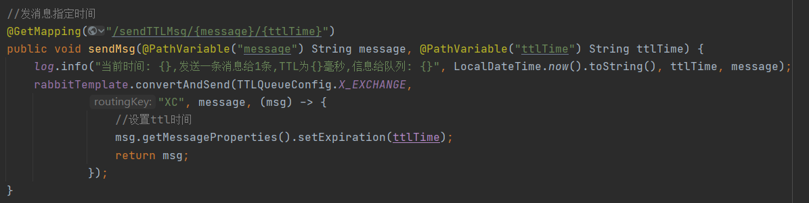

### 测试

> 消费者无需修改，重启服务后发送请求测试

> 发送消息并且指定10s延迟时间

### 缺陷

> 死信消息在做延迟队列存在一个明显的缺陷，查看如下操作
>
> 首先准备2个请求，一个发送延迟时间10s的消息，另外一个发送延迟时间为5s的消息，并且先发10s的后发5s的
>
> 首先不看结果，按照延迟消息的理解是不是应该是5s的消息先被消费，再到10s的

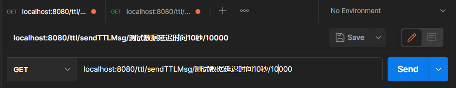

>从控制打印的日志可以看出消息并没有按照我们正常的消费被消费，而是先等待10s把最新入队的消息消费了后再获取下一条数据并且判断该数据是否达到超时时间
>
>尽管消息设置了延迟时间但是因为它们的数据结构为队列的关系，所以消息都是有向后顺序的，mq始终只会检测第一条消息是否过期，并不会因为你后面入队的消息达到超时时间而可以提前让这些超时消息出队

## RabbitMQ延迟消息插件

> 在之前的延迟队列都是利用死信队列实现的，但是存在的问题就是，如果先入队消息比后入队消息过期时间要长，那么这就会出现问题，RabbitMQ延迟消息插件可以解决这些问题

### 安装延迟队列插件

#### 下载

> [RabbitMQ官网下载插件页面](https://www.rabbitmq.com/community-plugins.html)，下载`rabbitmq_delayed_message_exchange`插件

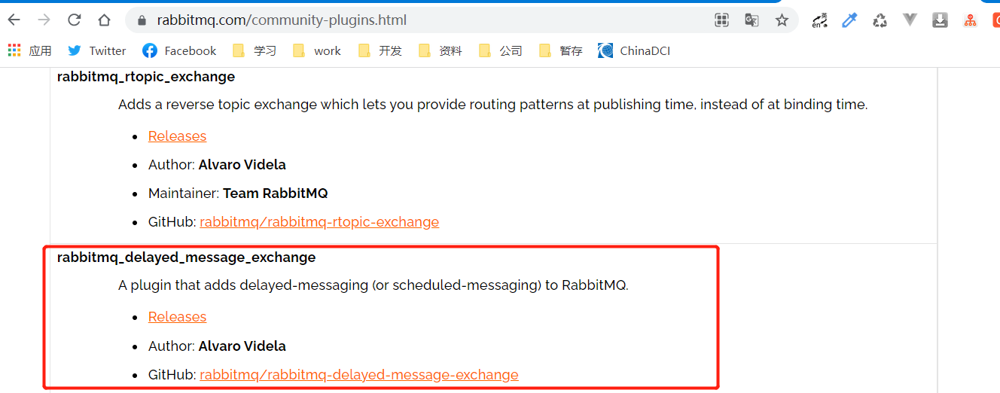

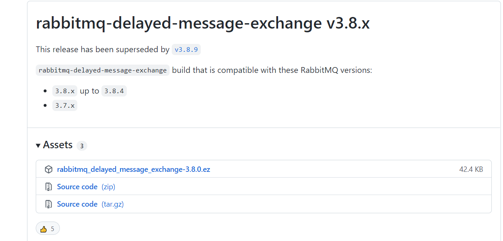

#### 安装

> 将下载好的ez安装包拷贝到liunx上，执行如下命令重启RabbitMQ完成安装

~~~shell
#进入到rabbitmq的安装目录下
cd /usr/lib/rabbitmq/lib/rabbitmq_server-3.8.16/plugins/
#将安装包拷贝到该目录下，执行如下命令安装(不用带上版本号)
rabbitmq-plugins enable rabbitmq_delayed_message_exchange
~~~

> 看到如下内容表示安装成功

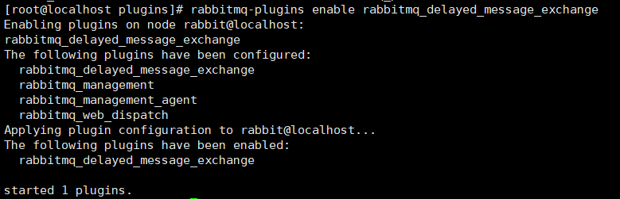

#### 重启

> 执行如下命令，重启rabbitmq服务

~~~shell
systemctl restart rabbitmq-server.service 
~~~

> 重启成功后进入到交换机的控制界面，在新增交换机中可以选择一种类型为`x-delayed-message`表示成功

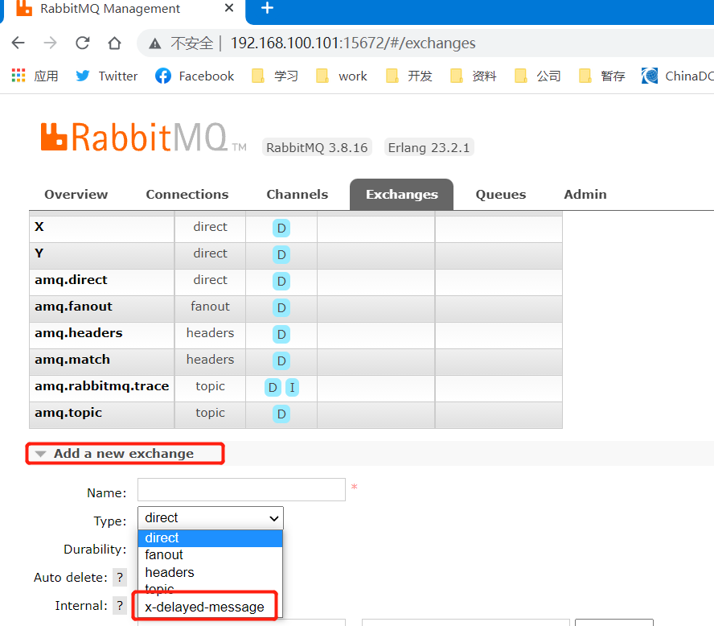

### 延迟队列插件案例

> 基于插件的延迟队列与之前的方式有很大的区别，之前的消息是堆积在一个无消费者的队列中等待过期进入死信队列，然而现在消息是堆积在交换机中交换机会观察所以消息的ttl时间，当有消息的ttl时间达到了才会将该消息推入到一个队列，该队列有消费者直接消费

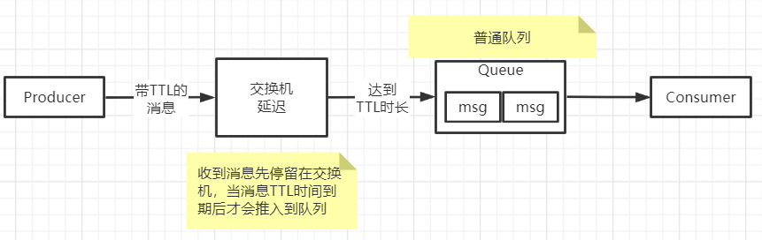

#### 准备配置类

> 交换机声明时与平时不一样，其余配置都是一致的

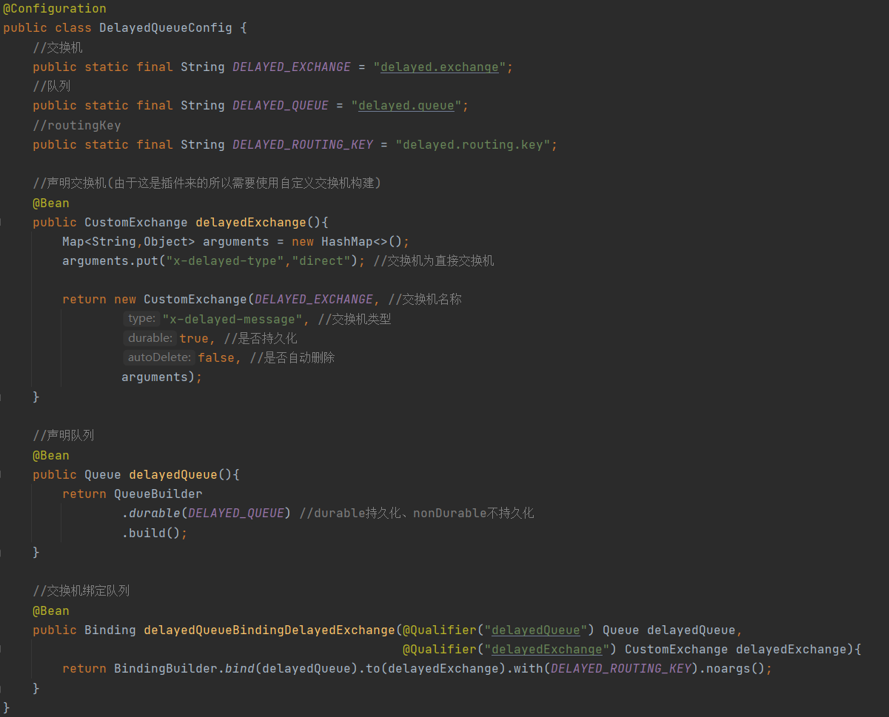

#### 消息生产者

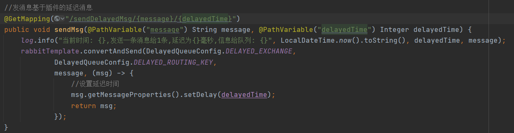

#### 消息消费者

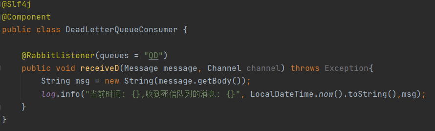

#### 测试

> 分别向发送2条消息，先发10s延迟后发5s延迟的消息，并且观察控制台

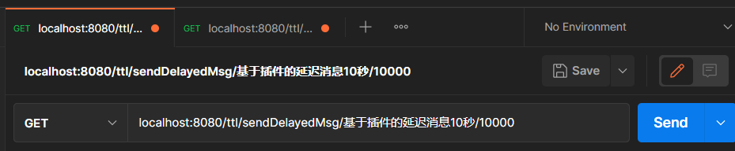

> 从控制台可以看到，不管消息的先后顺序只要达到延迟时间后消息就会被消费者消费

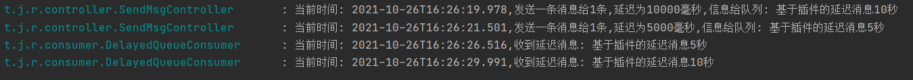

## 发布确认高级内容

> 在生产环境中由于某种不明原因，导致rabbitmq重启，在重启期间生产者消息投机失败导致消息丢失，需要手动处理和恢复，以下就介绍如何才能进行rabbitmq的消息可靠投递，无法投递消息该如何处理

### 问题分析

> rabbitmq消息丢失的情况
>
> 1. 交换机不可用，导致生产者发送消息根本未被接收导致消息丢失
> 2. 队列不可用，假定交换机是可用的，可以正常的接收消息交换机收到消息后会将消息缓存下来根据routingKey向队列推送消息，并且删除缓存中已推送的消息，如队列不可以着无法接收到消息，导致消息丢失

### 模型搭建

> 搭建一个简单的模型，来演示解决以上分析的问题

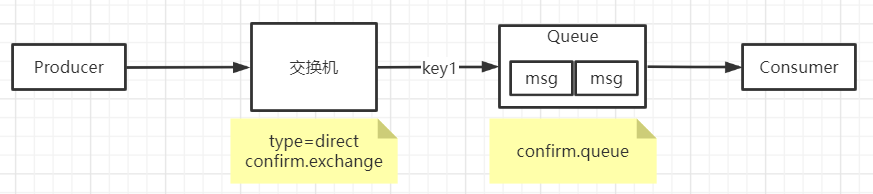

#### 配置类编写

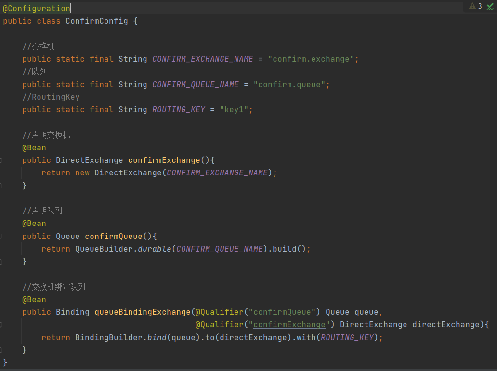

#### 消息生产者

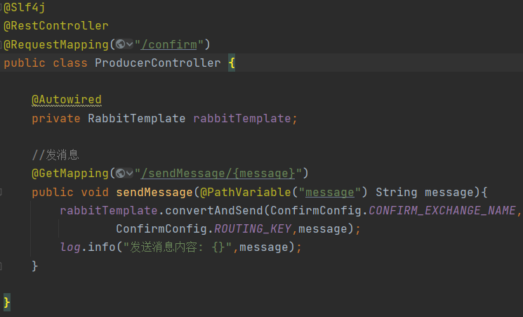

#### 消息消费者

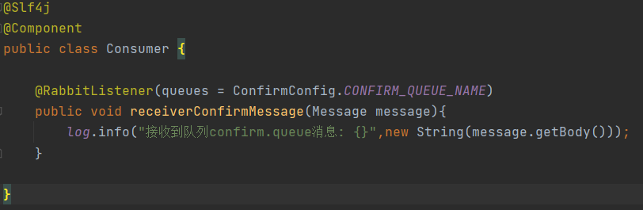

#### 测试

> 测试生产者能够成功发送消息，消费者也能够成功接收消息

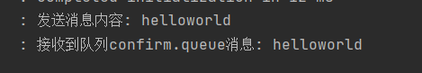

### 交换机不可用解决

> 在前面的模型中，在生产者发送消息后是无法知道消息是否发送成功的，生产者只知道消息已经发出去了，如果这时交换机不可以那么就会导致消息丢失，mq提供了一个发送消息后回调事件给我们，该回调里面指明了发出去的消息是否被交换机成功的接收，我们只需要实现这个回调即可

#### 修改yml

> 默认发布确认模式是关闭的，需要去配置文件中开启，设置为交换机模式
>
> publisher-confirm-type有2个参数，correlated与simple
>
> 1. correlated(异步确认)：发布消息到交换机成功后触发RabbitTemplate.ConfirmCallback回调
> 2. simple(同步确认)：测试效果与correlated 会一样触发回调，并且在发送消息成功后可以使用rabbitTemplate的waitForConfirms或waitForConfirmsOrDie方法等待broker节点返回发送结构，根据返回结果判断下一步逻辑，要注意的是如果waitForConfirmsOrDie方法返回false则会关闭channel，接下来无法发送消息到broker

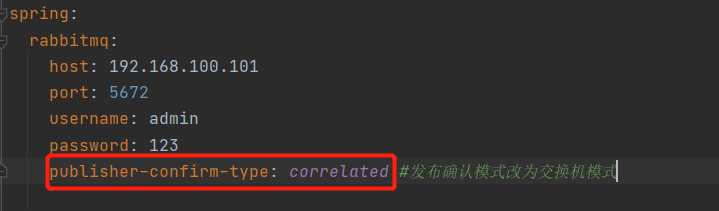

#### 编写回调

> 在RabbitTemplate类中有一个回调接口，当交换机收到消息或者未收到消息都会回调该接口，该接口提供3个参数
>
> 1. CorrelationData：由生产者发送消息时自己附带的对象，若发送时未指定收到的是null
> 2. ack：true表示接收成功，false表示接收失败
> 3. cause：异常原因(在ack=false时才会有内容，其余为null)

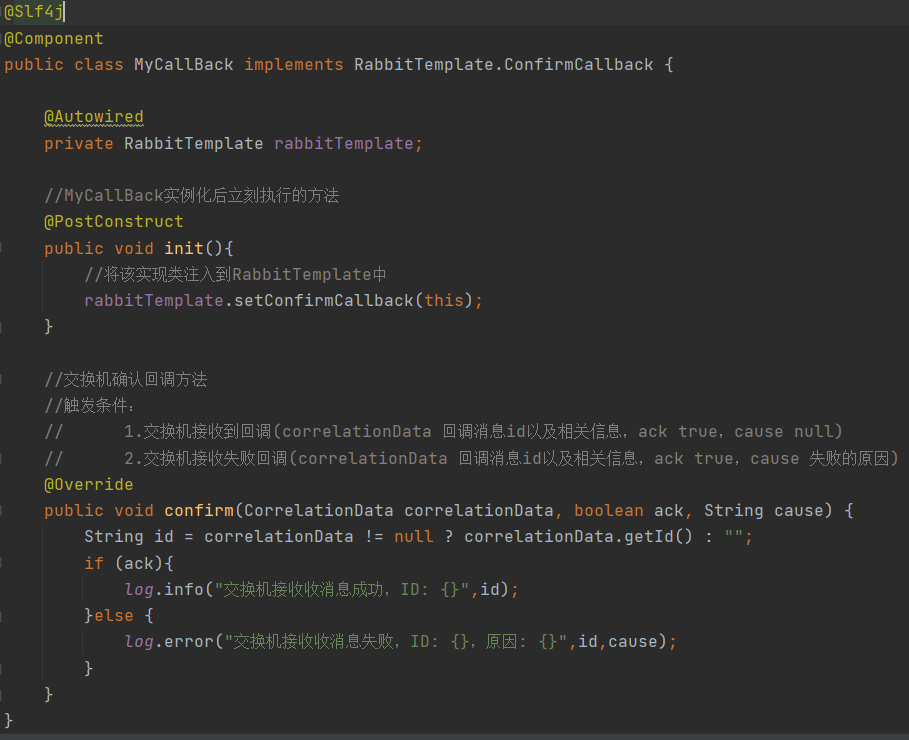

#### 修改消息生产者

> 可以看到在回调方法中有一个CorrelationData对象，这个对象正常情况下是没有任何东西的，需要生产者发送消息时带上，回调中才会有该对象，所以需要改造一下消息生产者在发消息时发送CorrelationData，传入id等自定义的参数

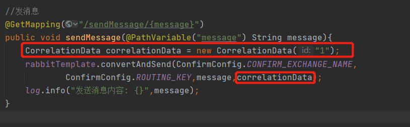

#### 测试

**正常发送消息**

> 从测试中可以看到回调方法被正常的执行，并且`correlationData.id`也是发消息时携带的`1`

**发送消息到不存在的交换机**

> 修改消息生产者，将消息发送到一个不存在的交换机上查看是否还是触发回调

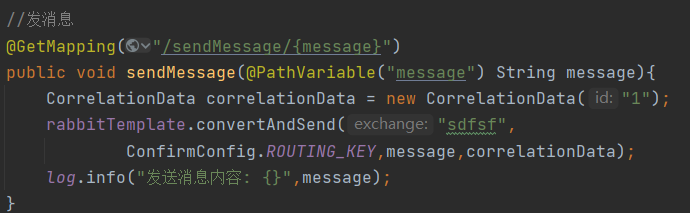

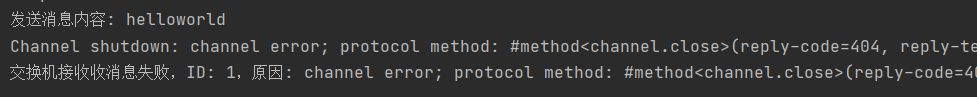

**发送消息到不存在的RoutingKey**

> 修改消息生产者，将消息发送到一个存在的交换机但是RoutingKey不存在查看是否还是触发回调

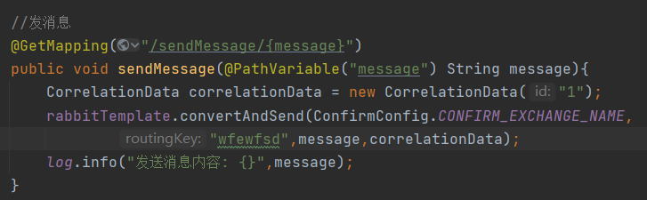

> 交换机显示成功接收但是消费未能打印出消费信息，因为routingkey绑定的队列根本不存在，所以消息还是丢失了，接下来则说明如何解决该问题

### 队列不可用解决

#### Mandatory参数

> 在仅开启了生产者确认机制的情况下，交换机收到消息后，会直接给消息生产者发送确认消息，如果发现该消息不可路由，那么消息会被丢弃，此时生产者是不知道这个消息被丢弃的，通过设置Mandatory参数可以在当消息传递过程中不可达目的地将消息返回给生产者

#### 修改yml

> 首先去yml中开启消息回退功能

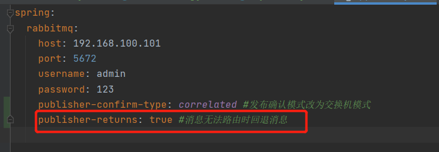

#### 编写回调

> 在RabbitTemplate类中有一个回调接口，`消息无法到达目的地时会执行该回调`

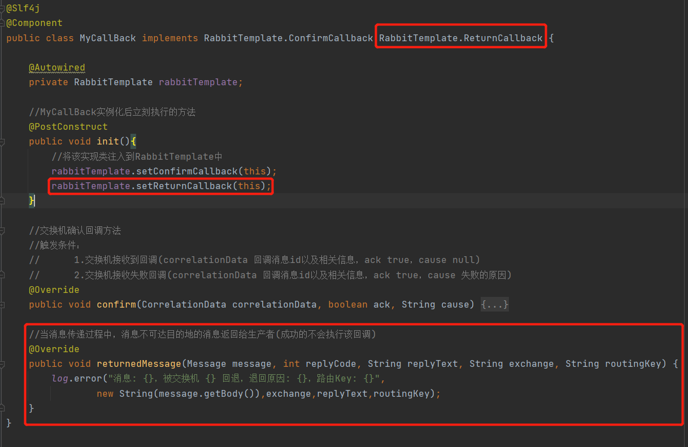

#### 修改消息生产者

> 修改生产者代码，生产者交换机是正确的，路由是错误的

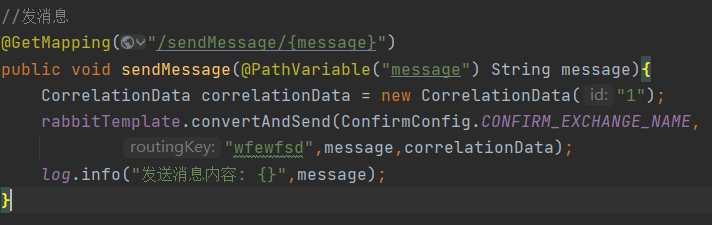

#### 测试

> 从测试结果可以看到，交换机是能成功接收，但是由于无法路由的缘故所以消息被退回，执行了RabbitTemplate.ReturnCallback的回调

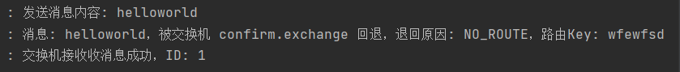

### 备份交换机

> 交换机备份也可以队列不可用的问题，工作流程当一个生产者发送一条消息时，当这条消息无法被路由到队列时，这消息就会被推到备用交换机上，备用交换机是一个广播交换机拥有2个队列，1备份队列(用于存储和备份消息)，2告警队列(用于发送告警信息)
>
> 在原有的基础上进行改造增加备用交换机，以及备份队列与告警队列，和2个消费者

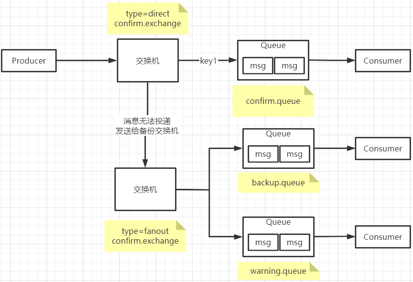

#### 修改配置类

> 在原配置基础上，上面备份交换机与备份队列、告警队列
>
> 为原交换机设置备份交换机

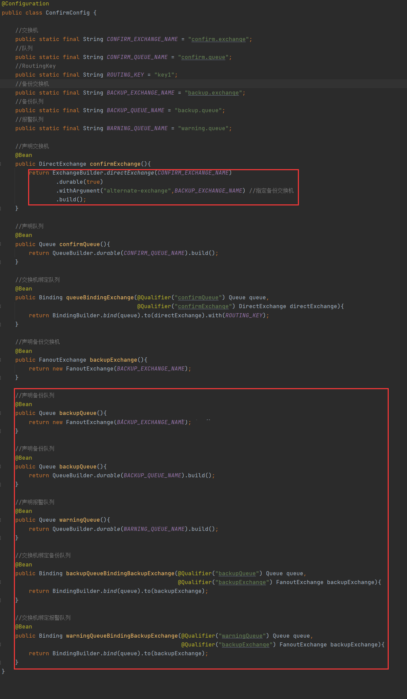

#### 消息消费者

> 编写一个报警消息的消费者，打印无法投递消息
>
> 备份消息消费者也是同样的编写不过业务可能不同，备份消息消费者需要对消息存储重发

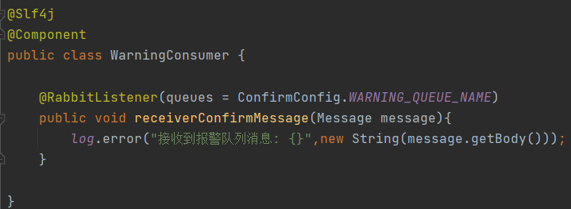

#### 测试

> 由于修改了原交换机增加了备份交换机所以启动前需要先去到后台管理界面把原交换机删除掉

**发送消息到不存在的RoutingKey**

> 发送一条无法路由的消息，可以看到消息已经被转发到备份交换机了
>
> `注意：可以发送如果同时配置了Mandatory(消息回退)与备份交换机最终只会执行备份交换机，没有执行消息回退的回调`

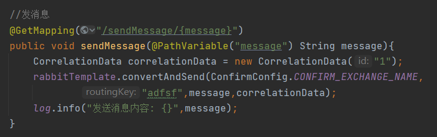

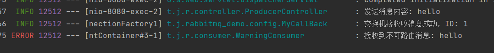

