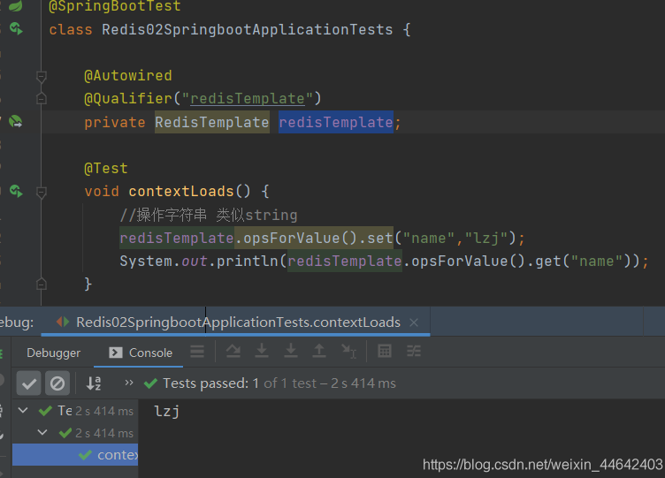

# SpringBoot-集成Redis

> SpringBoot集成Redis配置十分的简单，只需要按照以下步骤完成即可

## 依赖引入

~~~xml
<!--redis-->
<dependency>
    <groupId>org.springframework.boot</groupId>
    <artifactId>spring-boot-starter-data-redis</artifactId>
</dependency>

<!--spring2.x集成redis所需common-pool2-->
<dependency>
    <groupId>org.apache.commons</groupId>
    <artifactId>commons-pool2</artifactId>
</dependency>

<!--redis序列化工具类-->
<dependency>
    <groupId>com.fasterxml.jackson.core</groupId>
    <artifactId>jackson-databind</artifactId>
</dependency>
~~~

## yml配置

~~~yml
spring:
  redis:
    #redis服务地址
    host: localhost
    #redis连接端口
    port: 6379
    #redis数据库索引
    database: 0
    #连接超时时间(毫秒)
    timeout: 1800000
    lettuce:
      pool:
        #连接池最大连接数(使用负数表示不限制)
        max-active: 20
        #最大阻塞等待时间(使用负数表示不限制)
        max-wait: -1
        #最大空闲连接
        max-idle: 5
        #最小空闲连接
        min-idle: 0
~~~

## 添加Redis配置类

~~~java
@EnableCaching
@Configuration
public class RedisConfig extends CachingConfigurerSupport {

    @Bean
    public RedisTemplate<String, Object> redisTemplate(RedisConnectionFactory factory) {
        RedisTemplate<String, Object> template = new RedisTemplate<>();
        template.setConnectionFactory(factory);

        Jackson2JsonRedisSerializer jackson2JsonRedisSerializer = new Jackson2JsonRedisSerializer(Object.class);

        ObjectMapper mapper = new ObjectMapper();
        mapper.setVisibility(PropertyAccessor.ALL, JsonAutoDetect.Visibility.ANY);
        mapper.activateDefaultTyping(LaissezFaireSubTypeValidator.instance, ObjectMapper.DefaultTyping.NON_FINAL, JsonTypeInfo.As.PROPERTY);

        jackson2JsonRedisSerializer.setObjectMapper(mapper);
        //string的序列化
        StringRedisSerializer stringRedisSerializer = new StringRedisSerializer();
        //key采用string的序列化方式
        template.setKeySerializer(stringRedisSerializer);
        //hash的key也采用string的序列化方式
        template.setHashKeySerializer(stringRedisSerializer);
        //value序列化方式采用jackson
        template.setValueSerializer(jackson2JsonRedisSerializer);
        //hash的value序列化方式采用jackson
        template.setHashValueSerializer(jackson2JsonRedisSerializer);
        template.afterPropertiesSet();
        return template;
    }

    @Bean
    public CacheManager cacheManager(RedisConnectionFactory factory) {
        RedisSerializer<String> redisSerializer = new StringRedisSerializer();
        Jackson2JsonRedisSerializer jackson2JsonRedisSerializer = new Jackson2JsonRedisSerializer(Object.class);
        //解决查询缓存转换异常的问题
        ObjectMapper om = new ObjectMapper();
        om.setVisibility(PropertyAccessor.ALL, JsonAutoDetect.Visibility.ANY);
        om.enableDefaultTyping(ObjectMapper.DefaultTyping.NON_FINAL);
        jackson2JsonRedisSerializer.setObjectMapper(om);
        // 配置序列化（解决乱码的问题）,过期时间600秒
        RedisCacheConfiguration config = RedisCacheConfiguration.defaultCacheConfig()
                .entryTtl(Duration.ofSeconds(600))
                .serializeKeysWith(RedisSerializationContext.SerializationPair.fromSerializer(redisSerializer))
                .serializeValuesWith(RedisSerializationContext.SerializationPair.fromSerializer(jackson2JsonRedisSerializer))
                .disableCachingNullValues();
        RedisCacheManager cacheManager = RedisCacheManager.builder(factory)
                .cacheDefaults(config)
                .build();
        return cacheManager;
    }

}
~~~

## 测试

