# SpringBoot-集成Shiro

> 任何涉及到用户的系统都需要权限控制，目前权限控制有2大框架`Shiro`与`SpringScurity`，Shiro是一个简单易上手的权限控制框架，在[Shiro框架入门到精通](../JAVA专栏/Shiro框架.md)中对Shiro框架的核心思想，以及认证授权流程进行了学习后，接下来本片博客就讲解如何把Shiro集成到SpringBoot中

## 业务分析

### 权限控制

> 首先我们要对权限控制的业务进行分析得出
>
> 1. 资源需要分`公共资源`与`受限资源`
>    * 公共资源：无需认证即可访问的页面，如login页面，一些css文件，js文件
>    * 受限资源：需认证授权后才能访问，如个人中心，我的门户，我的菜单
> 2. 客户端所有的Request都需要经过Shiro，这样shiro才能判断这些发起请求的用户是否已经通过了认证，`ShiroFliter`就可以拦截用户请求，并且在`ShiroFliter`中需要获取`SecurityManager`对用户进行认证

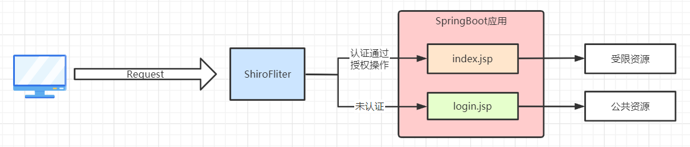

### 注册与登录

> 由于需要对权限控制，判断那些是合法用户所以需要制作注册登录功能，通过以下流程图可以看到，有4个资源是公共资源，无需登录即可访问的分别是`rehister.jsp页面、user/register请求、login.jsp页面、user/login请求`

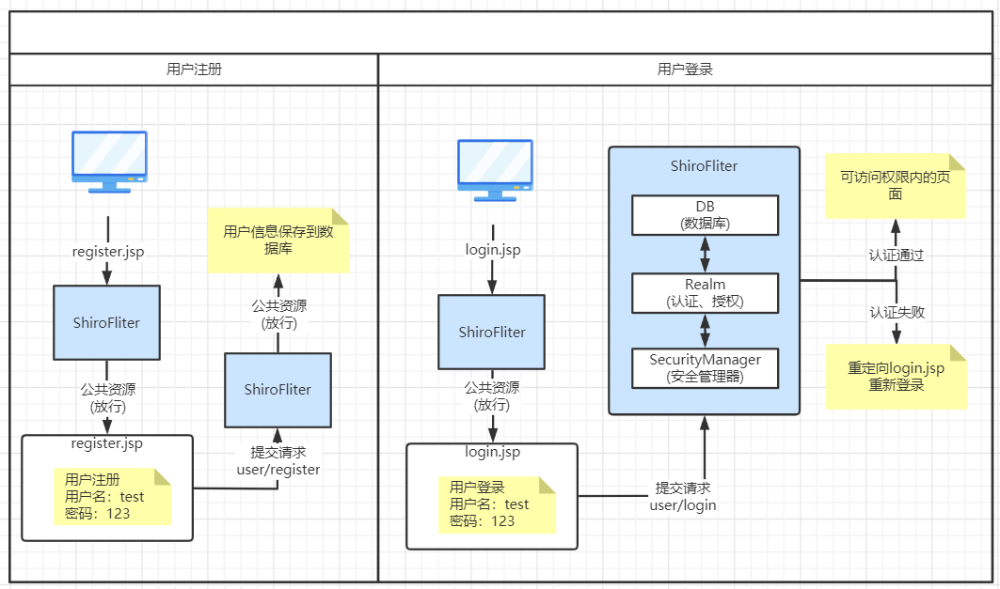

## 依赖引入

~~~xml
<!--Shiro依赖-->
<dependency>
    <groupId>org.apache.shiro</groupId>
    <artifactId>shiro-spring-boot-web-starter</artifactId>
    <version>1.7.1</version>
</dependency>
<!--引入jsp解析依赖-->
<dependency>
    <groupId>org.apache.tomcat.embed</groupId>
    <artifactId>tomcat-embed-jasper</artifactId>
</dependency>
<dependency>
    <groupId>jstl</groupId>
    <artifactId>jstl</artifactId>
    <version>1.2</version>
</dependency>
<!--引入Mybatis依赖-->
<dependency>
    <groupId>org.mybatis.spring.boot</groupId>
    <artifactId>mybatis-spring-boot-starter</artifactId>
    <version>2.1.4</version>
</dependency>
<!--引入Mysql依赖-->
<dependency>
    <groupId>mysql</groupId>
    <artifactId>mysql-connector-java</artifactId>
</dependency>
<!--阿里巴巴druid-->
<dependency>
    <groupId>com.alibaba</groupId>
    <artifactId>druid</artifactId>
    <version>1.2.4</version>
</dependency>
~~~

## 认证实现

### 数据库表设计

~~~sql
create table users
(
    id       int auto_increment comment '主键'
        primary key,
    password varchar(64) null comment '用户名',
    username varchar(64) null comment '密码',
    salt     varchar(64) null comment '盐'
);
~~~

### Spring配置文件

~~~properties
#设置服务端口号
server.port=8585
#服务在/shiro路径下
server.servlet.context-path=/shiro
spring.application.name=shiro

#配置MVC使用JSP
spring.mvc.view.prefix=/
spring.mvc.view.suffix=.jsp

#数据库连接池配置
spring.datasource.type=com.alibaba.druid.pool.DruidDataSource
spring.datasource.driver-class-name=com.mysql.cj.jdbc.Driver
spring.datasource.url=jdbc:mysql://localhost:3306/shiro?characterEncoding=UTF-8
spring.datasource.username=root
spring.datasource.password=123456

#Mybatis扫描包
mybatis.type-aliases-package=top.jolyoulu.springboot_jsp_shiro.entity
mybatis.mapper-locations=classpath:top/jolyoulu/mapper/*.xml

#dao打印debug日志查看sql语句
logging.level.top.jolyoulu.springboot_jsp_shiro.dao=debug
~~~

### Shrio配置

#### CustomerRealm

> 当前内容只讲`认证`所以自定义Realm只实现了`doGetAuthenticationInfo`方法，授权在后面会讲到在当前`Realm`基础上修改

~~~java
public class CustomerRealm extends AuthorizingRealm {

    @Autowired
    private UserService userService;

    @Override
    protected AuthorizationInfo doGetAuthorizationInfo(PrincipalCollection principals) {
        return null;
    }

	//用户认证时会调用该方法
    @Override
    protected AuthenticationInfo doGetAuthenticationInfo(AuthenticationToken token) throws AuthenticationException {
        //获取到用户的身份信息(用户名)
        String principal = (String) token.getPrincipal();
        //根据用户身份信息去数据库查询用户密码与盐
        User user = userService.findByUserName(principal);
        if (user != null){
            //封装到SimpleAuthenticationInfo返回
            return new SimpleAuthenticationInfo(
                    principal,
                    user.getPassword(),
                    ByteSource.Util.bytes(user.getSalt()),
                    this.getName());
        }
        return null;
    }
}
~~~

#### ShiroConfig

> 由于项目部署的是SpringBoot项目所以需要将来Shiro的`ShiroFilter(过滤器)、SecurityManager(安全管理器)、Realm(认证与授权实现)`注入到Bean工厂中
>
> ShiroFilterFactoryBean：过滤器，ShiroFilter会捕获所有发送到后台的请求，并且根据配置好的`受限资源、公共资源`区分那些请求是可以被匿名访问，那些请求是需要认证，根据配置好的`安全管理器`对当前请求进行认证
>
> DefaultWebSecurityManager：注意由于是Web项目这里使用的是`DefaultWebSecurityManager`这种安全管理器才能起作用
>
> Realm：`CustomerRealm`自定义实现了认证与授权，并且由于默认凭证匹配器过于简单所以修改为md5+Hash凭证匹配器，当然在保存用户密码时也需要对密码md5+hash加密

~~~java
@Configuration
public class ShiroConfig {

    //创建ShiroFilter
    @Bean("shiroFilterFactoryBean")
    public ShiroFilterFactoryBean getShiroFilterFactoryBean(){
        ShiroFilterFactoryBean shiroFilterFactoryBean = new ShiroFilterFactoryBean();
        //给Filter设置安全管理器
        shiroFilterFactoryBean.setSecurityManager(this.getDefaultSecurityManager());
        //配置系统受限资源 与 公共资源
        Map<String,String> map = new HashMap<>();
        map.put("/user/login","anon"); //anon 公共资源
        map.put("/user/register","anon"); //anon 公共资源
        map.put("/register.jsp","anon"); //anon 公共资源
        map.put("/**","authc"); //authc 请求这个资源需要认证和授权
        shiroFilterFactoryBean.setFilterChainDefinitionMap(map);
        //配置认证界面的路径
        shiroFilterFactoryBean.setLoginUrl("/login.jsp");
        return shiroFilterFactoryBean;
    }

    //创建安全管理器
    @Bean
    public DefaultWebSecurityManager getDefaultSecurityManager(){
        DefaultWebSecurityManager defaultSecurityManager = new DefaultWebSecurityManager();
        defaultSecurityManager.setRealm(this.getRealm());
        return defaultSecurityManager;
    }

    //创建自定义realm
    @Bean
    public Realm getRealm(){
        CustomerRealm customerRealm = new CustomerRealm();
        //修改凭证匹配器对加密后代码密码匹配 MD5+盐+hash
        HashedCredentialsMatcher hashedCredentialsMatcher = new HashedCredentialsMatcher();
        hashedCredentialsMatcher.setHashAlgorithmName("md5");
        hashedCredentialsMatcher.setHashIterations(1024);
        customerRealm.setCredentialsMatcher(hashedCredentialsMatcher);
        return customerRealm;
    }
}
~~~

#### 常见过滤器

| 配置缩写          | 对应的过滤器                  | 说明                                                         |
| ----------------- | ----------------------------- | ------------------------------------------------------------ |
| anon(常用)        | AnonymousFilter               | 指定url可以匿名访问                                          |
| authc(常用)       | FormAuthenticationFilter      | 指定url需要form表单登录，默认会从请求中获取`username、password、rememberMe`等参数并尝试登录，如果登录不来就会跳转到loginUrl配置的路径，我们可以用这个过滤器做默认的登录逻辑，但是一般都是自己在控制器写登录逻辑的，所以这个很少用 |
| authBasic         | BasicHttpAuthenticationFilter | 指定url需要basic登录                                         |
| logout            | LogoutFilter                  | 登出过滤器，配置指定url就可以实现退出功能，非常方便          |
| noSessionCreation | NoSessionCreationFilter       | 禁止创建会话                                                 |
| perms             | PermissionAuthorizationFilter | 需要指定权限才能访问                                         |
| port              | PortFilter                    | 需要指定端口才能访问                                         |
| rest              | HttpMethodPermissionFilter    | 将http请求方法转化成相应的动词来构造一个权限字符串，这个感觉意义不大，有下去自己看源码注释 |
| roles             | RolesAuthorizationFilter      | 需要指定角色才能访问                                         |
| ssl               | SslFilter                     | 需要https请求才能访问                                        |
| user              | UserFilter                    | 需要已登录或者“记住我”的用户才能访问                         |

### user

> user实体类，对应数据库的users表结构

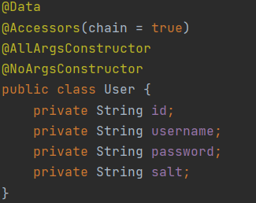

### UserDao与UserDao.xml

> 并且2个保存用户信息，与根据用户名查询用户信息的SQL实现

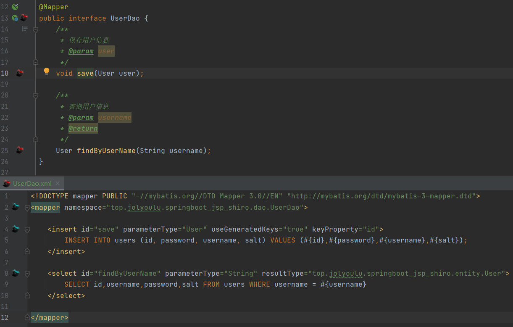

### SaltUtils

> 随机盐生成器，在注册用户信息时需要调用该方法获取随机盐，当然如果觉得麻烦也可以自己传固定的盐

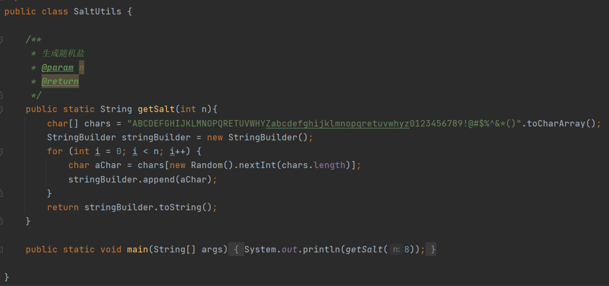

### UserService与UserServiceImpl

> 并且注册用户的接口与具体的实现

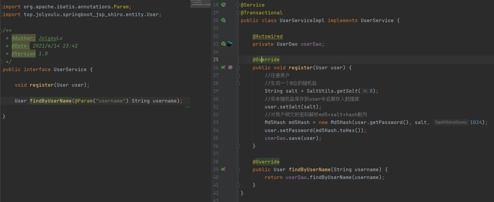

### login.jsp与register.jsp

> login.jsp与register.jsp是`公共资源`无需登录也可以访问

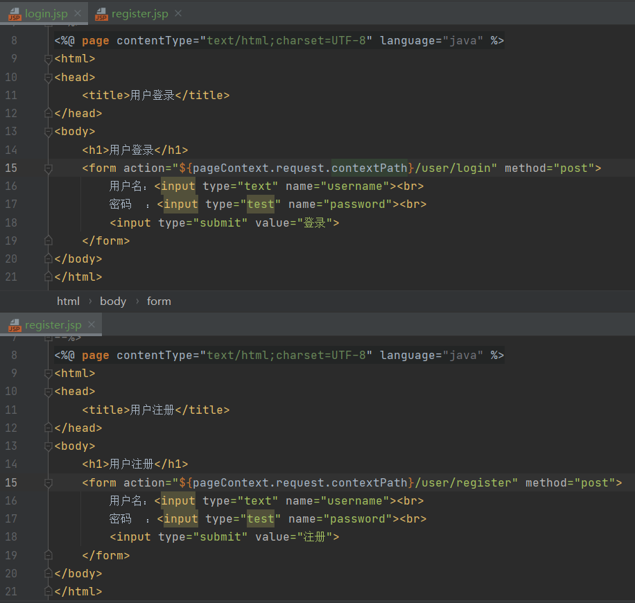

### index.jsp

> index.jsp是`受限资源`只有登录后才能访问

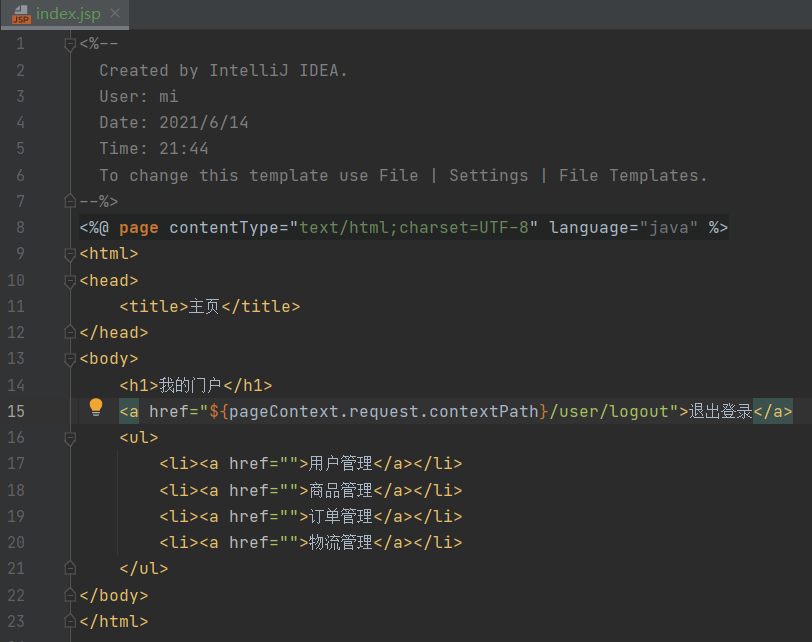

### Controller

> 控制层

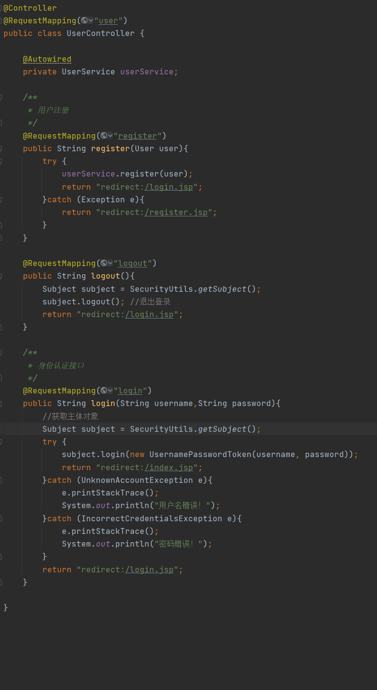

### 测试

#### 注册测试

> 1. 未登录情况下可以访问 `/shiro/register.jsp`
> 2. 输入用户名与密码点击注册，user信息成功插入数据库
> 3. 注册成功后跳转到登录页面

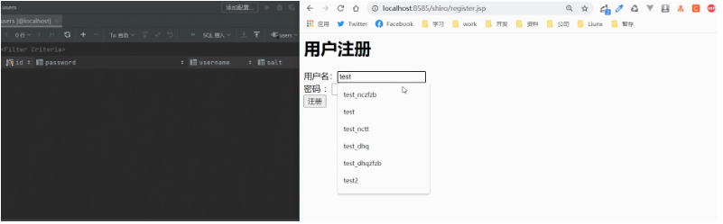

#### 登录测试

> 1. 访问受限资源会被跳转到登录界面
> 2. 输入正确账号密码登录成功，跳转到主页

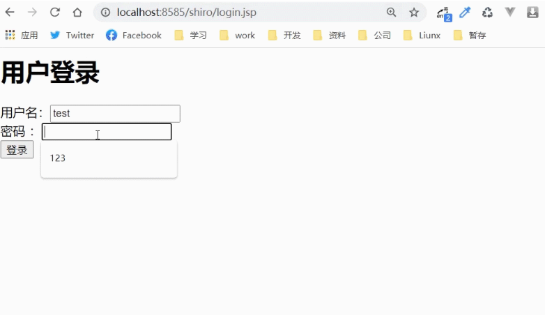

## 授权实现

> `授权的实现需在认证通过基础上完成`
>
> 要实现授权之前首先我们要搞明白3个东西之间的关系`用户、角色、权限`，在日常开发中最常有的3种组合关系如下
>
> 1. 方案1：用户对应角色，角色对应着权限，最后通过权限绑定资源
> 2. 方案2：用户对应角色，角色绑定资源
> 3. 方案3：用户对应权限，权限绑定资源
>
> 以上三种方案并没有好坏，采取那种方案还是要看实际业务需求，根据业务需求进行定制相应的权限控制

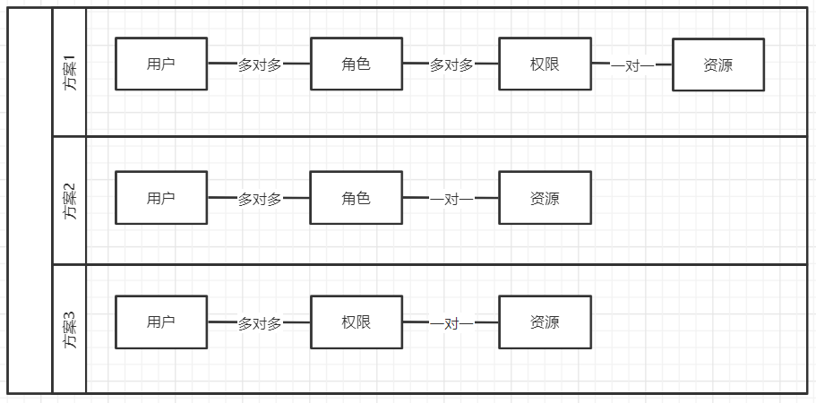

### 数据库设计

> 通常情况下用的最多的是方案一，如下就是方案1的数据库设计

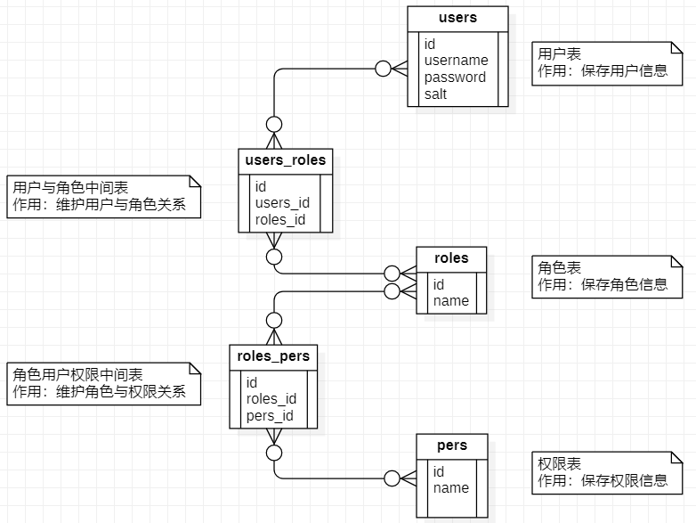

> 建表语句
~~~sql
create table pers
(
    id   int auto_increment comment '主键'
        primary key,
    name varchar(64)  null comment '权限标识',
    url  varchar(256) null comment '资源路径'
)
    comment '权限表';

create table roles
(
    id   int auto_increment comment '主键'
        primary key,
    name varchar(64) null comment '角色名称'
)
    comment '角色表';

create table roles_pers
(
    id       int auto_increment
        primary key,
    roles_id int null comment '角色id',
    pers_id  int null comment '权限id'
)
    comment '角色与权限关系表';

create table users
(
    id       int auto_increment comment '主键'
        primary key,
    password varchar(64) null comment '用户名',
    username varchar(64) null comment '密码',
    salt     varchar(64) null comment '盐'
)
    comment '用户表';

create table users_roles
(
    id       int auto_increment comment '主键'
        primary key,
    users_id int null,
    roles_id int null
)
    comment '用户与角色关联表';
~~~

### Shrio配置

#### 修改CustomerRealm

~~~java
public class CustomerRealm extends AuthorizingRealm {

    @Autowired
    private UserService userService;
	//修改部分============================================================================
    @Override
    protected AuthorizationInfo doGetAuthorizationInfo(PrincipalCollection principals) {
        //获取主身份信息
        String primaryPrincipal = (String) principals.getPrimaryPrincipal();
        //获取Roles信息
        User rolesByUserName = userService.findRolesByUserName(primaryPrincipal);
        //根据主身份信息获取角色与权限信息
        SimpleAuthorizationInfo simpleAuthorizationInfo = new SimpleAuthorizationInfo();
        if (!rolesByUserName.getRoleList().isEmpty()){
            rolesByUserName.getRoleList().forEach(role -> {
                simpleAuthorizationInfo.addRole(role.getName());
                //通过角色id获取权限信息
                List<Pers> permsByRolesId = userService.findPermsByRolesId(role.getId());
                if (!permsByRolesId.isEmpty()){
                    permsByRolesId.forEach(pers -> {
                        simpleAuthorizationInfo.addStringPermission(pers.getName());
                    });
                }
            });
        }
        return simpleAuthorizationInfo;
    }
    //修改部分============================================================================
    
    //用户认证时会调用该方法
    @Override
    protected AuthenticationInfo doGetAuthenticationInfo(AuthenticationToken token) throws AuthenticationException {
        //获取到用户的身份信息(用户名)
        String principal = (String) token.getPrincipal();
        //根据用户身份信息去数据库查询用户密码与盐
        User user = userService.findByUserName(principal);
        if (user != null){
            //封装到SimpleAuthenticationInfo返回
            return new SimpleAuthenticationInfo(
                    principal,
                    user.getPassword(),
                    ByteSource.Util.bytes(user.getSalt()),
                    this.getName());
        }
        return null;
    }
}
~~~

### Role与Pers

> 增加角色与权限的实体类

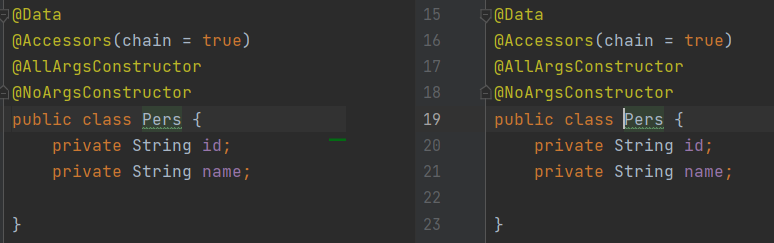

### User

> 用户实体需求修改增加多一个角色集合便于查询

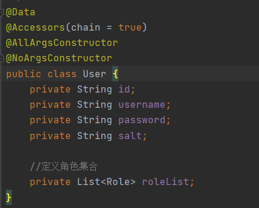

### UserDao与UserDao.xml

> UserDao与UserDao.xml增加获取角色列表与权限列表的接口与sql实现

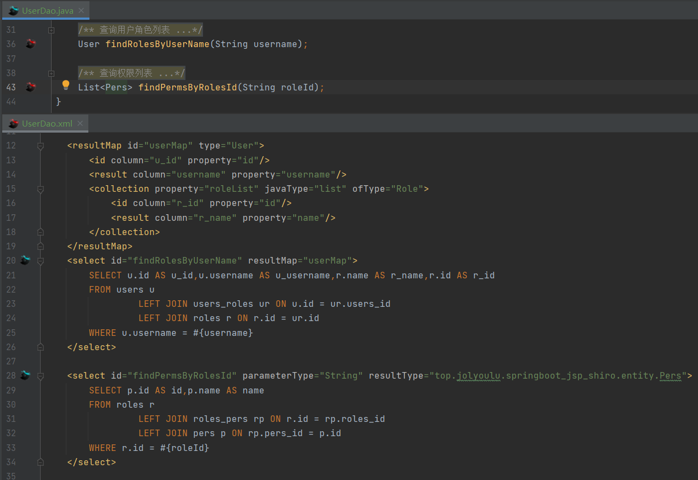

### UserService与UserServiceImpl

> 增加获取角色列表与权限列表的实现

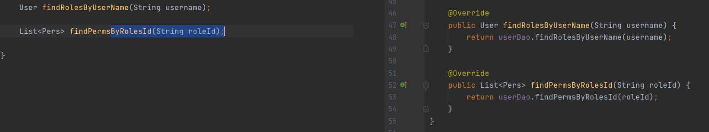

### index.jsp

> 前端页面上加上权限标签字符串的限制

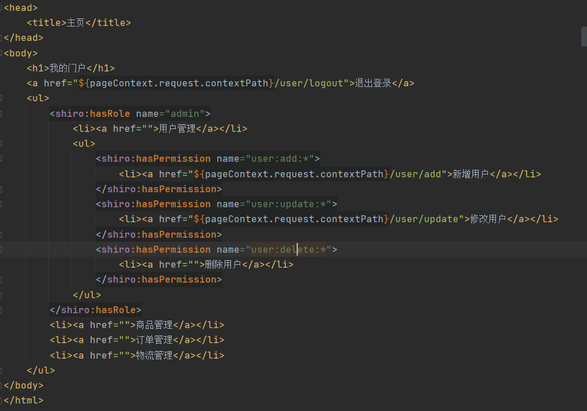

### Controller

> 后端编写2个接口增加权限字符串的限制

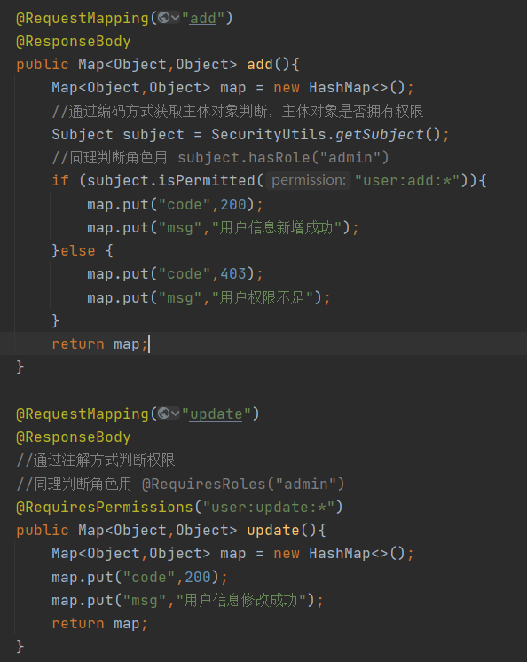

### 测试

#### 导入测试数据

~~~sql
#插入2个用户 密码加密方式 MD5+盐+hash散列1024
INSERT INTO users (id, password, username, salt) VALUES (129, '474aee2ef25e3761708c8b11808983f9', 'test', 'q%KvH!zq');
INSERT INTO users (id, password, username, salt) VALUES (130, '5edde3e7e27004196deb938012a4b616', 'admin', '^bQRt4QJ');
#插入2个角色 user 和 admin
INSERT INTO roles (id, name) VALUES (1, 'admin');
INSERT INTO roles (id, name) VALUES (2, 'user');
#admin角色分配给admin用户  user角色分配给test用户
INSERT INTO users_roles (id, users_id, roles_id) VALUES (1, 130, 1);
INSERT INTO users_roles (id, users_id, roles_id) VALUES (2, 129, 2);
#查3个权限
INSERT INTO pers (id, name) VALUES (1, 'user:add:*');
INSERT INTO pers (id, name) VALUES (2, 'user:update:*');
INSERT INTO pers (id, name) VALUES (3, 'user:delete:*');
#admin角色引用这3个权限
INSERT INTO roles_pers (id, roles_id, pers_id) VALUES (1, 1, 1);
INSERT INTO roles_pers (id, roles_id, pers_id) VALUES (2, 1, 2);
INSERT INTO roles_pers (id, roles_id, pers_id) VALUES (3, 1, 3);
~~~

#### 权限测试

> 1. admin用户可以登录成功后可以看到用户管理
> 2. user用户登录成功后无法看到用户管理
> 3. admin用户可以新增、修改用户
> 4. user用户虽然看不到用户管理不能通过页面点击新增、修改用户，通过直接发送新增用户请求也无法访问

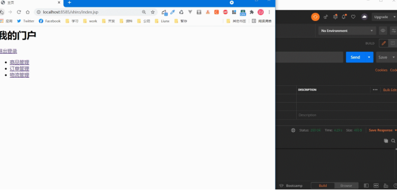

## 授权优化之缓存使用

> 登录成功后，只要涉及到权限的资源，如在进入我的门户、或者发送请求都会进入`doGetAuthorizationInfo`获取用户授权信息资源是否可访问、这就存在一个很大的隐患、试想如果项目上线了，那么每一个用户只要进入某个页面、刷新某个页面、发起某个请求都会进入`doGetAuthorizationInfo`去数据库查询授权信息，用户量上来后数据库压力可想而知有多大，`为了减轻数据库的压力我们需要将来用户权限信息缓存起来，在授权消息不变的情况下用户访问任何的资源除了第一次其它都是直接从缓存获取，大大减轻数据库压力`

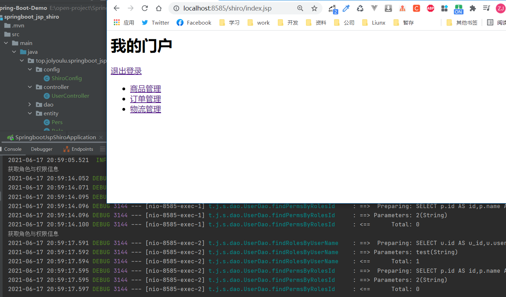

### CacheManager

> CacheManager是Shiro提供的缓存管理器，通过CacheManager可以传入自定义缓存，由于缓存使用的是直接内存读写数据极快，利用缓存可以极大的缓解了数据库的IO操作，所有的认证与授权先去缓存中查，查不到再去数据库获取

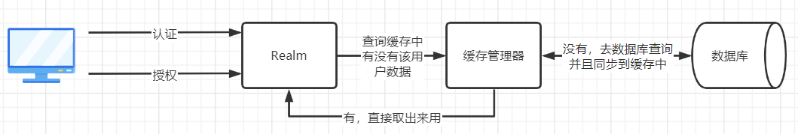

### 使用Shir默认缓存EhCache实现

#### 依赖引入

~~~xml
<!-- https://mvnrepository.com/artifact/org.apache.shiro/shiro-ehcache -->
<dependency>
    <groupId>org.apache.shiro</groupId>
    <artifactId>shiro-ehcache</artifactId>
    <version>1.7.1</version>
</dependency>
~~~

#### 开启缓存

> 修改`ShiroConfig`中，获取Realm的Bean时开启缓存

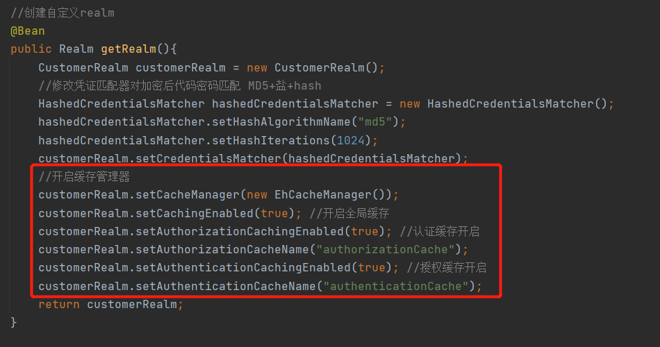

#### 测试

> 开启缓存后，重启服务后再次登录不管怎么刷新页面，不会在看到有sql打印了，因为登录以后的所有授权都通过缓存获取

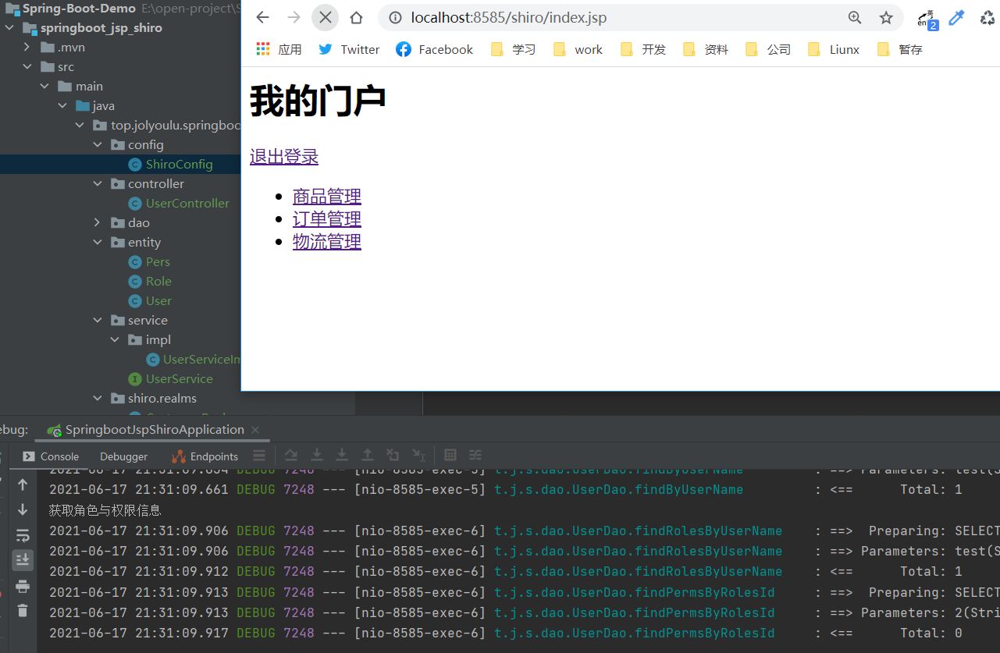

### 使用Redis缓存实现

> 以上使用的EhCahe只是应用级别的缓存，每单应用关闭后重启缓存就会被清空，这样表示我们每次更新服务的时候所有用户都需要重新登录，重新授权，使用Redis可以解决这个问题，Redis是分布式缓存身份信息与授权信息都存到Redis，只要Redis不宕机这些数据就一直会在内存中保存

#### Redis服务的安装与下载

>请根据自己操作系统类型阅读如下安装教程，若已安装Redis跳过该目录即可

[Win10-安装Redis](../Redis专栏/Win10-安装Redis.md)

[Linux-安装Redis](../Redis专栏/Linux-安装Redis.md)

#### 启动Redis

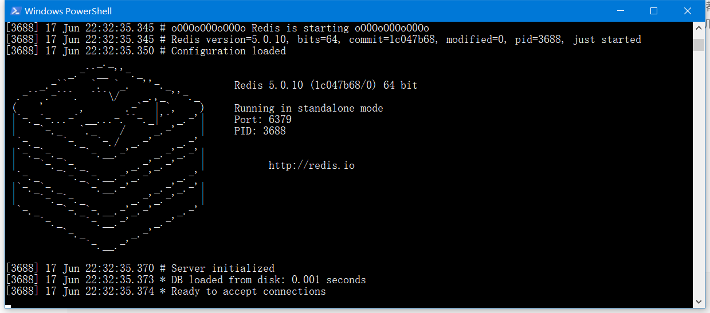

#### 依赖引入

~~~xml
<dependency>
    <groupId>org.springframework.boot</groupId>
    <artifactId>spring-boot-starter-data-redis</artifactId>
</dependency>
~~~

#### 修改配置文件

> 修改`application.properties`配置Redis

~~~properties
#Redis配置
spring.redis.port=6379
spring.redis.host=localhost
spring.redis.database=0
~~~

#### 实现自定义缓存

#### ApplicationContextUtils

> 在RedisCache中会用到

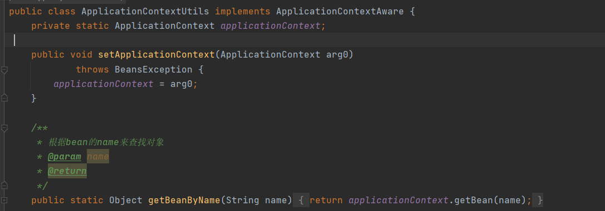

#### RedisConfig

> `Redis序列化设置，Redis默认使用的是java的Serializable序列化，使用过程中有很多坑的，建议切换自定义序列化，不然等一下启动项目测试登录必踩坑，Shiro的Bug亲身经历`

~~~java
@Configuration
@EnableCaching
public class RedisConfig {

    @Bean
    public RedisTemplate<String, Object> redisTemplate(RedisConnectionFactory factory) {
        RedisTemplate<String, Object> template = new RedisTemplate<>();
        template.setConnectionFactory(factory);
        //Json序列化配置
        Jackson2JsonRedisSerializer jackson2JsonRedisSerializer = new Jackson2JsonRedisSerializer(Object.class);
        ObjectMapper om = new ObjectMapper();
        om.setVisibility(PropertyAccessor.ALL, JsonAutoDetect.Visibility.ANY);
        om.enableDefaultTyping(ObjectMapper.DefaultTyping.NON_FINAL);
        jackson2JsonRedisSerializer.setObjectMapper(om);
        //string的序列化
        StringRedisSerializer stringRedisSerializer = new StringRedisSerializer();
        //key采用string的序列化方式
        template.setKeySerializer(stringRedisSerializer);
        //hash的key也采用string的序列化方式
        template.setHashKeySerializer(stringRedisSerializer);
        //value序列化方式采用jackson
        template.setValueSerializer(jackson2JsonRedisSerializer);
        //hash的value序列化方式采用jackson
        template.setHashValueSerializer(jackson2JsonRedisSerializer);
        template.afterPropertiesSet();
        return template;
    }
}
~~~

#### RedisCache

> 实现自己的缓存操作对象，`注意数据结构使用的opsForHash不要使用opsForValue有坑`

~~~java
public class RedisCache<K,V> implements Cache<K,V> {

    private String cacheName;

    public RedisCache() {
    }

    public RedisCache(String cacheName) {
        this.cacheName = cacheName;
    }

    //由于RedisCache不是由Spring托管的所有需要使用工具类获取bean工厂中对象
    private RedisTemplate getRedisTemplate(){
        return (RedisTemplate) ApplicationContextUtils.getBeanByName("redisTemplate");
    }

    @Override
    public V get(K k) throws CacheException {
        return (V) getRedisTemplate().opsForHash().get(this.cacheName,k.toString());
    }

    @Override
    public V put(K k, V v) throws CacheException {
        getRedisTemplate().opsForHash().put(this.cacheName,k.toString(), v);
        return null;
    }

    @Override
    public V remove(K k) throws CacheException {
        return (V) getRedisTemplate().opsForHash().delete(this.cacheName,k.toString());
    }

    @Override
    public void clear() throws CacheException {
        getRedisTemplate().delete(this.cacheName);
    }

    @Override
    public int size() {
        return getRedisTemplate().opsForHash().size(this.cacheName).intValue();
    }

    @Override
    public Set<K> keys() {
        return getRedisTemplate().opsForHash().keys(this.cacheName);
    }

    @Override
    public Collection<V> values() {
        return getRedisTemplate().opsForHash().values(this.cacheName);
    }
}
~~~

#### RedisCacheManager

> 编写一个自定义管理器继承CacheManager，并且返回刚刚编写好的RedisCache

~~~java
public class RedisCacheManager implements CacheManager {
    @Override
    public <K, V> Cache<K, V> getCache(String cacheName) throws CacheException {
        System.out.println("getCache收到参数"+cacheName);
        return new RedisCache<K, V>(cacheName);
    }
}
~~~

#### 修改ShiroConfig

> 修改自定义Realm设置缓存管理器时使用自定义的缓存管理器

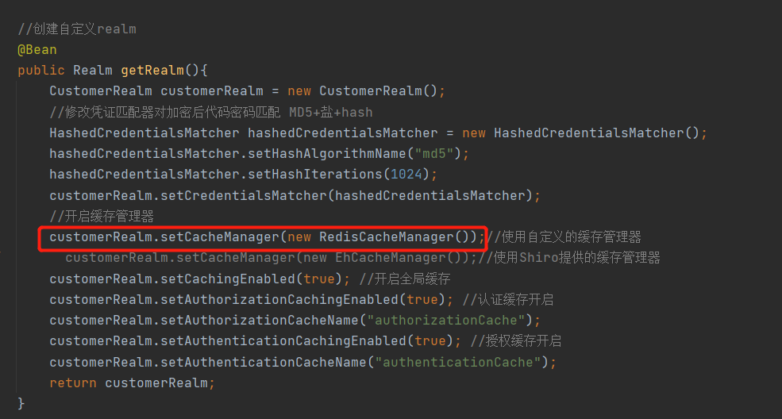

#### 集成Redis过程中的坑

> 在集成Redis时可能会遇到的2个坑以及解决方案

[Shiro-集成Redis序列化失败报错解决](../填坑/Shiro-集成Redis序列化失败报错解决.md)

## Shiro加入验证码

> 在开发登录过程中有时为了预防机器人，需要使用验证码，接下来就讲解如何加入验证码

### VerifyCodeUtils

> 验证码生成工具类，百度找的

~~~java
public class VerifyCodeUtils {
    // 使用到Algerian字体，系统里没有的话需要安装字体，字体只显示大写，去掉了1,0,i,o几个容易混淆的字符
    public static final String VERIFY_CODES = "23456789ABCDEFGHJKLMNPQRSTUVWXYZ";
    private static Random random = new Random();

    /**
     * 使用系统默认字符源生成验证码
     *
     * @param verifySize 验证码长度
     * @return
     */
    public static String generateVerifyCode(int verifySize) {
        return generateVerifyCode(verifySize, VERIFY_CODES);
    }

    /**
     * 使用指定源生成验证码
     *
     * @param verifySize 验证码长度
     * @param sources    验证码字符源
     * @return
     */
    public static String generateVerifyCode(int verifySize, String sources) {
        if (sources == null || sources.length() == 0) {
            sources = VERIFY_CODES;
        }
        int codesLen = sources.length();
        Random rand = new Random(System.currentTimeMillis());
        StringBuilder verifyCode = new StringBuilder(verifySize);
        for (int i = 0; i < verifySize; i++) {
            verifyCode.append(sources.charAt(rand.nextInt(codesLen - 1)));
        }
        return verifyCode.toString();
    }

    /**
     * 生成随机验证码文件,并返回验证码值
     *
     * @param w
     * @param h
     * @param outputFile
     * @param verifySize
     * @return
     * @throws IOException
     */
    public static String outputVerifyImage(int w, int h, File outputFile, int verifySize) throws IOException {
        String verifyCode = generateVerifyCode(verifySize);
        outputImage(w, h, outputFile, verifyCode);
        return verifyCode;
    }

    /**
     * 输出随机验证码图片流,并返回验证码值
     *
     * @param w
     * @param h
     * @param os
     * @param verifySize
     * @return
     * @throws IOException
     */
    public static String outputVerifyImage(int w, int h, OutputStream os, int verifySize) throws IOException {
        String verifyCode = generateVerifyCode(verifySize);
        outputImage(w, h, os, verifyCode);
        return verifyCode;
    }

    /**
     * 生成指定验证码图像文件
     *
     * @param w
     * @param h
     * @param outputFile
     * @param code
     * @throws IOException
     */
    public static void outputImage(int w, int h, File outputFile, String code) throws IOException {
        if (outputFile == null) {
            return;
        }
        File dir = outputFile.getParentFile();
        if (!dir.exists()) {
            dir.mkdirs();
        }
        try {
            outputFile.createNewFile();
            FileOutputStream fos = new FileOutputStream(outputFile);
            outputImage(w, h, fos, code);
            fos.close();
        } catch (IOException e) {
            throw e;
        }
    }

    /**
     * 输出指定验证码图片流
     *
     * @param w
     * @param h
     * @param os
     * @param code
     * @throws IOException
     */
    public static void outputImage(int w, int h, OutputStream os, String code) throws IOException {
        int verifySize = code.length();
        BufferedImage image = new BufferedImage(w, h, BufferedImage.TYPE_INT_RGB);
        Random rand = new Random();
        Graphics2D g2 = image.createGraphics();
        g2.setRenderingHint(RenderingHints.KEY_ANTIALIASING, RenderingHints.VALUE_ANTIALIAS_ON);
        Color[] colors = new Color[5];
        Color[] colorSpaces = new Color[]{Color.WHITE, Color.CYAN, Color.GRAY, Color.LIGHT_GRAY, Color.MAGENTA,
                Color.ORANGE, Color.PINK, Color.YELLOW};
        float[] fractions = new float[colors.length];
        for (int i = 0; i < colors.length; i++) {
            colors[i] = colorSpaces[rand.nextInt(colorSpaces.length)];
            fractions[i] = rand.nextFloat();
        }
        Arrays.sort(fractions);

        g2.setColor(Color.GRAY);// 设置边框色
        g2.fillRect(0, 0, w, h);

        Color c = getRandColor(200, 250);
        g2.setColor(c);// 设置背景色
        g2.fillRect(0, 2, w, h - 4);

        // 绘制干扰线
        Random random = new Random();
        g2.setColor(getRandColor(160, 200));// 设置线条的颜色
        for (int i = 0; i < 20; i++) {
            int x = random.nextInt(w - 1);
            int y = random.nextInt(h - 1);
            int xl = random.nextInt(6) + 1;
            int yl = random.nextInt(12) + 1;
            g2.drawLine(x, y, x + xl + 40, y + yl + 20);
        }

        // 添加噪点
        float yawpRate = 0.05f;// 噪声率
        int area = (int) (yawpRate * w * h);
        for (int i = 0; i < area; i++) {
            int x = random.nextInt(w);
            int y = random.nextInt(h);
            int rgb = getRandomIntColor();
            image.setRGB(x, y, rgb);
        }

        shear(g2, w, h, c);// 使图片扭曲

        g2.setColor(getRandColor(100, 160));
        int fontSize = h - 4;
        Font font = new Font("Algerian", Font.ITALIC, fontSize);
        g2.setFont(font);
        char[] chars = code.toCharArray();
        for (int i = 0; i < verifySize; i++) {
            AffineTransform affine = new AffineTransform();
            affine.setToRotation(Math.PI / 4 * rand.nextDouble() * (rand.nextBoolean() ? 1 : -1),
                    (w / verifySize) * i + fontSize / 2, h / 2);
            g2.setTransform(affine);
            g2.drawChars(chars, i, 1, ((w - 10) / verifySize) * i + 5, h / 2 + fontSize / 2 - 10);
        }

        g2.dispose();
        ImageIO.write(image, "jpg", os);
    }

    private static Color getRandColor(int fc, int bc) {
        if (fc > 255)
            fc = 255;
        if (bc > 255)
            bc = 255;
        int r = fc + random.nextInt(bc - fc);
        int g = fc + random.nextInt(bc - fc);
        int b = fc + random.nextInt(bc - fc);
        return new Color(r, g, b);
    }

    private static int getRandomIntColor() {
        int[] rgb = getRandomRgb();
        int color = 0;
        for (int c : rgb) {
            color = color << 8;
            color = color | c;
        }
        return color;
    }

    private static int[] getRandomRgb() {
        int[] rgb = new int[3];
        for (int i = 0; i < 3; i++) {
            rgb[i] = random.nextInt(255);
        }
        return rgb;
    }

    private static void shear(Graphics g, int w1, int h1, Color color) {
        shearX(g, w1, h1, color);
        shearY(g, w1, h1, color);
    }

    private static void shearX(Graphics g, int w1, int h1, Color color) {

        int period = random.nextInt(2);

        boolean borderGap = true;
        int frames = 1;
        int phase = random.nextInt(2);

        for (int i = 0; i < h1; i++) {
            double d = (double) (period >> 1)
                    * Math.sin((double) i / (double) period + (6.2831853071795862D * (double) phase) / (double) frames);
            g.copyArea(0, i, w1, 1, (int) d, 0);
            if (borderGap) {
                g.setColor(color);
                g.drawLine((int) d, i, 0, i);
                g.drawLine((int) d + w1, i, w1, i);
            }
        }

    }

    private static void shearY(Graphics g, int w1, int h1, Color color) {

        int period = random.nextInt(40) + 10; // 50;

        boolean borderGap = true;
        int frames = 20;
        int phase = 7;
        for (int i = 0; i < w1; i++) {
            double d = (double) (period >> 1)
                    * Math.sin((double) i / (double) period + (6.2831853071795862D * (double) phase) / (double) frames);
            g.copyArea(i, 0, 1, h1, 0, (int) d);
            if (borderGap) {
                g.setColor(color);
                g.drawLine(i, (int) d, i, 0);
                g.drawLine(i, (int) d + h1, i, h1);
            }

        }

    }

    public static void main(String[] args) throws IOException {
        File dir = new File("C:\\Users\\mi\\Downloads");
        int w = 200, h = 80;
        for (int i = 0; i < 50; i++) {
            String verifyCode = generateVerifyCode(4);
            File file = new File(dir, verifyCode + ".jpg");
            outputImage(w, h, file, verifyCode);
        }
    }
}
~~~

### UserController

> 编写获取验证码的请求，以及修改登录认证先验证验证码是否正确

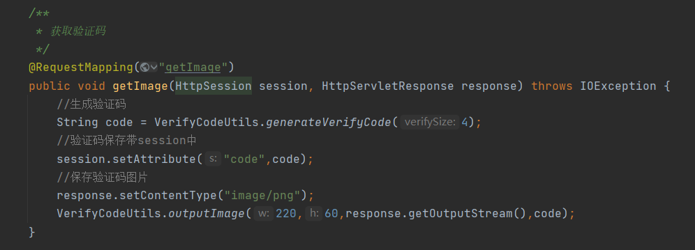

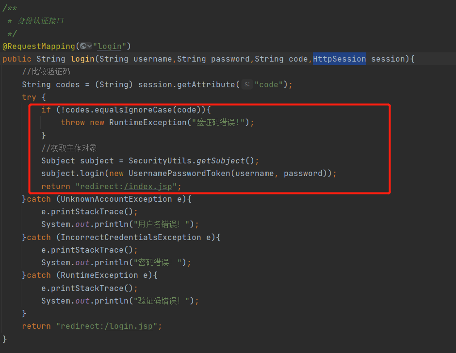

### login.jsp

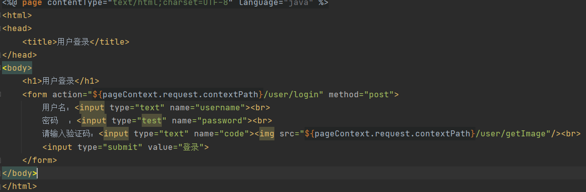

### ShiroConfig

> 将验证码请求设为公告资源

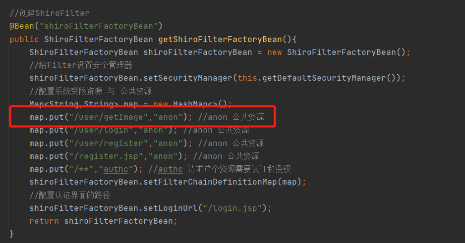

### 测试

> 1. 验证码能正常显示
> 2. 输入验证码后登录成功

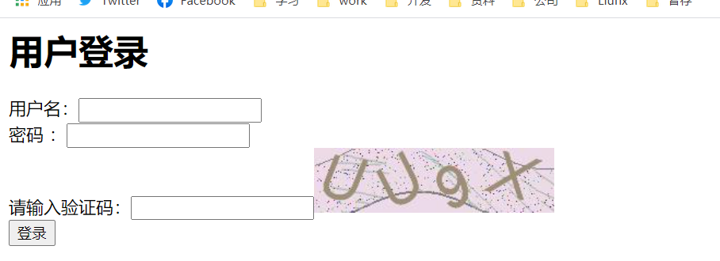
