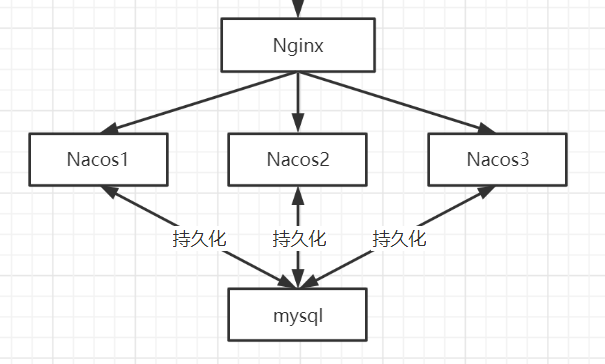
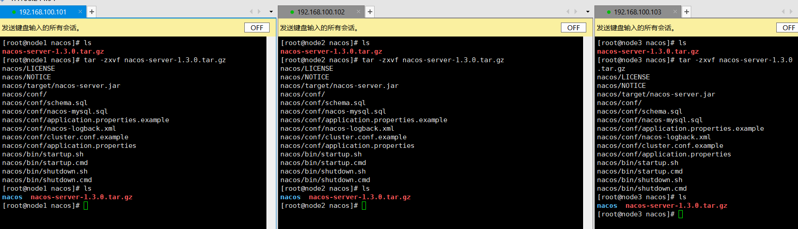
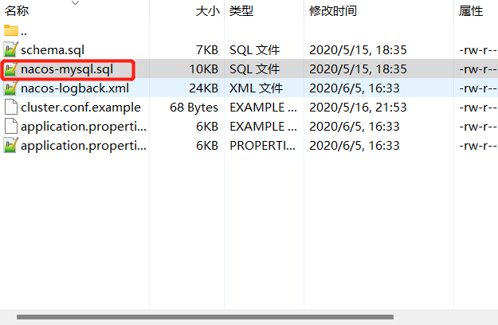
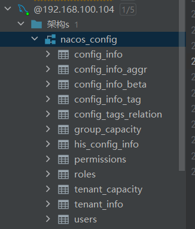
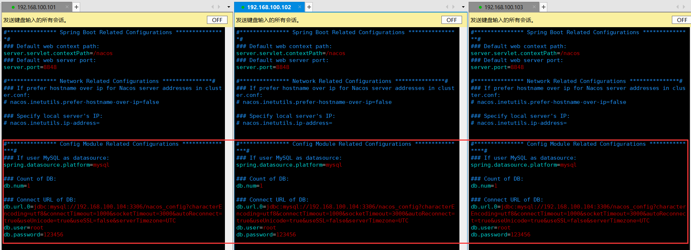
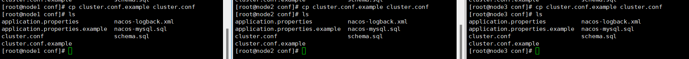
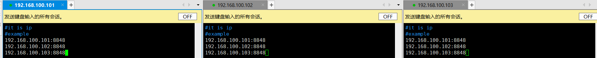
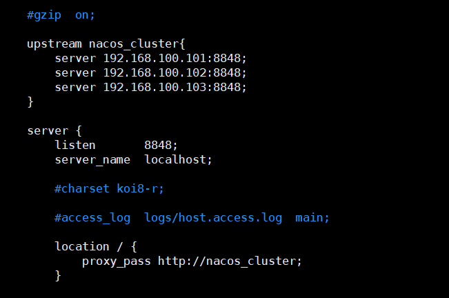
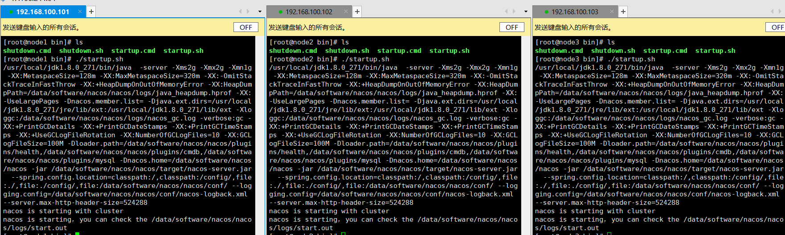
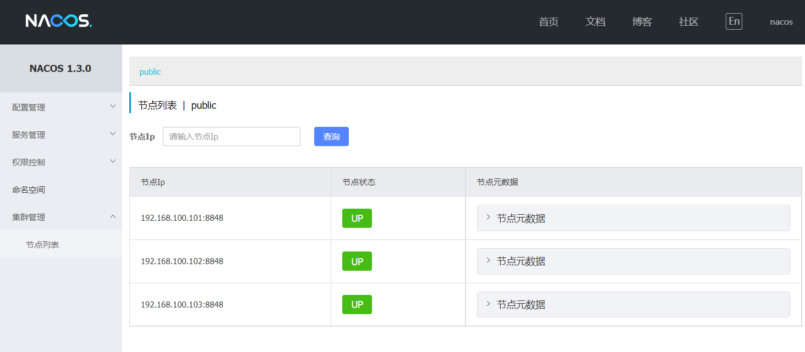

# Liunx-Nacos集群部署

> 我们安装1nginx+3Nacos+1mysql的方式完成Nacos的集群部署

## 安装包下载

> 进入到Nacos的git仓库下载`nacos-server-1.3.0.tar.gz`安装包，并且将安装包拷贝到Liunx中，并且使用tar目录将安装包解压
>
> 下载地址：https://github.com/alibaba/nacos/releases/download/1.3.0/nacos-server-1.3.0.tar.gz

## 配置数据源

### 数据库初始化

> 首先需要将3个Nacos使用相同的mysql数据源，需要准备一台mysql服务器，将nacos/conf文件夹中的`nacos-mysql.sql`脚本放入到mysql中执行

> 执行完毕后可看到生成如下数据库与表结构

### 修改配置

> 修改`nacos/conf/application.properties`配置，将如下内容注释去除，并且配置好mysql连接信息

## 集群配置

> 集群信息配置`cluster.conf`文件中，将拷贝`cluster.conf.example`为`cluster.conf`

> 将集群中的所有Nacos的IP:端口都写入到`cluster.conf`文件中

## 修改Nginx

> 修改nginx增加如下配置，进行负载均衡

## 集群启动

> 进入到nacos的bin目录，执行`startup.sh`脚本启动

**启动成功后登录到nacos在集群信息中看到nacso列表信息表示成功**

