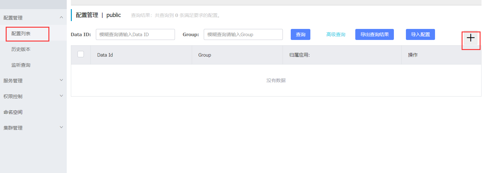
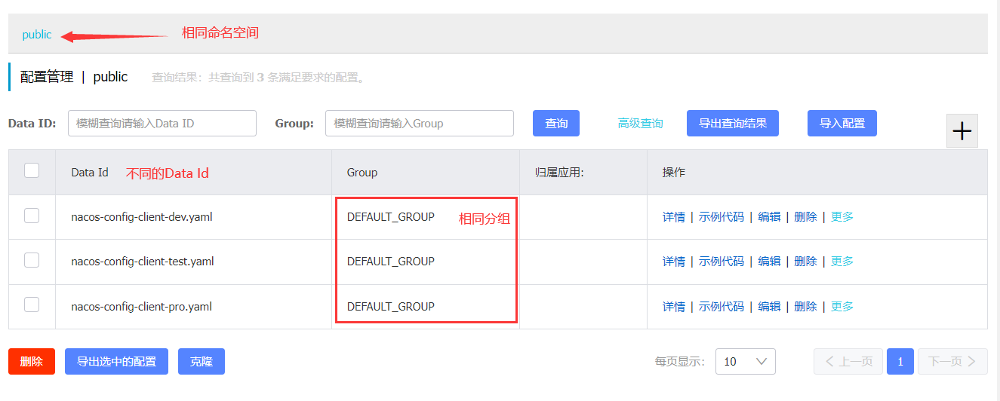
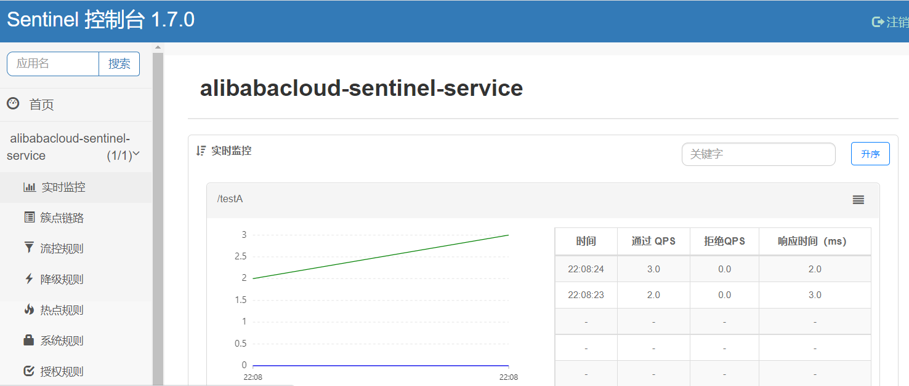
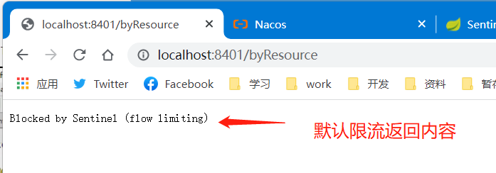
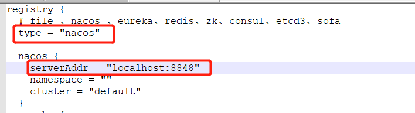

# SpringCloudAlibaba

> 由于SpringCloudNetfix组件已经维护模式，以为着Netfix大部分组件若出现大问题才会修补，SpringCloudNetfix将不再开发新版本了，那么这时就需要替代解决方案，这时就诞生了SpringCloudAlibaba


## Nacos

> SpringCloudAlibaba-Nacos，服务和配置中心，Nacos相当于Eureka+Config+Bus组合，即注册中心+配置中心+总线，比SpringCloudNetfix使用更加方便一个定3个

### Nacos安装

> 下载地址：https://github.com/alibaba/nacos/releases/tag/1.4.0
>
> 首先从github官网下载nacos安装包


**单机启动**

> 下载完毕后解压文件夹进入到bin目录，执行`startup.cmd -m standalone`表示单机启动


**测试**

> 启动成功后访问`http://localhost:8848/nacos`能看到登录页面表示安装成功，nacos默认的登录密码与账号都是nacos


### 服务注册中心

#### 服务提供者

**依赖引入**

> 引入alibaba下的nacos服务

~~~xml
<dependency>
    <groupId>com.alibaba.cloud</groupId>
    <artifactId>spring-cloud-starter-alibaba-nacos-discovery</artifactId>
</dependency>
~~~

**yml编写**

> 连接注册中心的配置，是通过`spring.cloud.nacos`配置的


**编写启动类**

> 启动类与需要添加`@EnableDiscoveryClient`注解


**编写Controller**


**启动测试**

> 服务启动成功后即可在nacos的服务管理-服务列表下看到该服务，表示成功


#### 服务消费者

**依赖引入**

> 引入alibaba下的nacos服务

~~~xml
<dependency>
    <groupId>com.alibaba.cloud</groupId>
    <artifactId>spring-cloud-starter-alibaba-nacos-discovery</artifactId>
</dependency>
~~~

**yml编写**

> 连接注册中心的配置，是通过`spring.cloud.nacos`配置的


**编写启动类**

> 启动类与需要添加`@EnableDiscoveryClient`注解


**负载均衡**

> Nacos默认是已经集成了负载均衡的，所以无需而外引入Ribbon即可直接配置负载均衡


**编写Controller**


**测试**


### 服务配置中心

> 前面说到Nacos即是一个注册中心，也是一个配置中心

#### configClient

> 接下来演示客户端的编写，configClient可读取Nacos上定义好的配置

**依赖引入**

> 需要同时引入nacos-config与nacos-discovery依赖

~~~xml
<!--SpringCloud Alibaba Nacos config-->
<dependency>
    <groupId>com.alibaba.cloud</groupId>
    <artifactId>spring-cloud-starter-alibaba-nacos-config</artifactId>
</dependency>
<!--SpringCloud Alibaba Nacos-->
<dependency>
    <groupId>com.alibaba.cloud</groupId>
    <artifactId>spring-cloud-starter-alibaba-nacos-discovery</artifactId>
</dependency>
~~~

**配置文件编写**

> 配置文件需要编写2个分别是bootstrap.yml application.yml
>
> bootstrap.yml作用：需要获取远程配置中心的配置信息都写这里面，因为SpringBoot的yml加载顺序是bootstrap.yml优先，接下来才是application.yml，这样可以保证先获取到配置中心配置后，再加载application.yml


**启动类编写**

> 启动类上加上@EnableDiscoveryClient即可


**Controller编写**

> `注意：需要动态更新配置的Controller记得加上@RefreshScope注解`


#### nacos创建配置

> nacos中创建配置非常的方便，只需要登录到`http://nacos IP地址:8848/nacos`在配置列表中添加配置信息就行了，注意的是Data Id是需要遵循指定的规则才行



**Data Id**

> Data Id是用于给客户端寻找配置文件的唯一标识，创建Data Id需要与官方文档一致才能才能让客户端正确的从nacos中读取到配置，以当前项目配置为例按官方要求得出需要在nacos中添加Data Id 为 `nacos-config-client-dev.yaml`文件


**新建配置**

> 在配置列表中点击右上角的加号添加配置


> 输入Data ID与相应的配置信息


#### nacos配置动态更新

> 修改nacos上的配置客户端也会动态的实现获取最新配置信息


> 编辑完毕后点击发布即可


> 使用configClient测试获取配置信息，可以发现已得到刚发布的最新配置


#### nacos分类配置

> nacos分类配置可让多个相同的服务使用不同的配置文件，其他命名规范为`namespace+group+data Id`，利用最外层的`namespace`区分不同的部署环境`group+data Id`逻辑上区分2个不同的对象

**命名作用**

> namespace(默认public)：nacos中namespace主要是实现环境隔离，如开发、测试、生产，就可以分别创建不同的namespace，实现配置隔离
>
> group(默认DEFAULT_GROUP)：group可以把不同的微服务划分到同一个分组中

#### nacos分类配置3种实现

##### DataID方案

> 利用DataID来区分不同环境的配置，这个也是使用最多的一种方式




##### Group方案

> 利用Group来区分不同环境的配置


##### Namespace方案

> 利用Namespace来区分不同环境的配置


##### 总结

> 经过DataID方案、Group方案、Namespace方案，的练习最终我们可以发现一个规律，我们可以使用Namespace+Group+DataID来得到各种各样的配置方案

### Nacos集群基础

> 在生产环境下Nacos必然是集群模式的，接下来就演示Nacos如何搭建集群模式，通过官方说明需要看出Nacos的集群需要配合nginx与mysql
>
> 官方文档`https://nacos.io/zh-cn/docs/cluster-mode-quick-start.html`


#### Mysql准备

> 由于在Nacos涉及到很多配置的设置，既然有配置那么就需要持久化保存这写些配置，Nacos在默认情况下是内置了一个轻量数据库`Apache Derby`但是这在集群模式下由于每个Nacos都使用自己内置`Derby`保存数据，那么就会存在数据一致性问题，解决这个办法很简单就是让所以的Nacos使用相同的数据源，Nacos官方目前只支持一种数据源mysql

**初始化数据库**

> 在Nacos的conf文件夹下有一个`nacos-mysql.sql`该文件就是初始化Nacos数据库数据的文件，只需要在数据库中执行该文件即可


> 执行完毕后可以看到一个名为`nacos-mysql`的数据库，以及一些表，这时数据源已经准备好了


#### 配置文件修改

> 修改conf文件夹中的`application.properties`文件


> 找到Mysql的配置，将如下内容取消注释，并且配置好相应的数据库连接信息


#### Linux-Nacos集群搭建

> 了解了Nacos集群基础后，接下来那么就可以开始搭建Nacos集群

## Sentinel

> SpringCloudAlibaba-Sentinel，相当于Hystrix可为微服务提供熔断、降级、流控等功能，相较于Hystrix，Sentinel提供了一套web界面提供给用户直接通过web界面配置熔断、降级、流控等


### Sentinel安装

> 下载地址：https://github.com/alibaba/Sentinel/releases
>
> 首先从github官网下载nacos安装包


#### Sentinel 组成

> Sentinel 是由 前台、后台组成的
>
> 核心库(Java客户端)：不依赖任何框架/库，能够运行于所有java运行时环境，同时对dubbo/springcloud等框架也有较好的支持
>
> 控制台(Dashboard)：基于SpringBoot开发，打包后可以直接运行，不需要额外的web容器

#### Sentinel 后台启动

> 执行`java -jar sentinel-dashboard-1.7.0.jar`命令即可启动Sentinel的后台
>
> 注意：Sentinel 默认端口为8080端口，请确认8080端口未被占用


> 启动成功后访问`localhost:8080`弹出如下界面表示部署成功，初始账号与密码都为sentinel，
>
> `可以发现Sentinel与Hystrix不同之处，Hystrix需要自己搭建一个Springcloud项目启动，而Sentinel只需要下载一个jar包执行就行了`


### 初始化演示工程

> 为了更好的演示sentinel的使用，我们需要编写一点demo工程，demo使用nacos作为注册中心，使用sentinel作为监控

**依赖引入**

~~~xml
<!--SpringCloud Alibaba Nacos-->
<dependency>
    <groupId>com.alibaba.cloud</groupId>
    <artifactId>spring-cloud-starter-alibaba-nacos-discovery</artifactId>
</dependency>
<!--SpringCloud Alibaba sentinel-datasource-nacos 持久化时需要用到-->
<dependency>
    <groupId>com.alibaba.csp</groupId>
    <artifactId>sentinel-datasource-nacos</artifactId>
</dependency>
<!--SpringCloud Alibaba sentinel-->
<dependency>
    <groupId>com.alibaba.cloud</groupId>
    <artifactId>spring-cloud-starter-alibaba-sentinel</artifactId>
</dependency>
~~~

**修改配置**

> 相较其他配置文件，只需要多增加sentinel配置项即可


**编写启动类**


**编写controller**


**测试**

> 项目启动成功后登录nacos可以看到该服务已经注册到服务列表中


> 尝试调用一下刚刚的测试接口，能成功返回


> 访问sentinel的web控制台可以看到该服务，并且在该服务下有实时监控、族点链路、流控规则、降级规则等配置菜单



### 流控规则

> 流控规则主要作用就是对用户的请求做流量控制，这个是一个非常重要的功能

#### 基本介绍

> 在族点链路中点击流控可以看到弹出如下内容


| 配置项            | 说明                                                         |
| ----------------- | ------------------------------------------------------------ |
| 资源名            | 唯一名称，默认请求路径                                       |
| 针对来源          | Sentinel可以针对调用者进行限流，填写微服务名称，默认default(不区分来源) |
| 阈值类型/单机阈值 | QPS(每秒的请求数量)：当调用该api的QPS达到阈值的时候，进行限流<br />线程数：当调用该api的线程数达到阈值的时候，进行限流 |
| 是否集群          | 不需要集群                                                   |
| 流控模式          | 直接：api达到限流条件是，直接限流<br />关联：当关联的资源达到阈值时，就限流自己<br />链路：只记录指定链路上的流量（指定资源从入口资源进来的流量，如果达到阈值，就进行限流） |
| 流控效果          | 快速失败：直接失败，抛异常<br />Warm Up：根据codeFacort(冷加载因子默认3)的值，从阈值/codeFactor，经过预热时长，才达到设置的QPS阈值<br />排队等候：匀速排队，让请求以匀速的速度通过，阈值类型必须设置为QPS，否则无效 |

#### 流控模式

##### 直接(默认)

> 我们为testA路径添加一个限流规则，QPS(每秒请求数) > 1 时直接限流
>
> 默认的 流控模式：直接，流控效果：快速失败


> 设置成功后，我们尝试快速的请求`testA`路径后会发现直接返回`Blocked by Sentinel (flow limiting)`请求被Sentinel直接拒绝了，返回快速失败的结果


##### 关联

> 我们为testA路径添加一个限流规则，流控模式为关联，假如关联资源`/testB`的QPS > 1时那么`testA`被限流，
>
> `场景：如支付义务QPS达到某个阈值，那么下单业务需要限流`


> 利用Jmeter并发访问`testB`请求，可以发现`testA`被限流了


#### 流控效果

##### 快速失败(默认)

> 快速失败，就是一种默认的限流效果，达到阈值后直接返回`Blocked by Sentinel (flow limiting)`


##### 预热

> 预热主要是用于应对，突然间的QPS增加导致系统崩溃的问题，预热中有一个关键的参数`冷加载因子（默认3）`，如单机阈值是10，预热时长5，那么设定后会产生的效果：系统初始化的阈值10/3=3，即阈值刚开始为3，然后过了5秒后阈值才会慢慢的提升到设定好的10


##### 排队等待

> 当在一瞬间QPS超过了10以后的请求都会进入到一个排队等待中，超时时间是500毫秒


### 降级规则

> Sentinel提供3种降级规则RT、异常比例、异常数


| 配置项         | 说明                                                         |
| -------------- | ------------------------------------------------------------ |
| RT(秒级)       | RT(平均响应时间，秒级统计)，当一个接口平均响应时间设定的阈值后并且在时间窗口内通过的请求>=5时，触发降级，窗口期过后关闭断路器 |
| 异常比例(秒级) | QPS >= 5 且异常比例(秒级统计)超过阈值时，触发降级；窗口期过后关闭断路器 |
| 异常数(分钟级) | 异常数(分钟统计)超过阈值时，触发降级，窗口期过后关闭断路器   |


#### RT

> 访问`/testRT`如果在1秒内有5或以上的请求响应时间>200毫秒，那么服务降级1秒


**测试**

> 修改业务代码，模拟该请求处理需要1秒，这样处理时间远远的与设定的200毫秒了


> 利用jmeter对该接口进行压测，可以发现接口直接熔断了


#### 异常比例

> 访问`/testTO`如果在1秒内有5或以上的请求其中异常比例达到50%，那么服务降级1秒


**测试**

> 修改业务代码让所有请求都抛异常


>  利用jmeter对该接口进行压测，可以发现接口直接熔断


#### 异常数

> 访问`/testTO`如果在60秒内有5个请求发送了异常，那么服务降级60秒


**测试**

> 前5个请求都能访问，第6个请求后就熔断了 


### 热点key限流

> 热点数据，即热点经常访问的数据，对这些热点数据进行限流，与流控不同之处热点key是根据请求参数的top进行限流，而流控是将整个请求进行限流，热点key的颗粒度更加细化，如可对某一个商品ID进行限流

#### QPS模式

> 目前热点规则只支持QPS模式限流，将资源名为`testHotKey`的请求种的第一个参数作为限流参数，当该参数在1s的时间窗口内请求>1个后触发限流，直接返回预设定好的消息


> 后端的接口必须加上@SentinelResource注解，因为@SentinelResource中有2个非常重要的参数
>
> value ：必须与热点规则资源名相同，用于帮助热点规则定位你需要限流那个资源
>
> blockHandler：限流后预设好的返回内容，最好写不然前端会收到500的错误页面


**测试**

> 如果某一个p1参数被连续多次的请求后，该参数会被限流注解返回预设的好的blockHandler的结果


#### 参数例外项

> 参数例外项在新增限流的规则中的高级选项中，它可以更加灵活的配置参数限流规则，看如下配置，在请求资源testHotKey，如果参数索引0在1秒的时间窗口内，多个相同的值发起请求QPS达到了1就会限流，但是如果值是5则例外，当值是5时一个时间窗口可以支持200的QPS


### 系统规则

> 系统规则着是为整个应用的入口做限流，这个使用的比较少，因为颗粒度不够细，而且系统规则限流会影响到流控规则


| 配置项    | 说明                                                         |
| --------- | ------------------------------------------------------------ |
| LOAD      | 该配置只对Linux/Unix-like机器生效，系统的load1作为启发指标，进行自适应系统保护，设定参考值一般是 CPU核心数量*2.5 |
| RT        | 当单台机器上所有入口流量的平均RT达到阈值触发保护             |
| 线程数    | 当单台机器上所有入口的并发线程数达到阈值时触发保护           |
| 入口QPS   | 当单台机器上所有入口流量的QPS达到阈值时触发保护              |
| CPU使用率 | 当系统CPU使用率超过阈值时触发保护                            |

### SentinelResource

> SentinelResource在Sentinel中是一个非常重要的注解，SentinelResource可以标记那些资源是需要做限流控制的，并且可以设置自定义的限流后返回结果

#### 按资源名称流控

> 利用SentinelResource标记某一个请求的资源名称，以及定义该请求限流后的返回内容


> 配置完毕后可以在Sentinel控制台中看到用`@SentinelResource`定义的资源名称


> 直接对资源名称进行流控，也是可以的


> 触发流控后返回了自定义的信息


#### 按URL限流

> 按url限流就没有按资源名那么灵活，按url限流时只会返回sentinel的默认限流内容`Blocked by Sentinel (flow limiting)`


> 进行使用前面编写好的代码，这次不对资源名称限流，而是直接对url限流


> 通过测试结果可以发现如果如果url进行限流，在触发限流时sentinel只能返回默认的限流消息，无法自定义返回结果，相较按资源名称流控的灵活性更加低



#### 统一限流处理

> 在前面的案例中可以发现，使用`@SentinelResource`注解中的`blockHandler`属性来自定义限流处理会存在一个问题，那么就是每个接口都需要编写一个blockHandler方法，最后会导致整个系统出现很多的冗余代码，Sentinel提供了

**统一限流处理类**

> 定义统一限流处理类，其中添加2个静态方法


**接口编写**

> 编写一个接口，利用`@SentinelResource`指定资源名称，并且指定限流处理类，以及流处理类中的那个方法


**测试**

> 给该资源名添加流控规则


> 触发流控后返回了统一限流处理类中的指定方法内容，通过统一的限流处理类可以更好的管理限流处理


### 服务熔断

#### Ribbon

> 在使用Ribbon作为负载均衡时，需使用到`SentinelResource`注解完成服务的降级和熔断，这里要注意的是在`SentinelResource`中`fallback`属性只会处理接口异常，`blockHandler`属性只会处理在Sentinel控制台配置的限流，所有在生产环境上需要2个都配置上


#### Feign

> Sentinel集成Feign需要在yml配置开启sentinel对feign的支持


> Feign与Ribbon不同之处在于Feign的降级与熔断都由FeignClient下的fallback属性处理


### 规则持久化

> 在前面的练习中大家都会发现，每次重启微服务后会发现在Sentinel控制台配置的流控规则都会消失，那么在生产环境下是很麻烦的，每次重启都要重新配置，其实Sentinel是提供配置持久化的

#### 持久化到Nacos

> 持久化到Nacos是其中一种，并不代表Sentinel只能持久化到Nacos中，也可以持久化其他组件上参考官方文档`https://sentinelguard.io/zh-cn/docs/dynamic-rule-configuration.html`，因为Nacos是配套必须组件所有这里只讲解持久化到Nacos中就行了

**添加依赖**

> 在需要持久化的微服务的pom文件中添加如下依赖

~~~xml
<dependency>
    <groupId>com.alibaba.csp</groupId>
    <artifactId>sentinel-datasource-nacos</artifactId>
</dependency>
~~~

**修改yml**

> 在yml文件的sentinel属性下添加datasource的配置


**Nacos创建配置**

> 在Nacos中添加刚刚设定好的配置软件


> 配置内容解释如下

~~~json
[
    {
        "resource":"/byResource/customerBlockHandler",
        "limitApp":"default",
        "grade":1,
        "count":1,
        "strategy":0,
        "controlBehavior":0,
        "clusterMode":false
    }
]
~~~

| 属性            | 说明                                       |
| --------------- | ------------------------------------------ |
| resource        | 资源名称                                   |
| limitApp        | 来源应用(一般写default)                    |
| grade           | 阈值类型：0 线程数，1 QPS                  |
| count           | 单机阈值                                   |
| strategy        | 流控模式：0 直接，1 关联，3 链路           |
| controlBehavior | 流控效果：0 快速失败，1 Warm UP 2 排队等待 |
| clusterMode     | 是否集群                                   |

**测试**

> 重启服务后，自动从Nacos流控规则加载到Sentinel中了


## Seata

> 在微服务开发中难免会遇到分布式事务的问题，Seata是处理分布式事务

### 基本概念

> 分布式事务处理过程中的1个ID+三组件模型
>
> 1个ID：全局唯一的事务ID
>
> 三模型：
>
> 1. Transaction Coordinator(TC)：事务协调者，维护全局事务的状态，驱动全局事务提交或回滚
> 2. Transaction Manager(TM)：事务管理器，定于全局事务的范围，开始全局事务，提交或回滚全局事务
> 3. Resource Manager(RM)：资源管理器，管理分支事务处理的资源，与TC交谈以注册分支事务和报告分支事务的状态，并驱动分支事务提交或回滚

### 工作流程

> 1. TM向TC申请开启一个全局事务，全局事务创建成功后会生成一个XID，这个XID是全局唯一的
> 2. XID会在微服务的调用链上下文中传播
> 3. RM向TC注册分支事务，将其纳入XID对应全局事务的管辖
> 4. TM向TC发起针对XID的全局提交或回滚决议
> 5. TC调度XID下关联的全部分支事务完成提交或回滚


### Seata安装

#### 下载安装包

> 通过github可以下载Seata，win下载zip包，Linux下载tag包，下载完毕后解压安装包
>
> 下载地址：https://github.com/seata/seata/releases


#### 配置文件修改

> 在conf文件夹下，有一个`file.conf`的文件，需要修改如下配置

**自定义事务组名**

> 找到service模块，修改分组名称自己定义一个，这里我使用默认的这个名称可以自己启一个


**事务日志存储方式改为db**

> Seata默认是使用file保存日志，修改为保存到数据库会比较好，这个不做解释了把
>
> 找到store模块，修改存储方式为db，设置mysql连接信息


#### 数据库准备

> 由于事务日志修改保存到mysql中，所有需要初始化数据库，初始化文件在`/conf/db_store.sql`中，在数据库中构建一个`seata`库执行该脚本即可


#### 配置注册中心

> Seata也是一个服务，他需要注册到配置中心中，那么需要修改`conf/registry.conf`文件内容，Seata支持好多注册中心，因为这里使用的是阿里套件所有将它注册到nacos上就行了



#### 启动服务

> Nacos启动后，进入到Setata目录下的bin目录下，启动Seata


### 分布式事务的运用

**依赖引入**

```xml
<!--seata-->
<dependency>
    <groupId>com.alibaba.cloud</groupId>
    <artifactId>spring-cloud-starter-alibaba-seata</artifactId>
    <exclusions>
        <exclusion>
            <!--去除默认的seata-->
            <groupId>io.seata</groupId>
            <artifactId>seata-all</artifactId>
        </exclusion>
    </exclusions>
</dependency>
<!--需要与你安装seata版本一致-->
<dependency>
    <groupId>io.seata</groupId>
    <artifactId>seata-all</artifactId>
    <version>0.9.0</version>
</dependency>
```

**配置文件**

> 配置文件需要添加seata配置，并且tx-service-group要与seata-server的一致


**seata配置文件**

> 在使用到seata的微服务中也要配置好file.conf与registry.conf文件，配置内容其实就是将seata-server中的这个2个文件拷贝进来就行了


**bean编写**

> 自定义数据源代理，使用seata对数据源进行代理


**主启动类**

> 主启动类中需要排除自动装配数据源


**事务使用**

> 使用方式非常简单，只需在使用到分布式事务的业务方法上加上`@GlobalTransactional`注解即可


### 注意事项

> 在使用docker部署时需要在启动参数指定SEATA_IP，否则在应用连接seata后seata会返回容器内部的ip给应用去连接，导致应用一直连接不上seata

~~~shell
docker run -d --name seata -p 8091:8091 -e SEATA_IP=你想指定的ip -e SEATA_PORT=8091 seataio/seata-server:latest
~~~

