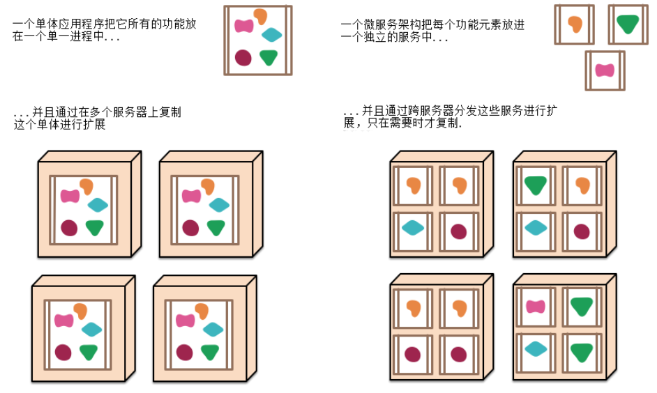
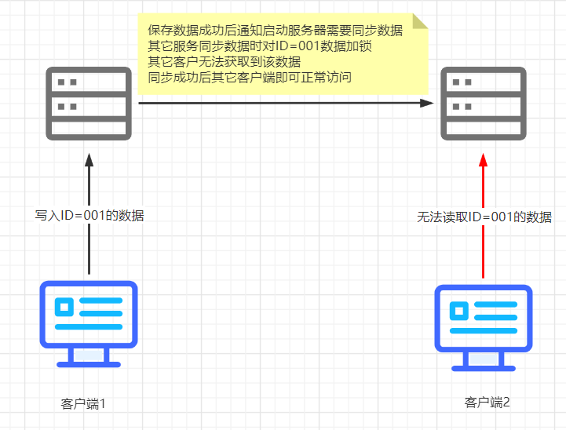
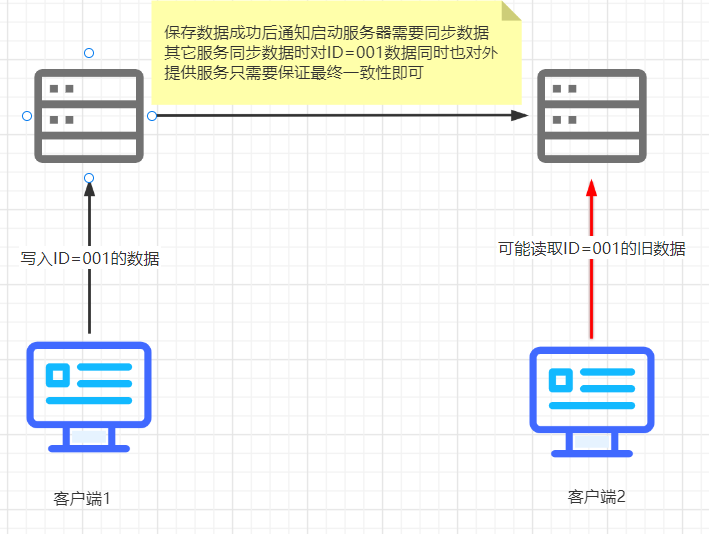

# SpringCloud

## 什么是微服务

> 在了解SpringCloud首先要知道什么是微服务，微服务是由Martin Fowler提出的，并且在他发布的文章中充分的说明了什么是微服务，大家都可以阅读一下，这里我提供Martin Fowler发布微服务的原文链接，以及翻译的中文连接，英文不可以看中文
>
> 中文网站：http://blog.cuicc.com/blog/2015/07/22/microservices/
>
> 原文链接：https://martinfowler.com/articles/microservices.html

## CAP理论

> cap理论是分布式系统中必须了解的一个知识
>
> 1. Consistency(一致性)
>
> 2. Availability(可用性)
>
> 3. Partition tolerance(分区容错性)
>
> 在分布式环境下P总是，但是C/A只能保证只其中一个，CAP三者是不能同时成立的，只能保存CP/AP

### 什么是CP

> C(一致性)P(分区容错性)，微服务需要保证CP那么表示任何一个节点数据在每时每刻都需要保证数据一致性，所以但一个服务接收到写操作时由于需要保证一致性，那么写数据时着需要对其它服务器中的数据进行加锁，完成写操作后并且同步到其它服务后，才能正常访问，这就意味着在写入数据时其它服务是不可用的

### 什么是AP

> A(可用性)P(分区容错性)，微服务需要保证AP那么表示每个节点不管任何时候都需要对客户端请求做出响应，那么当客户端往服务中写数据时，因为需要保证高可用，其它客户端同时去读取时可能就读取旧的数据

## SpringCloud技术栈有那些

### 推荐论坛

> 说到SpringCloud技术栈，有那些那当然是官方文档说的最清晰，还是那句话官网全英文对英文不好的同学不友好，我这里提供了一个SpringCloud官方文档对照翻译的中文文档
>
> 中文网站：https://www.springcloud.cc/spring-cloud-dalston.html#_spring_cloud_config_server

### 技术总览

### 服务注册中心

Eureka

Zookeeper

Consul

Nacos

### 服务调用

Ribbon

LoadBalancer

OpenFeign

### 服务降级

Hystrix

resilience4j

sentienl

### 服务网关

Zuul

gateway

### 服务配置

Config

Nacos

### 服务总线

Bus

Nacos

