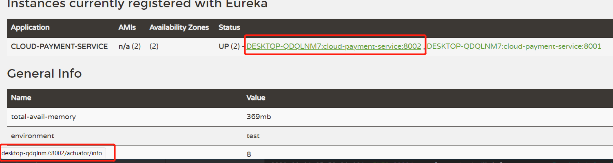
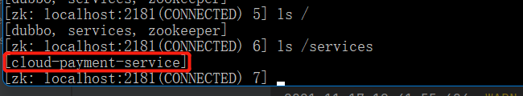
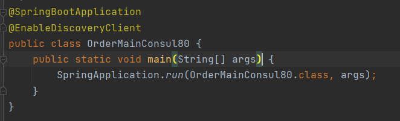
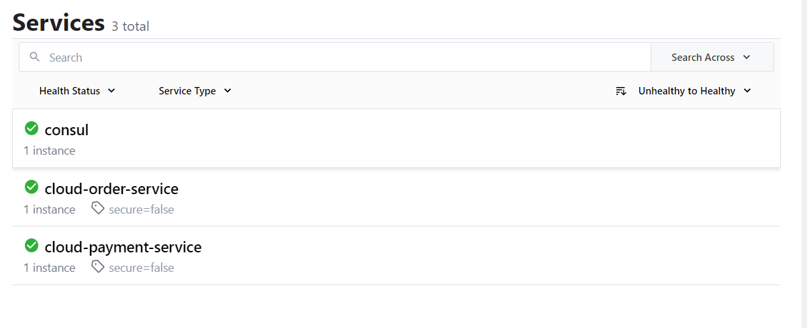

# SpringCloud服务注册中心

## Eureka

> Eureka是一种服务治理的实现，在传统的rpc远程调用框架中，管理每个服务与服务之间依赖关系比较复杂，所以需要使用服务治理，管理服务之间的依赖关系，可以实现服务调用、负载均衡、容错等

### Eureka包含组件

**Eureka Server提供服务注册服务**

> 各个微服务节点通过配置启动后，会在Eureka Server中进行注册，这样Eureka Server中的服务注册表中会保存着所以可用的服务节点信息，节点信息可用在Eureka管理界面中看到

**Eureka Client通过注册中心访问**

> 是一个java客户端，用于简化Eureka Server的交互，客户端同时也具备一个内置的、轮询的负载均衡算法，在应用启动后，会定期向Eureka Server发送心跳(默认30秒)，如果Eureka Server在多个心跳周期没有收到该节点的心跳，Eureka Server会将从服务注册表中把这个服务节点移除(默认90秒)

### 单机Eureka构建

**依赖引入**

~~~xml
<dependency>
    <groupId>org.springframework.cloud</groupId>
    <artifactId>spring-cloud-starter-netflix-eureka-server</artifactId>
</dependency>
~~~

**yml编写**

**启动类编写**

> 注意启动类中需要加上`@EnableEurekaServer`注解表示该类是Eureka Server

**测试**

> 通过访问7001能够成功访问表示Eureka Server部署成功

### 提供者注册到Eureka

**依赖引入**

~~~xml
<dependency>
    <groupId>org.springframework.cloud</groupId>
    <artifactId>spring-cloud-starter-netflix-eureka-client</artifactId>
</dependency>
~~~

**yml编写**

**修改启动类**

> 在启动类上增加`@EnableEurekaClient`的注解

**测试**

> 可在Eureka中看到已注册上的服务

### 消费者注册到Eureka

**依赖引入**

~~~xml
<dependency>
    <groupId>org.springframework.cloud</groupId>
    <artifactId>spring-cloud-starter-netflix-eureka-client</artifactId>
</dependency>
~~~

**yml编写**

**修改启动类**

> 在启动类上增加`@EnableEurekaClient`的注解

**测试**

> 可在Eureka中看到已注册上的服务

### 集群Eureka构建

**修改Host文件**

**修改yml**

> 在注册时需要多个eureka相互注册

**测试**

> 若看到2给eureka相互指向，那么表示该eureka配置成功

**服务注册到Eureka**

> 服务注册需要向集群的Eureka注册，那么需要将所以的Eureka地址都写上

### actuator微服务信息完善

> 在前面使用Eureka中可以发现，注册上去的服务存在一些问题，如服务名称比较乱，以及注册的服务不知道是什么IP地址，如果在大量的服务注册时这个问题会导致排查移除时很难处理

> 可通过修改yml来解决这个问题

> 修改后可以发现在Eureka可以看到服务的IP以及标准的服务名称，方便以后问题排查

### 服务发现Discovery

> Discovery可以获取到Eureka上的注册的服务实例完成信息，这个后期是非常用于的东西

**修改启动类**

**编写测试**

> 通过discoveryClient可以从Eureka获取实例列表，以及根据主机名获取该名称下的所有实例的信息详细，包括ip、端口、serviceid、uri等

### Eureka自我保护机制

**概述**

> 当Eureka中看到这段红色话表示Eureka发送了自我保护机制，当触发了这种机制那么Eureka将不会剔除任何一个已经下线了的服务，属于CAP理论中的AP分支

**自我保护思想**

> 在默认情况下，如果Eureka Server在一定时间内没有收到某个微服务的实例心跳，Eureka Server就会将该实例从实例列表中剔除(默认90秒)，但是当网络分区故障发送(延时、卡顿、拥挤)的时Eureka Server会发现大片服务没有心跳，这时如果大片剔除这些服务很危险，所以Eureka Server就会启动自我保护机制，认为这些服务都是存活的不会将任何一个服务剔除

**禁止自我保护**

~~~yml
#eureka注册中心配置
eureka:
  server:
    #关闭自我保护机制
    enable-self-preservation: false
    #剔除检查间隔时间调整2000毫秒
    eviction-interval-timer-in-ms: 2000
    
#eureka客户端配置
eureka:
  instance:
    #Eureka客户端发送心跳的时间间隔(默认30s)
    lease-renewal-interval-in-seconds: 1
    #Eureka服务端收到最后一个心跳时间，超时将剔除服务(默认90s)
    lease-expiration-duration-in-seconds: 2
~~~

## Zookeeper

> Zookeeper做为SpringCloud的注册中心目的是为了让一些交旧的dubbo项目以最少的成本从RPC转微服务，也可以减少转微服务的学习成本，在使用Zookeeper作为注册中心那么需要一些预备知识，Zookeeper安装与部署

预备知识：[Zookeeper-快速入门(服务安装、单机部署、集群部署)](https://blog.csdn.net/weixin_44642403/article/details/115985332)

### 提供者注册到ZK

**依赖引入**

~~~xml
<dependency>
    <groupId>org.springframework.cloud</groupId>
    <artifactId>spring-cloud-starter-zookeeper-discovery</artifactId>
    <!--该问题用于解决zookeeper与部署版本不一致导致启动保存问题-->
    <!--排查自带的zookeeper:3.5.3-beta包-->
    <exclusions>
        <exclusion>
            <groupId>org.apache.zookeeper</groupId>
            <artifactId>zookeeper</artifactId>
        </exclusion>
    </exclusions>
</dependency>
<!--添加自己生产环境中的所用的zookeeper对应版本jar包-->
<dependency>
    <groupId>org.apache.zookeeper</groupId>
    <artifactId>zookeeper</artifactId>
    <version>3.4.9</version>
    <exclusions>
        <exclusion>
            <groupId>org.slf4j</groupId>
            <artifactId>slf4j-api</artifactId>
        </exclusion>
        <exclusion>
            <groupId>org.slf4j</groupId>
            <artifactId>slf4j-log4j12</artifactId>
        </exclusion>
        <exclusion>
            <groupId>log4j</groupId>
            <artifactId>log4j</artifactId>
        </exclusion>
    </exclusions>
</dependency>
~~~

**编写yml**

**启动类编写**

**测试**

> 可看到服务名称没正常的注册到服务Zookeeper中表示成功

### 消费者注册到ZK
**依赖引入**

~~~xml
<dependency>
    <groupId>org.springframework.cloud</groupId>
    <artifactId>spring-cloud-starter-zookeeper-discovery</artifactId>
    <!--该问题用于解决zookeeper与部署版本不一致导致启动保存问题-->
    <!--排查自带的zookeeper:3.5.3-beta包-->
    <exclusions>
        <exclusion>
            <groupId>org.apache.zookeeper</groupId>
            <artifactId>zookeeper</artifactId>
        </exclusion>
    </exclusions>
</dependency>
<!--添加自己生产环境中的所用的zookeeper对应版本jar包-->
<dependency>
    <groupId>org.apache.zookeeper</groupId>
    <artifactId>zookeeper</artifactId>
    <version>3.4.9</version>
    <exclusions>
        <exclusion>
            <groupId>org.slf4j</groupId>
            <artifactId>slf4j-api</artifactId>
        </exclusion>
        <exclusion>
            <groupId>org.slf4j</groupId>
            <artifactId>slf4j-log4j12</artifactId>
        </exclusion>
        <exclusion>
            <groupId>log4j</groupId>
            <artifactId>log4j</artifactId>
        </exclusion>
    </exclusions>
</dependency>
~~~

**编写yml**

**启动类编写**

**controller编写**

> controller也是使用restTemple进行发送请求，这里服务名称与Eureka不同，Zookeeper是小写的

**测试**

> 能够成功调用8004服务

> 获取实例列表信息也没有问题

### 服务节点信息查看

> 在Zookeeper中若有服务注册上来都会被放在`/services/服务名称/UUID(每个服务生成唯一的ID)`路径中，通过get方式可以可以获取到某一个节点详细信息

## Consul

> Consul是一套分布式服务发现和配置管理系统，由HashiGorp公司用GO语言开发
>
> 提供了微服务系统中的服务治理、配置中心、控制总线等功能，这些功能中每一个都可以单独根据需要使用，也可以使用构建全方位的服务网格

### 提供者注册到Consul

**依赖引入**

~~~xml
<dependency>
    <groupId>org.springframework.cloud</groupId>
    <artifactId>spring-cloud-starter-consul-discovery</artifactId>
</dependency>
~~~

**编写yml**

**启动类编写**

**测试**

> 可Consul服务端看到已注册上来的服务名称表示成功

### 消费者注册到Consul
**依赖引入**

~~~xml
<dependency>
    <groupId>org.springframework.cloud</groupId>
    <artifactId>spring-cloud-starter-consul-discovery</artifactId>
</dependency>
~~~

**编写yml**

**启动类编写**

**controller编写**

> controller也是使用restTemple进行发送请求

**测试**

> 可Consul服务端看到已注册上来的服务名称表示成功

> 测试远程调用

## 三款注册中心对比

| 组件名    | 语言 | CAP  | 服务健康检查 | 对外暴露接口 | Spring Cloud集成 |
| --------- | ---- | ---- | ------------ | ------------ | ---------------- |
| Eureka    | Java | AP   | 可配支持     | HTTP         | 已集成           |
| Consul    | Go   | CP   | 支持         | HTTP/DNS     | 已集成           |
| Zookeeper | Java | CP   | 支持         | 客户端       | 已集成           |

