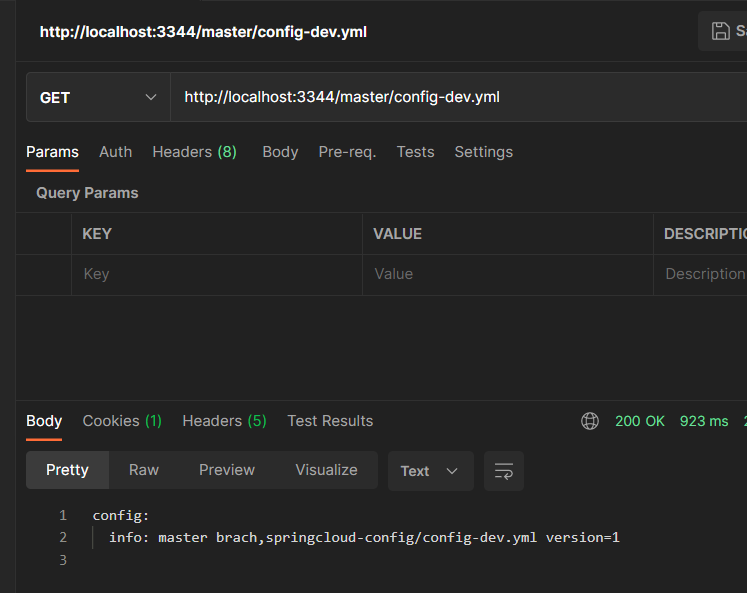

# SpringCloud服务配置

> 因为在微服务系统下，会出现大量的服务，每一个服务都有自己的配置文件，那么若配置调整的话那么会很麻烦需要修改很多服务的配置文件，所以需要一套集中式的，动态的配置管理设施，SpringCloud提供了ConfigServer

## ConfigServer

> ConfigServer是SpringCloud分布式配置中心，他用于访问远程git仓库中的配置文件，其它服务可通过它获取到远程仓库的配置，实现当远程仓库配置有所调整后其它服务也可以获取到最新配置

### 搭建配置中心

**依赖引入**

~~~xml
<dependency>
    <groupId>org.springframework.cloud</groupId>
    <artifactId>spring-cloud-config-server</artifactId>
</dependency>
~~~

**yml配置**

> yml只需配置上远程仓库地址，以及登录远程仓库所用的账号密码
>
> 将该服务注册到注册中心


**编写启动类**


**测试**

> 现在git仓库上有几份配置文件，分别是dev、test、pro


> 通过配置中心`localhost:3344`直接读取到git仓库中的配置文件



### 客户端读取配置

**依赖引入**

> 客户端引入`spring-cloud-starter-config`依赖，千万别搞错了

~~~xml
<dependency>
    <groupId>org.springframework.cloud</groupId>
    <artifactId>spring-cloud-starter-config</artifactId>
</dependency>
~~~

**bootstrap.yml**

> 在client需要使用到bootstrap配置文件，bootstrap.yml与普通的application.yml区别在于bootstrap是系统级别的，所以会最先被加载，bootstrap加载完毕后再加载application的配置文件


**编写启动类**


**controller**

> 编写接口返回从配置中心读取到的配置信息


**测试**

> 能够读取到分布式配置中心中的配置信息


### 动态更新问题

#### 存在问题

> 现在虽然是可以从分布式配置中心获取到配置，但是存在一个问题如果修改了gitee仓库的配置，配置并没有被实时的同步过来，测试结果如下
>
> 当修改了远程仓库配置中version=5只会，可以发现3344(分布式配置中心)获取的是最新的配置


> 虽然分布式配置中心获取到了最新的配置，但问题是配置中心的客户端并没有获取到，无论你怎么刷新都是上一次的配置，需要重启3355服务，才能读取到最新配置，那么有什么解决办法可以使得不重启获取到最新的配置呢，查看解决方案


#### 解决方案

> 要让客户端不重启服务也能感知并且及时获取最新配置需要进行如下操作
>
> 1. 修改配置中心客户端yml
> 2. 在引用了分布式配置中心的属性类上加上`@RefreshScope`注解
> 3. 在修改远程仓库配置后需要发送一个post手动刷新客户端配置

**修改客户端yml**

> 配置中心客户端增加如下配置


**添加@RefreshScope注解**


**手动发送Post刷新请求**


**测试获取**

> 客户端也能获取到最新的配置了
>
> 这也存在一个问题当你的微服务应用很多的时候，那如果修改配置中心的一个配置后那么需要手动刷新所有使用到该配置的客户端，虽然可以使用脚本实现，但是还是比较繁琐的操作流程


## Bus

> SpringCloudBus消息总线，可用于配合ConfigServer实现动态的更新配置，一说到消息那么自然就会联想到消息中间件，SpringCloudBus可支持2种消息代理：RabbitMQ和Kafka
>
> SpringCloudBus与ConfigServer组合后就能实现动态更新配置，所有ConfigServer使用时需要配合SpringCloudBus

### 什么是总线

> 在微服务架构种，通常会使用轻量级的消息代理来构建一个共用的消息主题，并让系统中所有微服务实例都连接上，该主题中产生的消息都会被所有实例监听和消费，所有称它为消息总线，在总线上的各个实例，都可以方便的广播一些需要让其他连接在该主题上的实例都知道的消息
>
> ConfigClient实例都监听MQ中同一个topic(默认是springCloudBus)，当一个服务刷新数据的时候，它把这个信息放入Topic中，这样其它监听同一个Topic的服务都能得到通知，然后去更新自身的配置
>
> 若对消息队列不是很了解的可以先阅读我写的消息队列博客哦
>
> [RabbitMQ-基础(四大核心概念、六大模式、消息应答、持久化、分发逻辑、主题模式、延迟队列)](https://blog.csdn.net/weixin_44642403/article/details/120931674)
>
> [RabbitMQ-进阶(镜像队列、负载均衡、联邦插件)](https://blog.csdn.net/weixin_44642403/article/details/121017327)

### 安装RabbitMQ

> 首先需要安装一个RabbitMQ，若未安装可以阅读以下博客
>
> [Liunx-RabbitMQ单机部署](https://blog.csdn.net/weixin_44642403/article/details/120931857)

### 动态更新工作流程

> 实现客户端动态更新配置的方式通常是通过服务配置中心发送一个`/bus/refresh`消息后，该消息会被发送到总线，总线得到消息后会广播给其它的应用，从而通知其它应用去配置中心获取最新的配置


### 动态更新实现

#### 修改ConfigServer

**引入依赖**

> 引入消息总线的依赖

```xml
<dependency>
    <groupId>org.springframework.cloud</groupId>
    <artifactId>spring-cloud-starter-bus-amqp</artifactId>
</dependency>
<dependency>
    <groupId>org.springframework.boot</groupId>
    <artifactId>spring-boot-starter-actuator</artifactId>
</dependency>
```

**修改yml**

> 追加配置rabbitmq配置，以及暴露bus的端点


#### 修改ConfigClient
**引入依赖**

> 引入消息总线的依赖

```xml
<dependency>
    <groupId>org.springframework.cloud</groupId>
    <artifactId>spring-cloud-starter-bus-amqp</artifactId>
</dependency>
<dependency>
    <groupId>org.springframework.boot</groupId>
    <artifactId>spring-boot-starter-actuator</artifactId>
</dependency>
```

**修改yml**

> 追加配置rabbitmq配置，以及暴露bus的端点


#### 测试

**修改git仓库版本信息**


**对配置中心发送Post`/actuator/bus-refresh`**

> 发送完毕后，配置中心会通知其它应用获取获取最新的配置


**其它微服务收到配置中心的通知后自动去获取最新配置**


### 定点通知

> 在前面实现了全局动态刷新，但是有时可能会有那么一个场景，比如现在新功能上线需要，发布流程是灰度发布那么我们期望的是只有指定的几台服务器需要使用最新的配置，其余服务继续使用旧配置

#### 实现方式

> 只需要在发送请求时带上destination参数即可实现，通知指定服务获取最新配置
>
> http://配置中心地址:配置中心端口/actuator/bus-refresh/{destination}

#### 测试

**修改远程仓库配置文件**


**发送请求给配置中心**

> 发送时带上{destination}参数指定只通知3366服务获取最新的配置


> 为什么要叫 config-client:3366
>
> 因为3366微服务的配置文件  name = config-client；port = 3366


**访问3366配置**

> 3366获取到了最新的配置信息


**访问3355**

> 3355使用的还是旧的配置

