# SpringCloud消息驱动

##  Stream

> SpringCloudStream，的诞生是为了解决各种消息中间件之间的兼容性问题，学习过消息中间件的同学都知道现在市面上流行的消息中间件有ActiveMQ、RabbitMQ、RocketMQ、Kafka它们之间的部署于使用都有较大的差异，那么若分布式系统下同时用到了多种消息中间件，那么会增加开发人员的学习成本，CloudStream的诞生就是为了解决这种问题，屏蔽底层消息中间件的差异，降低切换成本，统一消息的编程模型

### 介绍

> 官方定义SpringCloudStream是一个构建消息驱动微服务的框架
>
> 应用程序通过`inputs`（生产者）或者`outputs`（消费者）来于SpringCloudStream中的`binder`对象交换，通过配置来`binding`（绑定）消息中间件，`binder`对象负责于消息中间件交互，所以只需要搞清楚如何使用SpringCloudStream就可以很方便的使用消息中间件

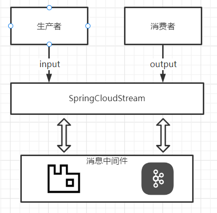

### 常用注解与API

| 组成           | 说明                                                         |
| -------------- | ------------------------------------------------------------ |
| Middleware     | 中间件，目前只支持RabbitMQ和Kafka                            |
| Binder         | Binder是应用消息中间件之间的封装，目前实现了Kafka和RabbitMQ的Binder，通过Binder可以很方便的连接中间件，可以动态的改变消息类型（对应于Kafka的topic和RabbitMQ的exchange），这些都可以通过配置文件来实现 |
| @Input         | 注解标识输入通道，通过该输入通道接收到的消息进入应用程序     |
| @Output        | 注解标识输出通道，发布的消息将通过该通道离开应用程序         |
| @StreamListent | 监听队列，用于消费者的队列的消息接收                         |
| @EnableBinding | 指信道channel和exchange绑定在一起                            |

### 简单生产者

> 本次案例使用RabbitMQ作为消息中间件，并且编写生产者使用Stream往消息中间件推送消息，若没使用过RabbitMQ请阅读的RabbitMQ文章
>
> [RabbitMQ-基础(四大核心概念、六大模式、消息应答、持久化、分发逻辑、主题模式、延迟队列)](https://blog.csdn.net/weixin_44642403/article/details/120931674)

**依赖引入**

> 引入stream依赖

~~~xml
<dependency>
    <groupId>org.springframework.cloud</groupId>
    <artifactId>spring-cloud-starter-stream-rabbit</artifactId>
</dependency>
~~~

**编写yml**

> 编写配置文件，配置通道以及rabbitmq的连接配置

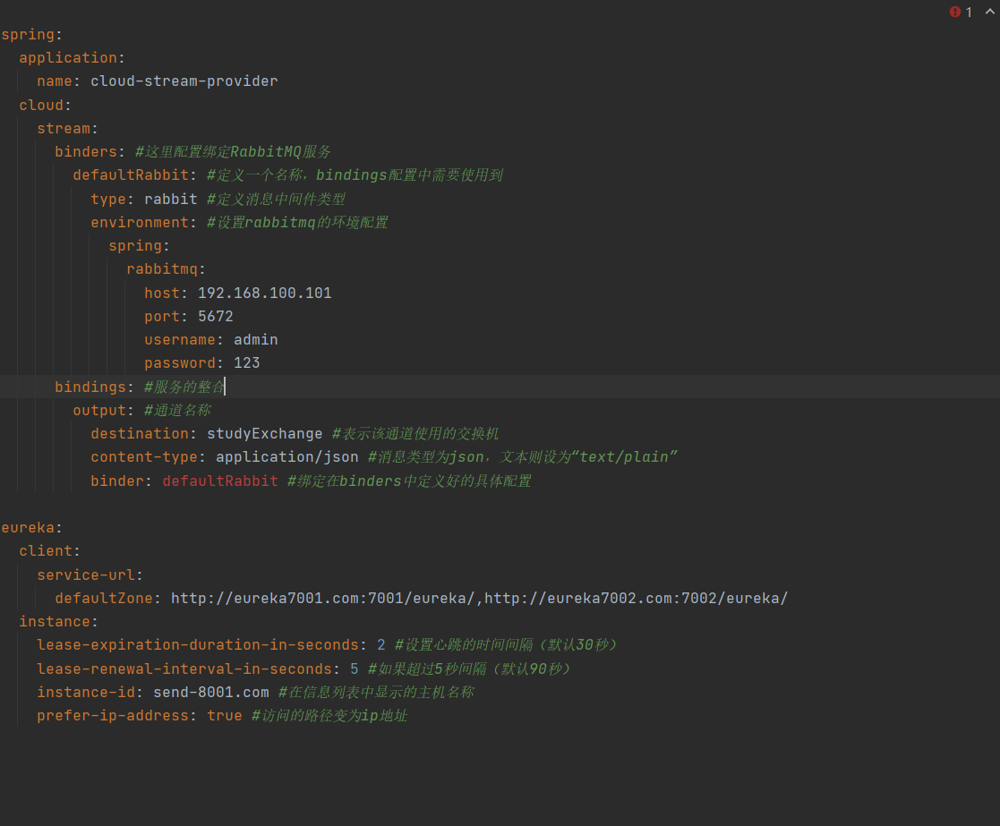

**编写Service**

> 编写业务类，注意Service的实现类不再使用`@Service`主机了，而是使用`@EnableBinding(Source.class)`标记该类为消息生产者，并且引入`MessageChannel`用于发送消息

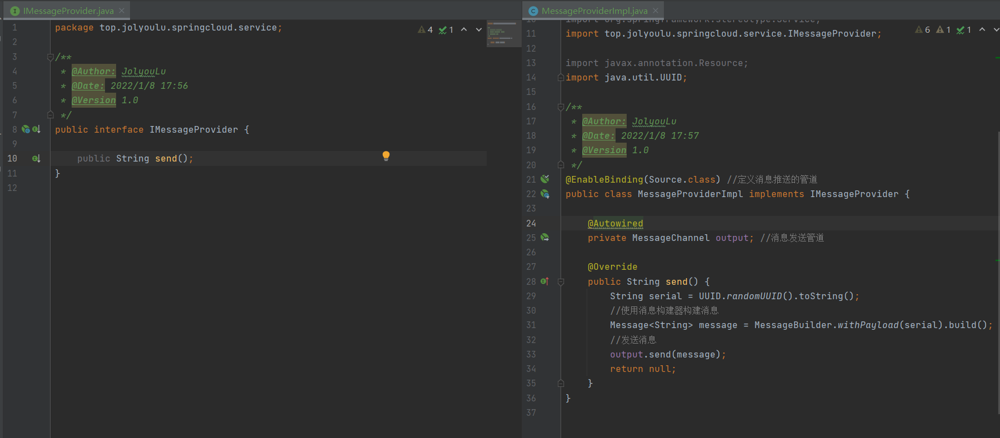

**编写Controller**

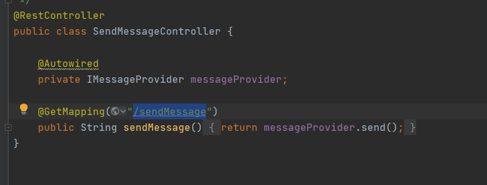

**测试**

> 可以看到再RabbitMQ中自动创建了一个名为`studyExchange`的交换机，并且我发送请求时RabbitMQ交换机能收到发送的消息表示成功

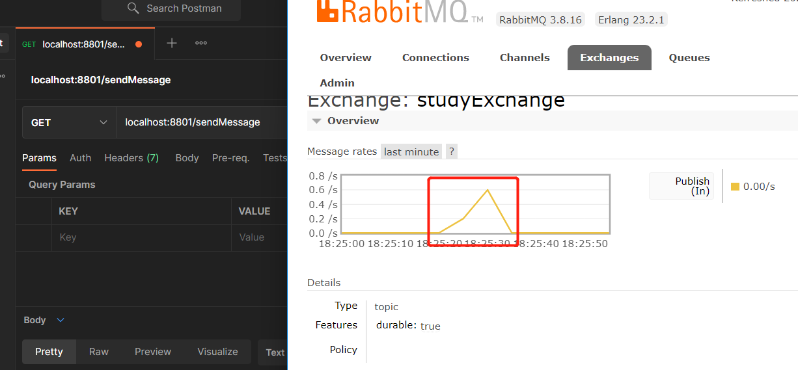

### 简单消息者

> 本次案例使用RabbitMQ作为消息中间件，并且编写消费者使用Stream往消息中间件获取消息，若没使用过RabbitMQ请阅读的RabbitMQ文章
>
> [RabbitMQ-基础(四大核心概念、六大模式、消息应答、持久化、分发逻辑、主题模式、延迟队列)](https://blog.csdn.net/weixin_44642403/article/details/120931674)

**依赖引入**

> 引入stream依赖

~~~xml
<dependency>
    <groupId>org.springframework.cloud</groupId>
    <artifactId>spring-cloud-starter-stream-rabbit</artifactId>
</dependency>
~~~

**编写yml**

> 编写配置文件，配置通道以及rabbitmq的连接配置，于生产者唯一不同的地方就是，通道生产者使用的是`output`消费者使用的是`input`

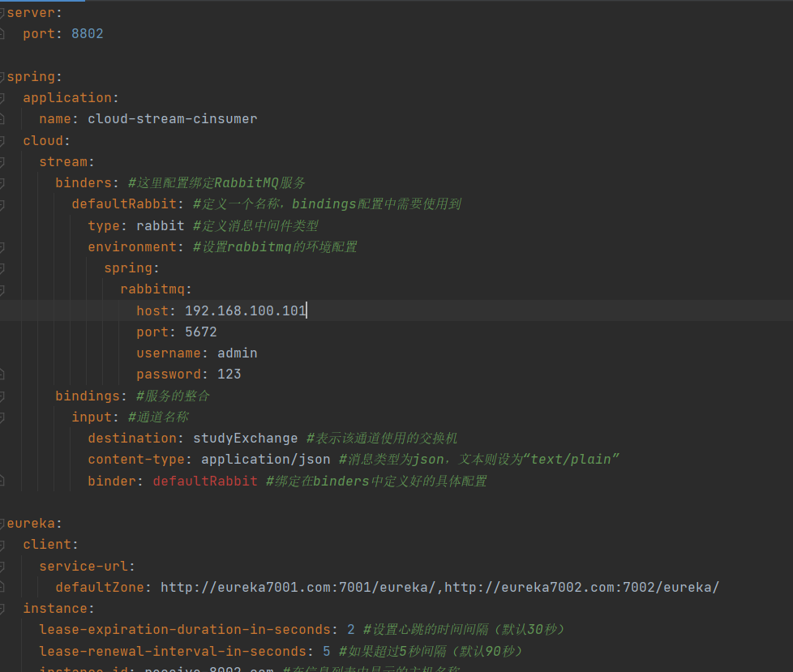

**编写Controller**

> 编写一个Controller用于消费消息，消费者使用的是`@EnableBinding(Sink.class)`绑定交换机，使用`@StreamListener(Sink.INPUT)`监听消息

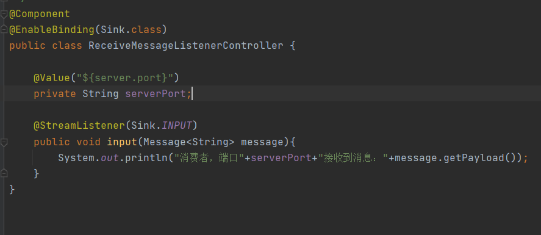

**测试**

> 生产者发送的消息到交换机后，消费者就会自动对消息进行消费

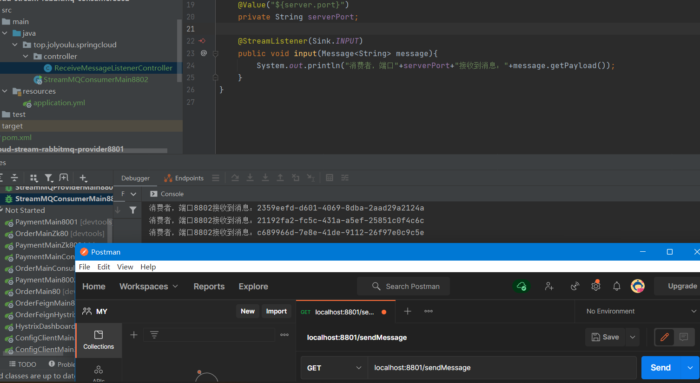

### 分组消费与持久化

> 前面的简单案例是带大家入门，只是简单的运用在工作上还是不够的，接下来说一下高级操作分组消费与持久化

#### 重复消费

> 案例重演，假如当前存在1个生产者2个消费者，那么如果生产者向队列中发送一条消息会发送什么

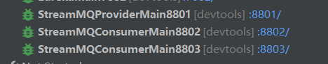

> 可以发现消息被8802和8803同时消费了，那么这样就存在一个问题消息的重复消费

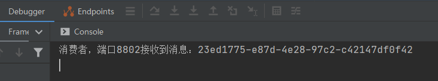

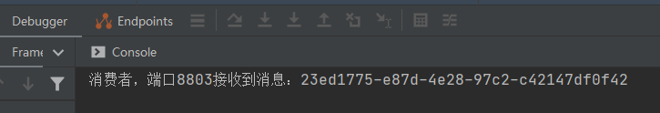

**引发的原因**

> 登录到RabbitMQ的后台，并且找到studyExchange交换机进入可以看到，当前交换机下有2个队列
>
> 这个就是重复消费的原因了，若学过RabbitMQ的同学都明白，当交换机收到消息后会将消费发送到绑定的所有队列中，由于Stream的消费者启动后若为配置分组就会在交换机下创建一个队列并且绑定交互，那么以为着多个消费者不同的通道同一个交换机，那么就会照成消息的重复消费
>
> 解决办法很简单只需要让这2个消费者监听同一个队列，多个消费者消费相同队列时它们是竞争的关系，就不会被重复消费了，在Stream中只需要指定多个消费者同一个分组后即可实现，多个消费者绑定相同的队列

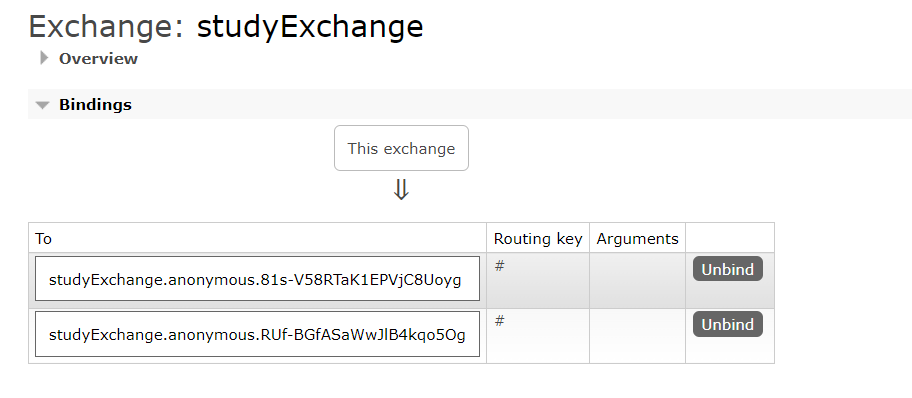

**解决方案**

> 利用Stream的分组解决该问题，在Stream中处于同一个group中的多个消费者是竞争关系，就能够保证消息只会被其中一个应用消费一次，只需要修改yml文件中的group将多个消费者定义为同一个分组中即可

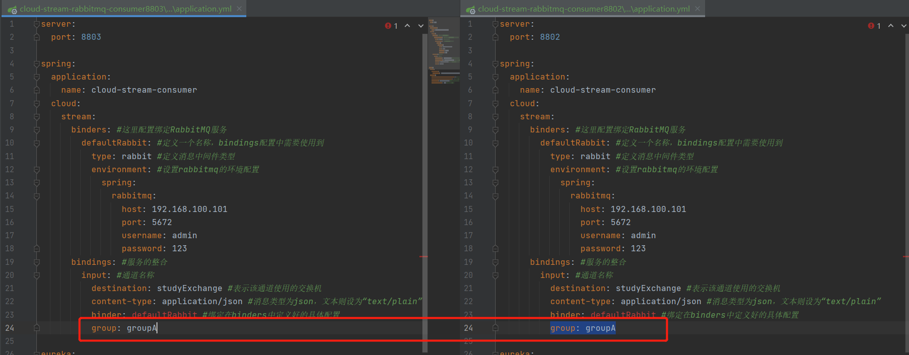

#### 持久化

> 若消息消费者未指定group那么，如果消费者单机后重新会重新创建一个队列连接上交换机那么会产生一个问题就是消息的丢失，解决这个问题也是给所有消费者指定分组，那么消费者在掉线后重启还是连接的相同的分组这样之前发送到交换机的消息会被保留到队列中知道消费者连接上进行消费