# SpringCloud熔断限流

## 分布式调用链

> 在微服务架构下，由于业务的逻辑实际就是服务与服务之间的远程调用，当一些复杂业务时那么会调用多个服务，这些被调用的服务会像链条一样一环扣一环的执行称为调用链，当调用链中其中一个环节发生了异常、响应超时，那么可想而知这会对整个业务照成很大影响

## 高并发下性能问题

> 在高并发下一套应用很有可能会被一个业务处理极慢的接口拖死，由于业务处理较慢接口并发量过高那么就会有很多线程被打开处理业务，并且未能及时返回最终导致新的请求进入后tomcat线程池中已没有空余线程池分配给新的请求，随着并发的增高请求阻塞的累计最终导致服务宕机

**高并发下演示**

> 首先准备2个接口
>
> 1. `/payment/hystrix/timeOut/{id}` （该接口会sleep3秒模拟业务处理时长）
> 2. `/payment/hystrix/ok/{id}`（该接口无sleep表示该业务可以立刻返回结果）

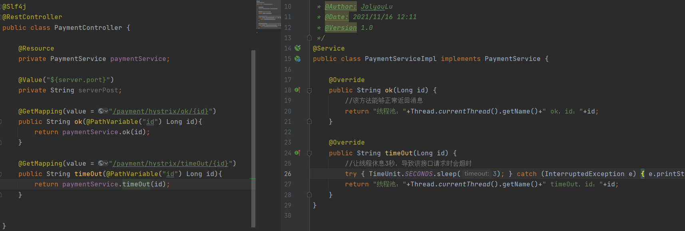

**在非高并发情况下测试接口**

> 从测试结果中看到非高并发情况下，接口的响应时间都在预料之中
>
> `/hystrix/ok `接口在10多毫秒内就返回了结果
>
> `/hystrix/timeOut`接口由于使用了sleep方法让线程阻塞3秒，所以响应结果3秒多一点

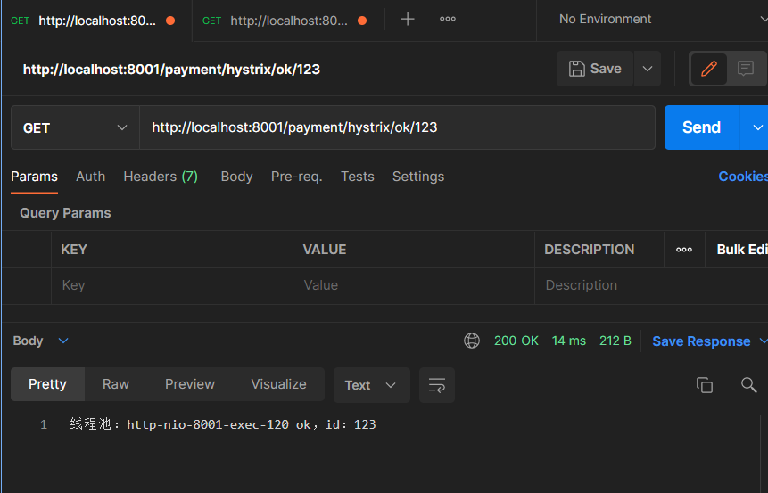

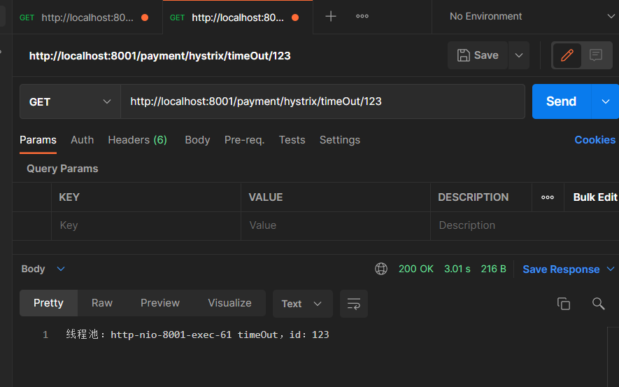

**在高并发环境下测试接口**

> 假如我现在使用`Jmeter`对`/hystrix/timeOut`接口进行压测，模拟2W个线程的发访问`/hystrix/timeOut`接口，可以发现在并发时我去访问`/hystrix/ok `居然需要2秒时间，这就是由于某个业务请求并发量过高并且处理时间较长，拖累了整个系统其它接口的响应时长，这种情况下是非常危险的这是服务器如果并发持续增加，整体的响应就会越来越慢最终导致大量请求超时，服务器宕机
>
> 解决这种问题
>
> 1. 优化业务慢的接口
> 2. 在接口无法进行优化的情况下，服务降级/服务熔断

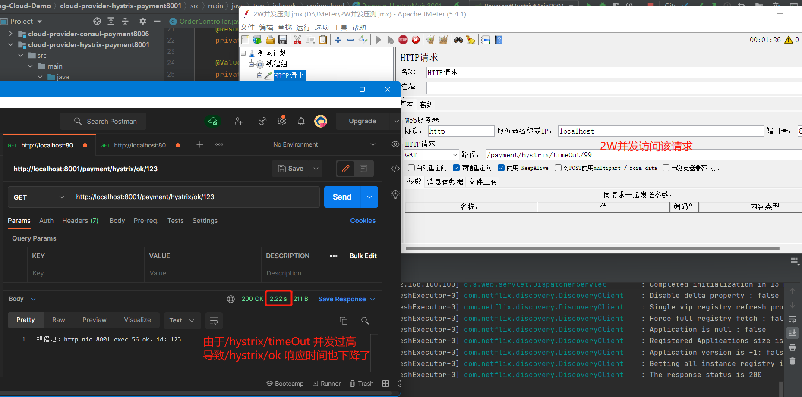

## Hystrix

> Hystrix是一个用于处理分布式延迟和容错的开源库，在分布式系统中，许多依赖不可避免的会调用失败，比如超时、异常等，Hystrix能够保证在一个依赖出问题的情况下，不会导致整体服务失败，避免级联故障，以提高系统的弹性
>
> “断路器”，本身是一种开关装置，当某个服务单元发生故障后，通过断路器的故障监控，向调用方返回一个符合预期的、可处理的备选响应(FallBack)，而不是长时间的等待或者抛无法处理的异常，这就可以保证整个调用链执行的效率，和执行的完成度

### Hystrix重要概念

**服务降级**

> 服务降级作用在服务`消费者`的上的，当一个消费者向服务提供者发送的请求时发送异常、超时，通过fallback返回一个友好提示给前端用户
>
> 发送服务降级的情况
>
> 1. 程序运行异常
> 2. 超时
> 3. 服务熔断触发降级
> 4. 线程池/信号量打满也会导致服务降级

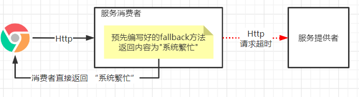

**服务熔断**

> 服务熔断作用在服务`提供者`的上的，如家中的保险丝，当某一个服务提供者达到最大的服务量后，为了防止由于请求量过大导致的宕机，这时服务提供者就会触发熔断，直接返回友好提示
>
> 发送服务降级的情况
>
> 1. 服务熔断的发送，一般会在服务降级只会发生

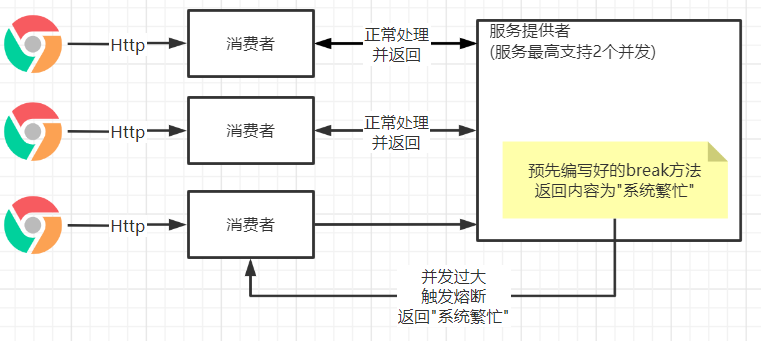

**服务限流**

> 在高并发等操作下，为了防止瞬间大量的请求打到服务器上导致服务器宕机，那么需要进行限流

### Hystrix服务降级

> 当一个微服务的一个方法执行时间过长或执行时出现问题就会被降级，返回预设好的`fallbackMethod`方法

#### 提供者中的降级

**修改Service**

> 使用`@HystrixCommand`标记该方法需要进行降级处理，并且指定该方法降级时调用那个`fallbackMethod`处理，`commandProperties`中设定触发降级的条件

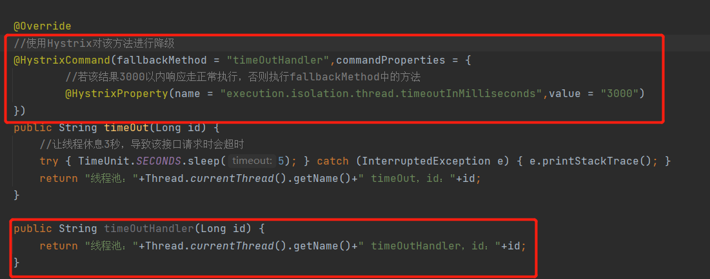

**修改启动类**

> 在主启动类中开启断路器即可

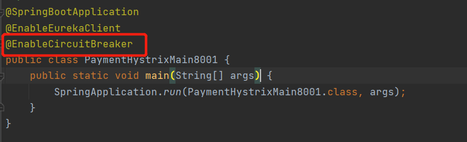

**测试**

> 可看到当前接口在3秒后还未响应，就会被交由预设定好的`timeOutHandler`方法处理了

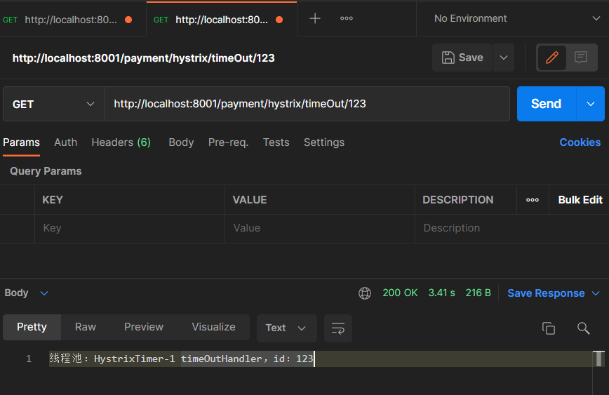

#### 消费者中的降级

**yml**

> 在yml中开启降级

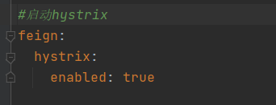

**修改启动类**

> 在启动类上加上`@EnableHystrix`注解

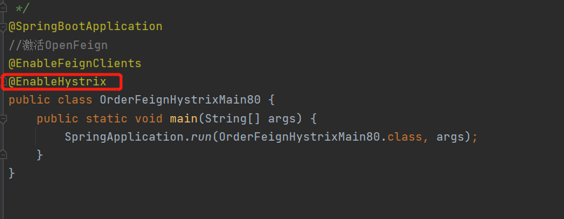

**Controller**

> 修改Controller增加熔断的方法

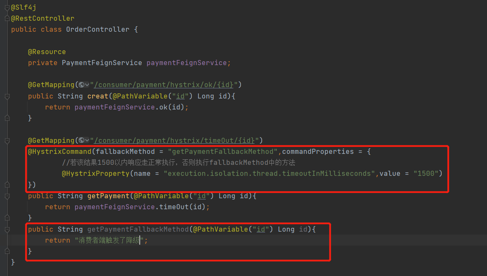

**测试**

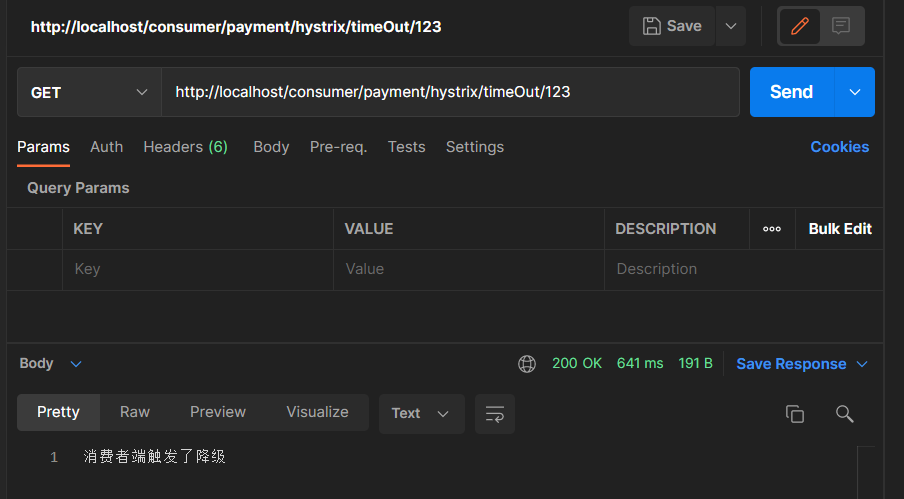

#### 全局服务降级

##### 基于控制层

> 在前面的编写时可以发现，每一个方法都需要一个降级的处理方法，那么假如我有100个方法这样就会产生很多的冗余代码，通过Global Fallback来设置全局的默认降级方法这样可以解决问题

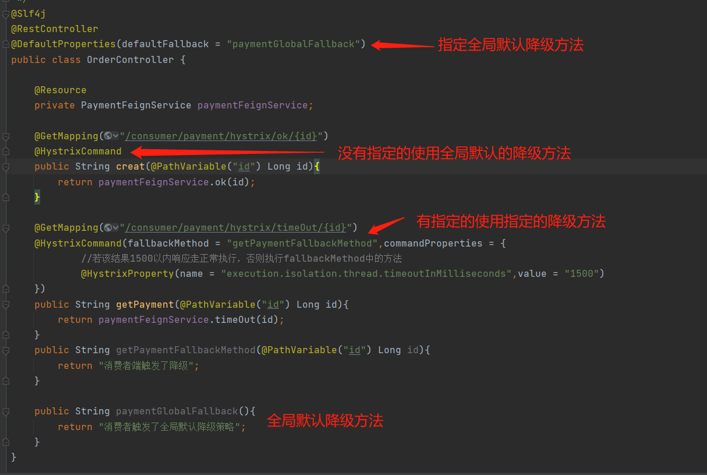

##### 基于Feign

> 若框架消费者使用的是Feign做远程调用的话，那么可以将服务降级做在Feign中，这样可以更加的松耦合

**yml**

> 在yml中开启降级

**PaymentFallbackService**

> 编写PaymentFallbackService实现PaymentFeignService，用于处理对应接口降级时的响应

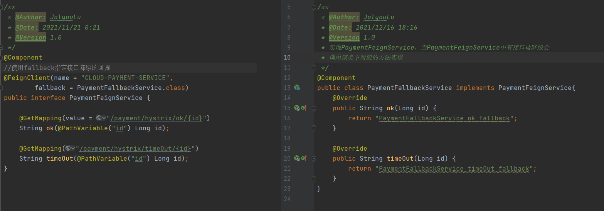

**测试**

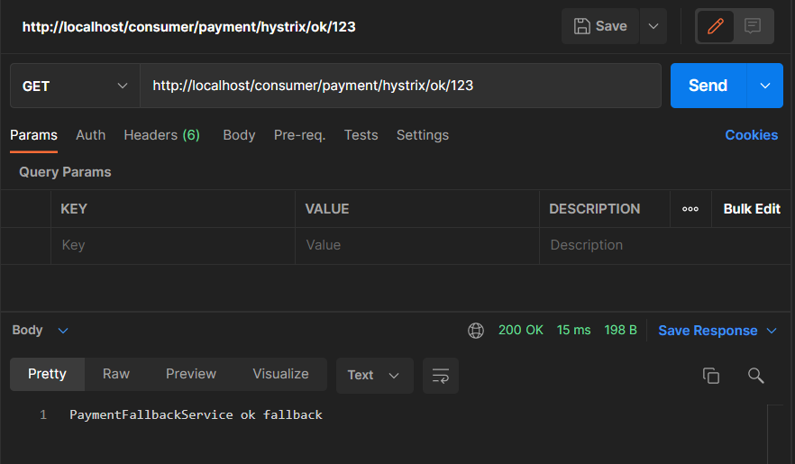

### Hystrix服务熔断

> 服务熔断，类似于保险丝达到最大服务后，直接解决访问，然后调用降级的方法返回友好提示
>
> 熔断机制是用于应对微服务链路保护机制，当链路中的节点出错不可用了或响应时长太长会进行服务降级，而熔断该节点的调用，快速返回错误消息，当检测到节点微服务调用响应正常后，恢复链路
>
> 服务熔断与服务降级最大区别是，能自我恢复，当某一个节点被熔断后检测到节点正常会恢复正常服务，而降级则不会，在SpringCould框架里，熔断机制通过Hystrix实现，Hystrix会监控微服务间的调用状况，当失败的调用到一定阈值，缺省是5秒内20次调用失败，就会启动熔断机制，熔断机制的注解是@HystrixCommand

#### 开启断路器

> 断路器的开启只需要在降级的基础上直接断路器的参数即可开启断路器，这里有几个主要参数是时间窗口、请求次数、失败率，即在一个时间窗口内失败率达到请求次数的阈值，开启熔断
>
> 熔断开启后正常的请求都会被降级，一段时间后(默认5秒)熔断器会进入一个半开的状态，会放1个请求过来尝试执行业务代码，如果能够正常执行并且返回正常结果，那么熔断就会关闭，若还是失败那么断路器会持续着开启，等待下一次半开状态检测服务是否正常

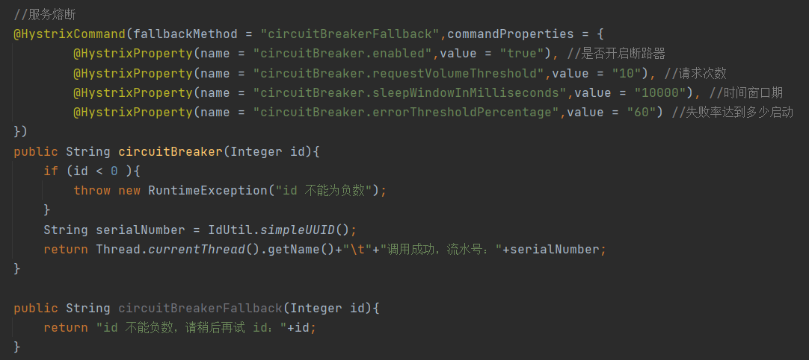

### Hystrix服务监控

> Hystrix服务监控是一个图形化监控界面，可以更方便的查看到服务状态

#### 服务搭建

> 创建一个空微服务项目

**依赖引入**

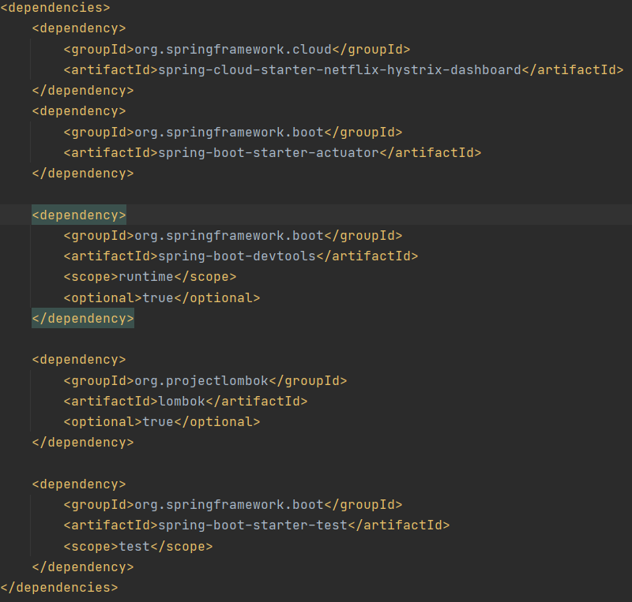

**yml**

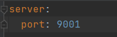

**启动类**

> 启动类中添加`EnableHystrixDashboard`注解

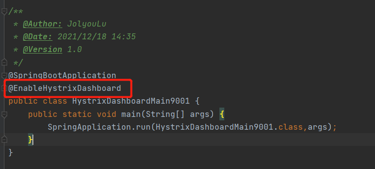

**启动服务**

> 服务启动成功后，服务`http://localhost:9001/hystrix`可以看到如下界面表示Hystrix监控启动成功

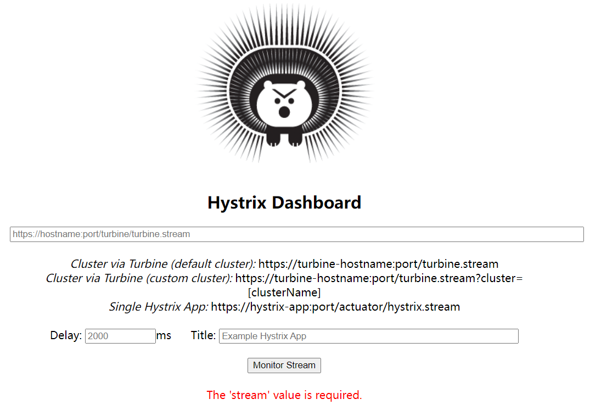

#### 服务监控使用

**连接监控**

> 只需要填入`http://服务域名/hystrix.stream` 即可监控指定的服务

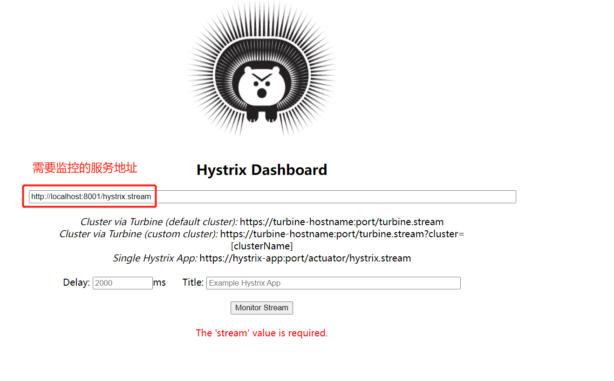

#### 监控面板说明

> 进入到Hystrix监控面板中，一图搞定所有

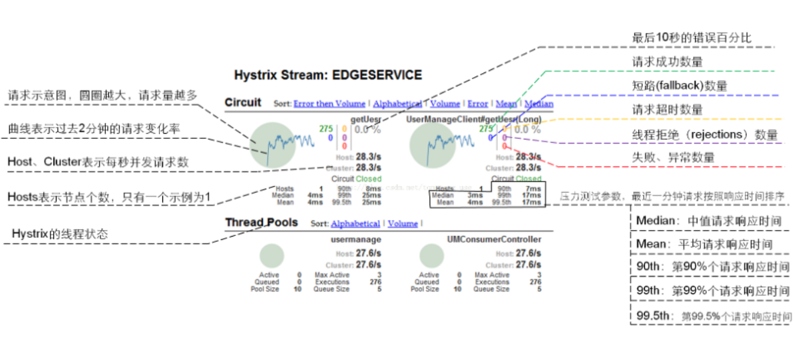

#### 存在的坑

> 新版的SpringCloud，连接需要监控的服务后会出现`Unable to connect to Command Metric Stream` 无法使用监控工具连接上

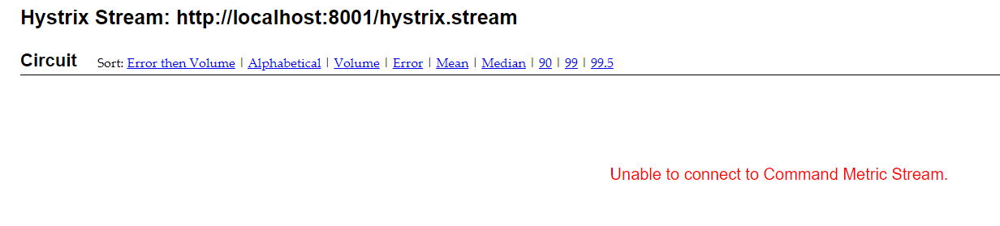

**解决方案**

>  只需要在`被监控`的服务启动类加上如下配置即可

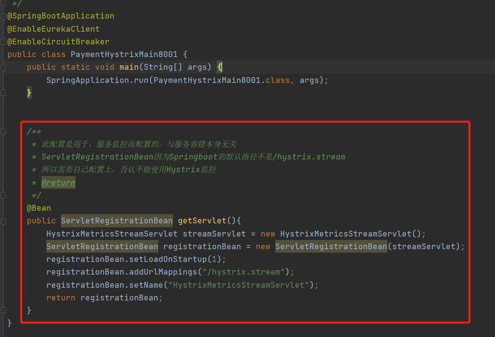

