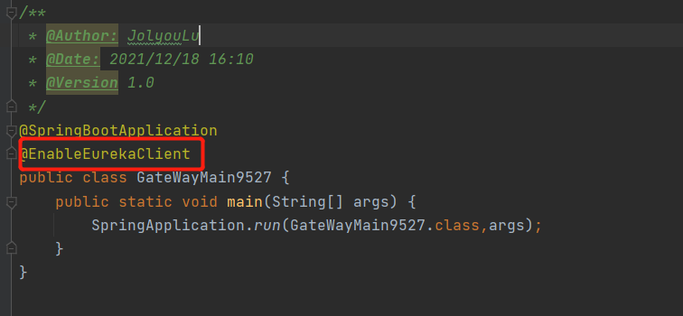

# SpringCloud网关路由

## GateWay

> GatWay即网关，他就像守门的安保人员，他是整个微服务架构的组成部分，主要功能是为服务提供过滤、熔断、限流、重试等功能

### 基本介绍

> SpringCloud Gateway 使用的Webflux中的reactor-netty响应式编程组件，底层使用了Netty通信框架，使得Gateway 在高并发下有很好的性能，若想了解Netty框架可以阅读我的专栏[JAVA网络编程](https://blog.csdn.net/weixin_44642403/category_10325897.html?spm=1001.2014.3001.5482)
>
> GateWay能干什么？ 反向代理、鉴权、流量控制、熔断、日志监控等

### 三大核心

> Route(路由)：路由是构建网关的基本模块，它由ID、目标URI、一系列的断言和过滤器组成，如果断言为true则匹配该路由
>
> Predicate(断言)：参考的是Java8的java.util.function.Predicate开发人员可以匹配HTTP请求中的所有内容(例如请求头或请求参数)，如果请求与断言相匹配则路由
>
> Filter(过滤)：指的是Spring框架中GatewayFilter的实例，使用过滤器，可以在请求被路由前或之后对请求进行修改

### 基础服务搭建

**依赖引入**

> 使用gateway需要在工程中引入spring-cloud-starter-gateway依赖即可

 ```xml
 <dependency>
     <groupId>org.springframework.cloud</groupId>
     <artifactId>spring-cloud-starter-gateway</artifactId>
 </dependency>
 <dependency>
     <groupId>org.springframework.cloud</groupId>
     <artifactId>spring-cloud-starter-netflix-eureka-client</artifactId>
 </dependency>
 ```

**注意：不要在gateway中引入如下依赖，否则无法正常启动服务**


**yml**

> 修改yml，让网关注册到注册中心上


**主启动类**

> 主启动类中增加如下注解，即可



### 配置静态路由

> 路由的配置通过修改GatWay服务的yml，也可以写代码方式

#### yml配置路由

> 当前有一个8001服务，现在我们不能通过8001服务需要结果路由即通过9527去访问8001服务，那么我们需要配置路由匹配相应的请求并且将其转发到8001服务上


**测试**

> 通过路由访问8001服务


#### 代码配置路由

> 在代码中注入RouteLocator的Bean也可以配置到路由信息，现在我们通过编码的方式将自己的9527服务代理到百度新闻

**编写配置类**

> 编写一个RouteLocator的配置类，并且配置好路由信息


**测试**

> 通过本地的9527服务调整到百度新闻


### 配置动态路由

> 在前面的静态路由配置可以看到uri都是写死的，但在微服务下，服务提供者数量都是不确定的所有不能使用静态路由实现，需要使用动态路由以服务名来作为路由路径，实现动态路由转发

#### yml配置路由

> 首先准备2个服务名相同的服务，分别是8001，8002


**测试**

> 向9527发起请求时，路由会将请求分配到8001和8002，分配方式是轮询


### Predicat的使用

> Predicat断言，是一个很重要的东西，它决定了你路由需要截取那些请求转发到哪里，在启动GateWay服务时，可以发现有一个叫RoutePredicateFactory工厂加载了好多东西，可以发现其中`Path`就是我们前面在yml中配置的东西，接下来就讲解一些其它断言的使用，会让你路由配置更上一层楼
>
> [官方文档对11种断言的说明](https://docs.spring.io/spring-cloud-gateway/docs/current/reference/html/#gateway-request-predicates-factories)


#### After

> 限制在什么时间之后，该路由才会生效
>
> 场景：如版本迭代可指定新功能上线后在那个时间节点开始可以访问

~~~yml
#获取这个时间并带上时区的可以使用该方法活动
#ZonedDateTime now = ZonedDateTime.now();
#System.out.println(now);
predicates:
  - After=2021-12-19T13:09:05.996+08:00[Asia/Shanghai] #在这个时间节点后才会路由才会生效
~~~

#### Before

> 限制在什么时间之前，该路由生效
>
> 场景：配置After一起使用，使得某个接口在一个时间段内是可路由的，过期后无法路由

~~~yml
#获取这个时间并带上时区的可以使用该方法活动
#ZonedDateTime now = ZonedDateTime.now();
#System.out.println(now);
predicates:
  #该路由只会在2021-12-19日的 13-14点生效
  - After=2021-12-19T13:00:00.000+08:00[Asia/Shanghai] 
  - Before=2021-12-19T14:09:05.996+08:00[Asia/Shanghai] 
~~~

#### Between

> 对After与Before同时使用的场景进行了优化，使用Between可以代替同时写After与Before

~~~yml
#获取这个时间并带上时区的可以使用该方法活动
#ZonedDateTime now = ZonedDateTime.now();
#System.out.println(now);
predicates:
  #该路由只会在2021-12-19日的 13-14点生效
  - Between=2021-12-19T13:00:00.000+08:00[Asia/Shanghai],2021-12-19T14:09:05.996+08:00[Asia/Shanghai]
~~~

#### Cookie

> Cookie需要2个参数，一个是Cookie name，一个是正则表达式，路由会通过获取对应的Cookie name值和正则表达式匹配，如果匹配上的请求才会路由

~~~yml
predicates:
  #只对cookie中的token，是以cloud开头的请求路由才会跳转
  - Cookie=token,cloud\w*
~~~

~~~java
//正则表达式测试
public static void main(String[] args) {
    String str = "cloud123123";
    Pattern pattern = Pattern.compile("cloud\\w*");
    Matcher matcher = pattern.matcher(str);
    if (matcher.find()){
        System.out.println(matcher.group());
    }else {
        System.out.println("未匹配");
    }

}
~~~
#### Header

> Header需要2个参数，一个是Header name，一个是正则表达式，路由会通过获取对应的Header name值和正则表达式匹配，如果匹配上的请求才会路由

~~~yml
predicates:
  #只对Header中的token，是以cloud开头的请求路由才会跳转
  - Header=token,cloud\w*
~~~

#### Host

> 获取请求头中的Host，对匹配的域名进行路由

~~~yml
predicates:
  #只对Host带有**.test1.com域名的请求路由
  - Host=**.test1.com
~~~

#### Method

> 只对GET,POST方法路由

~~~yml
predicates:
  - Method=GET,POST
~~~

#### Path

> 对匹配的请求url路由
~~~yml
predicates:
  - Path=/payment/get/**
~~~

#### Query

> 对请求携带某一个param参数才会路由
~~~yml
predicates:
  #在param请求参数中带有id参数的请求才会路由
  - Query=id
~~~

### Filter的使用

> 在断言通过后，请求会进入到一条过滤链条过滤器，经过过滤链后请求才会被转发到微服务上处理，最后才会到达用户界面
>
> 生命周期两种
>
> 1. pre：请求前的过滤
> 2. post：请求后的过滤
>
> 种类分两种
>
> 1. GatewayFilter：单一的过滤器 [官方文档](https://docs.spring.io/spring-cloud-gateway/docs/current/reference/html/#gatewayfilter-factories)
> 2. GlobalFilter：全局的过滤器 [官方文档](https://docs.spring.io/spring-cloud-gateway/docs/current/reference/html/#global-filters)

#### GatewayFilter

> 单一过滤器其实与Predicat使用方法也是大同小异，由于涉及到30多种的使用方法这里就不多说了，官方文档有详细的说明，这里就不多说了因为时间开发过程中使用GlobalFilter过滤器会比较多


#### GlobalFilter

> GlobalFilter叫全局过滤器，也叫自定义过滤器，编写一个自定义过滤器从请求参数中获取uname，如果有这个参数就放行，没有就解决请求


**测试**

> 只有携带了uname参数的请求才能被正确的访问


