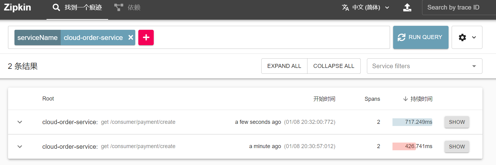

# SpringCloud请求链路跟踪

> 在微服务框架中，一个客户端发起的请求会在后端系统中，经过多个不同的服务节点，调用来协同产生最后的请求结果，那么就会形成一个复杂的调用链，在链路中任何一个环节出现高延迟或错误都会引起请求最后的失败

## Sleuth

> SpringCloudSleut的出现是为了监控在微服务环境下的后端服务的调用链，配合上zipkin可图形化展现请求的整个调用过程

## 链路监控的搭建

### ZipKinServer构建

> 从SpringCloud的F版起来已不需要自己构建ZipKin Server了，只需要调用jar包即可

**下载ZipKin**

> 进入到ZipKin官网，下载最新的jar包

**启动ZipKin**

> 执行`java -jar zipkin-server-2.23.16-exec.jar`启动ZipKin，看到如下图标表示启动成功

### Sleuth链路监控

> 为需要监控的微服务配置上相关依赖

**依赖引入**

~~~xml
<!--包含sleuth+zipkin-->
<dependency>
    <groupId>org.springframework.cloud</groupId>
    <artifactId>spring-cloud-starter-zipkin</artifactId>
</dependency>
~~~

**修改yml**

> 在yml中增加zipkin配置，指定发送到那个zipkin服务中

**测试**

> 在Zipkin中可以看到被监控的微服务的请求处理情况

