# SpringCloud负载均衡

## Ribbon

> SpringCloud Ribbon是基于net fix Ribbon实现的一套客户端负载均衡工具，Ribbon客户端提供一系列的完整配置项如链接超时，重试等

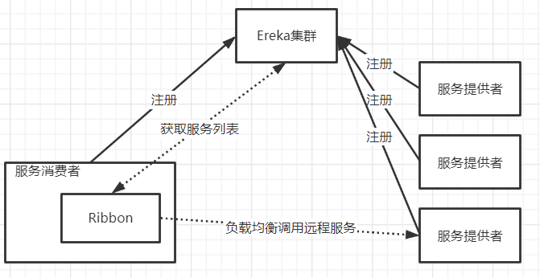

### Ribbon负载均衡使用

**依赖引入**

> 方式1：在Eureka-Client的包中已经默认引入了Ribbon所以无需再次引入额外的包了

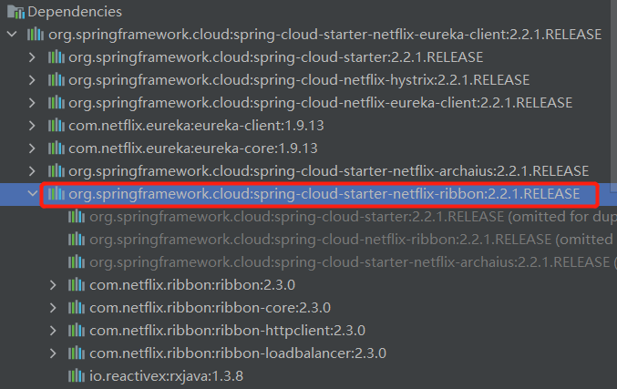

> 方式2：当然如果你pom中没有引入Eureka-Client包，那么直接在pom文件中添加如下内容即可

```xml
<dependency>
    <groupId>org.springframework.cloud</groupId>
    <artifactId>spring-cloud-starter-netflix-ribbon</artifactId>
</dependency>
```

**开启负载均衡**

> 使用`LoadBalanced`注解开启Ribbon负载均衡，只要使用RestTemplate发送请求时就会进入负载均衡，默认是轮询的负载均衡

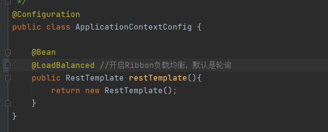

### Ribbon核心组件IRule

> IRule是一个为定义的LoadBalancer的一个接口，只需要实现该接口那么就可以修改默认的负载均衡方式，在Ribbon为我们提供了一些简单的负载均衡实现

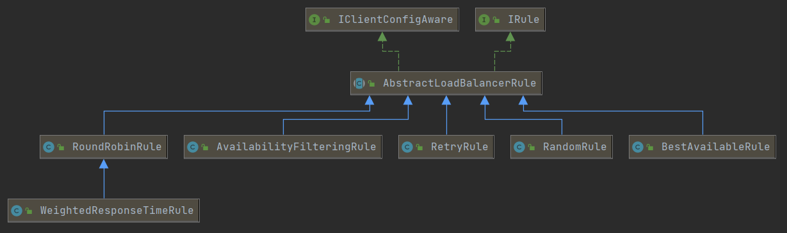

**常见的负载均衡实现**

| 实现类                    | 说明                                                         |
| ------------------------- | ------------------------------------------------------------ |
| RoundRobinRule            | 轮询                                                         |
| RandomRule                | 随机                                                         |
| RetryRule                 | 先按照RoundRobinRule的策略获取服务，如果获取服务失败在指定时间内会进行重试 |
| WeightedResponseTimeRule  | 对RoundRobinRule进行扩展，响应书店越快实例选择权重越大，越容易被选择 |
| BestAvailableRule         | 会先过滤掉由于多次访问故障而处于断路器跳闸状态的服务，然后选择一个并发量交小的服务器 |
| AvailabilityFilteringRule | 先过滤掉故障实例，再选择并发较小的实例                       |

### Ribbon负载均衡替换

> 在修改Ribbon负载均实现时，官方文档中明确给出如下警告
>
> 这个自定义配置类不能方在`@ComponentScan`所扫描的当前包的下以及子包下，否则我们自定义这个配置类会被所有Ribbon客户端所共享，达不到特殊定制的目的

**什么是不能方在`@ComponentScan`所扫描的当前包的下以及子包下**

> 意思就是不要让Ribbon的自定义配置类不能被SpringBootApplication扫描到，有SpringBoot基础同学都知道在SpringBoot在启动时，会默认装配自己同级别以及同级一下的所有Bean，按官方文档所说意思就是你编写的Ribbon的自定义配置类不能方到SpringBoot扫描路径下，需要独立出来，如图正确创建方法

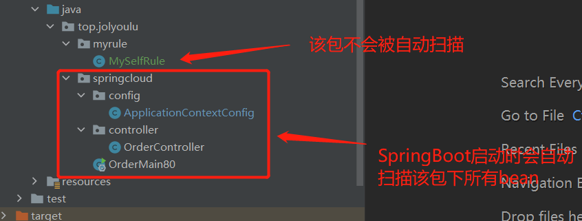

**编写bean**

> 修改负载均衡策略是随机，注意个类并不是放在SpringBoot扫描路径下的

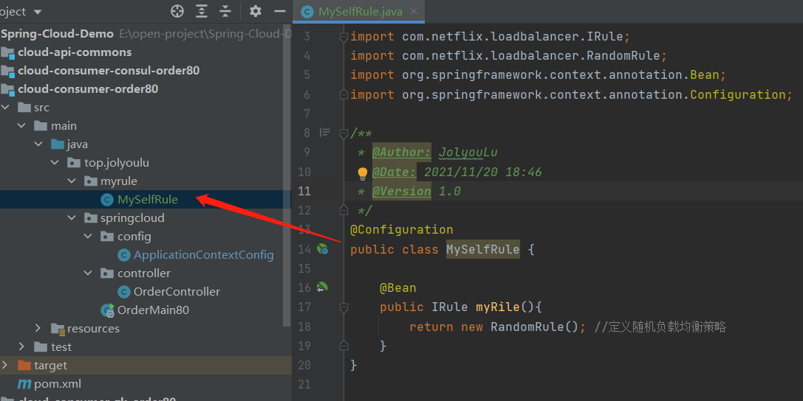

**装配负载均衡策略**

> 由于编写的MySelfRule并不是在SpringBootApplication的同级目录下，所有需要使用`RibbonClient`手动指定装配那个负载均衡策略

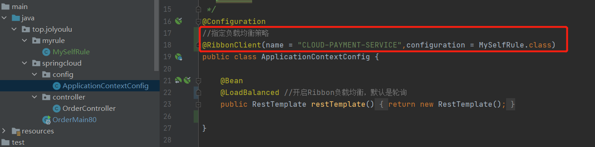

**为什么这样做**

> 之所以这样做的好处是可以按需设置负载均衡，我们可以按不同的服务使用不同的负载均衡策略

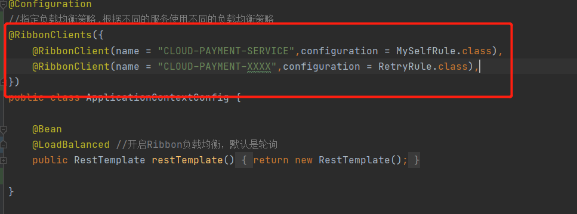

### Ribbon负载均衡原理

> Ribbon负载均衡原理首先需要弄明白几个问题
>
> 1. 客户端知道当前注册中心的实例列表
>
>    使用discoveryClient.getInstances("CLOUD-PAYMENT-SERVICE");从Eureka中获取当前可用服务列表，返回对象List对象
>
> 2. 如何计算得出下一台需要发请求给那个服务器
>
>    轮询算法：`rest的第几次请求 % 服务器集群总数 = 实际调用服务下班`每次重启后rest接口计数从1开始
>
>    如当前使用discoveryClient.getInstances("CLOUD-PAYMENT-SERVICE");获取List列表共2台机器
>
>    * list.get(0) = 127.0.0.1:8001
>    * list.get(1) = 127.0.0.1:8002
>
>    当发起第1个请求时，请求数1：1 % 2 = 1， 发请求到 list.get(1) = 127.0.0.1:8002 服务
>
>    当发起第2个请求时，请求数2：2 % 2 = 0， 发请求到 list.get(0) = 127.0.0.1:8001 服务
>
>    当发起第3个请求时，请求数3：3 % 2 = 1，l 发请求到 ist.get(1) = 127.0.0.1:8002 服务
>
>    当发起第4个请求时，请求数4：4 % 2 = 0， 发请求到 list.get(0) = 127.0.0.1:8001 服务

## OpenFeign

> OpenFeign是一个声明式的WebService客户端，使用Feign会让编写使用的更加的容易，使用方法也很简单，只需要创建一个接口并且在接口上添加注解即可

### OpenFeign使用

**引入依赖**

~~~xml
<dependency>
    <groupId>org.springframework.cloud</groupId>
    <artifactId>spring-cloud-starter-openfeign</artifactId>
</dependency>
~~~

**编写接口与注解**

> 编写一个service接口，这个接口上需要加上FeignClient注解，在接口中定义相关的方法，并且使用注解的方式指定该接口访问的服务提供者的url地址以及所带的参数

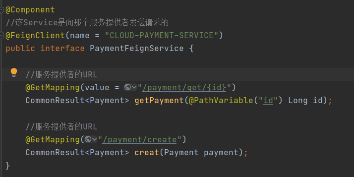

**修改启动类**

> 主启动类中需要添加`EnableFeignClients`注解开启OpenFeign

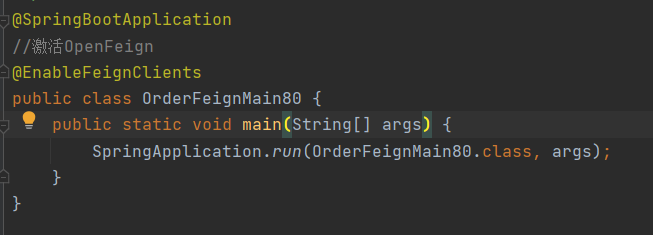

**编写controller**

> controller的编写只需要像平时那样使用自动注入，获取到service对象执行相应的方法即可

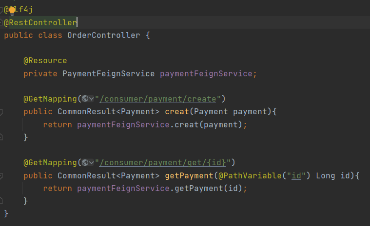

**测试**

> 可用从测试结果看出Feign默认是有负载均衡的，策略为轮询

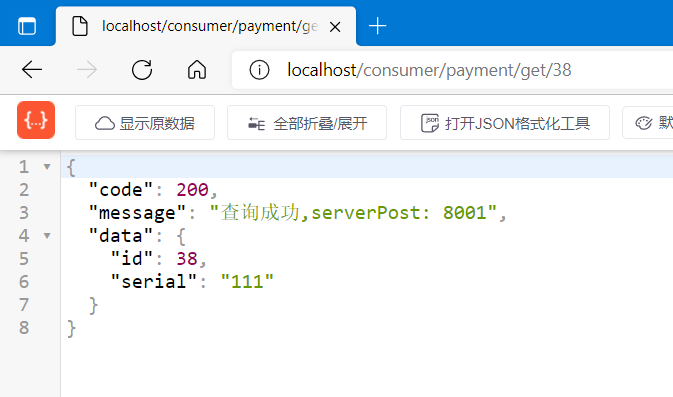

### OpenFeign超时控制

> 由于OpenFeign的底层是由Ribbon实现的，所有当需要设置接口超时时长修改ribbon配置即可

~~~yml
#设置feign客户端超时时间
ribbon:
  #设置请求建立连接后，两端所用的时间
  ReadTimeout: 5000
  #建立连接后收取到可用资源所用的最大时间
  ConnectTimeout: 5000
~~~

### OpenFeign日志打印

> Feign提供了日志打印功能，可以看到每一个请求的url、请求体、消息体等内容、方便调试

**日志级别**

| 类型    | 说明                                                    |
| ------- | ------------------------------------------------------- |
| NONE    | 默认、不显示任何日志                                    |
| BASIC   | 仅记录请求方法、URL、响应状态码及执行时间               |
| HEADERS | 除了BASIC中定义的信息之外，还有请求和响应的头信息       |
| FULL    | 除了HEADERS中定义的信息外，还有请求和响应的正文及元数据 |

**编写日志Bean**

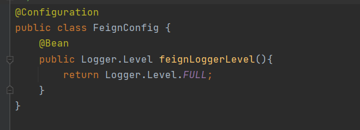

**修改yml**

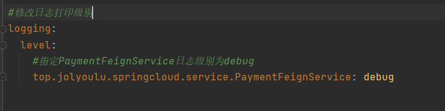

**测试**

> 可看到OpenFeign发送的每一个请求都会在日志中打印出来

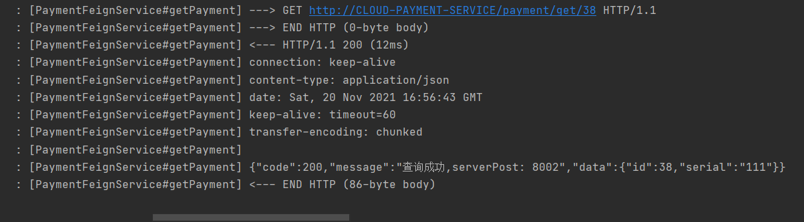