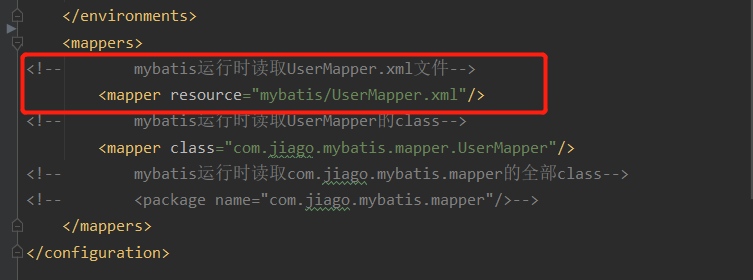
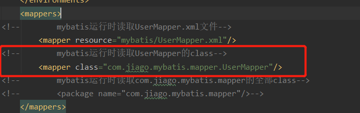

# Mybatis快速入门

该文档对应的项目都可通过github下载：https://github.com/JolyouLu/mybatis01.git  代码在test.mybatis下

## 传统JDBC的弊端

### 创建表

~~~sql
SET NAMES utf8mb4;
SET FOREIGN_KEY_CHECKS = 0;

DROP TABLE IF EXISTS `user`;
CREATE TABLE `user`  (
  `id` bigint(20) NOT NULL AUTO_INCREMENT COMMENT '主键',
  `username` varchar(255) CHARACTER SET utf8 COLLATE utf8_general_ci NULL DEFAULT NULL COMMENT '姓名',
  `age` int(4) NULL DEFAULT NULL COMMENT '年龄',
  `phone` bigint(20) NULL DEFAULT NULL COMMENT '手机',
  `desc` varchar(255) CHARACTER SET utf8 COLLATE utf8_general_ci NULL DEFAULT NULL COMMENT '说明',
  PRIMARY KEY (`id`) USING BTREE
) ENGINE = InnoDB AUTO_INCREMENT = 8 CHARACTER SET = utf8 COLLATE = utf8_general_ci ROW_FORMAT = Dynamic;

SET FOREIGN_KEY_CHECKS = 1;
~~~

### 使用传统jdbc编写crud

在我们每一次crud时我们都需要对数据库建立一次连接，首先我们需要一个工具类用来建立数据库连接与关闭数据库连接

##### 数据库连接工具类

~~~java
public class DbUtil {
    private static String driver;
    private static String url;
    private static String username;
    private static String password;
    static {
        driver="com.mysql.jdbc.Driver";//数据库驱动
        url="jdbc:mysql://localhost:3306/study?characterEncoding=utf8&useSSL=true";//地址
        username="root";//连接数据库用户名
        password="123456";//连接数据库密码
    }
    /**
     * 加载数据库驱动 并且连接数据库
     */
    public static Connection open(){
        try {
            Class.forName(driver);
            return (Connection) DriverManager.getConnection(url,username,password);
        }catch (Exception e){
            System.out.println("数据库连接失败！");
            e.printStackTrace();
        }
        return null;
    }
    /**
     * 关闭数据库连接
     */
    public static void close(Connection conn){
        if (conn !=null){
            try {
                conn.close();
            }catch (SQLException e){
                e.printStackTrace();
            }
        }
    }
}
~~~

##### 传参数insert语句

我们先写一个传参数来进行crud的例子

~~~java
public class Jdbc01 {
    public static void main(String[] args) {
        insert("test01",12);
    }
    //使用传参数 新增数据方法
    static void insert(String name,int age){
        //定义需要执行的sql
        String sql="insert into user(username,age) value(?,?)";
        //打开数据库连接
        Connection conn = DbUtil.open();
        try {
            //执行sql
            PreparedStatement pstmt =(PreparedStatement) conn.prepareStatement(sql);
            pstmt.setString(1,name);
            pstmt.setInt(2, age);
            pstmt.executeUpdate();
        }catch (SQLException e){
            e.printStackTrace();
        }finally {
            //关闭数据库连接
            DbUtil.close(conn);
        }
    }
}
~~~

##### 使用对象insert语句

首先我们需要一个user对象 该对象与数据库字段名字是完全一致的

~~~java
public class User implements Serializable {
    private Integer id;
    private String username;
    private Integer age;
    private String desc;
    //以下省略get set方法
}
~~~

新增以及查询方法

~~~java
public class jdbc02 {
    public static void main(String[] args) {
        User user = new User();
        user.setUsername("test02");
        user.setAge(18);
        insert(user);//插入数据方法
        User query = query(1);
        System.out.println("查询成功结果如下！");
        System.out.println(query);

    }

    static void insert(User user){
        //定义需要执行的sql
        String sql="insert into user(username,age) value(?,?)";
        //打开数据库连接
        Connection conn = DbUtil.open();
        try {
            PreparedStatement pstmt =(PreparedStatement) conn.prepareStatement(sql);
            pstmt.setString(1,user.getUsername());
            pstmt.setInt(2, user.getAge());
            pstmt.executeUpdate();
        }catch (SQLException e){
            e.printStackTrace();
        }finally {
            DbUtil.close(conn);
        }
    }

    static User query(int id){
        String sql="select * from user where id=?";
        Connection conn = DbUtil.open();
        try {
            PreparedStatement pstmt =(PreparedStatement) conn.prepareStatement(sql);
            pstmt.setInt(1,id);
            ResultSet rs = pstmt.executeQuery();
            if (rs.next()){
                String name = rs.getString(2);
                User user = new User();
                user.setId(id);
                user.setUsername(name);
                return user;
            }
        }catch (SQLException e){
            e.printStackTrace();
        }finally {
            DbUtil.close(conn);
        }
        return null;
    }
}
~~~

### 总结

经过上面几个方法的练习，我们可以发现使用jdbc连接数据库查询的代码量很多，而且每次进行crud时都需要创建和关联数据链接。很消耗资源，而且只要我们修改表结构后整个方法体都需要修改，sql就很难进行维护。

## Mybatis介绍

mybatis的官网https://mybatis.org/mybatis-3/zh/index.html

Mybaits简：MyBatis 是一款优秀的持久层框架，它支持定制化 SQL、存储过程以及高级映射。MyBatis 避免了几乎所有的 JDBC 代码和手动设置参数以及获取结果集。MyBatis 可以使用简单的 XML 或注解来配置和映射原生类型、接口和 Java 的 POJO（Plain Old Java Objects，普通老式 Java 对象）为数据库中的记录。

### 快速开始

在使用mybatis前我们需要引入相关依赖

~~~xml
<dependency>
    <groupId>org.mybatis</groupId>
    <artifactId>mybatis</artifactId>
    <version>3.4.6</version>
</dependency>
~~~

然后我们需要在resources目录下创建一个mybatis-config.xml配置文件

~~~xml
<?xml version="1.0" encoding="UTF-8" ?>
<!DOCTYPE configuration
        PUBLIC "-//mybatis.org//DTD Config 3.0//EN"
        "http://mybatis.org/dtd/mybatis-3-config.dtd">
<configuration>
    <typeAliases>
<!--     把com.jiago.mybatis.pojo.User定义别名user这样mapper文件resultType直接使用user就行不用写包路径-->
        <typeAlias type="com.jiago.mybatis.pojo.User" alias="user"/>
    </typeAliases>
    <plugins>
        <!--        日志拦截器插件-->
        <plugin interceptor="com.jiago.mybatis.plugin.SqlPrintInterceptor"></plugin>
    </plugins>
    <environments default="development">
        <environment id="development">
            <transactionManager type="JDBC"/>
            <dataSource type="POOLED">
                <property name="driver" value="com.mysql.jdbc.Driver"/>
                <property name="url" value="jdbc:mysql://localhost:3306/study?useSSL=true"/>
                <property name="username" value="root"/>
                <property name="password" value="123456"/>
            </dataSource>
        </environment>
    </environments>
    <mappers>
<!--        mybatis运行时读取UserMapper.xml文件-->
        <mapper resource="mybatis/UserMapper.xml"/>
<!--        mybatis运行时读取UserMapper的class-->
        <mapper class="com.jiago.mybatis.mapper.UserMapper"/>
<!--        mybatis运行时读取com.jiago.mybatis.mapper的全部class-->
<!--        <package name="com.jiago.mybatis.mapper"/>-->
    </mappers>
</configuration>
~~~

并在resources中创建一个mybatis文件夹下放我们的sql文件

~~~xml
<?xml version="1.0" encoding="UTF-8" ?>
<!DOCTYPE mapper
        PUBLIC "-//mybatis.org//DTD Mapper 3.0//EN"
        "http://mybatis.org/dtd/mybatis-3-mapper.dtd">
<mapper namespace="com.jiago.mybatis.UserMapper">
    <select id="selectUser" resultType="user">
    select * from user where id = #{id}
  </select>
</mapper>
~~~

当这些都准备好以后我们就可以编写我们的测试方法

#### 基础的sql查询

在测试之前我们需要配置一下mybatis的配置文件告诉mybatis需要扫描resources包下的xml文件这样他才能读取到xml的sql的id

~~~java
@Test //使用xml编写sql查询
    public void test() throws IOException {
        String resource = "mybatis-config.xml";
        //读取resources下的mybatis-config.xml配置文件
        InputStream inputStream = Resources.getResourceAsStream(resource);
        SqlSessionFactory sqlSessionFactory = new SqlSessionFactoryBuilder().build(inputStream);
        SqlSession sqlSession = sqlSessionFactory.openSession();
        //com.jiago.mybatis.UserMapper.selectUser  UserMapper.xml下的id为selectUser的语句
        User user = sqlSession.selectOne("com.jiago.mybatis.UserMapper.selectUser", 1);
        System.out.println("查询结果："+user);
    }
~~~

#### 注解式sql查询

注解式的sql查询我们只需要编写一个UserMapper的接口并且把我们需要的查询语句写在@select()

~~~java
public interface UserMapper {
    @Select("select * from user where id = #{id}")
    public User selectUser(Integer id);
}

~~~

测试注解式查询

在测试之前我们需要配置一下mybatis的配置文件告诉mybatis需要扫描mapper包下的class文件这样他才能读取

~~~java
@Test //使用注解编写sql查询
    public void test2() throws IOException {
        String resource = "mybatis-config.xml";
        //读取resources下的mybatis-config.xml配置文件
        InputStream inputStream = Resources.getResourceAsStream(resource);
        SqlSessionFactory sqlSessionFactory = new SqlSessionFactoryBuilder().build(inputStream);
        SqlSession sqlSession = sqlSessionFactory.openSession();
        UserMapper mapper = sqlSession.getMapper(UserMapper.class);
        User user = mapper.selectUser(1);
        System.out.println("查询结果："+user);
    }
~~~

### 总结

#### Mybatis注解开发与xml开发的优缺点

xml优点：sql集中于一个文件中，方便查询和修改，因为不是java文件每次编辑后无需重新编译

xml缺点：xml文件编写起来比较麻烦，容易出错，一些如“<,>”符号在xml是特殊符号需要使用转义才能运行

注解优点：调用方便，没有需要转义符号的烦恼

注解缺点：修改和查询sql比较难，对于一些多层嵌套查询的sql可读性会很差，而且很乱

#### Mybatis中$于#的区别

#：预编译的可以防止sql注入（推荐）

$：占位符，无法反正sql注入

#### Mybatis之parameterType 与 parameterMap 区别

一般情况都是使用默认的很少很少修改，通过 parameterType 指定输入参数的类型，类型可以是简单类型、hashmap、pojo 的包装 类型 

#### Mybatis 之 resultType 与 resultMap 区别

resultType就是查询返回结果映射到你指定的bean对象

resultMap你可以把你查询的结果映射成一个你想要的map容器或者list容器，前提是你需要编写一段<resultMap>

#### Mybatis的plugin

plugin是写在mybtais的配置文件中用于配置各种插件，如github项目中就配置了显示sql的插件，他相当于一个拦截器把连接的数据打印在后台