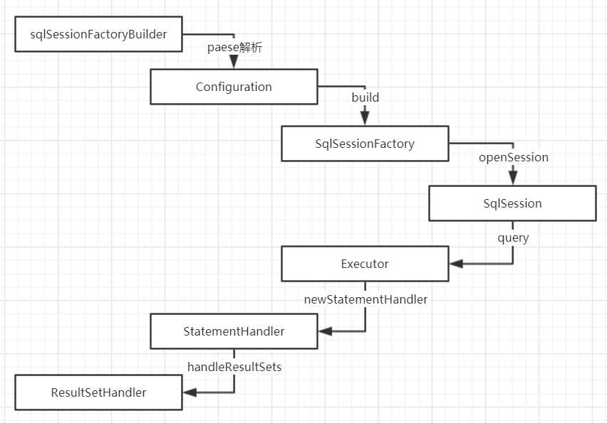

# Mybatis核心概念

## Mybatis核心概念

在手写Mybatis前我们先了解一些Mybatis的核心类的用处

Mybaits的核心类有一下几个：Configuration、SqlSessionFactory、SqlSession、Executor、MappedStatement、 StatementHandler、ResultSetHandler 

|       名称        |                             意义                             |
| :---------------: | :----------------------------------------------------------: |
|   Configuration   |         管理，读取，解析mybatis-config全局配置关系类         |
| SqlSessionFactory |           Session管理工厂接口，用来获取SqlSession            |
|    SqlSession     | SqlSession 是一个面向用户（程序员）的接口。SqlSession 中提 供了很多操作数据库的方法 |
|     Executor      |             SqlSession 内部通过执行器操作数据库              |
|  MappedStatement  |      对操作数据库存储封装，包括 sql 语句、输入输出参数       |
| StatementHandler  |              具体操作数据库相关的 handler 接口               |
| ResultSetHandler  |            具体操作数据库返回结果的 handler 接口             |

## 整体认识 mybatis 源码包 

​                ├─annotations 		  ->注解相关 比如 @select @insert 
​                ├─binding     			  -> mapper 相关 
​                ├─builder     			  ->解析 xml 相关 
​                ├─cache      			  ->缓存 
​                ├─cursor    			   -> 返回结果 resultset 
​                ├─datasourcer  		 ->数据管理  
​                ├─exceptionsr          -> 异常 
​                ├─executorr              -> 执行器 
​                ├─io                          ->classloader 
​                ├─jdbc                       ->jdbc 
​                ├─lang                      ->jdk7 jdk8 
​                ├─logging                 ->日志相关 
​                ├─mapping               ->mapper 相关的封装 
​                ├─parsing                 ->xml 相关解析 
​                ├─plugin                    ->拦截器 
​                ├─reflection               ->反射相关 
​                ├─scripting                ->数据厂家 
​                ├─session                 ->sessiomn 
​                ├─transaction            ->事务 
​                └─type                       ->返回类型对应 

## Mybatis是如何运行的

大概流程mybatis执行时sqlSessionFactoryBuilder调paese方法解析你传入的mybatis配置文件，解析后会拿到一个Configuration的对象，调用一个build把解析好的Configuration传入你会获取到一个SqlSessionFactory对象，这个对象已经存着Configuration的配置了因为你在用build方法时已经传入，在通过openSession方法时他会获取我们配置文件中的数据库连接参数，开启一个事务，获取一个执行器SimpleExecutor，在获取完SimpleExecutor后还会获取一个CachingExecutor执行器，CachingExecutor非常非常重要，CachingExecutor就是一级缓存，这里可以说明myabtis一级缓存是默认开启的，然后还会通过pluginAll遍历配置文件判断是否有插件，最后我们会获取到一个executor，把executor装回SqlSession中这样我们的SqlSession就已经可以做数据库操作了，接下来我们调用selectOne方法其实底层调用的是executor的query方法，调用query方法前会通过一个你传入的statement去获取MappedStatement存放返回值类型，已经sql的索引，然后调用query方法，通过索取去获取sql语句，并且创建一个缓存createCacheKey，继续调用query调之前他会去先去通过id查询Cache看有没有值，因为我们是第一次查询所以里面是没有值的所以他会继续调用delegat.query方法真正的查询数据库方法，这时候他会new一个StatementHandler并调用他的query方法（真正的查询在这里）最后会返回ResultSetHandler我们的结果集

## debug跑一遍Mybatis

经过上面的简介想必大家也大概了解了mybatis是怎么运作，但是光说还是比较抽象，现在跟着我的脚本我们来一段一段的debu跑一遍mybatis

首先我们编写一个test方法

~~~java
@Test //使用xml编写sql查询
    public void test() throws IOException {
        String resource = "mybatis-config.xml";
        InputStream inputStream = Resources.getResourceAsStream(resource);
        //第一步：读取加载resources下的mybatis-config.xml配置文件
        SqlSessionFactory sqlSessionFactory = new SqlSessionFactoryBuilder().build(inputStream);
        //第二步：通过sqlSessionFactory获取sqlSession
        SqlSession sqlSession = sqlSessionFactory.openSession();
        //第三步：com.lzj.test.mybatis.mybatis.mapper.UserMapper  UserMapper.xml下的id为selectUser的语句
        User user = sqlSession.selectOne("com.lzj.test.mybatis.mybatis.mapper.UserMapper.selectUser", 1);
        System.out.println("查询结果："+user);
    }
~~~

### 第一步获取sqlSessionFactory

首先我们进入SqlSessionFactoryBuilder.build方法（idea使用鼠标的中键点击方法即可进入该类下的方法）

~~~java
//首先我们会去到org.apache.ibatis.session.SqlSessionFactoryBuilder#build(java.io.InputStream)
public SqlSessionFactory build(InputStream inputStream) {
    return build(inputStream, null, null);
}
//继续点build我们会去到org.apache.ibatis.session.SqlSessionFactoryBuilder#build(java.io.InputStream, java.lang.String, java.util.Properties)这里就是我们的buid的主体方法
public SqlSessionFactory build(InputStream inputStream, String environment, Properties properties) {
    try {
      //把配置文件的流放入XMLConfigBuilder中
      XMLConfigBuilder parser = new XMLConfigBuilder(inputStream, environment, properties);
      //parser.parse() 读取配置文件读取完后会返回一个Configuration对象 调用build方法
      return build(parser.parse());
    } catch (Exception e) {
      throw ExceptionFactory.wrapException("Error building SqlSession.", e);
    } finally {
      ErrorContext.instance().reset();
      try {
        inputStream.close();
      } catch (IOException e) {
        // Intentionally ignore. Prefer previous error.
      }
    }
  }
//org.apache.ibatis.session.SqlSessionFactoryBuilder#build(org.apache.ibatis.session.Configuration)
public SqlSessionFactory build(Configuration config) {
    //parser.parse()调用完后 会把结果buid进来 这里new DefaultSqlSessionFactory返回SqlSessionFactory
    return new DefaultSqlSessionFactory(config);
  }
~~~

所以我们第一步会得到一个sqlSessionFactory

~~~java
//第一步：读取加载resources下的mybatis-config.xml配置文件
SqlSessionFactory sqlSessionFactory = new SqlSessionFactoryBuilder().build(inputStream);
~~~

### 第二步获取sqlSession

首先我们进入sqlSessionFactory.openSession()方法（idea使用鼠标的中键点击方法即可进入该类下的方法）

~~~java
//我们会发现他其实是一个接口org.apache.ibatis.session.SqlSessionFactory#openSession()
//我们进入他的实现类DefaultSqlSessionFactory
//org.apache.ibatis.session.defaults.DefaultSqlSessionFactory#openSession()
@Override
public SqlSession openSession() {
    //我们可以看到他调用了openSessionFromDataSource方法
    return openSessionFromDataSource(configuration.getDefaultExecutorType(), null, false);
}
//org.apache.ibatis.session.defaults.DefaultSqlSessionFactory#openSessionFromDataSource
//返回一个sqlSession
private SqlSession openSessionFromDataSource(ExecutorType execType, TransactionIsolationLevel level, boolean autoCommit) {
    Transaction tx = null;
    try {
      //通过configuration获取environment对象该对象里面存着DataSource
      final Environment environment = configuration.getEnvironment();
       //开启一个事务 把数据库连接信息传入事务
      final TransactionFactory transactionFactory = getTransactionFactoryFromEnvironment(environment);
      tx = transactionFactory.newTransaction(environment.getDataSource(), level, autoCommit);
      //获取executor执行器 
      final Executor executor = configuration.newExecutor(tx, execType);
      //调用DefaultSqlSession构造方法
      return new DefaultSqlSession(configuration, executor, autoCommit);
    } catch (Exception e) {
      closeTransaction(tx); // may have fetched a connection so lets call close()
      throw ExceptionFactory.wrapException("Error opening session.  Cause: " + e, e);
    } finally {
      ErrorContext.instance().reset();
    }
  }
~~~

所以我们第二步会得到一个sqlSession

~~~java
//第二步：通过sqlSessionFactory获取sqlSession
SqlSession sqlSession = sqlSessionFactory.openSession();
~~~

### 第三步获取结果

首先我们进入sqlSession.selectOne()方法（idea使用鼠标的中键点击方法即可进入该类下的方法）

~~~java
//进入后我们发现是一个接口我们进入他的实现类DefaultSqlSessionFactory
//org.apache.ibatis.session.defaults.DefaultSqlSession#selectOne(java.lang.String, java.lang.Object)
@Override
  public <T> T selectOne(String statement, Object parameter) {
    // 我们进入selectList方法
    List<T> list = this.<T>selectList(statement, parameter);
    if (list.size() == 1) {
      return list.get(0);
    } else if (list.size() > 1) {
      throw new TooManyResultsException("Expected one result (or null) to be returned by selectOne(), but found: " + list.size());
    } else {
      return null;
    }
  }
//org.apache.ibatis.session.defaults.DefaultSqlSession#selectList(java.lang.String, java.lang.Object)
@Override
public <E> List<E> selectList(String statement, Object parameter) {
    //继续往下找
    return this.selectList(statement, parameter, RowBounds.DEFAULT);
}
//org.apache.ibatis.session.defaults.DefaultSqlSession#selectList(java.lang.String, java.lang.Object, org.apache.ibatis.session.RowBounds)
@Override
public <E> List<E> selectList(String statement, Object parameter, RowBounds rowBounds) {
    try {
      //statement="com.lzj.test.mybatis.mybatis.mapper.UserMapper.selectUser" 这是我们传进来的
      //这里就通过getMappedStatement获取我们UserMapper.xml文件下id=selectUser中的信息，信息内容可查看MappedStatement对象
        MappedStatement ms = configuration.getMappedStatement(statement);
        //调用执行器的query方法
        return executor.query(ms, wrapCollection(parameter), rowBounds, Executor.NO_RESULT_HANDLER);
    } catch (Exception e) {
        throw ExceptionFactory.wrapException("Error querying database.  Cause: " + e, e);
    } finally {
        ErrorContext.instance().reset();
    }
  }
//org.apache.ibatis.executor.CachingExecutor#query(org.apache.ibatis.mapping.MappedStatement, java.lang.Object, org.apache.ibatis.session.RowBounds, org.apache.ibatis.session.ResultHandler)
@Override
public <E> List<E> query(MappedStatement ms, Object parameterObject, RowBounds rowBounds, ResultHandler resultHandler) throws SQLException {
    //这里就取出我们的sql语句了
    BoundSql boundSql = ms.getBoundSql(parameterObject);
    //创建一级缓存key=id+Offset+Limit+Sql 如果想看这个方法可以去到org.apache.ibatis.executor.BaseExecutor#createCacheKey
    CacheKey key = createCacheKey(ms, parameterObject, rowBounds, boundSql);
   	//调用另外一个query方法
    return query(ms, parameterObject, rowBounds, resultHandler, key, boundSql);
}
//org.apache.ibatis.executor.CachingExecutor#query(org.apache.ibatis.mapping.MappedStatement, java.lang.Object, org.apache.ibatis.session.RowBounds, org.apache.ibatis.session.ResultHandler, org.apache.ibatis.cache.CacheKey, org.apache.ibatis.mapping.BoundSql)
@Override
public <E> List<E> query(MappedStatement ms, Object parameterObject, RowBounds rowBounds, ResultHandler resultHandler, CacheKey key, BoundSql boundSql)
    throws SQLException {
    //通过MappedStatement取cache信息判断sql是否有调过
    Cache cache = ms.getCache();
    //如果有信息表示sql有调用过
    if (cache != null) {
        flushCacheIfRequired(ms);
        if (ms.isUseCache() && resultHandler == null) {
            ensureNoOutParams(ms, boundSql);
            @SuppressWarnings("unchecked")
            List<E> list = (List<E>) tcm.getObject(cache, key);
            if (list == null) {
                list = delegate.<E> query(ms, parameterObject, rowBounds, resultHandler, key, boundSql);
                tcm.putObject(cache, key, list); // issue #578 and #116
            }
            return list;
        }
    }
    //不管有没有最后还是调用了delegate.<E> query 我们去到query下
    return delegate.<E> query(ms, parameterObject, rowBounds, resultHandler, key, boundSql);
}
//org.apache.ibatis.executor.BaseExecutor#query(org.apache.ibatis.mapping.MappedStatement, java.lang.Object, org.apache.ibatis.session.RowBounds, org.apache.ibatis.session.ResultHandler, org.apache.ibatis.cache.CacheKey, org.apache.ibatis.mapping.BoundSql)
@Override
public <E> List<E> query(MappedStatement ms, Object parameter, RowBounds rowBounds, ResultHandler resultHandler, CacheKey key, BoundSql boundSql) throws SQLException {
    ErrorContext.instance().resource(ms.getResource()).activity("executing a query").object(ms.getId());
    if (closed) {
        throw new ExecutorException("Executor was closed.");
    }
    if (queryStack == 0 && ms.isFlushCacheRequired()) {
        clearLocalCache();
    }
    List<E> list;
    try {
        queryStack++;
        //这里是判断resultHandler有没有参数是走缓存还是走数据库
        list = resultHandler == null ? (List<E>) localCache.getObject(key) : null;
        if (list != null) {
            handleLocallyCachedOutputParameters(ms, key, parameter, boundSql);
        } else {
            //我们看走数据库的方法
            list = queryFromDatabase(ms, parameter, rowBounds, resultHandler, key, boundSql);
        }
    } finally {
        queryStack--;
    }
    if (queryStack == 0) {
        for (DeferredLoad deferredLoad : deferredLoads) {
            deferredLoad.load();
        }
        // issue #601
        deferredLoads.clear();
        if (configuration.getLocalCacheScope() == LocalCacheScope.STATEMENT) {
            // issue #482
            clearLocalCache();
        }
    }
    return list;
}
//org.apache.ibatis.executor.BaseExecutor#queryFromDatabase
private <E> List<E> queryFromDatabase(MappedStatement ms, Object parameter, RowBounds rowBounds, ResultHandler resultHandler, CacheKey key, BoundSql boundSql) throws SQLException {
    List<E> list;
    localCache.putObject(key, EXECUTION_PLACEHOLDER);
    try {
        //调用doQuery查询
        list = doQuery(ms, parameter, rowBounds, resultHandler, boundSql);
    } finally {
        localCache.removeObject(key);
    }
    localCache.putObject(key, list);
    if (ms.getStatementType() == StatementType.CALLABLE) {
        localOutputParameterCache.putObject(key, parameter);
    }
    return list;
}
//org.apache.ibatis.executor.SimpleExecutor#doQuery
@Override
public <E> List<E> doQuery(MappedStatement ms, Object parameter, RowBounds rowBounds, ResultHandler resultHandler, BoundSql boundSql) throws SQLException {
    Statement stmt = null;
    try {
        Configuration configuration = ms.getConfiguration();
        //创建一个 StatementHandler 里面有具体的操作数据库
        StatementHandler handler = configuration.newStatementHandler(wrapper, ms, parameter, rowBounds, resultHandler, boundSql);
        stmt = prepareStatement(handler, ms.getStatementLog());
        //调用StatementHandler 的query 方法
        return handler.<E>query(stmt, resultHandler);
    } finally {
        closeStatement(stmt);
    }
}
//org.apache.ibatis.executor.statement.SimpleStatementHandler#query
@Override
public <E> List<E> query(Statement statement, ResultHandler resultHandler) throws SQLException {
    //把sql语句获取出来
    String sql = boundSql.getSql();
    //这里的execute用的是package java.sql的包 真正的查询
    statement.execute(sql);
    //调用handleResultSets 用于映射
    return resultSetHandler.<E>handleResultSets(statement);
}
//org.apache.ibatis.executor.resultset.DefaultResultSetHandler#handleResultSets
//这里一大串就不说了使用了反射把获取到的值反射到Object
@Override
  public List<Object> handleResultSets(Statement stmt) throws SQLException {
    ErrorContext.instance().activity("handling results").object(mappedStatement.getId());

    final List<Object> multipleResults = new ArrayList<Object>();

    int resultSetCount = 0;
    ResultSetWrapper rsw = getFirstResultSet(stmt);

    List<ResultMap> resultMaps = mappedStatement.getResultMaps();
    int resultMapCount = resultMaps.size();
    validateResultMapsCount(rsw, resultMapCount);
    while (rsw != null && resultMapCount > resultSetCount) {
      ResultMap resultMap = resultMaps.get(resultSetCount);
      handleResultSet(rsw, resultMap, multipleResults, null);
      rsw = getNextResultSet(stmt);
      cleanUpAfterHandlingResultSet();
      resultSetCount++;
    }

    String[] resultSets = mappedStatement.getResultSets();
    if (resultSets != null) {
      while (rsw != null && resultSetCount < resultSets.length) {
        ResultMapping parentMapping = nextResultMaps.get(resultSets[resultSetCount]);
        if (parentMapping != null) {
          String nestedResultMapId = parentMapping.getNestedResultMapId();
          ResultMap resultMap = configuration.getResultMap(nestedResultMapId);
          handleResultSet(rsw, resultMap, null, parentMapping);
        }
        rsw = getNextResultSet(stmt);
        cleanUpAfterHandlingResultSet();
        resultSetCount++;
      }
    }
	//调用collapseSingleResultList
    return collapseSingleResultList(multipleResults);
  }
//org.apache.ibatis.executor.resultset.DefaultResultSetHandler#collapseSingleResultList
private List<Object> collapseSingleResultList(List<Object> multipleResults) {
    //判断有没有值 有就返回object
    return multipleResults.size() == 1 ? (List<Object>) multipleResults.get(0) : multipleResults;
}
~~~

所以我们第三步会得到一个填充好数据的user

~~~java
//com.lzj.test.mybatis.mybatis.mapper.UserMapper  UserMapper.xml下的id为selectUser的语句
        User user = sqlSession.selectOne("com.lzj.test.mybatis.mybatis.mapper.UserMapper.selectUser", 1);
        System.out.println("查询结果："+user);
~~~

## 总结

经过第一第二第三步的简介大家对mybatis应该有更加深入的了解了把，下一篇文章我们一起来实现一个简单查询版的mybatis

小白架构师成长之路10-实现自己Mybatis

