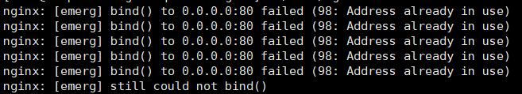

# Nginx 核心模块与配置

## Nginx 简介

Nginx是一个高性能的WEB服务器，除了Nginx还有很多WEB服务器，如Apache、Tomcat、Jetty、IIS他们都是WEB服务器，那么Nginx和他们比有用什么优势呢，Nginx优势在于性能高，Nginx开发团队对Nginx内存使用是有严格的控制，并且Nginx所有的模块都是没有任何阻塞

## Nginx安装

### 检查安装环境

需要Linux内核2.6以上版本才支持epool才能正常使用使用Nginx

~~~shell
uname -a
#4.18.0-147.5.1.el8_1.x86_64 #1 SMP Wed Feb 5 02:00:39 UTC 2020 x86_64 x86_64 x86_64 GNU/Linux 内核4.18.0
~~~

### 安装nginx 环境

Linux内核版本达到要求后我们需要安装一些相应的环境才能运行nginx

1. GCC编译器：Nginx不提供二进制可执行文件，所以使用前我们需要使用要GCC来编译C语言程序
2. PCRE库：RCRE库是正则表达式的支持，在Nginx中很多地方可以使用到正则表达式
3. zlib库：zlib库可以做HTTP包内容的压缩传输可以减少网络流量，可以在nginx.conf里配置**gzip on**开启
4. OpenSSL开发库：在使用HTTPS协议的时候就需要使用到这个库

执行以下语句安装以上所有库

~~~shell
yum -y install make zlib zlib-devel gcc-c++ libtool openssl openssl-devel pcre pcre-devel
~~~

### nginx源码下载

nginx下载地址：https://nginx.org/en/download.html

解压压缩包

~~~shell
tar -zxvf nginx-1.16.1.tar.gz 
~~~

### 简单安装

~~~shell
#进入nginx目录
cd nginx-1.16.1/
#使用默认配置初始化
./configure
#构建可执行文件
make && make install
~~~

执行完成后nginx会安装到我们的usr/local/nginx-xx目录中

执行nginx

~~~shell
#进入nginx目录
cd /usr/local/nginx
#执行nginx
./sbin/nginx
~~~

注意：nginx启动使用的是80端口如果你有其它进程在使用80端口nginx启动会报如下错误

启动后访问80端口弹出如下画面表示成功

### 基于参数构建

上面介绍了最简单的安装，只是提供简单功能，nginx特别之处就是模块化，我们可以指定我们需要使用什么模块去构建nginx，以下使用http_stub_status_module(检测http连接数)、with-http_ssl_module(解析https协议)、with-debug(打开debug开关)，3个模块构建nginx

~~~shell
#进入nginx目录
cd nginx-1.16.1/
#添加指定模块初始化
./configure --prefix=/usr/local/nginx --with-http_stub_status_module --with-http_ssl_module --with-debug
#构建可执行文件
make && make install
~~~

### nginx常用命令

~~~shell
#默认方式启动：
./sbin/nginx 
#指定配置文件启动 
./sbing/nginx -c /tmp/nginx.conf 
#指定nginx程序目录启动
./sbin/nginx -p /usr/local/nginx/

#强制性停止
./sbin/nginx -s stop
#等待请求处理完停止
./sbin/nginx -s quit

#检查配置文件是否有错误
./sbin/nginx -t
#热装载配置文件(nginx修改配置文件后无需重启，直接执行命令热装载配置)
./sbin/nginx -s reload
#重新打开日志文件(在生产环境中日志文件过大后备份新建后需要重新关联日志位置不然日志还是打印在久的文件中，即使你修改了名字)
./sbin/nginx -s reopen
~~~

### 更新模块

./configure构建，make && make install完成后我们需要更新我们的nginx

~~~shell
# 进入objs目录
cd /usr/local/nginx-1.16.1/objs
# 停止当前运行中的nginx
/usr/local/nginx/sbin/nginx -s stop
# 把当前目录的nginx文件夹替换到local下的nginx/sbin中的nginx文件夹
cp nginx /usr/local/nginx/sbin/
# 替换完成后进入local中的nginx
cd /usr/local/nginx
# 启动nginx
sbin/nginx
~~~

## Nginx架构

查看nginx进程

~~~shell
ps -ef | grep nginx
~~~

我们可以查看到nginx有2个进程一个教master主线进程，一个是worker工作进程

我们可以从流程图中看出nginx启动时，会生成两种类型的进程，一个是主进程（Master），一个或多个工作进程（Worker），主进程并不处理网络请求，主要负责调度工作进程，加载配置、启动工作进程、热装载配置等，所以，nginx启动以后，查看操作系统的进程列表，我们就能看到至少有两个nginx进程，服务器实际处理网络请求及响应的是工作进程（worker），在类Lunix系统上，nginx可以配置多个worker，而每个worker进程都可以同时处理数以千计的网络请求

模块化设计，nginx的模块化设计，可以很好的按照需求对功能模块进行选择和修改，编译成具有特定功能的服务器

事件驱动、异步及非阻塞，可以说是nginx得以获得高并发、高性能的关键因素，同时也得益于对Linux、Solaris及类BSD等操作系统内核中事件通知及I/O性能增强功能的采用，如kqueue、epoll及event ports

## Nginx配置和使用

### 配置文件的语法格式

nginx 的配置都是以一块一块划分 "{}" 花括号中就是配置内容

注意每一个配置块和{}括号必须用空格隔开

~~~shell
#user  nobody;
worker_processes  1;

events {
    worker_connections  1024;
}

http {# http配置块
    include       mime.types; #引入的头文件
    default_type  application/octet-stream;

    sendfile        on; #启动sendfile请求内容直接从内核拷贝网卡跳过拷贝nginx

    keepalive_timeout  65;#长连接保存时间

    server {#server服务
        listen       80;#监听的端口
        server_name  localhost;#配置域名

        location / {#匹配location/访问相应位置
            root   html;
            index  index.html index.htm;
        }
        error_page   500 502 503 504  /50x.html;
        location = /50x.html {
            root   html;
        }
    }
}
~~~

### 配置一个静态WEB服务

~~~shell
# 创建文件夹
mkdir -p /usr/www/test/
# 创建html文件
echo 'hello nginx' > test/test.html
# 进入nginx配置文件
vim /usr/local/nginx/conf/nginx.conf
~~~

添加一个server

~~~shell
server {
    listen 80; #监听80端口
    server_name www.test.com *.test.com; #匹配域名

    location / { #匹配域名/后访问相应的文件夹
        root /usr/www/test/;
    }
}
~~~

~~~shell
# 进入nginx目录
cd /usr/local/nginx
# 检查配置文件语法
./sbin/nginx -t
# 重新装载nginx
./sbin/nginx -s reload
~~~

重载后我们久可以通过www.test.com/test.html访问我们刚刚写的页面，这里我们需要安装一个 switchhosts 绑定域名对应的IP才能正常访问

配置根目录后我们就可以直接www.test.com访问到test.html

~~~shell
server {
    listen 80; #监听80端口
    server_name www.test.com *.test.com; #匹配域名

    location / { #匹配域名/后访问相应的文件夹
        root /usr/www/test/; 
        index test.html; #配置默认访问的页面
    }
}
~~~

### 动静分类

为了提高WEB服务器负载，静态文件专门放一个静态的服务器

访问：http://www.test.com/static/test.jpg

~~~shell
location /static { #匹配/static路径
    alias /usr/www/test/static/; #使用alias路径
    #如果使用root路径会加上匹配路径最后效果 /usr/www/test/static/static
    #所以需要使用alias别名
}

~~~

使用正则表达式匹配特定文件类型访问static

访问：http://www.test.com/test.jpg

~~~shell
location ~* \.(png|jpg|css|js)$ {#匹配任何路径路径结尾png|jpg|css|js
	root /usr/www/test/static/; #访问指定路径
}
~~~

### 防盗链

防止其它网站拼接url盗取网站资源

~~~shell
location ~* \.(png|jpg|css|js)$ {
	root /usr/www/test/static/;
	valid_referers none blocked *.test.com; #判断域名是否匹配
	if ($invalid_referer) {#如果不匹配返回403
		return 403;
	}
}
~~~

### 黑白名单

~~~shell
# 创建黑名单
echo 'deny 0.0.0.0/0;' >> ip.black #静止所有IP
# 编辑配置文件
vim conf/nginx.conf
~~~

在http中include ip.black或者在server中include也可以区别就是作用域不同

### 下载限速

~~~shell
# 创建一个download目录
mkdir /usr/www/test/download
# 进入到download目录
cd /usr/www/test/download
~~~

配置location

~~~shell
location /download { # 匹配/download
    alias /usr/www/test/download/; # 访问对应的路劲
    limit_rate 1m;# 限速1m带宽
    limit_rate_after 10m; # 下载超过10m后开始限速
}
~~~

### 反向代理

~~~shell
location =/baidu.html {#匹配/等于baidu.html
	proxy_pass http://www.baidu.com;#代理路径www.baidu.com
}
~~~

## Nginx日志配置

### 开启日志

用户需要改成root用户不然日志生产会没有权限

log注释打开

由于我们可能会存在很多的域名所以推荐打印日志时加上$host 域名

~~~shell
    log_format  main  '$host $remote_addr - $remote_user [$time_local] "$request" '
                      '$status $body_bytes_sent "$http_referer" '
                      '"$http_user_agent" "$http_x_forwarded_for"';
~~~

server在logs下 生成一个服务器名.access.log的日志 日志格式是log_format  main的格式

如果服务器遇到一些未知错误可以打开debug日志查看调试

~~~shell
# 动态查看error日志
tail -f logs/error.log 
~~~

