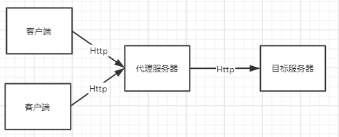
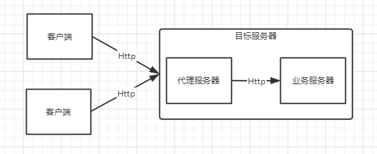
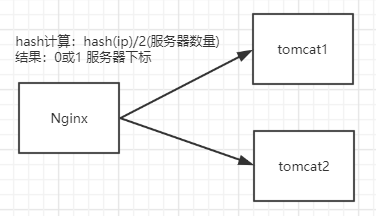
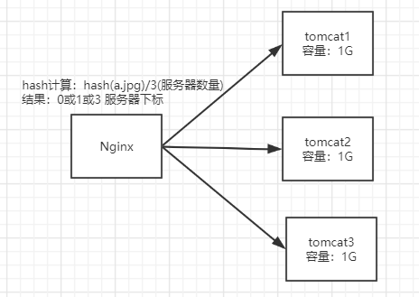
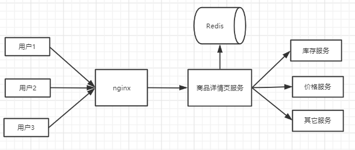
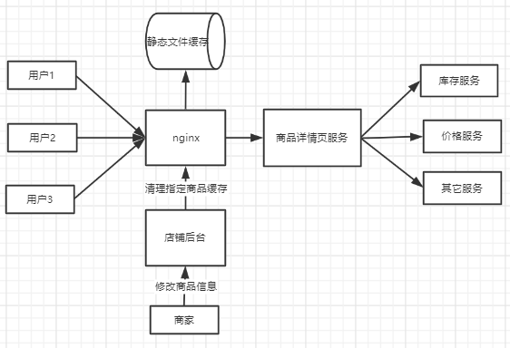

# Nginx生产环境应用

## Nginx反向代理实现

### 正向代理概念

在了解反向代理之前我们先理解什么是正向代理，举个栗子平时我们在学习软件开发时经常需要登陆一些外国网站查看开发文档，在访问这些网站的时候经常会很慢甚至直接无法访问，这过时候我们会使用VPN进行范围这些外国网站，这里就使用到了正向代理，因为我们无法直接服务到我们的目标服务器，所以我们就会先访问一个代理服务器（VPN）在由代理服务器访问目标服务器并返回客户端并返回 。这个过程当中客户端需要知道代理服务器地址，并配置连接。

### 反向代理概念

反向代理和正向代理不同之处是客户端无需知道代理服务器IP，而是客户端直接访问目标服务器的时候，在目标服务内部有一个统一接入网关将请求转发至后端真正处理的服务器并返回结果，这个过程当中客户端不需要知道代理服务器地址，代理对客户端而言是无感的。

### 反向与正向代理的区别

|                | **正向代理**                                               | **反向代理**                         |
| :------------- | :--------------------------------------------------------- | :----------------------------------- |
| 代理服务器位置 | 客户端与服务都能连接的们位置                               | 目标服务器内部                       |
| 主要作用       | 屏蔽客户端IP、集中式缓存、解决客户端不能直连服务端的问题。 | 屏蔽服务端内部实现、负载均衡、缓存。 |
| 应用场景       | 爬虫、翻墙、maven 的nexus 服务                             | Nginx 、Apache负载均衡应用           |

###  Nginx代理基本配置

Nginx 代理只需要配置 location 中配置proxy_pass 属性即可使其指向服务器地址。

#### 正向代理

访问/baidu.html会代理到百度的服务

~~~shell
# 正向代理到baidu 服务
location =/baidu.html {
	proxy_pass http://www.baidu.com;
}
~~~

#### 反向代理

访问/test/会代理到服务器内部的指定端口的web服务

~~~shell
# 反向代理到本地的指定端口服务
location /test/ {
	proxy_pass http://127.0.0.1:8080;
}
~~~

#### 代理相关参数

~~~shell
proxy_pass           # 代理服务
proxy_redirect off;   # 是否允许重定向
proxy_set_header Host $host; # 传 header 参数至后端服务
proxy_set_header X-Forwarded-For $remote_addr; # 设置request header 即客户端IP 地址
proxy_connect_timeout 90; # 连接代理服务超时时间
proxy_send_timeout 90; # 请求发送最大时间
proxy_read_timeout 90;  # 读取最大时间
proxy_buffer_size 4k; 
proxy_buffers 4 32k;
proxy_busy_buffers_size 64k; 
proxy_temp_file_write_size 64k;
~~~

### Nginx负载均衡配置

以上的proxy_pass 只是实现了基本的反向代理只会代理到一个服务器上，但是为了实现更加高的性能，我们通常后端需要多个服务器处理这些请求，这个是时候可以通过upstream 模块实现负载均衡

~~~shell
http {	
	#upstream 就是需要负载均衡的服务，通常是业务多个服务器处理
	#注意：upstream是与server同级
	upstream backend {
	    #weight 轮询权重 权重越高轮询次数越高
	    server 127.0.0.1:8080 weight=1; 
	    server 127.0.0.1:8081 weight=2;
	    #backup 如果服务列表中的服务器都down机了就会访问www.baidu.com
	    server www.baidu.com backup;
	}

    server {
        listen       80;
        server_name  localhost;
		
        location / {
        	# proxy_pass 代理到backend中的服务器列表 默认是轮询
			proxy_pass http://backend;
        }
    }
~~~

#### 负载均衡相关参数

~~~shell
service	    #反向服务地址 加端口
weight	    #权重
max_fails	#失败多少次 认为主机已挂掉则，踢出
fail_timeout	#踢出后重新探测时间
backup	    #备用服务
max_conns	#允许最大连接数
slow_start	#当节点恢复，不立即加入,而是等待 slow_start	后加入服务对列。
~~~

#### 负载均衡算法

~~~shell
ll+weight   #轮询加权重 (默认)
ip_hash     #基于Hash 计算 ,用于保持session 一致性
url_hash    #静态资源缓存,节约存储，加快速度（第三方）
least_conn  #最少链接（第三方）
least_time  #最小的响应时间,计算节点平均响应时间，然后取响应最快的那个，分配更高权重（第三方）
~~~

#### 负载均衡算法使用

~~~shell
upstream backend {
	#使用ip_hash算法做负载均衡
    ip_hash;
    server 127.0.0.1:8080;
    server 127.0.0.1:3000;
}
~~~

##### ll+weight

轮询加权重是负载均衡的默认方式，就是有请求进来时会按照权重的大小轮询服务器，但是缺点如果我这个我现在这个服务是需要登陆的，那用户请求过来都会轮询不同的Tomcat上session不一致又要重新登陆

##### ip_hash

根据ip的hash计算来获得这个用户上一次访问的是那个服务器并且只要这个用户的请求一直由这个服务器处理，解决了session 一致性的问题，缺点是如果系统是面向学习或者企业，由于他们请求一般都是同一个交换机出来所以ip都是一样的导致负载不均衡

##### url_hash

url_hash用处如下例子，如果我们有3G的静态资源文件，有3台服务器，那么如果我们使用ll+weight算法做负载均衡，那我们是不是需要准备3台容量3G的服务器，才能做到负载均衡，但是如果使用url_hash我们只需要吧3台容量1G的服务器即可，有请求进入nginx会对url继续hash计算得到当前文件需要服务那台服务器

##### least_conn

计算当前nginx与tomcat连接数，如果那个tomcat连接最少那就把新连接分发给tomcat

##### least_time

计算当前nginx与tomcat相应时间，先把请求分发到相应时间最快的tomcat

## Nginx高速缓存

### 为什么要用nginx的缓存

某电商平台商品详情页需要实现 700+ QPS(每秒能处理700个Get请求)，如何实现？

首先我们先分析一下这个页面会用到什么服务

**对于商品详情页涉及了如下主要服务： **

* 商品详情页HTML页面渲染
* 价格服务
* 促销服务
* 库存状态/配送至服务
* 广告词服务
* 预售/秒杀服务
* 评价服务
* 试用服务
* 推荐服务
* 商品介绍服务
* 各品类相关的一些特殊服务

**解决方案：**

1. 采用Ajax 动态加载 价格、广告、库存等服务
2. 采用key value 缓存详情页主体html。

nginx反向代理导商品服务，然后商品服务通过redis获取内存中的资源返回给nginx，有没有更快的解决方案，有就是把静态缓存放到你滚下中。

**基于Nginx 静态缓存的解决方案：**

把商品详情页主要内容缓存导nginx静态文件中这样用户只需要一访问nginx可立马得到响应，最大限度的提高了并发量，其余详细内容则通过其它服务加载

~~~shell
# 创建一个cache_test文件夹用于存放缓存
mkdir /data/nginx/cache_test
~~~

### 缓存应用

注意缓存的配置与server块同级

~~~shell
http {	
	#proxy_cache_path 缓存路径 
	#levels 缓存层级及目录位数(层级越多目录越加分散) levels=1(一级目录名md5倒数1位):2(二级目录名md5倒数2-3位)
	#keys_zone 缓存区内存大小 
	#inactive 有效期
	#max_size 硬盘大小
	proxy_cache_path /data/nginx/cache_test levels=1:2 keys_zone=cache_test:100m inactive=20d max_size=1g;

    server {
        listen       80;
        server_name  localhost;
		
        location / {
        	# proxy_pass 代理到backend中的服务器列表 默认是轮询
			proxy_pass http://backend;
			# 指定缓存区
			proxy_cache cache_test;
			#以全路径md5值做做为Key 
			proxy_cache_key $host$uri$is_args$args;
			#对不同的HTTP状态码设置不同的缓存时间
			proxy_cache_valid 200 304 12h;
        }
    }
~~~

### 缓存清除

引入第三方模块

缓存的清理需要依赖第三方模块ngx_cache_purge，所以我们先下载第三方模块

~~~shell
# 进入当前nginx停止nginx服务
cd /usr/local/nginx
./sbin/nginx -s stop
# 进入nginx-1.16.1源码包
cd /usr/local/nginx-1.16.1/
# 查看当前nnginx中安装了什么模块以及版本号
./objs/nginx -V
#nginx version: nginx/1.16.1
#built by gcc 8.3.1 20190507 (Red Hat 8.3.1-4) (GCC) 
#built with OpenSSL 1.1.1c FIPS  28 May 2019
#TLS SNI support enabled
#configure arguments: --prefix=/usr/local/nginx --with-http_stub_status_module --with-http_ssl_module #--with-debug

# 创建 packages 存放第三方模块
mkdir  packages
cd packages
# 下载ngx_cache_purge 模块包 
wget http://labs.frickle.com/files/ngx_cache_purge-2.3.tar.gz
# 解压ngx_cache_purge-2.3.tar.gz
tar -xvf ngx_cache_purge-2.3.tar.gz
# 进入nginx-1.16.1源码包
cd /usr/local/nginx-1.16.1/
# 将刚刚./objs/nginx -V中的config内容拷贝下来后面加上--add-module=新模块路径 使用./configure构建
./configure --prefix=/usr/local/nginx --with-http_stub_status_module --with-http_ssl_module --with-debug --add-module=/usr/local/nginx-1.16.1/packages/ngx_cache_purge-2.3
# 构建完成后使用make编译(注意不要make install会把配置文件覆盖)
make
# 把objs/nginx复制到localnginx中
cp objs/nginx /usr/local/nginx
# 进入nginx目录启动nginx
cd /usr/local/nginx
./sbin/nginx
~~~

编写配置文件

~~~shell
location ~ /clear(/.*) {
  #允许访问的IP 
   allow           127.0.0.1;
   allow           192.168.0.193; #指定那个服务器可以清理
   #禁止访问的IP
   deny            all;
   #配置清除指定缓存区和路径(与proxy_cache_key一至)
   proxy_cache_purge    cache_item $host$1$is_args$args;
} 
~~~

成功后效果

### 缓存参数描述

| 父元素   | 名称              | 描述                                                         |
| :------- | :---------------- | :----------------------------------------------------------- |
| http     | proxy_cache_path  | 指定缓存区的根路径                                           |
|          | levels            | 缓存目录层级最高三层，每层1~2个字符表示。如1:1:2 表示三层。  |
|          | keys_zone         | 缓存块名称 及内存块大小。如 cache_item:500m 。表示声明一个名为cache_item 大小为500m。超出大小后最早的数据将会被清除。 |
|          | inactive          | 最长闲置时间 如:10d 如果一个数据被闲置10天将会被清除         |
|          | max_size          | 缓存区硬盘最大值。超出闲置数据将会被清除                     |
| location | proxy_cache       | 指定缓存区，对应keys_zone 中设置的值                         |
|          | proxy_cache_key   | 通过参数拼装缓存key 如：$host$uri$is_args$args 则会以全路径md5值做做为Key |
|          | proxy_cache_valid | 为不同的状态码设置缓存有效期                                 |

## Nginx参数调优

**worker_processes number;**
配置worker进程数量，每个worker进程都是单线程的进程，如果请求大多已计算为主这个时候worker数量与CPU内核数量一致即可，如果请求大多已IO为主（访问静态资源）这个时候需要进行读写磁盘寻道会出现阻塞worker数量那么需要配置稍多一些的worker进程。

**每个worker 进程的最大连接数**
**语法**：worker_connections number;
**默认**：worker_connections 1024

**worker_cpu_affinity cpumask[cpumask……]**
**绑定Nginx worker进程到指定的CPU内核**
为什么要绑定worker进程到指定的CPU内核呢？如果每一个worker进程都是非常繁忙的，多个worker进程都在抢同一个CPU，如果每一个worker进程都独享一个CPU，就在内核的调度策略上实现了完全的并发。
例如，如果有4颗CPU内核，就可以进行如下配置：
worker_processes 4;
worker_cpu_affinity 1000 0100 0010 0001;
注意 worker_cpu_affinity配置仅对Linux操作系统有效。

**Nginx worker 进程优先级设置**
**语法**：worker_priority nice;
**默认**：worker_priority 0;
优先级由静态优先级和内核根据进程执行情况所做的动态调整（目前只有±5的调整）共同决定。nice值是进程的静态优先级，它的取值范围是–20～+19，–20是最高优先级，+19是最低优先级。因此，如果用户希望Nginx占有更多的系统资源，那么可以把nice值配置得更小一些，但不建议比内核进程的nice值（通常为–5）还要小

**Nginx worker进程可以打开的最大句柄描述符个数**
**语法**： worker_rlimit_nofile limit;
**默认：**空
更改worker进程的最大打开文件数限制。如果没设置的话，这个值为操作系统的限制。设置后你的操作系统和Nginx可以处理比“ulimit -a”更多的文件，所以把这个值设高，这样nginx就不会有“too many open files”问题了。

**是否打开accept锁**
**语法**：accept_mutex[on|off]
**默认**：accept_mutext on;
accept_mutex是Nginx的负载均衡锁，当某一个worker进程建立的连接数量达到worker_connections配置的最大连接数的，会大大地减小该worker进程试图建立新TCP连接的机会，accept锁默认是打开的，如果关闭它，那么建立TCP连接的耗时会更短，但worker进程之间的负载会非常不均衡，因此不建议关闭它。

**使用accept锁后到真正建立连接之间的延迟时间**
语法：accept_mutex_delay Nms; 
默认：accept_mutex_delay 500ms; 
在使用accept锁后，同一时间只有一个worker进程能够取到accept锁。这个accept锁不是堵塞锁，如果取不到会立刻返回。如果只有一个worker进程试图取锁而没有取到，他至少要等待accept_mutex_delay定义的时间才能再次试图取锁。