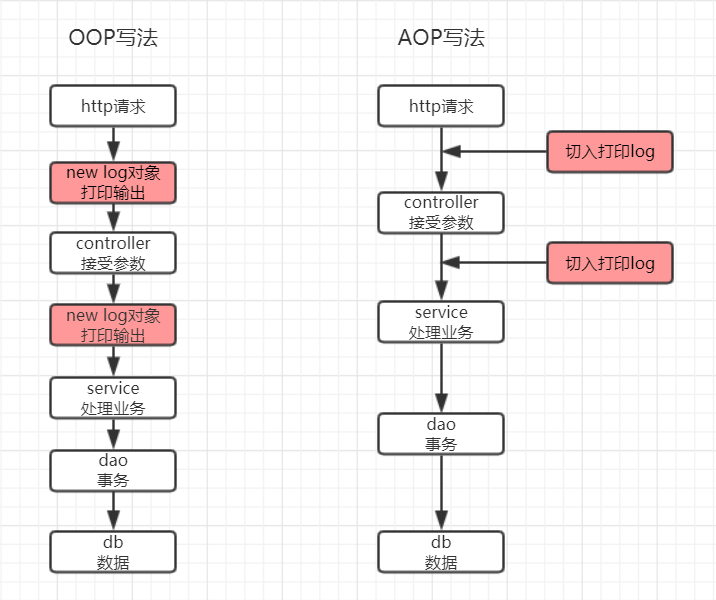
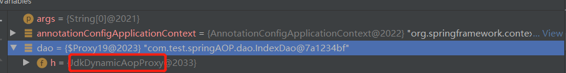
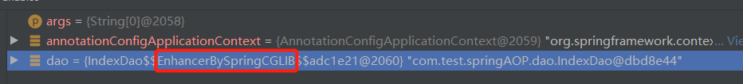
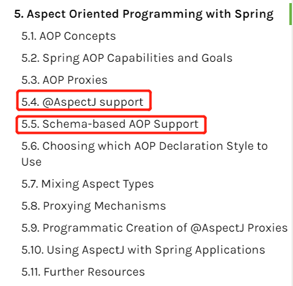

# Spring AOP原理深度解析

## 什么是OOP

在了解AOP之前我们先了解一下什么是OOP，OOP即Object-oriented programming（面向对象），面向对象大家都很熟熟悉把，把我们需要执行的代码封装成一个一个的对象，通过获取这个对象并且调用他的方法，这就是面向对象编程，

## 什么是AOP

以上了解了面向对象，接下来说一下AOP，AOP即Aspect Oriented Programming（面向切面），他于面向对象有有什么区别呢，假设如果我现在有一个需求就是，我为请求服务器的每一个请求都需要打印日志，我分别用2中方式实现。

从图中我们可以看到用面向对象的方式的话是线性，我们需要为每一个controller创建这个对象并且打印才能实现打印log，但是我们的log记录不是必要条件，就是说我们的log即使出错了我们的程序也必须能正常执行，如果我们使用oop来做的话那我们的log对象出错了我们程序就不能继续执行下去了，而且我们的记录log代码会散落在程序的各个地方难以维护，aop就是用来解决这些问题的，aop只是对每一个controller进行切入，我们只需标识程序需要从那个点切入就行，并且切入的代码于主线代码无关即使切入代码报错了主线代码也能正常执行，并且扩展性好，想切哪里就切哪里

## AOP主要的应用场景

1. 日志记录
2. 权限验证
3. 效率检查
4. 事务管理
5. 等等

## springAop的底层技术

|                                      | JDK动态代理       | CGLIB代理         |
| ------------------------------------ | ----------------- | ----------------- |
| 编译时期的织入还是运行时期的织入?    | 运行时期织入      | 运行时期织入      |
| 初始化时期织入还是获取对象时期织入？ | IOC初始化时期织入 | IOC初始化时期织入 |

springAOP默认在初始时判断你的类，如果你的类有接口用CGLIB代理实现，如果你的类没有接口就用默认的JDK动态代理实现，如果需要强制全部类都需要使用CGLIB许修改如下参数

~~~java
@EnableAspectJAutoProxy(proxyTargetClass = true)//支持@AspectJ的语法并所有类强制使用CGLIB实现AOP
~~~

### JDK动态代理

当我们获取Dao接口Spring使用JDK动态代理实现AOP，jdk动态代理底层是创建一个代理类继承Proxy并且实现Dao接口，因为java是单继承所以他只能基于接口实现，并且获取的是代理对象

### CGLIB代理

当我们直接获取的IndexDao对象Spring使用CGLIB代理实现AOP，CGLIB代理代理底层是使用直接修改改类的字节码文件实现是，所以获取的还是IdexDao对象

## springAop和AspectJ的关系

我们在看spring官方文档时候会发现，spring在编写AOP时提供了2种写法一种是@AspectJ，一种是xml的写法，那问题来了springAop和AspectJ什么关系，其实在最初的AOP都是通过xml的方式来实现的，但是springAOP的写法让很多的开发者难以理解，所以后来SpringAOP借鉴的@AspectJ的写法，就是使用@AspectJ语法也能实现AOP，语法是@AspectJ的底层还是SpirngAOP实现。

## Spring AOP的概念

### Aspect (切面)

aspect即一个切面，切面是用于存放切点，连接点，通知的一个载体，通常我们用一个类来作为切面

~~~java
@Aspect //声明一个切面
@Component
public class MyAspect {}
~~~

### Pointcut (切点)

切点用于存放连接点的集合，一般是定义在方法上，后面用通知的时候通过调用来获取方法切点中的连接点

~~~java
//@Pointcut定义一个切点，
@Pointcut("")
public void pointCutExecution(){}
~~~

### Join point  (连接点)

连接点一般存放在切点中，并且可以存放多个（需要用特殊的表达式）

~~~java
//定义连接点 com.test.springAOP.dao.IndexDao类下的任意返回值类型 任意方法，存入切点中
@Pointcut("execution(* com.test.springAOP.dao.IndexDao.*(..))")
public void pointCutExecution(){}
~~~

### Advice (通知)

#### Before advice (前置通知)

~~~java
//定义一个前置通知，应用到pointCutExecution()切点中的全部连接点
@Before("pointCutExecution()")
public void before(){
    System.out.println("before");//通知的业务代码
}
~~~

#### After returning advice (后置通知)

~~~java
//定义一个后置通知，程序正常执行我后会通知，应用到pointCutExecution()切点中的全部连接点
@AfterReturning("pointCutExecution()")
public void afterReturning(){
    System.out.println("afterReturning");
}
~~~

#### After throwing advice(异常通知)

~~~java
//定义一个异常通知，应用到pointCutExecution()切点中的全部连接点
@AfterThrowing("pointCutExecution()")
public void afterThrowing(){
    System.out.println("afterThrowing");
}
~~~

#### After (finally) advice(finally通知)

~~~java
//定义一个后置通知，无论程序有没有报错都会执行，应用到pointCutExecution()切点中的全部连接点
@After("pointCutExecution()")
public void after(){
    System.out.println("after");//通知的业务代码
}
~~~

#### Around advice(环绕通知)

~~~java
//环绕通知
@Around("pointCutExecution()")
public Object around(ProceedingJoinPoint proceedingJoinPoint) throws Throwable {
    //proceedingJoinPoint 用于环绕通知proceedingJoinPoint.proceed()执行对象方法
    System.out.println("start");
    Object retVal = proceedingJoinPoint.proceed();
    System.out.println("end");
    return retVal;
}
~~~

### JoinPoint（连接点例子）

#### execution

execution用于匹配方法执行 join points连接点，最小粒度方法，他可以明确你要切入点指定方法返回类型，类名，方法名和参数名等与方法相关的信息，所有execution使用是最广泛，但是由于需要的表达式也比较复杂容易出错

~~~tex
execution(modifiers-pattern? ret-type-pattern declaring-type-pattern?name-pattern(param-pattern) throws-pattern?)
execution(方法修饰符? 返回值类型 方法包路径或者类路径?方法名称(方法传入的参数) 方法抛出异常?) 带“？”表示可以不写即使最简便可写成execution(* set(..))即匹配所有set方法
以下是常用的exceution
@Pointcut("execution(* com.chenss.dao.*.*(..))")//匹配com.chenss.dao包下的任意接口和类的任意方法
@Pointcut("execution(public * com.chenss.dao.*.*(..))")//匹配com.chenss.dao包下的任意接口和类的public方法
@Pointcut("execution(public * com.chenss.dao.*.*())")//匹配com.chenss.dao包下的任意接口和类的public 无方法参数的方法
@Pointcut("execution(* com.chenss.dao.*.*(java.lang.String, ..))")//匹配com.chenss.dao包下的任意接口和类的第一个参数为String类型的方法
@Pointcut("execution(* com.chenss.dao.*.*(java.lang.String))")//匹配com.chenss.dao包下的任意接口和类的只有一个参数，且参数为String类型的方法
@Pointcut("execution(* com.chenss.dao.*.*(java.lang.String))")//匹配com.chenss.dao包下的任意接口和类的只有一个参数，且参数为String类型的方法
@Pointcut("execution(public * *(..))")//匹配任意的public方法
@Pointcut("execution(* te*(..))")//匹配任意的以te开头的方法
@Pointcut("execution(* com.chenss.dao.IndexDao.*(..))")//匹配com.chenss.dao.IndexDao接口中任意的方法
@Pointcut("execution(* com.chenss.dao..*.*(..))")//匹配com.chenss.dao包及其子包中任意的方法
官方文档中5.4.3下Examples有更多的例子
https://docs.spring.io/spring-framework/docs/current/spring-framework-reference/core.html#aop-pointcuts-examples
~~~

#### within

within与execution相比，粒度更大，仅能实现到包和接口、类级别。而execution可以精确到方法的返回值，参数个数、修饰符、参数类型等

~~~tex
@Pointcut("within(com.chenss.dao.*)")//匹配com.chenss.dao包中的任意方法
@Pointcut("within(com.chenss.dao..*)")//匹配com.chenss.dao包及其子包中的任意方法
~~~

#### args

args表达式的作用是匹配指定参数类型和指定参数数量的方法,与包名和类名无关

~~~tex
@Pointcut("args(java.io.Serializable)")//匹配运行时传递的参数类型为指定类型的、且参数个数和顺序匹配
@Pointcut("@args(com.chenss.anno.Chenss)")//接受一个参数，并且传递的参数的运行时类型具有@Classified
~~~

#### this 

this表达式匹配spring获取的对象是目标对 即使用了CGlib代理的bean

~~~tex
@Pointcut("this(com.chenss.dao.IndexDaoImpl)")//当前对象，也就是代理对象，代理对象时通过代理目标对象的方式获取新的对象，与原值并非一个
~~~

#### target  

target表达式匹配spring获取的对象是目标的代理对象 即使用了JDK动态代理的bean

~~~tex
@Pointcut("target(com.chenss.dao.IndexDaoImpl)")//目标对象，也就是被代理的对象。限制目标对象为com.chenss.dao.IndexDaoImpl类
~~~

#### @annotation

annotation表达式匹配存在指定注解的方法

~~~tex
@Pointcut("@annotation(com.test.springAOP.anno.MyAnno)") //匹配有@MyAnno的方法
~~~

#### @within

within表达式匹配存在指定注解的类

~~~tex
@Pointcut("@within(com.test.springAOP.anno.MyAnno)")//匹配有@MyAnno的类
~~~

