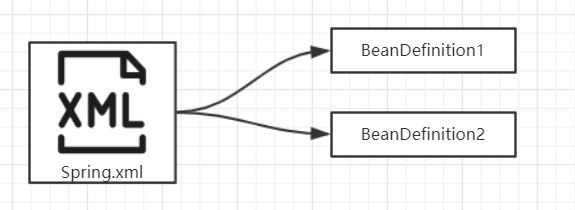
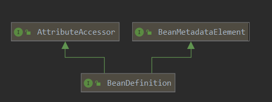
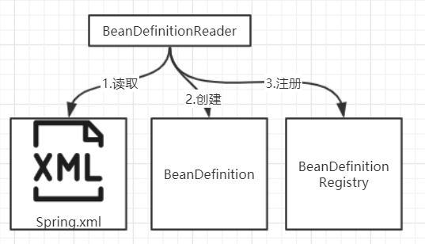
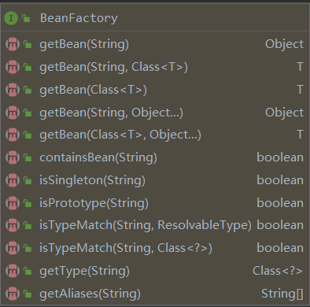
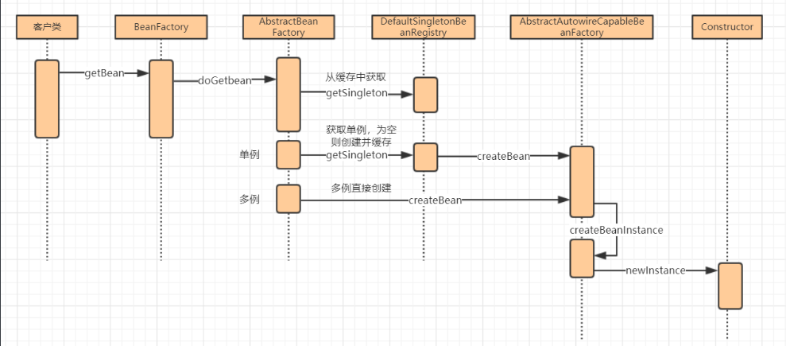
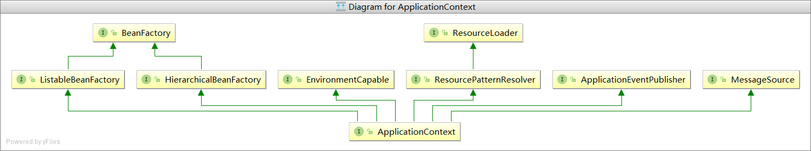

# IOC核心理论回顾

## IOC理论概要

在没有ioc之前我们的调用对象之前我们都需要对对象进行创建，创建对象的方式有以下几种

| 类别     | 描述               | 时间点         |
| -------- | ------------------ | -------------- |
|          | 构造方法传入       | 创建引用对象时 |
| 外部传入 | 属性设置传入       | 设置对象状态时 |
|          | 运行时做为参数传入 | 调用时         |
|          | 属性中直接创建     | 创建引用对象时 |
| 内部创建 | 初始化方法创建     | 创建引用对象时 |
|          | 运行时动态创建     | 调用时         |

假设我们现在用A、B两个对来解释以上6种

构造方法传入：创建A对象时，把B对象传入

属性设置传入：给A对象设置一个属性，为B对象

运行时做为参数传入：调用A的某一个方法时把B对象传进去

属性中直接创建：直接在A对象的属性中new一个B对象

初始化方法创建：在构造方法中new一个B对象

运行时动态创建：调用方法时new一个B对象

以上就是一些创建对象的方法，如果B对象是一个非常普通的对象，那我们new的时候并且不会觉得他很复杂，但是如果你要创建的的是一个有复杂依赖的service对象，这时你需要在不同的时机插件不同的对象，引用会变的很复杂，我们管理起来也会很麻烦，刚刚好spring的IOC就为我们做好了这些工作，只需要把bean写入spring配置文件总spring就会构建并且帮我们管理这些依赖关系。

### 实体Bean的构建

在构建之前我们需要一个类

~~~Java
public class HelloSpring {
    private String name;
    private int sex;
	//基于ClassName构建需要无参构造方法
    public HelloSpring() {
    }
	//构造方法构建需要传入参数
    public HelloSpring(String name,int sex) {
        this.name = name;
        this.sex = sex;
    }

    public static HelloSpring build(String type){
        if ("A".equals(type)){
            return new HelloSpring("testA",1);
        }else if ("B".equals(type)){
            return new HelloSpring("testB",0);
        }else {
            throw new IllegalArgumentException("type must A or B");
        }
    }
}
~~~

#### 基于ClassName构建

~~~xml
<!--默认构造函数构建需要无参构造方法-->
<bean class="com.test.spring.HelloSpring"/>
~~~

#### 构造方法构建

~~~xml
<!--指定构造函数构建-->
<bean class="com.test.spring.HelloSpring">
    <!--方式1：通过index为构造函数传参-->
    <constructor-arg index="0" value="lzj"/>
    <!--方式2：通过name为构造函数传参-->
    <constructor-arg name="sex" value="1"/>
</bean>
~~~

#### 静态工厂方法构建

~~~xml
<!--静态工厂方法构建 用我们的build方法来构建 演示A/B测试-->
<bean class="com.test.spring.HelloSpring" factory-method="build">
    <constructor-arg name="type" value="A"/>
</bean>
~~~

#### FactoryBean创建（重点）

如果我们需要构建一个java.sql.Driver的对象我们可以这样写

~~~java
//实现FactoryBean接口重写getObject、getObjectType、isSingleton方法
public class DriverFactoryBean implements FactoryBean {
    private String jdbcUrl;
	//传入的参数jdbcUrl返回的
    public Object getObject() throws Exception {
        return DriverManager.getDriver(jdbcUrl);
    }
	//设置这个对象的类别
    public Class<?> getObjectType() {
        return java.sql.Driver.class;
    }
	//是否为单例模式 如果不是单例每次创建都会重新new对象
    public boolean isSingleton() {
        return true;
    }

    public String getJdbcUrl() {
        return jdbcUrl;
    }

    public void setJdbcUrl(String jdbcUrl) {
        this.jdbcUrl = jdbcUrl;
    }
}
~~~

有没有发现这个写法在mybatis配置文件中见过，mybatis就是用FactoryBean做为包装其实你传人的参数返回的对象是getObject方法中的对象

FactoryBean主要作用用于自定义创建我们的bean，以及自定义设置他的类别，模式

~~~xml
<bean id="driver" class="com.test.spring.DriverFactoryBean">
    <property name="jdbcUrl" value="jdbc:mysql://localhost:3306/study?useSSL=true"/>
</bean>
~~~

### Bean的基本特性

#### 作用范围

很多时候Bean对象是无状态的，而有些的有状态的 无状态的对象我们采用单例即可，而有状态则必须是多例的模式，通过scope即可创建

~~~xml
<!--prototype 多例的每次getbean的时候都会重新创建-->
<!--singleton 单例的bean对象会缓存到IOC容器中（默认）-->
<bean class="com.test.spring.HelloSpring" scope="prototype"/>
~~~

如果一个Bean设置成 prototype 我们可以 通过BeanFactoryAware 获取 BeanFactory 对象即可每次获取的都是新对像

#### 生命周期

Bean对象的创建、初始化、销毁即是Bean的生命周期。bean在构建的时候会调用init方法，bean在销毁的时候会调用destroy方法，bean在我们的ApplicationContext关闭的时候就会进行销毁

```xml
<bean class="com.test.spring.HelloSpring" init-method="init" destroy-method="destroy"></bean>
```

如果觉得麻烦，可以让Bean去实现 InitializingBean.afterPropertiesSet()、DisposableBean.destroy()方法。分别对应 初始和销毁方法

#### 转载机制

指示Bean在何时进行加载，设置lazy-init 即可，其值如下：
true: 懒加载，即延迟加载
false:非懒加载，容器启动时即创建对象
default:默认，采用default-lazy-init 中指定值，如果default-lazy-init  没指定就是false

~~~xml
<?xml version="1.0" encoding="UTF-8"?>
<beans xmlns="http://www.springframework.org/schema/beans"
       xmlns:xsi="http://www.w3.org/2001/XMLSchema-instance"
       xsi:schemaLocation="http://www.springframework.org/schema/beans http://www.springframework.org/schema/beans/spring-beans.xsd"
default-lazy-init="true">
~~~

什么时候使用懒加载？
懒加载会容器启动的更快，而非懒加载可以容器启动时更快的发现程序当中的错误 ，选择哪一个就看追求的是启动速度，还是希望更早的发现错误，一般我们会选 择后者

### 依赖注入

什么是依赖注入，当你一个对象依赖着另外一个对象时，我们需要通过代码的方式对他进行构建，经过上面的实体bean构建的学习，我们发现bean的构建好像并没有给我们带来多大的用处，下面就讲一下spring最重要的部分依赖注入，spring在构建Abean前会先把依赖的Bbean交给ioc容器构建好了返回给Abean，以下有2个对象HelloSpring和FineSpring，HelloSpring依赖着FineSpring，依赖注入有以下几种方式

~~~java
public class HelloSpring {
    //依赖fineSpring对象
    private FineSpring fineSpring;

    public HelloSpring() {
    }
	//使用构造函数注入
    public HelloSpring(FineSpring fineSpring) {
        this.fineSpring = fineSpring;
    }
	//使用set方法注入 必须要有该对象的set方法
    public void setFineSpring(FineSpring fineSpring) {
        this.fineSpring = fineSpring;
    }

    public FineSpring getFineSpring() {
        return fineSpring;
    }
}
~~~


#### set方法注入

~~~xml
<bean id="fineSpring" class="com.test.spring.FineSpring"/>
<bean class="com.test.spring.HelloSpring">
    <!--把依赖的bean以参数的方式传入-->
    <property name="fineSpring" ref="fineSpring"/>
</bean>
~~~

#### 构造方法注入

~~~xml
<bean class="com.test.spring.HelloSpring">
    <constructor-arg name="fineSpring">
        <!--把bean对象传入到构造函数内-->
        <bean class="com.test.spring.FineSpring"/>
    </constructor-arg>
</bean>
~~~

#### 自动注入（byName、byType）

自动注入即我们不用像上面2中方法注入我们的依赖只需要通过autowire设置注入的方式，spring通过反射获取你该bean对象中依赖了那些对象并且先对他进行创建，但是我们一个配置文件中可能会出现重复的构建bean，spring又是怎么去选择并注入的呢

~~~xml
<!--如果自动注入设置为byName，他会寻找id等于你对象中依赖对象的属性名的bean进行注入-->
<bean class="com.test.spring.HelloSpring" autowire="byName"/>
<bean id="fineSpring" class="com.test.spring.FineSpring"/>
<bean class="com.test.spring.FineSpring"/>
<!--如果自动注入设置为byType，他会选择你有设置primary="true"(是否主要的)的bean进行依赖注入-->
<bean class="com.test.spring.HelloSpring" autowire="byType"/>
<bean class="com.test.spring.FineSpring" primary="true"/>
<bean class="com.test.spring.FineSpring"/>
~~~

#### 方法注入（lookup-method）

当一个单例的Bean，依赖于一个多例的Bean，用常规方法只会被注入一次，如果每次都想要获取一个全新实例就可以采用lookup-method 方法来实现

1. 方法一：通过写抽象类的方式

   该操作的原理是基于动态代理技术，重新生成一个继承至目标类，然后重写抽像方法到达注入目的。

~~~java
//编写一个抽象类
public abstract class LookupMethodSpring {
    public void fineSpring(){
        //通过对该抽像方法的调用获取最新实例
        getFineSpring().fineSpring();
    }
	//编写一个抽象方法
    public abstract FineSpring getFineSpring();
}
~~~

配置文件

~~~xml
<bean class="com.test.spring.LookupMethodSpring">
    <lookup-method name="getFineSpring"/>
</bean>
~~~

1. 方法二

   通过实现 ApplicationContextAware 、BeanFactoryAware 接口来获取BeanFactory 实例，从而可以直接调用getBean方法获取新实例，推荐使用该方法，相比lookup-method语义逻辑更清楚一些

```java
//实现BeanFactoryAware接口
public class LookupMethodSpring implements BeanFactoryAware {
    private BeanFactory beanFactory;
	//调用fineSpring方法是 获取一个Bean
    public void fineSpring(){
        beanFactory.getBean(FineSpring.class);
    }

    public void setBeanFactory(BeanFactory beanFactory) throws BeansException {
        this.beanFactory = beanFactory;
    }
}
```

配置文件

~~~xml
<bean class="com.test.spring.LookupMethodSpring"></bean>
~~~

## IOC设计原理与实现

### Bean的构建过程

spring.xml  文件中保存了我们对Bean的描述配置，BeanFactory 会读取这些配置然后生成对应的Bean。这是我们对ioc 原理的一般理解。但在深入一些我们会有更多的问题？

1. 配置信息最后是谁JAVA中哪个对象承载的？
2. 这些承载对象是谁来读取XML文件并装载的？
3. 这些承载对象又是保存在哪里？

#### BeanDefinition

ioc实现中我们在xml中的描述的Bean信息最后都会被保存到一个BeanDefinition对象中，其中xml中的一个bean对于一个BeanDefinition对象



由此可见，xml  bean中设置的属性最后都会体现在BeanDefinition中。如:

| **XML-bean **   | **BeanDefinition**                       |
| :-------------- | :--------------------------------------- |
| class           | beanClassName                            |
| scope           | scope                                    |
| lazy-init       | lazyInit                                 |
| constructor-arg | ConstructorArgument                      |
| property        | MutablePropertyValues                    |
| factory-method  | factoryMethodName                        |
| destroy-method  | AbstractBeanDefinition.destroyMethodName |
| init-method     | AbstractBeanDefinition.initMethodName    |
| autowire        | AbstractBeanDefinition.autowireMode      |
| id              |                                          |
| name            |                                          |

我们通过源码看一下BeanDefinition的属性结构



BeanDefinition描绘我们这个bean的定义

AttributeAccessor描绘了我们bean在xml中的一些原始信息

BeanMetadataElement描绘了bean的一些属性访问操作

我们看完这3个对象后发现我们的在bean中设置的id和name在3个对象中都没有发现有他对于的属性，因为这个id和mane是作为这个bean对象的key存入到bean的注册中心中BeanDefinitionRegistry中

~~~java
//org.springframework.beans.factory.support.BeanDefinitionRegistry#registerBeanDefinition
//可以看到这里传入一个beanName属性（重点：这个是bean属性中的ID不是name）和一个beanDefinition对象
void registerBeanDefinition(String beanName, BeanDefinition beanDefinition)
			throws BeanDefinitionStoreException;
~~~

那么我们bean中的name又放在哪里呢，name相当于一个别名他是放在我们的AliasRegistry中

~~~java
//org.springframework.core.AliasRegistry#registerAlias
//可以看到这里为一个id注册一个别名
void registerAlias(String name, String alias);
~~~

最后我们发现如果我们需要获取一个BeanDefinition对象需要通过id才能获取，那么name有什么用呢，后面会说到

#### BeanDefinitionReader

通过前面的BeanDefinition我们知道了xml是的bean对象属性对应着BeanDefinition，BeanDefinition通过id+对象的反射注册到BeanDefinitionRegistry中那么他们的读取，创建，注册又由谁来完成呢？是由BeanDefinitionReader完成的



~~~java
public static void main(String[] args) {
    //创建一个resource装载器
    DefaultResourceLoader loader = new DefaultResourceLoader();
    //把spring.xml装载进去
    Resource resource = loader.getResource("spring.xml");
    //创建BeanDefinitionRegistry，Bean注册中心
    BeanDefinitionRegistry registry = new SimpleBeanDefinitionRegistry();
    //创建XmlBeanDefinitionReader，把注册中心传入
    XmlBeanDefinitionReader reader = new XmlBeanDefinitionReader(registry);
    //读取配置文件
    reader.loadBeanDefinitions(resource);
    //打印Bean数组ID
    System.out.println(Arrays.toString(registry.getBeanDefinitionNames()));
}
~~~

我们可以在输出看到我们没有设置id的Bean他们的默认id=类路径+#+序号

~~~verilog
[com.test.spring.LookupMethodSpring#0, com.test.spring.HelloSpring#1, com.test.spring.HelloSpring#0]
~~~

#### BeanFactory（bean工厂）

经过以上步骤我们的bean已经顺利的存入到我们的注册中心中了，那么接下来需要把这些bean进行生产了，在ioc中bean的构建是通过BeanFactory负责的



~~~java
//基于id获取bean
Object getBean(String name) throws BeansException;
//基于id和类别获取bean
<T> T getBean(String name, Class<T> requiredType) throws BeansException;
//基于类别获取bean
<T> T getBean(Class<T> requiredType) throws BeansException;
//传入一个Object对象会基于你的Object对象构造函数构建一个bean，哪怕你的bean是单例的也会重新构建一个bean
Object getBean(String name, Object... args) throws BeansException;
~~~

看了那么多，我们发现这个BeanFactory全部都是get方法居然没有Create方法（创建bean的方法怎么没有）

其实当我们调用getBean方法是他会触发一个Creat方法，编写我们的测试类

~~~java
DefaultListableBeanFactory beanFactory = new DefaultListableBeanFactory();
XmlBeanDefinitionReader reader = new XmlBeanDefinitionReader(beanFactory);
reader.setResourceLoader(new DefaultResourceLoader());
reader.loadBeanDefinitions("spring.xml");
beanFactory.getBean("helloSpring");
System.out.println(Arrays.toString(beanFactory.getBeanDefinitionNames()));
~~~

首先我们进入getBean

~~~java
//org.springframework.beans.factory.support.AbstractBeanFactory#getBean(java.lang.String)
public Object getBean(String name) throws BeansException {
    //调用了doGetBean方法
    return doGetBean(name, null, null, false);
}
//org.springframework.beans.factory.support.AbstractBeanFactory#doGetBean 由于这个方法太长只截取重点
//在方法下可以看到最先执行的是DefaultSingletonBeanRegistry(bean单例的注册中心).getSingleton方法这个方法是获取我们的单例bean
Object sharedInstance = getSingleton(beanName);
//org.springframework.beans.factory.support.DefaultSingletonBeanRegistry#getSingleton(java.lang.String, boolean)
protected Object getSingleton(String beanName, boolean allowEarlyReference) {
    //从singletonObjects通过key获取bean
    Object singletonObject = this.singletonObjects.get(beanName);
    //isSingletonCurrentlyInCreation(beanName)判断是否在创建
    //如果等于空并且bean没有在创建
    if (singletonObject == null && isSingletonCurrentlyInCreation(beanName)) {
        synchronized (this.singletonObjects) {
            //通过key从正在创建中的这个容器取
            singletonObject = this.earlySingletonObjects.get(beanName);
            //如果创建中还是取不到
            if (singletonObject == null && allowEarlyReference) {
                //如果是空我们从工厂中获取
                ObjectFactory<?> singletonFactory = this.singletonFactories.get(beanName);
                if (singletonFactory != null) {
                    singletonObject = singletonFactory.getObject();
                    this.earlySingletonObjects.put(beanName, singletonObject);
                    this.singletonFactories.remove(beanName);
                }
            }
        }
    }
    return (singletonObject != NULL_OBJECT ? singletonObject : null);
}
//org.springframework.beans.factory.support.AbstractBeanFactory#doGetBean
//获取完sharedInstance回到我们的AbstractBeanFactory中 判断如果AbstractBeanFactory不空并且AbstractBeanFactory参数等于空
if (sharedInstance != null && args == null) {
    if (logger.isDebugEnabled()) {
        if (isSingletonCurrentlyInCreation(beanName)) {
            logger.debug("Returning eagerly cached instance of singleton bean '" + beanName +
                         "' that is not fully initialized yet - a consequence of a circular reference");
        }
        else {
            logger.debug("Returning cached instance of singleton bean '" + beanName + "'");
        }
    }
    //检测bean是否有impl FactoryBean如果有调用getObject返回对应的bean
    bean = getObjectForBeanInstance(sharedInstance, name, beanName, null);
}else{
    //如果单例缓存都没有这个bean就会执行如下创建bean
}
~~~

大概执行流程：客户端调用getBean方法其实调用的是AbstractBeanFactory.doGetBean在调用doGetBean时首先会从缓存中获取看能不能拿到bean如果不能拿到就会去判断bean是单例还是多例

单例：在去单例bean注册中心获取一遍如果是空的话直接使用AbstractAutowireCapableBeanFactory.createBean创建bean

多例：如果是多例模式会先给bean加锁然后调用AbstractAutowireCapableBeanFactory.createBean创建bean调用完成后解除锁



#### BeanFactory 与 ApplicationContext区别

BeanFactory  看下去可以去做IOC当中的大部分事情，为什么还要去定义一个ApplicationContext 呢？
ApplicationContext 结构图


从图中可以看到 ApplicationContext 它由BeanFactory接口派生而来，因而提供了BeanFactory所有的功能。除此之外context包还提供了以下的功能：

1. MessageSource, 提供国际化的消息访问
2. 资源访问，如URL和文件
3. 事件传播，实现了ApplicationListener接口的bean
4. 载入多个（有继承关系）上下文 ，使得每一个上下文都专注于一个特定的层次，比如应用的web层