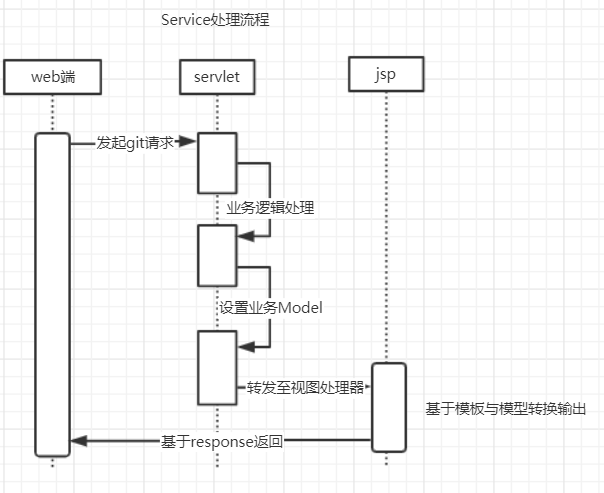
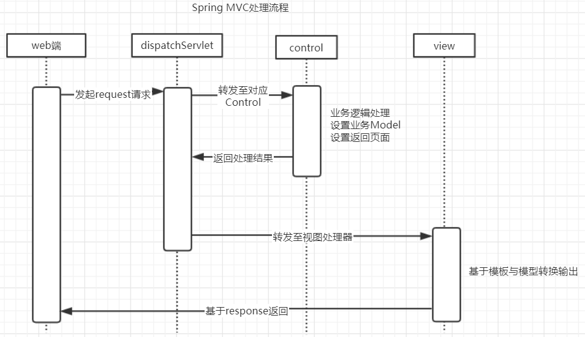
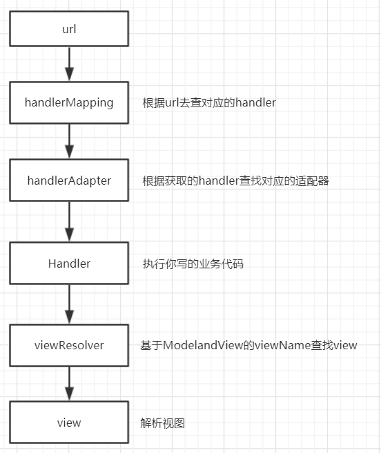
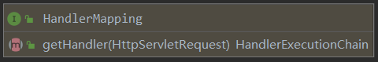
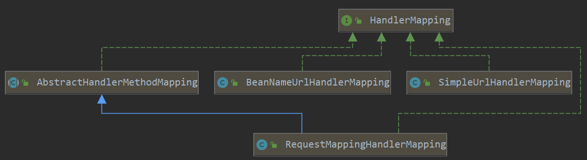
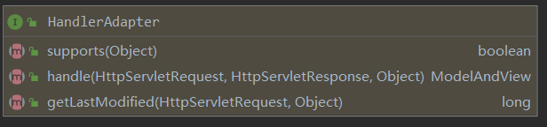
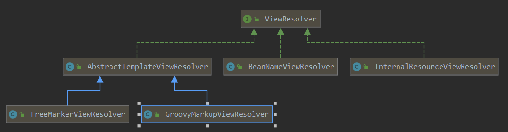
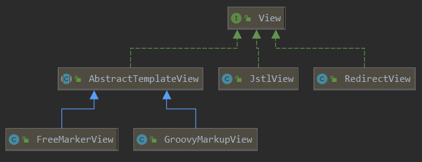

# Spring MVC原理深度解析

## 回顾servlet与jsp执行过程

### 执行流程

请求Servlet=>处理业务逻辑=>设置业务Model=>forward jsp Servlet=>jsp Servlet 解析封装html返回

### 流程小结

其实servlet与jsp是一个标准的MVC模式即：Model是M，jsp是V，servlet是C那springMVC和servlet+jsp又有什么区别呢

springMVC本质上其实还是使用Servlet处理，并在它基础上进行了封装简化了开发流程，提高易用性、并使用程序逻辑结构变的更加清晰，优化有以下几点

1. 基于注解的URL映射
2. http表单参数转换
3. 全局统一异常处理
4. 拦截器的实现

## Spring MVC的执行流程

### 执行流程

发起请求=>dispatchServlet转发到对应的Control=>Control处理业务设置Model设置返回页面=>dispatchServlet处理返回结果=>转发至视图处理=>基于模板模型转换输出=>返回到web

### 流程小结

我们发现springMVC的执行流程中多了一个dispatchServlet，dispatchServlet它相当于一个路由，他会接收url转发对应的control以及将来control返回的结果转发到对应的视图处理器，注意control不是直接把结果给view视图处理器，而是先给dispatchServlet，dispatchServlet再把转发对应的视图处理再返回给web，dispatchServlet相当于一个路由器在整个生命周期中做接收转发。

### spring MVC 体系结构

经过以上的执行流程的基本认识后我们会产生许多新问题

1. dispatchServlet如何找到对应的Control呢？
2. 如何执行调用Control当中的业务方法呢？

带着这些问题我们需要认识springMVC的体系结构

HandlerMapping（url与控制器的映射）

HandlerAdapter（控制器执行适配器）

ViewResolver（视图仓库）

View（具体解析视图）

HandlerExceptionResolver（异常捕捉器）

HandlerInterceptor（拦截器）

配置一个基础的spring mvc需要做什么

1. 创建一个Controller
2. 配置DispatcherServlet
3. 配置spring-mvc.xml
4. 配置SimpleUrlHandlerMapping
5. 配置InternalResourceViewResolver

## Spring MVC执行流程解析

### mvc具体执行流程

### HandlerMapping详解

HandlerMapping的用处就是查找url对应的Control对象的映射，DispatcherServlet就是基于HandlerMapping组件来寻找对应的Control，如果找不到会报Not Foind mapping的异常

在HandlerMapping中就只有一个接口getHandler，用于获取handler，我们从他传入参数中可以知道他是通过HttpServletRequerst即url来获取我们的handler,我们看看他分别被多少个类实现

该接口分别被BeanNameUrlHandlerMapping，SimpleUrlHandlerMapping，RequestMappingHandlerMapping实现

#### SimpleUrlHandlerMapping应用

~~~java
//创建Controller类
public class SimpleControl implements Controller {
    @Override
    public ModelAndView handleRequest(HttpServletRequest httpServletRequest, HttpServletResponse httpServletResponse) throws Exception {
        ModelAndView mv = new ModelAndView("userView");
        mv.addObject("name","我的第一个mvc");
        return mv;
    }
}
~~~

~~~xml
<bean id="simpleControl" class="com.test.springMVC.SimpleControl"></bean>
<!--配置HandlerMapping-->
<bean class="org.springframework.web.servlet.handler.SimpleUrlHandlerMapping">
    <property name="urlMap">
        <props>
            <!--把url映射到对应的Control-->
            <prop key="/hello.do">simpleControl</prop>
        </props>
    </property>
</bean>
<!--配置HandlerAdapter-->
<bean class="org.springframework.web.servlet.mvc.SimpleControllerHandlerAdapter"/>
<!--配置ViewResolver-->
<bean class="org.springframework.web.servlet.view.InternalResourceViewResolver">
    <!--配置资源的前缀-->
    <property name="prefix" value="/WEB-INF/page/"/>
    <!--配置资源的后缀-->
    <property name="suffix" value=".jsp"/>
    <!--配置具体的视图解析器-->
    <property name="viewClass" value="org.springframework.web.servlet.view.JstlView"/>
</bean>
~~~

#### BeanNameUrlHandlerMapping应用

~~~java
public class BeanNameControl implements HttpRequestHandler {
    @Override
    public void handleRequest(HttpServletRequest request, HttpServletResponse response) throws ServletException, IOException {
        response.getWriter().println("HttpRequestHandler");
    }
}
~~~

~~~xml
<!--id上加上“/”即把/BeanNameControl.do的url映射到class中-->
<bean id="/BeanNameControl.do" class="com.test.springMVC.BeanNameControl"></bean>
~~~

我们可以发现我们不用注入BeanNameUrlHandlerMapping的bean也可以使用BeanNameUrlHandlerMapping

其实是DispatcherServlet.properties默认帮我们实现了包括BeanNameUrlHandlerMapping对应Adapter也默认实现了

#### RequestMappingHandlerMapping应用

单看那么长的名字很陌生，说到@RequestMapping大家就清楚了把，他就是我们的@RequestMapping注解的实现这个怎么使用我就不多解释了

#### 总结

经过BeanNameUrlHandlerMapping，SimpleUrlHandlerMapping，RequestMappingHandlerMapping的使用我们发现RequestMappingHandlerMapping是基于AbstractHandlerMethodMapping实现的，BeanNameUrlHandlerMapping，SimpleUrlHandlerMapping是基于bean实现的，那么他们到底有什么区别呢，问的好。

BeanNameUrlHandlerMapping和SimpleUrlHandlerMapping我们发现他们都是一个类继承某个接口重写指定方法实现的那么就是说我一个类里面只允许有一个接口，因为一个类只能实现一个分类的handler接口

RequestMappingHandlerMapping不同之处他是基于AbstractHandlerMethodMapping实现的是方法级别的一个实现类，那就是说我一个bean中可以实现很多个@RequestMapping

### HandlerAdapter详解

HandlerAdapter是适配器用来适配调用指定Handler，根据Handler的不同种类采用不同的Adapter,其Handler与 HandlerAdapter 对应关系如下:

| Handler类别        | 对应适配器                     | 描述                                               |
| ------------------ | ------------------------------ | -------------------------------------------------- |
| Controller         | SimpleControllerHandlerAdapter | 标准控制器，返回ModelAndView                       |
| HttpRequestHandler | HttpRequestHandlerAdapter      | 业务自行处理 请求，不需要通过modelAndView 转到视图 |
| Servlet            | SimpleServletHandlerAdapter    | 基于标准的servlet  处理                            |
| HandlerMethod      | RequestMappingHandlerAdapter   | 基于@requestMapping对应方法处理                    |

suporte接口用于判断是否是对应的adapter适配器，handle就是调用具体的一个handle你的业务代码，getLastModified用来判断我们的git请求时间，如果git请求距离上一次是比较短的会直接返回缓存

### ViewResolver与View详解

找到应的Adapter 之后就会基于适配器调用业务处理，处理完之后业务方会返回一个ModelAndView ，在去查找对应的视图进行处理。其在org.springframework.web.servlet.DispatcherServlet#resolveViewName() 中遍历 viewResolvers 列表查找，如果找不到就会报一个 Could not resolve view with name 异常。

在下一步就是基于ViewResolver**.**resolveViewName() 获取对应View来解析生成Html并返回 。对应VIEW结构如下：

### HandlerExceptionResolver详解

该组件用于指示 当出现异常时 mvc 该如何处理。 dispatcherServlet 会调用org.springframework.web.servlet.DispatcherServlet#processHandlerException() 方法，遍历 handlerExceptionResolvers 处理异常，处理完成之后返回errorView 跳转到异常视图。

~~~java
public class SimpleExceptionHandle implements HandlerExceptionResolver {
    @Override
    public ModelAndView resolveException(HttpServletRequest request, HttpServletResponse response, Object handler, Exception ex) {
        return new ModelAndView("error");
    }
}
~~~

~~~xml
<!--自定义异常处理-->
<bean class="com.test.springMVC.SimpleExceptionHandle"></bean>
~~~

### HandlerInterceptor详解

HandlerInterceptor是spring在执行handler前中后你所需要做什么，如最常用的是日志记录，在调用handler我都要打印输出日志，这个就需要拦截器

~~~java
public class Interceptor implements HandlerInterceptor {
    @Override
    public boolean preHandle(HttpServletRequest request, HttpServletResponse response, Object handler) throws Exception {
        System.out.println("preHandle");
        return true;
    }

    @Override
    public void postHandle(HttpServletRequest request, HttpServletResponse response, Object handler, ModelAndView modelAndView) throws Exception {
        System.out.println("postHandle");
    }

    @Override
    public void afterCompletion(HttpServletRequest request, HttpServletResponse response, Object handler, Exception ex) throws Exception {
        System.out.println("afterCompletion");
    }
}
~~~

~~~xml
<bean class="org.springframework.web.servlet.handler.SimpleUrlHandlerMapping">
        <property name="urlMap">
            <props>
                <!--把url映射到对应的Control-->
                <prop key="/hello.do">simpleControl</prop>
            </props>
        </property>
        <property name="interceptors">
            <!--把拦截器织入/hello.do请求中-->
            <bean class="com.test.springMVC.Interceptor"></bean>
        </property>
    </bean>
~~~

## Spring MVC注解开发

~~~java
@Controller
public class RequestMappingControl {

    @RequestMapping("/hello.do")
    public ModelAndView hell0(){
        ModelAndView mv = new ModelAndView("userView");
        mv.addObject("name","我的第一个@RequestMapping的mvc");
        return mv;
    }
}
~~~

~~~xml
<!--演示注解方式开发-->
<context:component-scan base-package="com.test.springMVC" />

<!-- 注解驱动 -->
<mvc:annotation-driven/>

<!-- 视图仓库 -->
<bean
      class="org.springframework.web.servlet.view.InternalResourceViewResolver">
    <property name="prefix" value="/WEB-INF/page/" />
    <property name="suffix" value=".jsp" />
    <property name="viewClass"
              value="org.springframework.web.servlet.view.JstlView" />
</bean>
~~~

