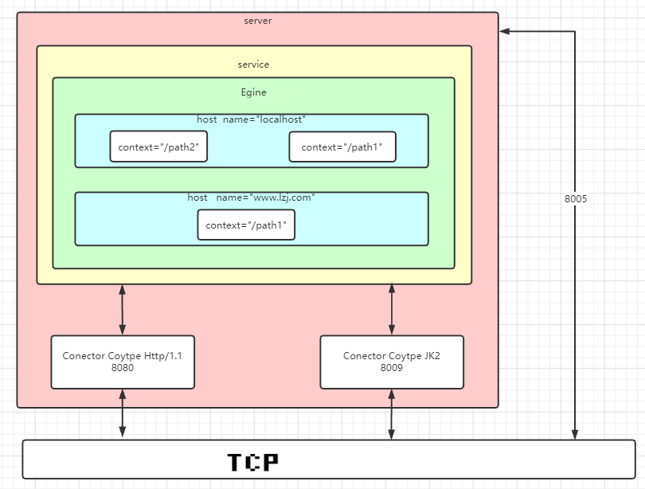
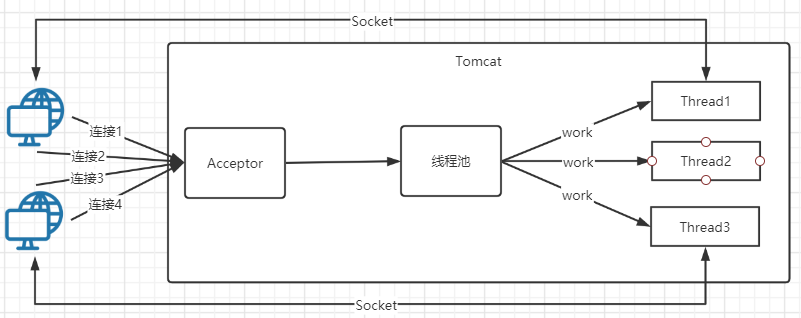
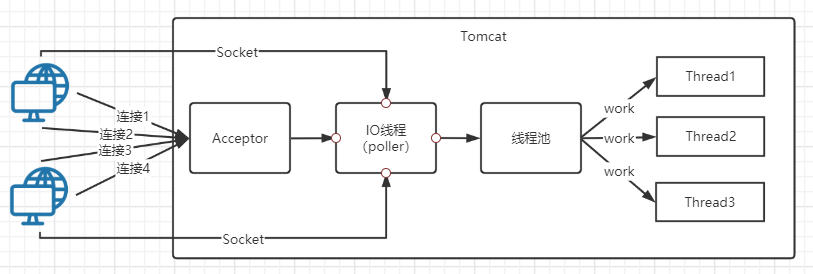

# Tomcat生产环境应用

## Tomcat是什么

Tomcat是一个基于JAVA的WEB容器，实现了JAVA EE中的 Servlet 与 jsp 规范，与Nginx apache 服务器不同在于，Tomcat一般用于动态请求处理，Mginx一般用于静态资源请求处理。在架构设计上采用面向组件的方式设计。即整体功能是通过组件的方式拼装完成。另外每个组件都可以被替换以保证灵活性。

首先最外层是一个server（服务器）在server下存在多个service（服务），在每一个服务下我们可以配置多个Conector（连接器）用于监听我们的端口接收请求，当接收到请求后会交给egine（引擎），egine会把请求按照域名分发给对应的host（虚拟机），host下通过对应的context（路径）访问对应的业务，最后讲一下8005这个端口在外面server（服务器）下会开着一个8005的端口这个8005端口有什么用呢，这个端口只有本地IP才能访问的tomcat端口我们可以通过8005端口把我们的tomcat关机

## Tomcat组件之间关系

* Server 和 Service
* Connector   连接器接收请求
  * HTTP 1.1
  * SSL  https
  * AJP（ Apache JServ Protocol） apache 私有协议，用于apache 反向代理Tomcat
* Container  容器组件
  * Engine  引擎 catalina
  * Host   虚拟机 基于域名 分发请求
  * Context 隔离各个WEB应用 每个Context的  ClassLoader都是独立
* Component  其它组件
  * Manager （管理器）
  * logger （日志管理）
  * loader （载入器）
  * pipeline (管道)
  * valve （管道中的阀）

## Tomcat的启动配置

我们平时启动Tomcat过程是怎么样的？ 

1. 复制WAR包至Tomcat webapp 目录。
2. 执行start.bat 脚本启动。
3. 启动过程中war 包会被自动解压装载。

那么现在思考一个问题，在Eclipse或idea中是如何用Tomcat启动WEB项目的呢？难道也是把我们WAR复制到webapp目录，执行start？显然不是，其实真正做法是在Tomcat程序文件之外创建了一个部署目录，配置相应的参数知道Tomcat启动时扫描我指定的文件夹，在一般生产环境中也是这么做的，这样使得Tomcat 程序目录和部署目录分开，我们只需要在启动时指定CATALINA_HOME 与  CATALINA_BASE 参数即可实现部署目录分开

**在演示自定义目录部署前需要了解几个参数意思**

| **启动参数**    | **描述说明**                                                 |
| :-------------- | :----------------------------------------------------------- |
| JAVA_OPTS       | jvm 启动参数 , 设置内存  编码等 -Xms100m -Xmx200m -Dfile.encoding=UTF-8 |
| JAVA_HOME       | 指定jdk 目录，如果未设置从java 环境变量当中去找。            |
| CATALINA_HOME   | Tomcat 程序根目录                                            |
| CATALINA_BASE   | 应用部署目录，默认为$CATALINA_HOME                           |
| CATALINA_OUT    | 应用日志输出目录：默认$CATALINA_BASE/log                     |
| CATALINA_TMPDIR | 应用临时目录：默认：$CATALINA_BASE/temp                      |

**小案例**

~~~shell
#进入根目录
cd /
# 创建一个data文件夹用于存放项目
mkdir data
# 进入data目录
cd data
# 创建一个myweb文件夹
mkdir myweb
# 进入tomcat目录
cd /usr/local/apache-tomcat-8.5.51/
# 把conf文件夹拷贝一份到myweb文件夹下
cp -r conf /data/myweb/
# 进入myweb文件夹
cd /data/myweb
# 创建存放日志目录
mkdir logs
# 创建存放war包目录
mkdir webapps
# 编写启动脚本文件
vim tomcat.sh
~~~

**启动脚本文件内容如下：**脚本中我们需要配置JAVA_OPTS（jvm启动参数），JAVA_HOME（java的根目录），CATALINA_HOME（Tomcat的根目录），CATALINA_BASE（读取项目文件目录），下面是一个case分支语句，根据传入的参数start（启动）、stop（停止）、restart（重启）、version（查看启动配置）、configtest（启动测试）执行不同的分支中的命令，其实命令的底层调用的就是CATALINA_HOME/bin/catalina.sh文件

~~~shell
#!/bin/bash
export JAVA_OPTS="-Xms100m -Xmx200m" #jvm启动参数
export JAVA_HOME=/usr/local/jdk1.8.0_231 #jdk的目录
export CATALINA_HOME=/usr/local/apache-tomcat-8.5.51 #Tomcat的目录
export CATALINA_BASE="`pwd`" #pwd获取当前目录路径

case $1 in
        start)
        $CATALINA_HOME/bin/catalina.sh start;
                 echo "start success!!"
        ;;
        stop)
        $CATALINA_HOME/bin/catalina.sh stop;
                 echo "stop success!!"
        ;;
        restart)
        $CATALINA_HOME/bin/catalina.sh stop;
                 echo "stop success!!";
                 sleep 2;
        $CATALINA_HOME/bin/catalina.sh start;
                 echo "start success!!"
        ;;
        version)
        $CATALINA_HOME/bin/catalina.sh version;
        ;;
        configtest)
        $CATALINA_HOME/bin/catalina.sh configtest;
        ;;
        esac
~~~

**最重要一步：**给tomcat.sh赋上权限，这样才能执行这个脚本

~~~shell
# 赋予权限
chmod +x tomcat.sh
# 启动
./tomcat.sh start
# 关机
./tomcat.sh stop
# 重启
./tomcat.sh restart
# 查看启动参数
./tomcat.sh version
# 测试启动
./tomcat.sh configtest
~~~

## server.xml 配置详解

Server 的基本基本配置

~~~xml
<?xml version="1.0" encoding="UTF-8"?>
<!--Server服务这可以配置本地服务服务器的端口8005-->
<Server port="8005" shutdown="SHUTDOWN">
  <!-- 监听器 -->
  <Listener className="org.apache.catalina.startup.VersionLoggerListener" />
  <Listener className="org.apache.catalina.core.AprLifecycleListener" SSLEngine="on" />
  <Listener className="org.apache.catalina.core.JreMemoryLeakPreventionListener" />
  <Listener className="org.apache.catalina.mbeans.GlobalResourcesLifecycleListener" />
  <Listener className="org.apache.catalina.core.ThreadLocalLeakPreventionListener" />
  <!-- 全局资源 -->
  <GlobalNamingResources>
    <!--加载tomcat-users.xml里配置的用户，可以通过配置的用户登陆tomcat后台-->
    <Resource name="UserDatabase" auth="Container"
              type="org.apache.catalina.UserDatabase"
              description="User database that can be updated and saved"
              factory="org.apache.catalina.users.MemoryUserDatabaseFactory"
              pathname="conf/tomcat-users.xml" />
  </GlobalNamingResources>
  <!-- 服务(可多个)用于绑定连接器与Engine -->
  <Service name="Catalina">
    <!-- 一个8080端口连接器(可多个)-->
    <Connector port="8080" protocol="HTTP/1.1" connectionTimeout="20000" redirectPort="8443" />
    <!-- 执行引擎-->
    <Engine name="Catalina" defaultHost="localhost">
      <!-- 虚拟主机--> 
      <Host name="localhost"  appBase="webapps" unpackWARs="true" autoDeploy="true">
        <!--过滤器，所有请求都会经过过滤器一般用于记录日志-->
        <Valve className="org.apache.catalina.valves.AccessLogValve" directory="logs"
               prefix="localhost_access_log" suffix=".txt"
               pattern="%h %l %u %t &quot;%r&quot; %s %b" />
      </Host>
    </Engine>
  </Service>
</Server>

~~~

## server.xml各元素说明

### Server

root元素：server 的顶级配置

| 属性     | 说明                 |
| -------- | -------------------- |
| port     | 执行关闭命令的端口号 |
| shutdown | 关闭命令             |

通过8005端口连接tomcat并关闭tomcat的服务（说实话这功能没啥用）

~~~shell
# 查看本机tcp服务信息
ss -tnlp
#LISTEN     0           1                   [::ffff:127.0.0.1]:8005                         *:*          users:#(("java",pid=15854,fd=437))                                                                     
# 连接127.0.0.1 8005主机
telnet 127.0.0.1 8005
# 关机
SHUTDOWN
~~~

### Service

服务：将多个connector 与一个Engine组合成一个服务，可以配置多个服务。

### Connector

连接器：用于接收 指定协议下的连接 并指定给唯一的Engine 进行处理。

| 属性              | 说明                                                         |
| ----------------- | ------------------------------------------------------------ |
| protocol          | 监听的协议，默认是http/1.1                                   |
| port              | 指定服务器端要创建的端口号                                   |
| minThread         | 服务器启动时创建的处理请求的线程数                           |
| maxThread         | 最大可以创建的处理请求的线程数                               |
| enableLookups     | 如果为true，则可以通过调用request.getRemoteHost()进行DNS查询来得到远程客户端的实际主机名，若为false则不进行DNS查询，而是返回其ip地址 |
| redirectPort      | 指定服务器正在处理http请求时收到了一个SSL传输请求后重定向的端口号 |
| acceptCount       | 指定当所有可以使用的处理请求的线程数都被使用时，可以放到处理队列中的请求数，超过这个数的请求将不予处理 |
| connectionTimeout | 指定超时的时间数(以毫秒为单位)                               |
| SSLEnabled        | 是否开启 sll 验证，在Https 访问时需要开启。                  |

配置Connector

~~~xml
 <!--端口为8888 protocol监听的协议Http11NioProtocol类监听（http/1.1默认就是调用该类）-->
 <!--connectionTimeout 连接超时时间为20000毫秒-->
 <!--redirectPort 如果是https请求重定向到8862-->
 <!--URIEncoding 请求编码格式-->
 <!--useBodyEncodingForURI 返回的格式编码格式-->
 <!--compression是否压缩 compressionMinSize压缩的最小大小-->
 <!--compressableMimeType什么类型的文件需要压缩-->
 <!--maxThreads最大线程数 minThread启动时初始线程池大小-->
 <!--acceptCount最大线程数满了后 加入等待队列的大小-->
 <!--enableLookups获取客户端的DNS 关闭性能比较好-->
<Connector port="8888" protocol="org.apache.coyote.http11.Http11NioProtocol"
                connectionTimeout="20000"
                redirectPort="8862"
                URIEncoding="UTF-8"
                useBodyEncodingForURI="true"
                compression="on" compressionMinSize="2048"
compressableMimeType="text/html,text/xml,text/plain,text/javascript,text/css,application/x-json,application/json,application/x-javascript"
                maxThreads="1024" minThread="200"
                acceptCount="800"
                enableLookups="false"/>
~~~

### Engine
引擎：用于处理连接的执行器，默认的引擎是catalina，一个service 中只能配置一个Engine

| 属性        | 说明     |
| ----------- | -------- |
| name        | 引擎名称 |
| defaultHost | 默认host |

### Host
虚拟机：基于域名匹配至指定虚拟机,类似于nginx 当中的server,默认的虚拟机是localhost.

| 属性       | 说明              |
| ---------- | ----------------- |
| name       | 虚拟机名称        |
| appBase    | webapp的目录      |
| unpackWARs | 是否自动解压war包 |
| autoDeploy | 是否自动发布      |

配置Host

~~~xml
<Host name="www.test.com"  appBase="/data/myweb" unpackWARs="true" autoDeploy="true">
    	<!--配置日志输出-->
        <Valve className="org.apache.catalina.valves.AccessLogValve" directory="logs" 
               prefix="www.test.com.access_log" suffix=".txt"
               pattern="%h %l %u %t &quot;%r&quot; %s %b" />
</Host>
~~~

### Context

应用上下文：一个host 下可以配置多个Context ，每个Context 都有其独立的classPath。相互隔离，以免造成ClassPath 冲突

| 属性       | 说明                           |
| ---------- | ------------------------------ |
| path       | 访问路径                       |
| docBase    | 指定对应的文件目录             |
| reloadable | 监听文件目录有如果有变化热转载 |

配置Context

~~~xml
<!--访问www.test.com/h路径时 指定访问hello文件夹中的应用程序-->
<Context path="/h" docBase="hello" reloadable="true"/>
~~~

### Valve

阀门：可以理解成request 的过滤器，具体配置要基于具体的Valve 接口的子类。以下即为一个访问日志的Valve.

~~~xml
 <Valve className="org.apache.catalina.valves.AccessLogValve" directory="logs"
               prefix="www.luban.com.access_log" suffix=".txt"
               pattern="%h %l %u %t &quot;%r&quot; %s %b" />
~~~

## Tomcat IO模型

### Tomcat支持的IO模型说明

|      | 描述                                                         |
| :--- | :----------------------------------------------------------- |
| BIO  | 阻塞式IO，即Tomcat使用传统的java.io进行操作。该模式下每个请求都会创建一个线程，对性能开销大，不适合高并发场景。优点是稳定，适合连接数目小且固定架构。 |
| NIO  | 非阻塞式IO，jdk1.4 之后实现的新IO。该模式基于多路复用选择器监测连接状态在通知线程处理，从而达到非阻塞的目的。比传统BIO能更好的支持并发性能。Tomcat 8.0之后默认采用该模式 |
| APR  | 全称是 Apache Portable Runtime/Apache可移植运行库)，是Apache HTTP服务器的支持库。可以简单地理解为，Tomcat将以JNI的形式调用Apache HTTP服务器的核心动态链接库来处理文件读取或网络传输操作。使用需要编译安装APR 库 |
| AIO  | 异步非阻塞式IO，jdk1.7后之支持 。与nio不同在于不需要多路复用选择器，而是请求处理线程执行完程进行回调调知，已继续执行后续操作。Tomcat 8之后支持。 |

### 使用指定IO模型的配置方式

~~~xml
配置 server.xml 文件当中的 <Connector  protocol="HTTP/1.1">修改即可。
默认配置protocol=“HTTP/1.1” tomcat 8.0 之前是 BIO 8.0 之后是NIO
<!--BIO-->
protocol=“org.apache.coyote.http11.Http11Protocol“
<!--NIO-->
protocol=”org.apache.coyote.http11.Http11NioProtocol“
<!--AIO-->
protocol=”org.apache.coyote.http11.Http11Nio2Protocol“
<!--APR-->
protocol=”org.apache.coyote.http11.Http11AprProtocol“
~~~

### BIO 与NIO有什么区别

BIO模式在每一个用户与Tomcat建立建立之后线程池会分配一个线程处理这个请求，中间就会存在一些问题，比如果由于网络延迟带宽等问题，线程开启后数据还没传输过来导致线程一只开着占用服务器资源直到获取数据后才执行相应的业务逻辑，所以如果出现并发访问线程池容量一下就用完了

NIO模式在是在BIO的基础上增加了一个专门处理IO的线程，当客户端与服务器连接上后IO线程会对这些连接上的客户端一直做一个轮询，轮询到有客户端数据已经准备好后会告诉线程池，线程池分配对应的wrok进程进行处理，处理完成后返回相应的结果，使得在应对并发访问时也能游刃有余

