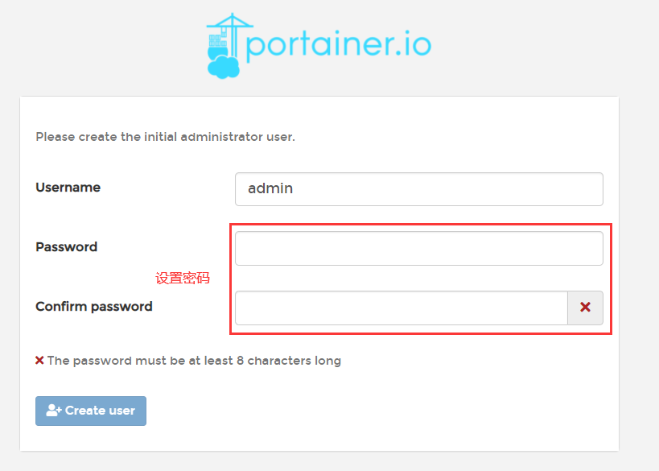
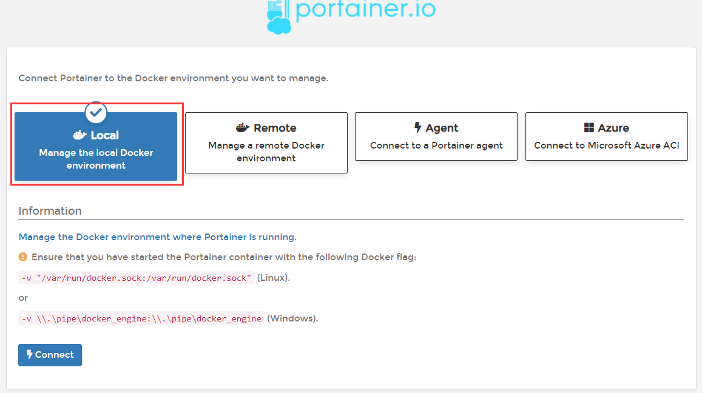
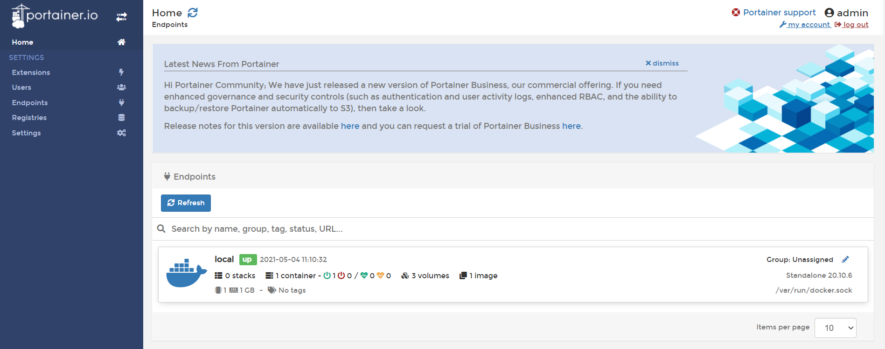
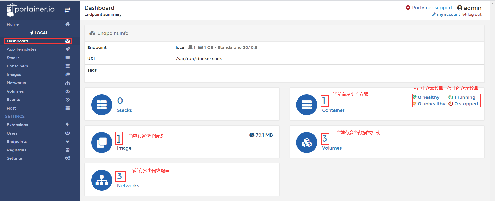

# Docker可视化控制面板

## Portainer

> Portainer是Docker的图形化管理工具！提供一个后台面板提供我们操作

### 下载镜像与运行

~~~shell
docker run -d -p 8080:9000 -v /var/run/docker.sock:/var/run/docker.sock  portainer/portainer
~~~

### 初次连接与配置

**初始密码设置**

> 通过http://你服务器IP:8080服务Docker的Portainer，连接后会进入一个登录页面，初次登录设置登录密码

**选择Local只管理本地**

> 选择Local管理服务器本地镜像

**设置成功**

### 面板说明

> 在Docker的指示面板上，可以查看与配置Docker的容器、镜像、数据卷挂载、网络配置

## Rencher

