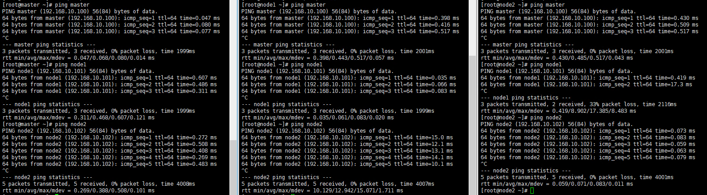

# 安装Kubernetes

Kubernetes有多种部署方式，目前主流的方式有kubeadm、minikube、二进制包

* minikube/Kind：一个用于快速搭建单节点kubernetes的工具
* kubeadm：一个用于快速搭建kubernetes集群的工具
* 二进制包：从官网下载每个组件的二进制包，依次去安装，此方式理解Kubernetes组件最有效

## 单节点部署

这里使用Kind完成单节点是K8s安装可用于学习环境

### Docker安装

~~~shell
#切换到国内镜像
wget https://mirrors.aliyun.com/docker-ce/linux/centos/docker-ce.repo -O /etc/yum.repos.d/docker-ce.repo

#安装18.06.3 Docker，使用--setopt命令确保不会安装到其它跟高的版本
yum -y install --setopt=obsoletes=0 docker-ce-18.06.3.ce-3.el7

#添加配置文件
#Docker在默认情况下使用Cgroup Driver为cgroupfs，而kubernetes推荐使用systemd
mkdir -p /etc/docker
tee /etc/docker/daemon.json <<-'EOF'
{
  "exec-opts": ["native.cgroupdriver=systemd"],
  "registry-mirrors": ["https://pztjnors.mirror.aliyuncs.com"]
}
EOF

#启动docker
systemctl restart docker
systemctl enable docker

#检查docker状态和版本
docker version
~~~

### Kind与K8s组件准备

~~~shell
#加入k8s文件夹，没有自行创建
cd k8s/
#下载Kind（centos7最高只能下载v0.17.0）
curl -LO "https://github.com/kubernetes-sigs/kind/releases/download/v0.17.0/kind-linux-amd64"
#下载Kubectl
curl -LO "https://dl.k8s.io/release/v1.30.1/bin/linux/amd64/kubectl"
#将kind安装到bin目录
mv kind-linux-amd64 kind
chmod +x ./kind
sudo mv ./kind /usr/local/bin/kind
#将kubectl安装到bin目录
chmod +x ./kubectl
sudo mv ./kubectl /usr/local/bin/kubectl
#测试
kind version
kubectl version
~~~

> 关于centos7最高只能下载v0.17.0说明，因为在Kind 0.17版本以后使用了cgroupsv2 详细内容查看[github issues](https://github.com/kubernetes-sigs/kind/issues/3311)

### Kind创建单机集群

~~~shell
#创建一个单节点集群
kind create cluster
~~~

> 安装过程可能会提示无法访问某些http地址，重新执行多几次命令后看到如下内容表示安装成功

~~~shell
#获取集群信息
get clusters
#查看集群运行状态
kubectl get nodes
~~~

[关于Kind工具更多用法](./Kind-基础)

## 一主多从

### 主机规划

> 本次环境搭建需要安装三台Centos服务器(一主多从)，然后在每台服务器中分别安装docker(18.06.3)、kubeadm(1.17.4)、kubelet(1.17.4)、kubectl(1.17.4)程序

| 角色   | IP             | 操作系统  | 配置               |
| ------ | -------------- | --------- | ------------------ |
| Master | 192.168.10.100 | Centos7.5 | 2核 2G内存 50G硬盘 |
| Node1  | 192.168.10.101 | Centos7.5 | 2核 2G内存 50G硬盘 |
| Node2  | 192.168.10.102 | Centos7.5 | 2核 2G内存 50G硬盘 |

### 环境初始化

#### 检查操作系统版本

> 确保操作系统版本在7.5或以上

~~~shell
cat /etc/redhat-release
~~~

#### 主机名解析

> 修改/etc/hosts文件添加 master、node1、node2主机名与地址

~~~shell
vim /etc/hosts
~~~

测试是否能够相互通信

#### 时间同步

> Kubernetes要求集群中的节点时间必须精确一致，这里直接使用chronyd服务从网络同步时间，在企业中建议配置内部的时间同步服务器

~~~shell
#启动时间同步服务
systemctl start chronyd
#设置开机自启动
systemctl enable chronyd
#获取时间测试
date
~~~

#### 禁用iptables和firewalld服务

> Kubernetes和docker在运行中会产生大量的iptables规则，为了不让系统规则跟它混淆，直接关闭系统的规则

~~~shell
#关闭firewalld服务
systemctl stop firewalld
systemctl disable firewalld
#关闭iptables服务
systemctl stop iptables
systemctl disable iptables
~~~

#### 禁用selinux

> selinux是linux系统下的安全服务，如果不关闭它在安装集群时会有一些奇怪的问题

~~~shell
vim /etc/selinux/config
~~~

#### 禁用swap分区

> swap分区指的是虚拟内存，它的作用是在物理内存使用完后将磁盘空间虚拟成内存使用，启用swap设备会对系统性能产生负面影响，因此Kubernetes要求每个节点都要禁用swap设备
>
> 但是如果因为某些原因确实不能关闭swap分区，那么需要在集群安装过程中通过参数配置来说明

~~~shel
vim /etc/fstab
~~~

#### 修改内核参数

> 根据官方要求在指定文件创建并且编辑kubernetes.conf文件

~~~shell
vim /etc/sysctl.d/kubernetes.conf
# kubernetes.conf中添加如下内容
# net.bridge.bridge-nf-call-ip6tables=1
# net.bridge.bridge-nf-call-iptables=1
# net.ipv4.ip_forwaed=1

#重新加载配置
sysctl -p

#加载网桥过滤模块
modprobe br_netfilter

#查看网桥过滤模块是否加载成功
lsmod | grep br_netfilter
~~~

#### 配置ipvs功能

> 在Kubernetes中service有两种代理模型，一种基于iptables，一种基于ipvs
>
> ipvs性能比较高，如果需要使用它，需要手动载入ipvs模块

~~~shell
#安装ipset和ipvsadm
yum install ipset ipvsadm -y

#添加需要加载的模块写入脚本文件
cat > /etc/sysconfig/modules/ipvs.modules <<EOF
#!/bin/bash
modprobe -- ip_vs
modprobe -- ip_vs_rr
modprobe -- ip_vs_wrr
modprobe -- ip_vs_sh
modprobe -- nf_conntrack_ipv4
EOF

#给脚本添加可执行权限，执行脚本文件，查看模块是否加载成功
chmod 755 /etc/sysconfig/modules/ipvs.modules && bash /etc/sysconfig/modules/ipvs.modules && lsmod | grep -e ip_vs -e nf_conntrack_ipv4
~~~

#### 重启

~~~shell
#重启系统
reboot
~~~

### Docker安装

~~~shell
#切换到国内镜像
wget https://mirrors.aliyun.com/docker-ce/linux/centos/docker-ce.repo -O /etc/yum.repos.d/docker-ce.repo

#安装18.06.3 Docker，使用--setopt命令确保不会安装到其它跟高的版本
yum -y install --setopt=obsoletes=0 docker-ce-18.06.3.ce-3.el7

#添加配置文件
#Docker在默认情况下使用Cgroup Driver为cgroupfs，而kubernetes推荐使用systemd
mkdir -p /etc/docker
tee /etc/docker/daemon.json <<-'EOF'
{
  "exec-opts": ["native.cgroupdriver=systemd"],
  "registry-mirrors": ["https://pztjnors.mirror.aliyuncs.com"]
}
EOF

#启动docker
systemctl restart docker
systemctl enable docker

#检查docker状态和版本
docker version
~~~

### Kubernetes组件安装

~~~shell
#切换使用阿里云镜像源
cat > /etc/yum.repos.d/kubernetes.repo << EOF
[kubernetes]
name=Kubernetes
baseurl=https://mirrors.aliyun.com/kubernetes/yum/repos/kubernetes-el7-x86_64
enabled=1
gpgcheck=0
repo_gpgcheck=0
gpgkey=https://mirrors.aliyun.com/kubernetes/yum/doc/yum-key.gpg https://mirrors.aliyun.com/kubernetes/yum/doc/rpm-package-key.gpg
EOF

#安装kubeadm、kubelet和kubectl
yum install --setopt=obsoletes=0 kubeadm-1.17.4-0 kubelet-1.17.4-0 kubectl-1.17.4-0 -y

# 配置kubelet和cgroup
vim /etc/sysconfig/kubelet
# 在配置文件中添加如下内容
# KUBELET_EXTRA_ARGS="--cgroup-driver=systemd"
# KUBE_PROXY_MODE="ipvs"

#设置kubelet开机自启
systemctl enable kubelet
~~~

### 准备集群镜像

~~~shell
#执行kubeadm命令，查看需要准备什么镜像
kubeadm config images list

#由于国内无法访问k8s镜像
#这里编写脚本通过访问阿里云，下载镜像
images=(
    kube-apiserver:v1.17.4
    kube-controller-manager:v1.17.4
    kube-scheduler:v1.17.4
    kube-proxy:v1.17.4
    pause:3.1
    etcd:3.4.3-0
    coredns:1.6.5
)

for imageName in ${images[@]} ; do
    docker pull registry.aliyuncs.com/google_containers/$imageName
    docker tag registry.aliyuncs.com/google_containers/$imageName k8s.gcr.io/$imageName
    docker rmi registry.aliyuncs.com/google_containers/$imageName
done
~~~

### 集群初始化(Master)

> 初始化集群时只需要在master上执行即可
>
> `注意：--apiserver-advertise-address参数是你master的IP地址`

~~~shell
#初始化集群(只需要Master上执行)
kubeadm init \
  --kubernetes-version v1.17.4 \
  --pod-network-cidr=10.244.0.0/16 \
  --service-cidr=10.96.0.0/12 \
  --apiserver-advertise-address=192.168.10.100 \
  
#添加配置
mkdir -p $HOME/.kube
sudo cp -i /etc/kubernetes/admin.conf $HOME/.kube/config
sudo chown $(id -u):$(id -g) $HOME/.kube/config

#假如失败需要重新安装，可以重置kubeadm
kubeadm reset
~~~

### 其它节点加入到集群(Node)

> 集群初始化成功后其它node就可以加入到集群中了，注意该命令每个人的主机都不一样具体什么命令看初始化成功后的提示

~~~shell
#node节点上执行该命令
kubeadm join 192.168.10.100:6443 --token zal1ue.tev416o3khxtm4tz \
    --discovery-token-ca-cert-hash sha256:c565d9b35108f933dbf8243955db1abdf866bb8c92eca7ee89bfaf58d2c171a1 
~~~

> 添加完毕后回到master就可以查看到集群的节点信息了

~~~shell
#查看集群节点信息
kubectl get nodes
~~~

### 安装网络插件(Master)

> 安装网络插件只需要在master上执行即可
>
> Kubernetes支持多种网络插件，如fannel、calico、canal等，这里我使用的是flannel

~~~shell
#获取fannel的配置文件
wget https://raw.githubusercontent.com/coreos/flannel/master/Documentation/kube-flannel.yml

#使用配置文件，-v=8调试模式启动
kubectl apply -f kube-flannel.yml -v=8

#查看集群状态
kubectl get nodes
~~~

> 在执行kube-flannel.yml后，会在master和node节点上通过docker下载flannel，由于docker下载比较慢会等很久，如果很久都还是NotReady状态，可以自行使用`docker pull flannel/flannel:v0.21.5`在各节点上下载

### 服务部署测试

> 到这里集群部署已经完成，接下来部署一个nginx测试集群是否能够正常工作

~~~shell
#部署nginx
kubectl create deployment nginx --image=nginx:1.14-alpine

#暴露端口
kubectl expose deployment nginx --port=80 --type=NodePort

#查看pod
kubectl get pod

#查看service
kubectl get service
~~~

> 通过`kubectl get service`查看到nginx通过访问31133就可以访问到nginx了

# 常见问题

**重启K8s后通过`http://masterIP地址:端口`无法访问到服务**

**问题现象**

> 1. 在任何主机(包括集群node节点)，使用`curl http://masterIP地址:服务端口/`命令都是访问超时
> 2. 在Master节点上，使用`kubectl get pods` 命令查看pod状态是正常
> 3. 在Master节点上，使用`kubectl get svc ` 命令查看service状态是正常，并且端口开发
> 4. 在Master节点上，使用`kubectl describe pods | grep "^Name:" -A 3`命令，找到改服务部署在那个节点上，登录到对应的Node服务器使用`curl http://NodeIP地址:服务端口/`能够正常访问
> 5. 在Master节点上，使用`curl http://masterIP地址:服务端口/`能够正常访问

**排查**

> 猜测：通过以上现象分析很可能是`kube-proxy`发生了问题

验证猜测：执行如下命令`curl 127.0.0.1:10249/proxyMode`查看`kube-proxy`模式

验证猜测：执行如下命令`kubectl get configmap kube-proxy -n kube-system -o yaml` 查看kube-system配置

> 结论：通过以上2个验证，发现由于kube-system的mode未配置模式，导致kube-system使用了iptables模式

**解决方案**

> 修改kube-proxy的mode配置，改为ipvs即可

~~~shell
#修改kube-proxy配置
#找到mode属性修改为 => mode: "ipvs"
kubectl edit cm kube-proxy -n kube-system

#手动重启 kube-proxy 进程
kubectl rollout restart daemonset/kube-proxy -n kube-system

#等待片刻，查看kube-system模式
curl 127.0.0.1:10249/proxyMode

#测试，有正常返回内容表示成功
curl http://192.168.10.100:30456/
~~~

