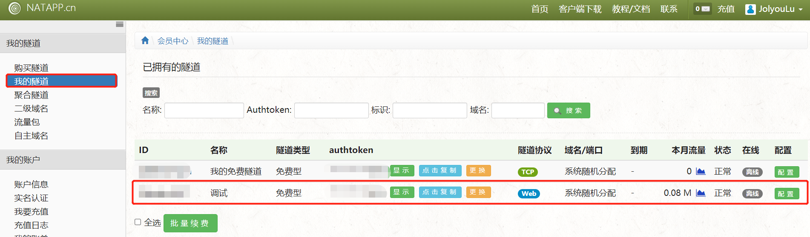
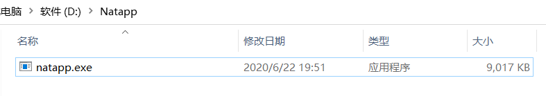

# 公众号开发-开发准备

## 前言

> 在日常生活我们基本离不开微信生态圈，如微信支付、微信公众号、微信小程序等，由于微信的用户量巨大，所以微信也改变了大家的生活方式，对企业来说运营微信公众号可以给企业带来更多的用户量以及流量，在当今社会流量就是金钱
>
> 为什么要开发微信公众号？对于小部分企业使用微信提供的微信公众号平台足以满足日常的使用，如发表文章、发推文等，但是对于大部分企业如需要结合企业小程序、软件对用户进行定向微信消息推送，或者让用户与公众号有一个更加好的交互体验等就需要对微信公众号进行二次开发
>
> 开发微信公众号好处是什么？自己开发的微信公众号可以实现高度定制化的开发，对公众号菜单、用户信息、自动回复、模板消息等都可以定制化开发，我觉得自定义开发的公众号最大的优点就是消息推送平时我们去外面吃饭取号后可以通过公众号查看到排队进度并且进度变化也会收到消息，他可以替代我们传统的短信推送，短信推送需要钱而微信消息推送不需要任何费用
>
> 最后本专栏的所有代码都会被上传到github与gitee仓库中，如果对你有帮助请不要忘给我点个start，你的鼓励是我最大的创造动力哦

## 公众号注册

> 要进行微信公众号开发，首先需要拥有一个公众号，公众号的注册也很简单，注册只需要准备一个邮箱即可，进入到
>
> [微信公众平台]: https://mp.weixin.qq.com/?token=&amp;lang=zh_CN
>
> 点击右上角立即注册

 ### 账号类型说明

> 进入到注册页面后我们会发现，可以注册订阅号、服务号、小程序、企业微信，它们都有什么区别呢？
>
> 这里只重点说订阅号与服务号
>
> 订阅号：订阅号特点就是每日可以给用户主动发一个推文，如XX新闻、XX日报等企业就比较适合订阅号，每天给用户发送一条推文
>
> 服务号（本专栏使用该类型）：服务号比较偏向服务化的，为用户推送模板消息（例子：外面吃饭排队扫码查看排队状态）、开通微信支付，或需使用跟多高级接口
点击此处查看：微信公众平台类型官方解释`https://kf.qq.com/faq/170815aUZjeQ170815mU7bI7.html`

### 注册时注意事项

> 1. 注册时需准备一个未在公众平台注册过服务号、订阅号、小程序等邮箱
> 2. 类型选择时选择`服务号`，尽量与本专栏类型一致(本专栏用的都是服务号)，订阅号也是可以的
> 3. 信息登记时选择个人即可，录入`姓名`与`身份证`
>
> 注册流程我就不一一演示了，微信官方有提供注册教程，连接就在下面点击查看

点击此处查看：

微信公众平台注册流程`https://kf.qq.com/faq/120911VrYVrA151009eIrYvy.html`

## 公众平台测试账号

> 发布于部署需使用到我们申请的公众号，日常的开发我们只需要使用公众平台测试账号即可，公众平台测试账号是免注册的，微信扫码就行
>

### 进入公众平台测试界面

> `进入公众平台测试界面，需要先登录到你注册好的公众号、订阅号`，到微信公众平台的官网，输入注册号的邮箱于密码登录

> 登录成功后将菜单一致滑到最下面，`开发`的那个菜单，点击`开发者工具`后可以看到右边选项，点击`公众平台测试账号`

> 直接使用手机扫码登录

> 扫码后看到如内容表示登录成功
>
> 测试的公众平台中提供了`appID、appsecret、URL、Token`的这些都是重要参数以后开发过程中会用到

## 内网穿透工具

> 什么是内网穿透工具？为什么需要使用内网穿透？

### 公众号服务流程图

> 首先大致了解一下自己写的公众号后台是如何被用户访问的，首先用户向公众号发送一个文本消息，这时最先收到这条消息的是微信服务器而不是我们的微信后台，然后微信服务器将来收到的消息再次转发到，我们的服务器的后台，通过微信公众平台配置可以指定转发到服务器ip与处理的url

### 内网穿透工具说明

> 经过上面`公众号服务流程图`我们简单的了解了我们的公众号后台接收用户消息是通过微信服务器转发过来的，那么这就需要给微信服务器提供转发的服务器IP/域名
>
> 这里我们就要思考一个问题，部署上线我们可以提供我们线上服务器的IP地址给微信公众号，那么如果我们需要本地测试呢，我们本地的电脑那肯定没有公网IP地址，不可能我们每写一个功能都部署上线才能测试这不现实而且开发效慢
>
> 这时我们就想有没有什么办法可以让我本地跑的服务映射到公网上面，微信服务器通过公网也能访问我们本地的服务呢，内网穿透工具就能解决这个问题，内网穿透工具可为我们本地指定的服务映射出一个临时域名（当然你有钱也可以买固定的），互联网上其它的用户通过这个临时的域名就可以访问到我们本地的服务了

### Natapp

> 本专栏使用的内网穿透工具是`Natapp`当然也其它工具如花生壳、ngrok等，如果有自己了解的选自己了解的其中一款即可
>
> Natapp是一款轻量化的(客户端只有9M不到的大小)，免费的(当然也有付费)的内网穿透工具，接下来就交大家如何使用这个工具

#### 注册

> 进入到
>
> [Natapp官网]: https://natapp.cn/
>
> 点击右上角免费注册输入`手机号码`与`验证码`就可以完成注册了

#### 通道购买

> 注册成功后点击登录，进入到控制台点击`购买通道`选择`免费通道`

> 1. 填写通道名
> 2. 通道协议选择Web
> 3. 本地端口随便输一个后期可以修改

#### 通道配置

> 通道购买成功后/已拥有通道，可在我的通道中查看拥有的通道

>点击通道右边的`配置`按钮就可以修改通道配置
>
>修改的地方主要是`本地端口`如我本地开启了一个8080端口的tomcat，我需要将这个tomcat服务映射到公网上，那么这里本地端口就需要设置为8080

#### 下载客户端

> 通道配置完毕后，需要Natapp客户端，客户端会按照你通道相应的配置生成一个临时的域名，其它人在公网上通过该域名就可以访问你本地的服务
>
> 进入到Natapp官网点击`客户端下载`下载你系统相应的客户端

> 下载完毕后解压可以看到一个`exe`的执行文件
>
> 我们需要在`exe`程序的同级目录下创建一个`config.ini`文件

#### 配置config.ini

> 在启动`natapp.exe`时会读取`config.ini`文件的配置相信，文件中`authtoken`参数是必填的对应着你购买通道的authtoken

~~~shell
#将本文件放置于natapp同级目录 程序将读取 [default] 段
#在命令行参数模式如 natapp -authtoken=xxx 等相同参数将会覆盖掉此配置
#命令行参数 -config= 可以指定任意config.ini文件
[default]
authtoken=   xxxx               #(必填)对应一条隧道的authtoken
clienttoken=                    #(非必填)对应客户端的clienttoken,将会忽略authtoken,若无请留空,
log=none                        #(非必填)log 日志文件,可指定本地文件, none=不做记录,stdout=直接屏幕输出 ,默认为none
loglevel=ERROR                  #(非必填)日志等级 DEBUG, INFO, WARNING, ERROR 默认为 DEBUG
http_proxy=                     #(非必填)代理设置 如 http://10.123.10.10:3128 非代理上网用户请务必留空
~~~

#### 测试

> 本地启动一个tomcat默认8080端口，将来tomcat服务映射到公网上

**tomcat下载**

> tomcat下载与启动这个大家应该都会了，我就不详细说明步骤了

[Tomcat下载地址]: https://tomcat.apache.org/download-90.cgi

> Tomcat启动成功并且测试服务`localhost:8080`无任何问题

**Natapp配置**

> 登录你注册号的Natapp官网，选择通道点击配置，将来原来80端口改成8080端口

**确认配置**

> 配置完毕后打开Natapp目录下的`config.ini`文件再次确认`authtoken`是否是你的通道

**启动Natapp客户端**

> 确认`config.ini`没问题后，双击`natapp.exe`启动客户端
>
> 启动成功后可以看到`http://bczynn.natappfree.cc -> 127.0.0.1:8080 `
>
> 表示在公网上访问`http://bczynn.natappfree.cc`即可映射到本地的`127.0.0.1:8080`

**测试通过域名访问**

> 直接在浏览器中访问`http://bczynn.natappfree.cc`并且成功服务本地的tomcat

### 总结

> 学会使用内网穿透工具是微信开发的第一步，也是最重要的一步
